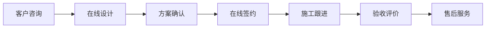

# 基于微信小程序装潢应用系统

## 1. 背景介绍

### 1.1 微信小程序概述

微信小程序是一种全新的连接用户与服务的方式,它可以在微信内被便捷地获取和传播,同时具有出色的使用体验。小程序无需安装即可使用,用完即走,不占用手机内存。

### 1.2 装潢行业现状

装潢行业是一个传统行业,目前存在信息不透明、服务质量参差不齐、用户体验差等痛点。随着移动互联网的发展,装潢行业也开始寻求数字化转型,利用互联网技术提升服务质量和用户体验。

### 1.3 基于小程序的装潢应用的意义

开发一款基于微信小程序的装潢应用,可以利用小程序的便捷性、易传播性等特点,为用户提供更加优质、高效、透明的装潢服务,提升用户体验,促进装潢行业数字化转型。

## 2. 核心概念与联系

### 2.1 微信小程序框架

微信小程序基于微信提供的框架开发,主要由 WXML、WXSS、JS、JSON 四个文件组成。其中:

- WXML(WeiXin Markup Language)用于描述页面结构 
- WXSS(WeiXin Style Sheets)用于描述页面样式
- JS(JavaScript)用于处理页面逻辑
- JSON(JavaScript Object Notation)用于配置页面属性

### 2.2 云开发技术

小程序云开发是微信团队提供的一套云端的开发工具和环境。开发者可以使用云开发开发微信小程序、小游戏,无需搭建服务器,即可使用云端能力。

云开发提供了云函数、云数据库、云存储等能力,开发者无需搭建服务器,书写后端代码,即可快速、高效的实现后端能力。

### 2.3 装潢行业业务流程

装潢的业务流程通常包括:

1. 客户咨询、了解需求
2. 设计师现场勘察、沟通 
3. 设计师出方案、报价
4. 客户确认方案、签订合同
5. 施工准备
6. 施工
7. 验收、交付
8. 售后服务

### 2.4 业务流程与小程序功能的映射关系

我们可以将装潢业务流程映射到小程序的不同功能模块中,例如:



## 3. 核心算法原理具体操作步骤

### 3.1 推荐算法

在小程序中,我们可以利用推荐算法为用户推荐感兴趣的装潢案例和设计师。常见的推荐算法包括:

1. 基于内容的推荐(Content-based Recommendation):根据用户过去喜欢的案例,推荐相似的案例。
2. 协同过滤(Collaborative Filtering):根据相似用户的喜好,推荐用户可能感兴趣的内容。
3. 混合推荐(Hybrid Recommendation):结合内容推荐和协同过滤,提高推荐精度。

以协同过滤为例,其基本步骤如下:

1. 收集用户偏好数据
2. 计算用户相似度
3. 生成推荐列表
4. 将推荐结果返回给用户

### 3.2 图像处理算法

在装潢设计中,我们经常需要对图片进行处理,例如风格迁移、色彩优化等。可以利用深度学习算法实现这些功能,例如:

1. 风格迁移:使用条件生成对抗网络(Conditional GAN),将一张图片的风格迁移到另一张图片上。
2. 色彩优化:使用深度卷积神经网络(DCNN),自动调整图片的色彩,使其更加鲜艳、和谐。

以风格迁移为例,其基本步骤如下:

1. 准备风格图片和内容图片
2. 使用预训练的 VGG 网络提取风格特征和内容特征 
3. 初始化生成图片
4. 通过优化算法(如 Adam)不断迭代,最小化风格损失和内容损失
5. 得到最终的风格迁移图片

## 4. 数学模型和公式详细讲解举例说明

### 4.1 推荐算法中的相似度计算

在协同过滤算法中,我们需要计算用户之间的相似度。常用的相似度计算方法包括余弦相似度和皮尔逊相关系数。

余弦相似度的计算公式为:

$$
\text{similarity} = \cos(\theta) = \frac{\vec{A} \cdot \vec{B}}{\|\vec{A}\| \|\vec{B}\|} = \frac{\sum_{i=1}^n A_i B_i}{\sqrt{\sum_{i=1}^n A_i^2} \sqrt{\sum_{i=1}^n B_i^2}}
$$

其中,$\vec{A}$和$\vec{B}$分别是用户$A$和用户$B$的偏好向量。

举例来说,假设用户$A$对物品$1,2,3$的偏好分别为$4,5,2$,用户$B$对物品$1,2,3$的偏好分别为$3,4,1$,则他们的偏好向量为:

$$
\vec{A} = (4,5,2) \\
\vec{B} = (3,4,1)
$$

根据余弦相似度公式,他们的相似度为:

$$
\text{similarity} = \frac{4 \times 3 + 5 \times 4 + 2 \times 1}{\sqrt{4^2 + 5^2 + 2^2} \sqrt{3^2 + 4^2 + 1^2}} \approx 0.99
$$

可见,这两个用户的偏好非常相似。

### 4.2 图像风格迁移中的损失函数

在图像风格迁移中,我们通常定义两个损失函数:内容损失和风格损失。

内容损失用于衡量生成图片与原始图片在内容上的相似程度,其计算公式为:

$$
L_{\text{content}}(\vec{p}, \vec{x}, l) = \frac{1}{2} \sum_{i,j} (F_{ij}^l - P_{ij}^l)^2
$$

其中,$\vec{p}$是内容图片,$\vec{x}$是生成图片,$F^l$和$P^l$分别是它们在 VGG 网络第$l$层的特征图。

风格损失用于衡量生成图片与风格图片在风格上的相似程度,其计算公式为:

$$
L_{\text{style}}(\vec{a}, \vec{x}) = \sum_{l=0}^L w_l E_l \\
E_l = \frac{1}{4N_l^2M_l^2} \sum_{i,j} (G_{ij}^l - A_{ij}^l)^2
$$

其中,$\vec{a}$是风格图片,$\vec{x}$是生成图片,$G^l$和$A^l$分别是它们在 VGG 网络第$l$层的 Gram 矩阵,$w_l$是每一层的权重。

最终的损失函数是内容损失和风格损失的加权和:

$$
L_{\text{total}}(\vec{p}, \vec{a}, \vec{x}) = \alpha L_{\text{content}}(\vec{p}, \vec{x}) + \beta L_{\text{style}}(\vec{a}, \vec{x})
$$

其中,$\alpha$和$\beta$是超参数,用于平衡内容损失和风格损失的比重。

## 5. 项目实践:代码实例和详细解释说明

下面我们通过一个简单的例子,演示如何在微信小程序中实现一个装潢案例推荐页面。

### 5.1 数据准备

首先,我们需要准备一些装潢案例的数据。可以将数据存储在云数据库中,每个案例包含以下字段:

- id:案例 ID
- title:案例标题
- description:案例描述
- image:案例图片 URL
- tags:案例标签,用于推荐

### 5.2 云函数实现

我们可以使用云函数实现案例推荐的后端逻辑。以下是一个简单的基于标签的推荐算法:

```javascript
// 云函数入口函数
exports.main = async (event, context) => {
  const db = cloud.database()
  const _ = db.command
  const { tagList } = event

  // 根据标签查询案例
  const cases = await db.collection('cases').where({
    tags: _.in(tagList)
  }).get()

  // 按照标签匹配度排序  
  cases.data.sort((a, b) => {
    const aMatch = a.tags.filter(tag => tagList.includes(tag)).length
    const bMatch = b.tags.filter(tag => tagList.includes(tag)).length
    return bMatch - aMatch
  })

  return {
    cases: cases.data
  }
}
```

### 5.3 小程序页面实现

在小程序页面中,我们可以调用云函数获取推荐的案例列表,并展示给用户:

```html
<!--pages/recommend/recommend.wxml-->
<view class="case-list">
  <view class="case-item" wx:for="{{cases}}" wx:key="id">
    <image src="{{item.image}}" mode="aspectFill"></image>
    <view class="case-info">
      <view class="case-title">{{item.title}}</view>
      <view class="case-desc">{{item.description}}</view>
    </view>
  </view>
</view>
```

```javascript
// pages/recommend/recommend.js
Page({
  data: {
    cases: []
  },
  
  onLoad() {
    this.recommendCases()
  },

  async recommendCases() {
    const { result } = await wx.cloud.callFunction({
      name: 'recommendCases',
      data: {
        tagList: ['现代简约', '北欧风格', '日式风格']
      }
    })

    this.setData({
      cases: result.cases
    })
  }
})
```

在上面的代码中,我们在页面加载时调用`recommendCases`云函数,传入一些感兴趣的标签。云函数根据标签匹配度返回排序后的案例列表,页面拿到结果后渲染到界面上。

## 6. 实际应用场景

基于微信小程序的装潢应用可以应用于多个场景,例如:

1. 家装公司的线上展厅:家装公司可以利用小程序展示装潢案例、设计师介绍等,方便用户随时随地浏览。
2. 在线设计服务:用户可以在小程序上提交装潢需求,设计师远程出方案,实现装潢的线上化。
3. 装潢材料电商:小程序可以作为装潢材料的线上销售渠道,用户可以直接在小程序上购买装潢材料。
4. 装潢社区:业主可以在小程序上分享装潢经验,设计师可以展示作品,形成装潢社区。
5. 装潢进度跟进:装潢公司可以通过小程序向业主报告装潢进度,业主也可以实时查看进度并提出反馈。

## 7. 工具和资源推荐

1. 微信小程序官方文档:https://developers.weixin.qq.com/miniprogram/dev/framework/
2. 小程序云开发文档:https://developers.weixin.qq.com/miniprogram/dev/wxcloud/basis/getting-started.html
3. Vant Weapp: 轻量、可靠的小程序 UI 组件库:https://youzan.github.io/vant-weapp
4. ECharts: 百度开发的可定制的数据可视化图表:https://github.com/ecomfe/echarts-for-weixin
5. CubeUI: 滴滴开源的基于 Vue.js 实现的精致移动端组件库:https://didi.github.io/cube-ui

## 8. 总结:未来发展趋势与挑战

随着微信小程序的不断发展,其在各行各业的应用将越来越广泛。就装潢行业而言,基于小程序的装潢应用有望成为行业数字化转型的重要抓手。未来,装潢小程序的发展趋势可能包括:

1. 线上线下深度融合:小程序将成为连接线上和线下装潢服务的重要渠道。
2. AI 技术应用:人工智能可以应用于装潢设计、客服等环节,提升装潢的智能化水平。
3. VR/AR 的应用:通过 VR/AR 技术,用户可以身临其境地体验装潢效果,提升决策信心。
4. 个性化推荐:利用推荐算法,为用户提供个性化的装潢方案和产品推荐。
5. 供应链协同:通过小程序连接装潢公司、设计师、材料商、施工队等角色,