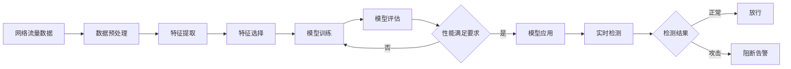

# 基于机器学习的DRDoS攻击检测的设计与实现

## 1. 背景介绍

### 1.1 DRDoS攻击的危害

在当今互联网时代,网络安全问题日益突出。其中,分布式反射拒绝服务(Distributed Reflective Denial of Service, DRDoS)攻击作为一种新型的网络攻击手段,对网络安全构成了严重威胁。DRDoS攻击利用大量僵尸主机对目标服务器发起海量的服务请求,快速消耗目标服务器的计算资源、存储资源和网络带宽资源,导致目标服务器无法正常响应合法用户请求,造成服务中断或瘫痪。

DRDoS攻击具有隐蔽性强、攻击流量大、攻击效果显著等特点,给企业和组织带来巨大经济损失。据统计,2020年全球范围内DRDoS攻击造成的经济损失高达820亿美元。因此,研究高效的DRDoS攻击检测方法具有重要的理论意义和实际应用价值。

### 1.2 机器学习在DRDoS攻击检测中的应用

传统的DRDoS攻击检测方法主要基于特征工程和专家经验,存在检测精度不高、误报率高、实时性差等问题。近年来,机器学习技术在网络安全领域得到广泛应用,为DRDoS攻击检测提供了新的思路和方法。

机器学习通过对海量网络流量数据进行学习和训练,自动提取DRDoS攻击流量的关键特征,构建高精度的检测模型。与传统方法相比,基于机器学习的DRDoS攻击检测方法具有以下优势:

1. 自适应性强,能够适应复杂多变的网络环境和攻击手段。
2. 检测精度高,通过多维度特征融合和深度特征学习,提高检测的准确率。
3. 实时性好,训练好的模型可快速识别DRDoS攻击流量,满足实时检测的需求。
4. 可扩展性强,可方便地引入新的特征和算法,不断优化和完善检测系统。

因此,研究基于机器学习的DRDoS攻击检测方法,对提升网络安全防护能力,保障网络系统安全稳定运行具有重要意义。

## 2. 核心概念与联系

### 2.1 DRDoS攻击原理

DRDoS攻击的核心是利用大量僵尸主机对目标服务器发起海量的服务请求,快速消耗目标服务器资源,导致其无法正常提供服务。攻击者通过感染大量主机,将其变成"肉鸡",并向这些主机下发攻击指令。"肉鸡"接收指令后,开始对目标服务器发起大量伪造的服务请求,如DNS请求、NTP请求等,造成拒绝服务攻击。

与传统DDoS攻击相比,DRDoS攻击具有以下特点:

1. 利用合法服务进行放大反射,使攻击流量急剧放大。
2. 伪造受害者IP地址,隐藏真实攻击源,增加溯源难度。
3. 攻击流量分布广泛,难以在源头进行有效阻断和清洗。

### 2.2 机器学习基本原理

机器学习是一种赋予计算机系统学习能力的人工智能技术,通过数据驱动的方式,使计算机系统具备自动学习、改进和预测的能力。机器学习主要包括以下几个关键环节:

1. 数据收集:收集和标注高质量的训练数据集。
2. 特征工程:从原始数据中提取、筛选和融合有效特征。
3. 模型训练:选择合适的机器学习算法,利用训练数据对模型进行训练优化。 
4. 模型评估:利用测试数据集对训练好的模型进行性能评估。
5. 模型应用:将训练好的模型部署到实际系统中,对新数据进行预测和决策。

常用的机器学习算法包括:

- 监督学习:K近邻、决策树、随机森林、支持向量机、逻辑回归等。
- 无监督学习:K均值聚类、层次聚类、主成分分析、自编码器等。
- 强化学习:Q学习、Sarsa学习、策略梯度等。

### 2.3 机器学习在DRDoS攻击检测中的应用框架

基于机器学习的DRDoS攻击检测的基本框架如下图所示:

整个框架主要包括以下几个关键步骤:

1. 数据预处理:对收集到的网络流量数据进行清洗、归一化等预处理操作。
2. 特征提取:从流量数据中提取反映DRDoS攻击特征的关键指标,如流量速率、请求次数、IP地址分布等。
3. 特征选择:利用特征选择算法筛选出对检测性能贡献最大的特征子集。
4. 模型训练:利用机器学习算法在训练数据集上训练检测模型,并通过交叉验证等方法优化模型。
5. 模型评估:在测试数据集上评估模型的检测性能,如准确率、召回率、误报率等。
6. 模型应用:将训练好的模型部署到实际网络环境中,对实时流量进行检测和判别。

下面将详细介绍基于机器学习的DRDoS攻击检测的核心算法原理和关键技术。

## 3. 核心算法原理具体操作步骤

本节重点介绍基于机器学习的DRDoS攻击检测的两种核心算法:基于决策树的检测算法和基于支持向量机的检测算法。

### 3.1 基于决策树的检测算法

#### 3.1.1 决策树算法原理

决策树是一种树形结构的分类器,由根节点、内部节点和叶节点组成。每个内部节点表示一个特征属性的判断条件,每个叶节点表示一个分类结果。决策树算法通过递归地选择最优划分特征,将数据集分割成越来越纯的子集,直到达到停止条件。

决策树算法的核心是特征选择准则,常用的准则有信息增益、信息增益比和基尼指数等。以信息增益为例,其计算公式为:

$$Gain(D,a) = Ent(D) - \sum_{v=1}^{V}\frac{|D^v|}{|D|}Ent(D^v)$$

其中,$D$为数据集,$a$为特征,$V$为特征$a$的取值个数,$D^v$为特征$a$取值为$v$的样本子集,$Ent(·)$为信息熵,计算公式为:

$$Ent(D) = -\sum_{k=1}^{K}\frac{|C_k|}{|D|}log_2\frac{|C_k|}{|D|}$$

其中,$K$为类别数,$C_k$为属于第$k$类的样本集合。

#### 3.1.2 决策树检测算法步骤

基于决策树的DRDoS攻击检测算法的具体步骤如下:

1. 数据预处理:对收集到的网络流量数据进行清洗、归一化等预处理操作。
2. 特征提取:提取反映DRDoS攻击特征的关键指标,如流量速率、请求次数、IP地址分布等。
3. 特征选择:利用决策树的特征选择准则,如信息增益,选择最优特征。
4. 生成决策树:根据选择的最优特征,递归地划分数据集,生成决策树。
5. 决策树剪枝:通过剪枝操作简化决策树,提高泛化性能,降低过拟合风险。
6. 模型评估:在测试集上评估决策树模型的检测性能,如准确率、召回率等。
7. 模型应用:将训练好的决策树模型部署到实际环境中,对新的网络流量进行实时检测。

### 3.2 基于支持向量机的检测算法

#### 3.2.1 支持向量机算法原理

支持向量机(Support Vector Machine, SVM)是一种二分类模型,其基本思想是在特征空间中寻找一个最优分类超平面,使得两类样本能够被超平面正确划分,并且离超平面最近的样本点(支持向量)到超平面的距离最大。

对于线性可分问题,SVM优化目标可表示为:

$$\min_{w,b} \frac{1}{2}||w||^2 \quad s.t. \quad y_i(w·x_i+b) \geq 1, i=1,2,...,N$$

其中,$w$和$b$为超平面参数,$x_i$和$y_i$为第$i$个样本的特征向量和类别标签。

对于线性不可分问题,通过引入松弛变量$\xi_i$和惩罚因子$C$,优化目标可表示为:

$$\min_{w,b,\xi} \frac{1}{2}||w||^2+C\sum_{i=1}^{N}\xi_i \quad s.t. \quad y_i(w·x_i+b) \geq 1-\xi_i, \xi_i \geq 0, i=1,2,...,N$$

通过求解对偶问题,可得到分类决策函数:

$$f(x) = sign(\sum_{i=1}^{N}\alpha_i y_i (x·x_i) + b)$$

其中,$\alpha_i$为拉格朗日乘子,$x_i$为支持向量。

#### 3.2.2 SVM检测算法步骤

基于SVM的DRDoS攻击检测算法的具体步骤如下:

1. 数据预处理:对收集到的网络流量数据进行清洗、归一化等预处理操作。
2. 特征提取:提取反映DRDoS攻击特征的关键指标,如流量速率、请求次数、IP地址分布等。
3. 特征选择:利用特征选择算法如F检验,选择对分类性能贡献最大的特征子集。
4. 模型训练:利用SVM算法在训练集上学习最优分类超平面,通过交叉验证优化模型参数。
5. 模型评估:在测试集上评估SVM模型的检测性能,如准确率、召回率、F1值等。
6. 模型应用:将训练好的SVM模型部署到实际环境中,对新的网络流量进行实时检测。

## 4. 数学模型和公式详细讲解举例说明

### 4.1 信息熵与信息增益

在决策树算法中,信息熵和信息增益是常用的特征选择准则。信息熵用于衡量数据集的纯度,信息熵越小,数据集的纯度越高。假设数据集$D$中第$k$类样本所占的比例为$p_k(k=1,2,...,K)$,则$D$的信息熵定义为:

$$Ent(D) = -\sum_{k=1}^{K}p_klog_2p_k$$

例如,假设数据集$D$中正样本占60%,负样本占40%,则其信息熵为:

$$Ent(D) = -0.6log_20.6-0.4log_20.4 = 0.971$$

信息增益表示特征$a$对数据集$D$的纯度提升程度,定义为数据集$D$的信息熵与特征$a$的条件熵之差:

$$Gain(D,a) = Ent(D) - \sum_{v=1}^{V}\frac{|D^v|}{|D|}Ent(D^v)$$

其中,$V$为特征$a$的取值个数,$D^v$为特征$a$取值为$v$的样本子集。

例如,假设特征$a$有2个取值,取值为1时正样本占80%,负样本占20%;取值为2时正样本占30%,负样本占70%。则特征$a$的信息增益为:

$$Gain(D,a) = 0.971 - (\frac{|D^1|}{|D|}·(-0.8log_20.8-0.2log_20.2) + \frac{|D^2|}{|D|}·(-0.3log_20.3-0.7log_20.7)) = 0.324$$

### 4.2 SVM中的核函数

在SVM算法中,通过核函数可将样