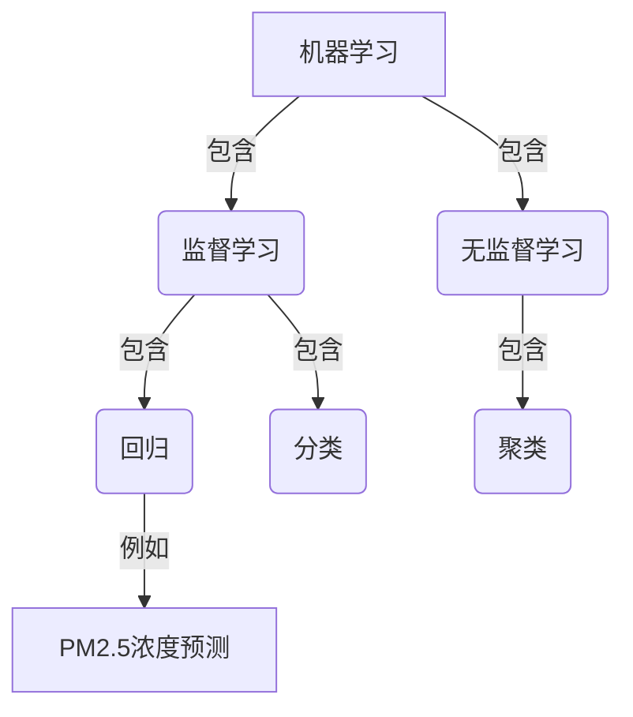
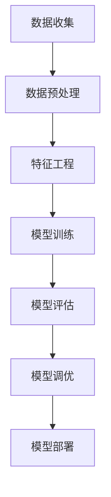

# 基于机器学习的PM2.5浓度预测模型

## 1.背景介绍

### 1.1 PM2.5概述

PM2.5是一种细小的悬浮颗粒物,直径小于或等于2.5微米,主要来源于燃煤、汽车尾气排放、工业生产等。由于其微小的尺寸,PM2.5可深入人体呼吸系统,对人体健康造成严重危害。因此,准确预测PM2.5浓度对于制定环境保护政策和公众健康风险评估至关重要。

### 1.2 传统预测方法缺陷

传统的PM2.5浓度预测方法主要依赖于物理模型和统计模型。然而,这些模型存在一些固有缺陷:

- 物理模型需要大量的输入数据,例如排放源、气象条件等,且计算成本高昂。
- 统计模型通常基于历史数据,难以捕捉复杂的非线性关系和动态变化。

### 1.3 机器学习在PM2.5预测中的应用

近年来,机器学习技术在环境领域得到了广泛应用,展现出了巨大的潜力。与传统方法相比,机器学习模型可以自动从数据中学习特征,捕捉复杂的非线性关系,并提供更准确的预测结果。

本文将介绍一种基于机器学习的PM2.5浓度预测模型,该模型综合利用了多源数据,包括气象数据、地理位置数据、排放源数据等,通过特征工程和模型优化,实现了高精度的PM2.5浓度预测。

## 2.核心概念与联系

### 2.1 机器学习概述

机器学习是一种从数据中自动分析获得规律,并应用所学习到的规律对未知数据进行预测的方法。常见的机器学习任务包括分类、回归、聚类等。PM2.5浓度预测属于回归任务,即根据输入特征预测一个连续的数值输出。



### 2.2 特征工程

特征工程是机器学习过程中的一个关键步骤,旨在从原始数据中提取有意义的特征,使模型能够更好地学习数据的内在规律。对于PM2.5预测任务,常用的特征包括:

- 气象数据:温度、湿度、风速、风向等
- 地理位置数据:经纬度、海拔高度等
- 排放源数据:工厂、交通流量等
- 时间数据:年、月、日、小时等

通过特征工程,可以将这些原始数据转换为模型可以理解的数值特征向量。

### 2.3 模型选择

根据任务的特点和数据的性质,需要选择合适的机器学习模型。常用于回归任务的模型包括线性回归、决策树、随机森林、支持向量回归(SVR)、神经网络等。不同模型有各自的优缺点,需要根据具体情况进行选择和调优。

此外,还需要考虑模型的可解释性、鲁棒性和可扩展性等因素,以满足实际应用的需求。

## 3.核心算法原理具体操作步骤

在介绍具体算法之前,我们先来看一下基于机器学习的PM2.5浓度预测模型的整体流程:



### 3.1 数据收集

收集与PM2.5浓度相关的多源数据,包括:

- 气象数据:温度、湿度、风速、风向等
- 地理位置数据:经纬度、海拔高度等
- 排放源数据:工厂、交通流量等
- 时间数据:年、月、日、小时等
- PM2.5监测站点数据

确保数据的完整性、准确性和时效性,对于提高模型性能至关重要。

### 3.2 数据预处理

对收集到的原始数据进行清洗和标准化处理,包括:

- 缺失值处理:填充或删除缺失值
- 异常值处理:去除异常值或进行平滑处理
- 数据标准化:将数据缩放到相同的范围,避免数据量纲不一致导致的影响

### 3.3 特征工程

根据领域知识和经验,从原始数据中提取有意义的特征,构建特征矩阵。常用的特征工程技术包括:

- one-hot编码:将分类特征转换为数值特征
- 多项式特征:增加特征的高次项,捕捉非线性关系
- 交互特征:构建特征之间的乘积项,捕捉特征交互
- 时间特征:将时间数据转换为周期性特征

### 3.4 模型训练

选择合适的机器学习模型,并使用训练数据对模型进行训练。常用的回归模型包括:

- 线性回归
- 决策树回归
- 随机森林回归
- 支持向量回归(SVR)
- 神经网络回归

在训练过程中,需要进行超参数调优,以获得最佳的模型性能。

### 3.5 模型评估

使用测试数据对训练好的模型进行评估,常用的评估指标包括:

- 均方根误差(RMSE)
- 平均绝对误差(MAE)
- 决定系数(R^2)

评估结果将指导我们对模型进行进一步的调优和改进。

### 3.6 模型调优

根据模型评估结果,对模型进行调优,包括:

- 特征选择:去除无关特征,提高模型泛化能力
- 超参数调优:调整模型超参数,提高模型性能
- 集成学习:组合多个基础模型,提高预测的稳定性和准确性

### 3.7 模型部署

将调优后的模型部署到生产环境中,实现PM2.5浓度的实时预测。同时,需要建立模型更新机制,定期使用新的数据对模型进行重新训练,以适应环境的动态变化。

## 4.数学模型和公式详细讲解举例说明

在介绍具体的机器学习模型之前,我们先来了解一下回归问题的数学表示。

给定一个包含 $n$ 个样本的数据集 $\mathcal{D} = \{(x_i, y_i)\}_{i=1}^n$,其中 $x_i \in \mathbb{R}^d$ 是 $d$ 维特征向量, $y_i \in \mathbb{R}$ 是对应的目标值。回归任务的目标是学习一个函数 $f: \mathbb{R}^d \rightarrow \mathbb{R}$,使得对于任意输入 $x$,函数值 $f(x)$ 都尽可能接近对应的目标值 $y$。

为了衡量模型的预测性能,我们引入损失函数 $\mathcal{L}(y, f(x))$,它度量了预测值 $f(x)$ 与真实值 $y$ 之间的差异。常用的损失函数包括均方损失和绝对损失:

$$
\begin{aligned}
\text{均方损失(MSE)}: \mathcal{L}(y, f(x)) &= (y - f(x))^2 \\
\text{绝对损失(MAE)}: \mathcal{L}(y, f(x)) &= |y - f(x)|
\end{aligned}
$$

机器学习模型的训练过程就是优化损失函数,使得在训练数据集上的损失最小化:

$$
\min_f \frac{1}{n} \sum_{i=1}^n \mathcal{L}(y_i, f(x_i))
$$

不同的机器学习模型对应着不同的函数形式 $f(x)$,下面我们来介绍几种常用的回归模型。

### 4.1 线性回归

线性回归是最简单的回归模型,它假设目标值 $y$ 是特征向量 $x$ 的线性组合:

$$
f(x) = w^T x + b
$$

其中 $w \in \mathbb{R}^d$ 是权重向量, $b \in \mathbb{R}$ 是偏置项。训练过程就是求解最小化均方损失的 $w$ 和 $b$ 的值:

$$
\min_{w, b} \frac{1}{n} \sum_{i=1}^n (y_i - w^T x_i - b)^2
$$

这个优化问题有解析解,可以直接计算得到最优解。

### 4.2 决策树回归

决策树回归是一种基于树形结构的非参数模型。它通过递归地对特征空间进行分割,将输入空间划分为多个区域,每个区域对应一个固定的输出值。

决策树的构建过程可以用下面的伪代码表示:

```
函数 构建决策树(数据集 D):
    如果 D 中所有实例属于同一类别 C:
        返回单节点树,并将该节点标记为类 C
    否则:
        根据特征选择准则(如信息增益)选择最优特征 A
        创建根节点,将 A 作为根节点
        对 A 的每个可能值 a_i:
            创建子节点,将 D_i(A=a_i) 划分到子节点
            递归构建子树,将子树作为子节点
    返回构建的决策树
```

决策树的优点是可解释性强,缺点是容易过拟合。通常需要结合剪枝技术来控制模型的复杂度。

### 4.3 随机森林回归

随机森林是一种基于决策树的集成学习方法。它通过构建多个决策树,并将它们的预测结果进行平均,从而提高预测的准确性和稳定性。

随机森林的构建过程如下:

1. 从原始数据集中通过有放回抽样获得 $n$ 个新的训练集
2. 对每个训练集,使用决策树算法构建一个决策树,在构建过程中,对于每个节点,只从所有特征中随机选择一部分特征作为候选特征
3. 将构建的 $n$ 个决策树组合成随机森林模型

对于新的输入实例 $x$,随机森林的预测值是所有决策树预测值的平均:

$$
f(x) = \frac{1}{n} \sum_{i=1}^n f_i(x)
$$

其中 $f_i(x)$ 是第 $i$ 个决策树的预测值。

随机森林的优点是预测准确性高、鲁棒性强,缺点是可解释性较差。

### 4.4 支持向量回归(SVR)

支持向量回归是一种基于核技巧的非线性回归模型。它的基本思想是将输入数据映射到高维特征空间,在高维空间中构建一个最优超平面,使得大部分样本距离超平面的距离在一定范围内。

对于线性可分的情况,SVR 试图找到一个超平面 $f(x) = w^T x + b$,使得对于任意训练样本 $(x_i, y_i)$,都有:

$$
|y_i - f(x_i)| \leq \epsilon
$$

其中 $\epsilon$ 是预先设定的允许误差范围。同时,我们希望 $w$ 的范数尽可能小,以控制模型的复杂度。这可以转化为以下优化问题:

$$
\begin{aligned}
\min_{w, b} \quad & \frac{1}{2} \|w\|^2 \\
\text{s.t.} \quad & y_i - w^T x_i - b \leq \epsilon \\
                & w^T x_i + b - y_i \leq \epsilon
\end{aligned}
$$

对于非线性情况,SVR 通过核技巧将输入数据映射到高维特征空间,在高维空间中构建超平面。常用的核函数包括多项式核、高斯核等。

SVR 的优点是可以有效处理非线性问题,并且具有良好的泛化能力。缺点是对参数和核函数的选择较为敏感,需要进行调优。

### 4.5 神经网络回归

神经网络是一种强大的非线性模型,它通过模拟生物神经元的工作原理,构建了一种可以自动从数据中学习特征的模型。

一个典型的神经网络由输入层、隐藏层和输出层