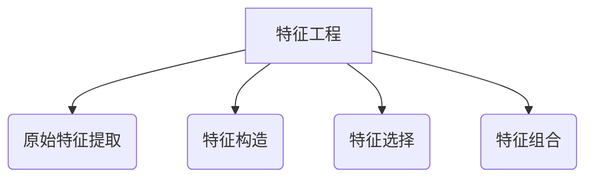
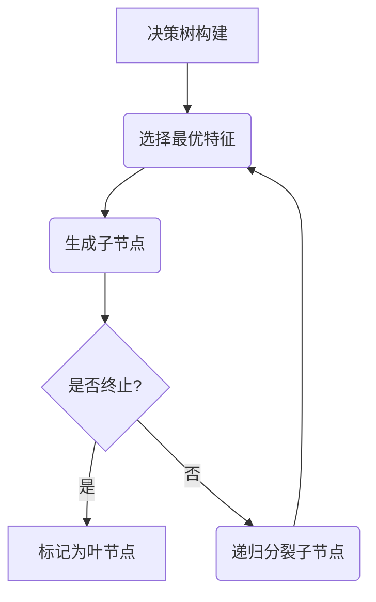
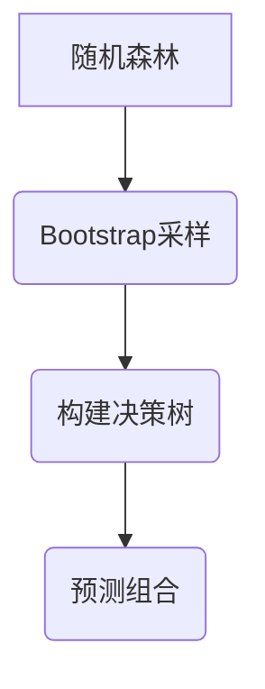
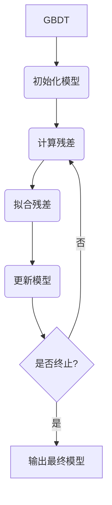

# 基于机器学习的银行信贷评分模型研究

## 1.背景介绍

### 1.1 信贷评分的重要性

在当今的金融领域中,信贷评分模型扮演着至关重要的角色。银行和其他金融机构在审批贷款申请时,需要对申请人的信用风险进行评估,以降低潜在的违约风险。传统的信贷评分方法主要依赖人工判断和历史数据,但这种方式存在一些缺陷,如主观性强、效率低下等。

随着大数据和机器学习技术的不断发展,基于机器学习的信贷评分模型应运而生,它能够从海量的历史数据中发现隐藏的模式和规律,从而更准确地预测申请人的违约风险。这不仅有助于银行做出更明智的贷款决策,还能提高审批效率,降低运营成本。

### 1.2 机器学习在信贷评分中的应用

机器学习算法能够从大量的历史数据中自动学习特征模式,并构建出精确的评分模型。常见的机器学习算法包括逻辑回归、决策树、随机森林、梯度提升树等。这些算法可以处理高维、非线性的数据,并且具有较强的泛化能力。

与传统的评分卡模型相比,基于机器学习的模型具有以下优势:

1. 更高的预测准确性
2. 自动特征选择和组合
3. 能够处理非线性和复杂的数据
4. 持续学习和自我优化

然而,机器学习模型也面临一些挑战,如数据质量、模型解释性、偏差和公平性等问题,需要在实际应用中加以解决。

## 2.核心概念与联系

### 2.1 监督学习与无监督学习

在信贷评分领域,我们通常采用监督学习的方法。监督学习是机器学习中的一个重要分支,它利用已知标签的训练数据,学习出一个映射函数,从而对新的未知数据进行预测或分类。

在信贷评分中,我们将历史贷款数据作为训练集,其中包含申请人的各种特征(如年龄、收入、职业等)以及相应的贷款结果(是否违约)。通过训练,模型能够学习到特征与违约风险之间的映射关系,从而对新的申请人进行评分和风险预测。

无监督学习则不需要标签数据,它主要用于发现数据内在的模式和结构。在信贷评分中,无监督学习可用于客户分群、异常检测等场景。

### 2.2 特征工程

特征工程是机器学习模型的重要环节之一。良好的特征能够提高模型的预测性能,反之则会导致模型欠拟合或过拟合。在信贷评分中,常见的特征包括:

- 人口统计学特征:年龄、性别、婚姻状况等
- 财务特征:收入、资产、负债等
- 信用历史:贷款记录、违约次数等
- 行为特征:消费模式、通讯记录等

除了原始特征外,我们还可以构造一些衍生特征,如年龄区间、收入比率等,以提高模型的表达能力。特征选择和特征组合也是特征工程的重要组成部分。

### 2.3 模型评估

为了评估信贷评分模型的性能,我们需要定义合适的评估指标。常用的指标包括:

- 准确率(Accuracy):正确预测的比例
- 精确率(Precision):正样本预测正确的比例
- 召回率(Recall):实际正样本被预测正确的比例
- F1分数:精确率和召回率的调和平均
- 受试者工作特征曲线(ROC)和曲线下面积(AUC)

除了这些统计指标外,我们还需要关注模型的解释性、稳定性和公平性等方面。一个理想的信贷评分模型应该具有较高的准确性,同时也要具备良好的可解释性和公平性,以确保决策的透明度和公正性。

## 3.核心算法原理具体操作步骤

### 3.1 逻辑回归

逻辑回归是一种常用的机器学习算法,适用于二分类问题。在信贷评分中,我们可以将其用于预测申请人是否会违约。

逻辑回归的核心思想是通过对数几率(log odds)建模,将输入特征映射到0到1之间的概率值。具体步骤如下:

1. 数据预处理:对特征进行标准化或归一化处理,处理缺失值等。
2. 初始化模型参数:通常将参数初始化为0或很小的随机值。
3. 计算预测值:对于每个样本,计算线性组合 $z = w^T x + b$,其中$w$为权重向量,$x$为特征向量,$b$为偏置项。
4. 计算概率:将线性组合$z$输入sigmoid函数,得到违约概率$p = \sigma(z) = \frac{1}{1 + e^{-z}}$。
5. 计算损失:使用交叉熵损失函数 $L = -\sum_{i=1}^{N}[y_i \log(p_i) + (1 - y_i)\log(1 - p_i)]$,其中$y_i$为真实标签。
6. 优化参数:使用梯度下降法等优化算法,迭代更新参数$w$和$b$,最小化损失函数。
7. 模型评估:在测试集上评估模型性能,计算准确率、AUC等指标。

逻辑回归的优点是模型简单、训练速度快、可解释性强。但它也有一些局限性,如对异常值敏感、只能处理线性可分数据等。

### 3.2 决策树

决策树是一种流行的机器学习算法,可用于分类和回归任务。在信贷评分中,我们可以使用决策树来预测申请人是否会违约。

决策树的构建过程是一种递归的分治策略,具体步骤如下:

1. 选择最优特征:根据某种指标(如信息增益、基尼系数等)选择最优特征,作为当前节点的分裂条件。
2. 生成子节点:根据最优特征的不同取值,将数据集分割成若干子集,作为子节点。
3. 终止条件:如果子节点中的样本属于同一类别,或者达到预设的最大深度,则将该节点标记为叶节点。
4. 递归分裂:对于每个非叶节点,重复步骤1-3,直到所有节点都是叶节点。

决策树的优点是模型可解释性强、可以处理数值型和类别型特征、对异常值不敏感。但它也存在过拟合的风险,因此需要进行剪枝或使用集成方法(如随机森林)来提高泛化能力。

### 3.3 随机森林

随机森林是一种基于决策树的集成学习方法,它通过构建多个决策树,并将它们的预测结果进行组合,从而提高模型的准确性和鲁棒性。

随机森林的具体步骤如下:

1. Bootstrap采样:从原始数据集中,通过有放回的方式随机采样N个样本,构建N个Bootstrap数据集。
2. 构建决策树:对于每个Bootstrap数据集,使用决策树算法构建一个决策树,但在选择最优特征时,只从所有特征中随机选择一个子集。
3. 预测组合:对于新的测试样本,每棵决策树都会做出一个预测,随机森林将这些预测结果进行投票或平均,得到最终的预测结果。

随机森林的优点是能够有效减小过拟合的风险,提高模型的泛化能力。它还具有对异常值的鲁棒性,可以处理高维数据,并且可以评估特征的重要性。

### 3.4 梯度提升树

梯度提升树(GBDT)是一种强大的机器学习算法,它通过迭代地构建多个弱学习器(决策树),并将它们的预测结果进行加权组合,从而得到一个强大的模型。

GBDT的核心思想是每一步只学习一个简单的模型,使其能够很好地拟合当前的残差,然后将这个简单模型加入到已有的模型之中。具体步骤如下:

1. 初始化模型:将初始模型设置为一个常数,如 $F_0(x) = \arg\min\sum_{i=1}^{N}L(y_i, c)$,其中$L$为损失函数。
2. 计算残差:对于每个样本,计算当前模型与真实值之间的残差 $r_i = y_i - F_{m-1}(x_i)$。
3. 拟合残差:使用决策树回归算法,对残差 $r_i$ 进行拟合,得到一个新的决策树模型 $h_m(x)$。
4. 更新模型:将新的决策树模型加入到已有的模型中,得到新的模型 $F_m(x) = F_{m-1}(x) + \eta h_m(x)$,其中$\eta$为学习率。
5. 迭代更新:重复步骤2-4,直到达到最大迭代次数或满足其他停止条件。

GBDT的优点是能够自动捕获特征之间的高阶非线性关系,具有较强的预测能力。但它也存在一些缺陷,如容易过拟合、对异常值敏感、训练时间较长等。

## 4.数学模型和公式详细讲解举例说明

在信贷评分模型中,我们常常需要使用一些数学模型和公式来描述和优化算法。下面将详细介绍几个常见的数学模型和公式。

### 4.1 逻辑回归模型

逻辑回归模型是一种广泛应用于分类问题的机器学习模型。在信贷评分中,我们可以使用逻辑回归来预测申请人是否会违约。

逻辑回归模型的核心思想是通过对数几率(log odds)建模,将输入特征映射到0到1之间的概率值。具体来说,对于一个样本 $x$,我们有:

$$
\begin{aligned}
z &= w^T x + b \\
p &= \sigma(z) = \frac{1}{1 + e^{-z}}
\end{aligned}
$$

其中 $w$ 为权重向量, $b$ 为偏置项, $\sigma(\cdot)$ 为 sigmoid 函数。我们的目标是找到最优的 $w$ 和 $b$,使得模型在训练数据上的损失最小化。

常用的损失函数是交叉熵损失函数:

$$
L = -\sum_{i=1}^{N}[y_i \log(p_i) + (1 - y_i)\log(1 - p_i)]
$$

其中 $y_i$ 为真实标签,取值为0或1。

为了优化损失函数,我们可以使用梯度下降法等优化算法,迭代更新参数 $w$ 和 $b$。具体来说,对于每个样本 $(x_i, y_i)$,我们有:

$$
\begin{aligned}
\frac{\partial L}{\partial w} &= (p_i - y_i)x_i \\
\frac{\partial L}{\partial b} &= p_i - y_i
\end{aligned}
$$

通过不断更新参数,直到损失函数收敛或达到其他停止条件。

### 4.2 决策树模型

决策树是一种流行的机器学习算法,可用于分类和回归任务。在信贷评分中,我们可以使用决策树来预测申请人是否会违约。

决策树的构建过程是一种递归的分治策略,核心问题是如何选择最优特征作为分裂条件。常用的指标包括信息增益和基尼系数。