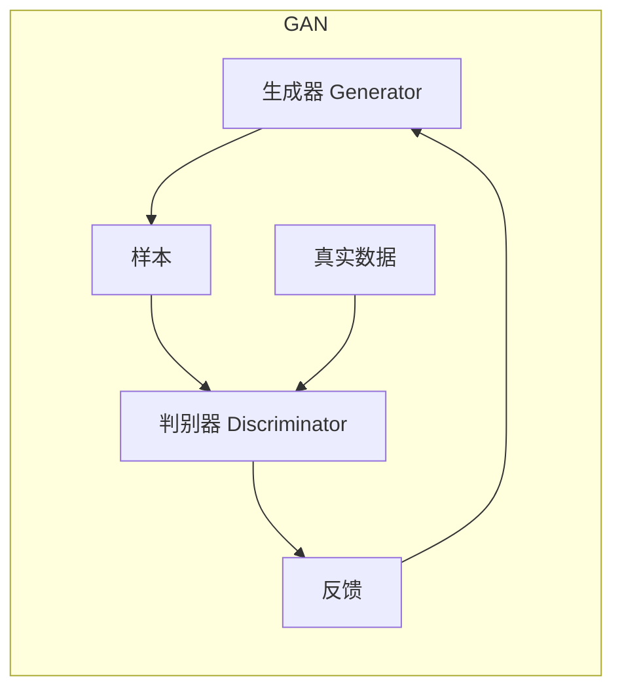
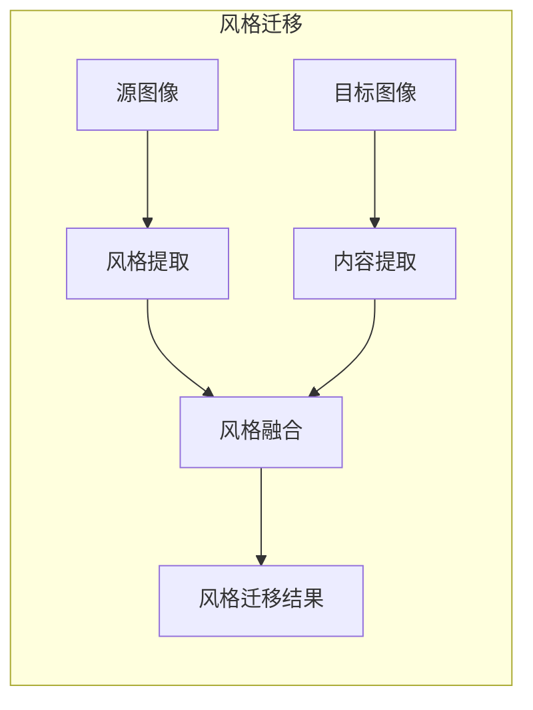

# 基于生成对抗网络的室内设计风格迁移工具研发

## 1. 背景介绍

### 1.1 室内设计的重要性

室内设计是一个融合艺术、科学和技术的领域,旨在创造舒适、功能性和美观的室内环境。良好的室内设计不仅能提升生活质量,还能影响工作效率和心理健康。随着人们对生活品质要求的提高,室内设计的重要性日益凸显。

### 1.2 传统室内设计的挑战

传统的室内设计过程通常依赖于设计师的主观判断和经验,这使得设计过程耗时耗力,且难以满足不同客户的个性化需求。此外,对于缺乏专业知识的普通用户来说,实现理想的室内设计风格也是一大挑战。

### 1.3 人工智能在室内设计中的应用

随着人工智能技术的不断发展,越来越多的智能化工具被应用于室内设计领域。其中,生成对抗网络(Generative Adversarial Networks, GANs)作为一种强大的生成模型,在图像生成、风格迁移等任务中表现出色,为室内设计带来了新的契机。

## 2. 核心概念与联系

### 2.1 生成对抗网络(GANs)

生成对抗网络是一种由两个神经网络组成的框架,包括生成器(Generator)和判别器(Discriminator)。生成器的目标是生成逼真的数据样本,而判别器的目标是区分生成的样本和真实样本。通过生成器和判别器的对抗训练,生成器可以学习到真实数据的分布,从而生成逼真的样本。



### 2.2 风格迁移

风格迁移是一种将源图像的风格迁移到目标图像的技术。通过捕获源图像的风格特征(如颜色、纹理等)并应用到目标图像上,可以实现风格的无缝融合。在室内设计中,风格迁移可以帮助用户将喜欢的风格应用到自己的室内环境中,从而实现个性化设计。



### 2.3 室内设计风格迁移

将生成对抗网络和风格迁移技术相结合,可以实现室内设计风格的自动迁移。具体来说,生成对抗网络可以学习到不同室内设计风格的特征,然后将这些特征应用到目标室内环境图像上,从而实现风格的无缝迁移。这种方法不仅可以满足用户的个性化需求,还能大大提高设计效率。

## 3. 核心算法原理具体操作步骤

### 3.1 数据准备

首先需要准备两种类型的数据:

1. **室内设计风格数据集**:包含不同风格(如现代、古典、工业等)的室内设计图像。这些图像将用于训练生成对抗网络,让其学习不同风格的特征。

2. **目标室内环境图像**:用户希望进行风格迁移的目标室内环境图像。

### 3.2 生成对抗网络训练

使用室内设计风格数据集训练生成对抗网络,具体步骤如下:

1. **初始化生成器和判别器**:设计合适的神经网络结构作为生成器和判别器。

2. **生成器训练**:生成器从随机噪声输入开始,生成假样本。判别器将真实样本和生成器生成的假样本作为输入,并输出一个概率值,表示该样本是真实的概率。生成器的目标是最大化判别器将假样本判定为真实样本的概率。

3. **判别器训练**:判别器的目标是最大化正确分类真实样本和生成样本的概率。

4. **反向传播和参数更新**:根据生成器和判别器的损失函数,使用反向传播算法更新网络参数。

5. **迭代训练**:重复步骤2-4,直到生成器生成的样本足够逼真,判别器无法可靠地区分真实样本和生成样本。

经过充分训练,生成对抗网络可以学习到不同室内设计风格的特征表示。

### 3.3 风格迁移

将训练好的生成对抗网络应用于目标室内环境图像,实现风格迁移:

1. **内容图像编码**:将目标室内环境图像输入到生成对抗网络的编码器中,获得其内容特征表示。

2. **风格编码**:从室内设计风格数据集中选择一种期望的风格,将其输入到生成对抗网络的编码器中,获得风格特征表示。

3. **特征融合**:将内容特征表示和风格特征表示融合,作为生成对抗网络解码器的输入。

4. **图像生成**:生成对抗网络的解码器将融合后的特征解码,生成具有目标风格的室内环境图像。

通过上述步骤,可以实现将期望的室内设计风格无缝迁移到目标室内环境图像上。

## 4. 数学模型和公式详细讲解举例说明

### 4.1 生成对抗网络损失函数

生成对抗网络的训练过程可以看作是一个极小极大游戏,生成器和判别器相互对抗,最终达到纳什均衡。其损失函数可以表示为:

$$\min_G \max_D V(D,G) = \mathbb{E}_{x\sim p_{data}(x)}[\log D(x)] + \mathbb{E}_{z\sim p_z(z)}[\log(1-D(G(z)))]$$

其中:
- $G$是生成器,将噪声$z$映射到数据空间,生成假样本$G(z)$
- $D$是判别器,对真实样本$x$和生成样本$G(z)$进行二分类
- $p_{data}(x)$是真实数据分布
- $p_z(z)$是噪声$z$的分布,通常为高斯分布或均匀分布

判别器$D$的目标是最大化对数似然,即$\max_D V(D,G)$;生成器$G$的目标是最小化$\log(1-D(G(z)))$,即$\min_G V(D,G)$。通过反复迭代,生成器和判别器相互对抗,最终达到纳什均衡。

### 4.2 风格迁移损失函数

风格迁移的目标是将源图像的风格迁移到目标图像,同时保留目标图像的内容。这可以通过最小化内容损失和风格损失来实现:

$$\mathcal{L}_{total}(\vec{p},\vec{a},\vec{x})=\alpha\cdot\mathcal{L}_{content}(\vec{p},\vec{x})+\beta\cdot\mathcal{L}_{style}(\vec{a},\vec{x})$$

其中:
- $\vec{p}$是目标图像的内容表示
- $\vec{a}$是源图像的风格表示
- $\vec{x}$是生成的输出图像
- $\mathcal{L}_{content}$是内容损失,用于保留目标图像的内容
- $\mathcal{L}_{style}$是风格损失,用于迁移源图像的风格
- $\alpha$和$\beta$是权重系数,用于平衡内容损失和风格损失

内容损失通常使用均方误差来计算:

$$\mathcal{L}_{content}(\vec{p},\vec{x})=\frac{1}{2}\sum_{i,j}(F_{ij}^l(\vec{x})-P_{ij}^l)^2$$

其中$F_{ij}^l$是输出图像$\vec{x}$在第$l$层的特征图,而$P_{ij}^l$是目标图像$\vec{p}$在相同层的特征图。

风格损失通常使用格拉姆矩阵(Gram Matrix)来计算:

$$\mathcal{L}_{style}(\vec{a},\vec{x})=\sum_l\frac{1}{N_l^2M_l^2}\sum_{i,j}\left(G_{ij}^l(\vec{x})-A_{ij}^l\right)^2$$

其中$G_{ij}^l(\vec{x})$是输出图像$\vec{x}$在第$l$层的格拉姆矩阵,而$A_{ij}^l$是源图像$\vec{a}$在相同层的格拉姆矩阵。$N_l$和$M_l$分别是特征图的高度和宽度。

通过最小化上述损失函数,可以生成同时保留目标图像内容和源图像风格的输出图像。

### 4.3 实例:卧室风格迁移

假设我们有一个现代风格的卧室图像作为目标图像,以及一个工业风格的室内设计图像作为风格源。我们希望将工业风格迁移到目标卧室图像上。

首先,将目标卧室图像和工业风格图像分别输入到生成对抗网络的编码器中,获得它们的内容特征表示$\vec{p}$和风格特征表示$\vec{a}$。

然后,使用公式(2)计算内容损失$\mathcal{L}_{content}(\vec{p},\vec{x})$和风格损失$\mathcal{L}_{style}(\vec{a},\vec{x})$,并根据公式(1)计算总损失$\mathcal{L}_{total}(\vec{p},\vec{a},\vec{x})$。

接下来,通过反向传播和梯度下降,最小化总损失函数,更新生成对抗网络的参数,生成输出图像$\vec{x}$。

经过多次迭代,我们可以得到一个同时保留了目标卧室内容和工业风格的输出图像。

## 5. 项目实践:代码实例和详细解释说明

### 5.1 环境配置

本项目使用Python编程语言,并基于PyTorch深度学习框架实现。首先,我们需要安装必要的Python包:

```bash
pip install torch torchvision matplotlib numpy Pillow
```

### 5.2 数据准备

我们将使用一个开源的室内设计风格数据集,包含现代、古典、工业等多种风格的图像。你可以从[这里](https://www.kaggle.com/datasets/itsahmadawais/interior-design-style-dataset)下载该数据集。

下载后,将数据集解压并放置在合适的目录下。我们将使用PyTorch的`ImageFolder`类自动加载和预处理图像数据。

```python
from torchvision import transforms, datasets

# 定义图像预处理变换
transform = transforms.Compose([
    transforms.Resize(256),
    transforms.CenterCrop(224),
    transforms.ToTensor(),
    transforms.Normalize(mean=[0.485, 0.456, 0.406], std=[0.229, 0.224, 0.225])
])

# 加载数据集
dataset = datasets.ImageFolder('path/to/dataset', transform=transform)
```

### 5.3 生成对抗网络实现

我们将使用PyTorch实现一个简单的生成对抗网络,包括生成器和判别器。

#### 5.3.1 生成器

生成器的输入是一个随机噪声向量,输出是一个图像。我们使用全卷积网络作为生成器的结构。

```python
import torch.nn as nn

class Generator(nn.Module):
    def __init__(self, z_dim=100, ngf=64, nc=3):
        super(Generator, self).__init__()
        self.main = nn.Sequential(
            # 输入是一个随机噪声向量 z
            nn.ConvTranspose2d(z_dim, ngf * 8, 4, 1, 0, bias=False),
            nn.BatchNorm2d(ngf * 8),
            nn.ReLU(True),
            
            # 上采样和卷积层
            nn.ConvTranspose2d(ngf * 8, ngf * 4, 4, 2, 1, bias=False),
            nn.BatchNorm2d(ngf * 4),
            nn.ReLU(True),
            nn.ConvTranspose2d(ngf * 4, ngf * 2, 4, 2, 1, bias=False),
            nn.BatchNorm2d(ngf * 2),
            nn.ReLU(True),
            nn.ConvTranspose2d(ngf * 2, ngf, 4, 2, 1, bias=False),
            nn.BatchNorm2d(ngf),
            nn.ReLU(True),
            
            # 输出层
            nn.ConvTranspose2d(ngf, nc, 4, 2, 1, bias=