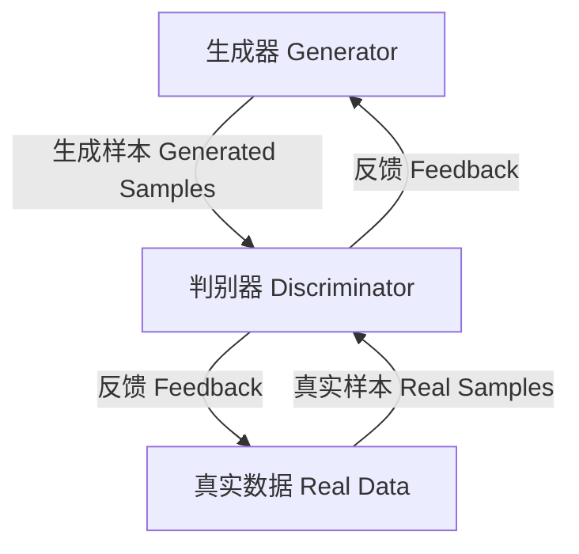
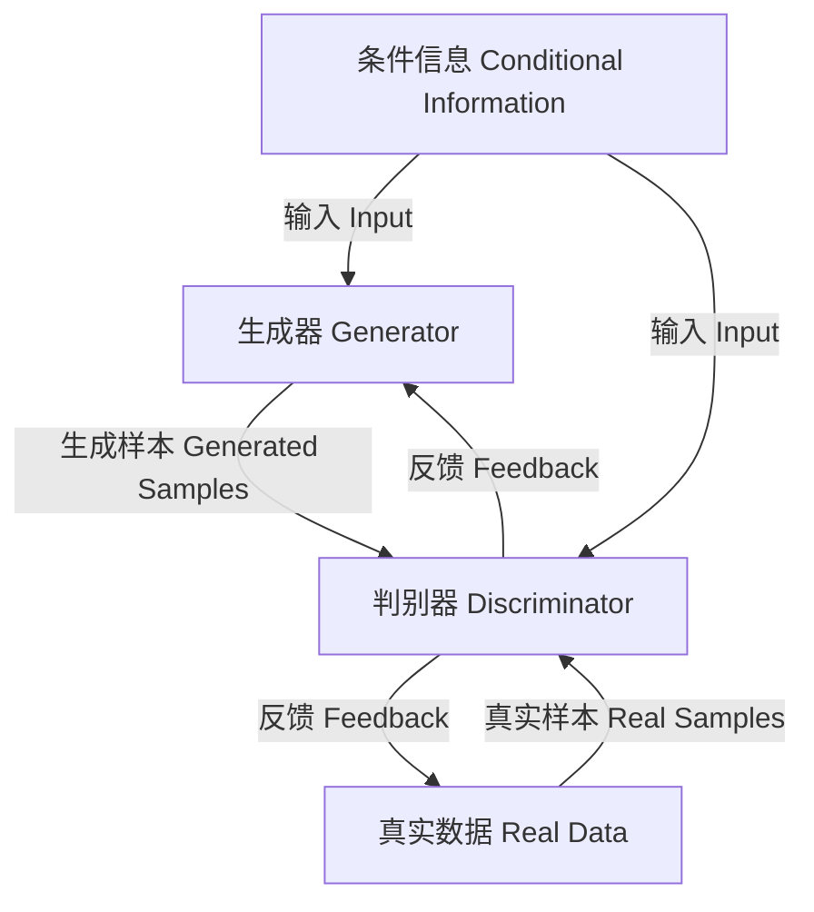

# 基于生成对抗网络的自然场景风格化图像生成研究

## 1. 背景介绍

### 1.1 图像生成任务概述

图像生成是计算机视觉和人工智能领域的一个核心研究课题,旨在基于给定的条件或约束,生成逼真、高质量的图像数据。随着深度学习技术的不断发展,基于深度生成模型的图像生成方法取得了长足的进步,广泛应用于多个领域,如计算机图形学、虚拟现实、影视特效等。

### 1.2 自然场景图像生成的重要性

自然场景图像生成任务是图像生成领域的一个重要分支,旨在生成具有真实感的自然环境图像,如山川、森林、海洋等景观。这类图像不仅具有重要的应用价值,还能为相关研究领域提供大量训练数据。然而,由于自然场景的复杂多样性,生成高质量的自然场景图像一直是一个巨大的挑战。

### 1.3 生成对抗网络在图像生成中的作用

生成对抗网络(Generative Adversarial Networks, GANs)是近年来在图像生成领域取得突破性进展的核心技术之一。GAN模型通过生成器和判别器两个神经网络模型的对抗训练,能够捕捉真实数据的分布,并生成逼真的样本数据。由于其出色的生成性能,GAN及其变体被广泛应用于自然场景图像生成等多个领域。

## 2. 核心概念与联系

### 2.1 生成对抗网络(GANs)

生成对抗网络是一种由生成器(Generator)和判别器(Discriminator)组成的无监督深度学习架构。生成器的目标是生成逼真的样本数据,而判别器则旨在区分生成的样本和真实数据。两个模型通过对抗训练相互博弈,最终达到生成器生成的样本无法被判别器识别的状态,即生成器学习到了真实数据的分布。



### 2.2 条件生成对抗网络(Conditional GANs)

条件生成对抗网络(Conditional GANs, cGANs)是GAN的一种扩展形式,它在生成过程中引入了额外的条件信息,如类别标签、文本描述等。通过将条件信息作为额外的输入,cGAN能够控制生成数据的特征,实现条件生成任务。在自然场景图像生成中,cGAN常被用于根据文本描述或语义标签生成相应的图像。



### 2.3 风格化图像生成

风格化图像生成是一种将特定视觉风格迁移到目标图像的任务。常见的方法是利用风格迁移网络将源风格图像的风格特征迁移到目标内容图像中,生成保留了内容信息但采用新风格的图像。在自然场景图像生成中,风格化图像生成可用于将特定的艺术风格或视觉效果应用于生成的自然场景图像,赋予其独特的视觉体验。

## 3. 核心算法原理具体操作步骤

### 3.1 生成对抗网络训练过程

1. **初始化生成器G和判别器D**
   - 生成器G是一个上采样卷积神经网络,将随机噪声作为输入,生成目标图像
   - 判别器D是一个下采样卷积神经网络,输入真实图像或生成图像,输出真实/假的概率值

2. **训练阶段**
   - 固定生成器G,仅训练判别器D
     - 将真实图像输入D,期望D输出接近1的值
     - 将G生成的假图像输入D,期望D输出接近0的值
     - 计算D的损失函数,并基于损失值更新D的参数
   - 固定判别器D,仅训练生成器G
     - 将随机噪声输入G,生成假图像
     - 将假图像输入D,期望D输出接近1的值
     - 计算G的损失函数,并基于损失值更新G的参数

3. **重复上述过程**
   - 生成器G和判别器D相互对抗训练
   - G努力生成逼真的假图像,以欺骗D
   - D努力区分真实图像和G生成的假图像

4. **训练收敛**
   - 当G生成的假图像无法被D区分时,训练达到收敛状态
   - G学习到了真实图像数据的分布,能够生成高质量的目标图像

### 3.2 条件生成对抗网络训练过程

条件生成对抗网络(cGAN)的训练过程与标准GAN类似,不同之处在于引入了额外的条件信息作为输入:

1. **初始化生成器G和判别器D**
   - G和D的网络结构类似于标准GAN
   - G和D除了图像数据,还接受条件信息(如类别标签、文本描述等)作为输入

2. **训练阶段**
   - 固定G,训练D
     - 将真实图像和条件信息输入D,期望D输出接近1
     - 将G生成的假图像和条件信息输入D,期望D输出接近0
     - 计算D损失函数,更新D参数
   - 固定D,训练G
     - 将随机噪声和条件信息输入G,生成假图像
     - 将假图像和条件信息输入D,期望D输出接近1
     - 计算G损失函数,更新G参数

3. **重复训练过程**
   - G和D相互对抗,G努力生成符合条件的逼真图像
   - D努力区分真实图像和G生成的条件图像

4. **训练收敛**
   - 当G生成的条件图像无法被D区分时,训练收敛
   - G学习到了真实数据在给定条件下的分布

通过引入条件信息,cGAN能够控制生成图像的特征,实现条件生成任务。在自然场景图像生成中,常用的条件信息包括文本描述、语义标签等。

## 4. 数学模型和公式详细讲解举例说明

### 4.1 生成对抗网络损失函数

生成对抗网络的目标是训练生成器G生成逼真的样本,使得判别器D无法区分真实样本和生成样本。这可以通过最小化生成器G和判别器D的损失函数来实现。

对于生成器G,其损失函数可定义为:

$$\underset{G}{\mathrm{min}}\,\underset{D}{\mathrm{max}}\,V(D,G) = \mathbb{E}_{x\sim p_\text{data}(x)}\left[\log D(x)\right] + \mathbb{E}_{z\sim p_z(z)}\left[\log\left(1-D(G(z))\right)\right]$$

其中:
- $x$是真实数据样本,服从真实数据分布$p_\text{data}(x)$
- $z$是随机噪声,服从噪声分布$p_z(z)$
- $D(x)$表示判别器D对真实样本$x$的判别概率
- $G(z)$表示生成器G基于噪声$z$生成的假样本
- $\log D(x)$是真实样本的对数似然
- $\log(1-D(G(z)))$是生成样本的对数似然负值

判别器D的损失函数定义为:

$$\underset{D}{\mathrm{max}}\,V(D,G) = \mathbb{E}_{x\sim p_\text{data}(x)}\left[\log D(x)\right] + \mathbb{E}_{z\sim p_z(z)}\left[\log\left(1-D(G(z))\right)\right]$$

在训练过程中,生成器G和判别器D通过最小化各自的损失函数进行对抗训练,直到达到Nash均衡,即生成器G生成的样本无法被判别器D区分为假。

### 4.2 条件生成对抗网络损失函数

对于条件生成对抗网络(cGAN),损失函数需要考虑额外的条件信息$y$。生成器G的条件损失函数可定义为:

$$\underset{G}{\mathrm{min}}\,\underset{D}{\mathrm{max}}\,V(D,G) = \mathbb{E}_{x\sim p_\text{data}(x)}\left[\log D(x|y)\right] + \mathbb{E}_{z\sim p_z(z)}\left[\log\left(1-D(G(z|y)|y)\right)\right]$$

判别器D的条件损失函数为:

$$\underset{D}{\mathrm{max}}\,V(D,G) = \mathbb{E}_{x\sim p_\text{data}(x)}\left[\log D(x|y)\right] + \mathbb{E}_{z\sim p_z(z)}\left[\log\left(1-D(G(z|y)|y)\right)\right]$$

其中:
- $y$是条件信息,如类别标签或文本描述
- $D(x|y)$表示判别器D在给定条件$y$下,对真实样本$x$的判别概率
- $G(z|y)$表示生成器G在给定条件$y$下,基于噪声$z$生成的假样本

通过引入条件信息$y$,cGAN能够控制生成样本的特征,实现条件生成任务。在自然场景图像生成中,常用的条件信息包括文本描述、语义标签等。

### 4.3 风格迁移损失函数

风格迁移是将一种视觉风格迁移到目标图像的过程。常见的方法是利用预训练的卷积神经网络(如VGG)提取图像的内容特征和风格特征,并最小化内容损失和风格损失,生成保留了原内容但采用新风格的图像。

内容损失函数定义为:

$$\mathcal{L}_\text{content}(p,x,g) = \frac{1}{2}\sum_{l=1}^L\frac{1}{N_l^2M_l^2}\left\|F_l^p(p) - F_l^x(g)\right\|_2^2$$

其中:
- $p$是原始内容图像
- $x$是风格参考图像
- $g$是生成的风格化图像
- $F_l^p(p)$和$F_l^x(g)$分别表示在第$l$层提取的内容特征图
- $N_l$和$M_l$是特征图的高度和宽度

风格损失函数定义为:

$$\mathcal{L}_\text{style}(x,g) = \sum_{l=1}^L\frac{1}{N_l^2M_l^2}\left\|G_l^x - G_l^g\right\|_F^2$$

其中:
- $G_l^x$和$G_l^g$分别表示在第$l$层提取的风格特征矩阵
- $\left\|\cdot\right\|_F$是矩阵的Frobenius范数

通过最小化内容损失和风格损失的加权和,可以生成保留了原内容但采用新风格的图像:

$$g^* = \underset{g}{\mathrm{argmin}}\,\alpha\mathcal{L}_\text{content}(p,x,g) + \beta\mathcal{L}_\text{style}(x,g)$$

其中$\alpha$和$\beta$是权重系数,用于平衡内容保留和风格迁移的重要性。

在自然场景图像生成中,风格迁移技术可用于将特定的艺术风格或视觉效果应用于生成的自然场景图像,赋予其独特的视觉体验。

## 5. 项目实践:代码实例和详细解释说明

以下是一个使用PyTorch实现的基于条件生成对抗网络(cGAN)的自然场景图像生成项目示例。我们将使用文本描述作为条件信息,生成相应的自然场景图像。

### 5.1 导入必要的库

```python
import torch
import torch.nn as nn
import torch.optim as optim
from torchvision.utils import save_image
```

### 5.2 定义生成器网络

生成器网络采用全卷积网络结构,将噪声和条件信息(文本嵌入向量)作为输入,生成目标图像。

```python
class Generator(nn.