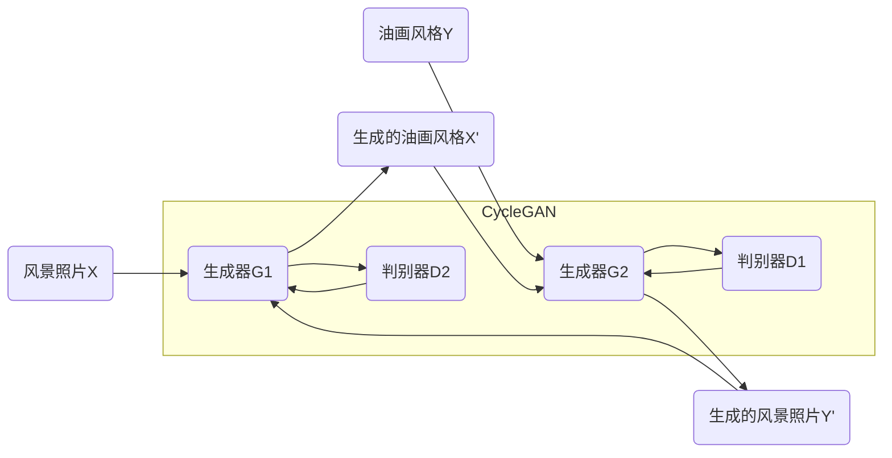

# 基于生成对抗网络的风景照片转换为油画风格的研究

## 1.背景介绍

### 1.1 图像风格转换的重要性

在当今视觉信息时代,图像处理技术的发展对于满足人们日益增长的视觉需求至关重要。图像风格转换作为图像处理的一个重要分支,旨在将图像从一种风格转换为另一种风格,同时保留图像的内容和结构信息。这种技术在多个领域都有广泛的应用,例如:

- 艺术创作:将普通照片转换为具有不同绘画风格(如油画、素描等),为艺术家提供创作灵感和辅助工具。
- 图像增强:通过风格转换,可以提高图像的视觉吸引力和艺术价值。
- 影视特效:将现实场景转换为手绘画风格,为电影、动画等增添独特的视觉体验。
- 个性化图像处理:根据用户偏好,对图像进行个性化的风格转换。

### 1.2 风景照片转油画风格的意义

在图像风格转换的众多应用中,将风景照片转换为油画风格尤为重要和受欢迎。油画作为人类最古老和经典的绘画形式之一,具有丰富的色彩、独特的笔触和浓郁的艺术气息。将风景照片转换为油画风格,不仅可以赋予照片艺术魅力,同时也保留了原始风景的细节特征。这种转换技术可广泛应用于旅游纪念品、个性化装饰品等领域,满足人们对艺术化风景图像的需求。

### 1.3 传统方法的局限性

传统的图像风格转换方法主要依赖于手工特征提取和经验规则,存在以下局限性:

1. 主观性强,需要人工参与设计特征和转换规则。
2. 泛化能力差,难以适应不同类型的图像数据。
3. 转换效果单一,缺乏多样化的风格表达。

为了克服这些局限,需要一种能够自主学习图像风格特征,并自动完成风格转换的智能化方法。

## 2.核心概念与联系

### 2.1 生成对抗网络(Generative Adversarial Networks, GAN)

生成对抗网络是一种由两个神经网络模型组成的框架,包括生成器(Generator)和判别器(Discriminator)。生成器的目标是生成逼真的数据样本(如图像),而判别器的任务是区分生成的样本和真实数据样本。两个模型相互对抗,最终达到生成器生成的样本能够以很高的概率欺骗判别器的目标。

生成对抗网络在图像生成、风格迁移等任务中表现出色,具有以下优点:

1. 端到端的模型,无需人工设计特征。
2. 生成样本质量高,细节丰富、逼真性强。
3. 具有很强的泛化能力,可以应用于不同类型的数据。

### 2.2 循环生成对抗网络(Cycle-Consistent Adversarial Networks, CycleGAN)

循环生成对抗网络是生成对抗网络的一种变体,专门用于图像风格迁移任务。它包含两个生成器和两个判别器,分别负责两种风格之间的相互转换。通过引入循环一致性损失(Cycle Consistency Loss),确保风格转换后的图像在再次转换回原始风格时,能够尽可能复原初始图像。

该模型的优点在于:

1. 无需成对的训练数据,可以利用不同风格的非配对图像进行训练。
2. 转换效果自然,保留了图像的内容和结构信息。
3. 具有良好的泛化能力,可以转换不同风格之间的图像。

### 2.3 生成对抗网络与传统方法的区别

与传统的基于规则和特征的图像风格转换方法相比,基于生成对抗网络的方法具有以下显著优势:

1. 自主学习图像特征,无需人工参与设计规则。
2. 生成效果自然,细节丰富,保留了图像的内容和结构信息。
3. 具有良好的泛化能力,可以适应不同类型的图像数据。
4. 风格转换效果多样化,可以生成丰富的艺术风格。

基于生成对抗网络的图像风格转换方法,为实现智能化、自动化的图像艺术化处理提供了有力工具。

## 3.核心算法原理具体操作步骤

### 3.1 循环生成对抗网络的基本架构

循环生成对抗网络由两个生成器和两个判别器组成,用于实现两种图像风格之间的相互转换。具体架构如下所示:

其中:

- 生成器 G1 将风景照片 X 转换为油画风格 X'
- 生成器 G2 将油画风格 Y 转换为风景照片风格 Y'
- 判别器 D1 判断生成的 Y' 是否为真实的风景照片
- 判别器 D2 判断生成的 X' 是否为真实的油画风格

为了确保风格转换的循环一致性,引入了循环一致性损失(Cycle Consistency Loss),即要求 X->G1->G2(X') 应当与原始输入 X 尽可能相同,Y->G2->G1(Y') 也应当与原始输入 Y 尽可能相同。

### 3.2 生成器和判别器的网络结构

生成器和判别器的网络结构对于模型的性能至关重要。常用的生成器网络结构包括:

1. 编码器-解码器(Encoder-Decoder)结构
2. U-Net 结构
3. 残差网络(ResNet)结构

判别器通常采用卷积神经网络(CNN)结构,用于对输入图像进行特征提取和分类。

### 3.3 损失函数

循环生成对抗网络的损失函数包括以下几个部分:

1. **对抗损失(Adversarial Loss)**:标准的生成对抗网络损失,用于生成器和判别器的对抗训练。

   $$L_{adv}(G, D) = \mathbb{E}_{x\sim p_{data}(x)}[\log D(x)] + \mathbb{E}_{z\sim p_{z}(z)}[\log(1 - D(G(z)))]$$

2. **循环一致性损失(Cycle Consistency Loss)**:确保风格转换的循环一致性。

   $$L_{cyc}(G_1, G_2) = \mathbb{E}_{x\sim p_{data}(x)}[\|G_2(G_1(x)) - x\|_1] + \mathbb{E}_{y\sim p_{data}(y)}[\|G_1(G_2(y)) - y\|_1]$$

3. **全变分正则化损失(Total Variation Regularization Loss)**:用于平滑生成图像,减少伪影和失真。

   $$L_{tv}(G) = \sum_{i,j}[(G_{i,j} - G_{i+1,j})^2 + (G_{i,j} - G_{i,j+1})^2]$$

4. **身份映射损失(Identity Mapping Loss)**:确保当输入图像与目标风格相同时,生成器不会改变输入图像。

   $$L_{id}(G_1, G_2) = \mathbb{E}_{x\sim p_{data}(x)}[\|G_1(x) - x\|_1] + \mathbb{E}_{y\sim p_{data}(y)}[\|G_2(y) - y\|_1]$$

总损失函数为上述各项损失的加权和:

$$L(G_1, G_2, D_1, D_2) = L_{adv}(G_1, D_2) + L_{adv}(G_2, D_1) + \lambda_1 L_{cyc}(G_1, G_2) + \lambda_2 L_{tv}(G_1) + \lambda_2 L_{tv}(G_2) + \lambda_3 L_{id}(G_1, G_2)$$

其中 $\lambda_1$、$\lambda_2$、$\lambda_3$ 为超参数,用于平衡各项损失的权重。

### 3.4 模型训练

循环生成对抗网络的训练过程包括以下步骤:

1. 准备风景照片和油画风格图像的数据集。
2. 初始化生成器和判别器的网络参数。
3. 对生成器和判别器进行交替训练:
   - 固定生成器,更新判别器的参数,最小化判别器的对抗损失。
   - 固定判别器,更新生成器的参数,最小化生成器的对抗损失、循环一致性损失、全变分正则化损失和身份映射损失。
4. 重复第 3 步,直到模型收敛或达到预设的训练轮数。

在训练过程中,通常采用一些技巧来提高模型的性能和稳定性,如梯度剪裁(Gradient Clipping)、指数移动平均(Exponential Moving Average)等。

## 4.数学模型和公式详细讲解举例说明

在循环生成对抗网络中,数学模型和公式起着至关重要的作用,用于定义模型的目标函数、损失函数和优化过程。本节将详细讲解相关的数学模型和公式,并给出具体的例子说明。

### 4.1 生成对抗网络的数学模型

生成对抗网络的基本思想是将生成器 G 和判别器 D 看作是一个迷你max游戏,其目标函数可以表示为:

$$\min_G \max_D V(D, G) = \mathbb{E}_{x\sim p_{data}(x)}[\log D(x)] + \mathbb{E}_{z\sim p_{z}(z)}[\log(1 - D(G(z)))]$$

其中:

- $p_{data}(x)$ 表示真实数据的分布
- $p_z(z)$ 表示随机噪声的分布,通常采用高斯分布或均匀分布
- $G(z)$ 表示生成器根据噪声 $z$ 生成的样本
- $D(x)$ 表示判别器对输入样本 $x$ 为真实数据的概率评分

生成器 G 的目标是最小化上述目标函数,即生成的样本能够以最大概率欺骗判别器。而判别器 D 的目标是最大化目标函数,即能够正确区分真实数据和生成数据。

通过生成器和判别器的对抗训练,最终期望生成器能够生成逼真的样本,以至于判别器无法区分真伪。

例如,在图像生成任务中,生成器 G 将随机噪声 $z$ 映射为图像样本 $G(z)$,而判别器 D 则评估输入图像 $x$ 是真实图像还是生成图像的概率分数 $D(x)$。通过不断优化生成器和判别器的参数,生成器最终能够生成高质量、逼真的图像样本。

### 4.2 循环一致性损失

循环生成对抗网络引入了循环一致性损失(Cycle Consistency Loss),用于确保风格转换的循环一致性。具体来说,对于风景照片 $x$ 和油画风格图像 $y$,我们期望满足以下条件:

$$G_2(G_1(x)) \approx x$$
$$G_1(G_2(y)) \approx y$$

也就是说,将风景照片 $x$ 先转换为油画风格 $G_1(x)$,再将生成的油画风格图像转换回风景照片风格 $G_2(G_1(x))$,应当能够尽可能复原原始的风景照片 $x$。同理,对于油画风格图像 $y$ 也应当满足循环一致性。

循环一致性损失的数学表达式为:

$$L_{cyc}(G_1, G_2) = \mathbb{E}_{x\sim p_{data}(x)}[\|G_2(G_1(x)) - x\|_1] + \mathbb{E}_{y\sim p_{data}(y)}[\|G_1(G_2(y)) - y\|_1]$$

其中 $\|\cdot\|_1$ 表示 L1 范数,用于计算重构图像与原始图像之间的像素差异。

引入循环一致性损失的目的是为了保留图像的内容和结构信息,避免在风格转换过程中丢失关键特征。通过最小化