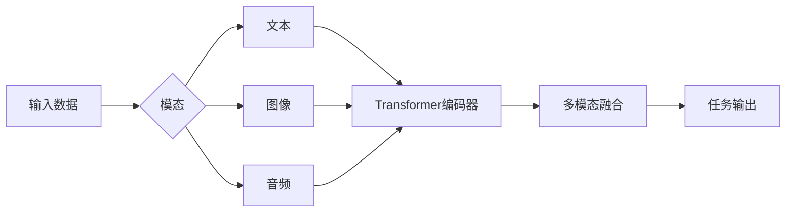

# 多模态大模型：技术原理与实战 GPT技术的发展历程

## 1. 背景介绍
### 1.1 人工智能的发展历程
### 1.2 大模型的兴起
#### 1.2.1 大模型的定义
#### 1.2.2 大模型的特点
#### 1.2.3 大模型的应用前景

### 1.3 多模态技术的发展
#### 1.3.1 多模态技术的概念
#### 1.3.2 多模态技术的优势
#### 1.3.3 多模态技术的挑战

## 2. 核心概念与联系
### 2.1 Transformer 架构
#### 2.1.1 自注意力机制
#### 2.1.2 位置编码
#### 2.1.3 残差连接与层归一化

### 2.2 预训练与微调
#### 2.2.1 无监督预训练
#### 2.2.2 有监督微调
#### 2.2.3 预训练与微调的优势

### 2.3 多模态融合
#### 2.3.1 早期融合
#### 2.3.2 晚期融合
#### 2.3.3 混合融合



## 3. 核心算法原理具体操作步骤
### 3.1 Transformer 编码器
#### 3.1.1 输入嵌入
#### 3.1.2 多头自注意力
#### 3.1.3 前馈神经网络

### 3.2 Transformer 解码器  
#### 3.2.1 自回归
#### 3.2.2 交叉注意力
#### 3.2.3 生成输出

### 3.3 预训练目标
#### 3.3.1 掩码语言模型
#### 3.3.2 次句预测
#### 3.3.3 对比学习

## 4. 数学模型和公式详细讲解举例说明
### 4.1 自注意力机制
$$Attention(Q,K,V) = softmax(\frac{QK^T}{\sqrt{d_k}})V$$
其中，$Q$、$K$、$V$ 分别表示查询、键、值，$d_k$ 为键向量的维度。

### 4.2 位置编码
$$PE_{(pos,2i)} = sin(pos/10000^{2i/d_{model}})$$
$$PE_{(pos,2i+1)} = cos(pos/10000^{2i/d_{model}})$$
其中，$pos$ 表示位置，$i$ 表示维度，$d_{model}$ 为嵌入维度。

### 4.3 残差连接与层归一化
$$LayerNorm(x+Sublayer(x))$$
其中，$Sublayer(x)$ 可以是自注意力层或前馈神经网络层。

## 5. 项目实践：代码实例和详细解释说明
### 5.1 使用 Hugging Face Transformers 库
```python
from transformers import AutoTokenizer, AutoModel

tokenizer = AutoTokenizer.from_pretrained("bert-base-uncased")
model = AutoModel.from_pretrained("bert-base-uncased")

inputs = tokenizer("Hello world!", return_tensors="pt")
outputs = model(**inputs)
```
以上代码展示了如何使用 Hugging Face Transformers 库加载预训练的 BERT 模型并进行推理。

### 5.2 微调预训练模型
```python
from transformers import AutoModelForSequenceClassification, TrainingArguments, Trainer

model = AutoModelForSequenceClassification.from_pretrained("bert-base-uncased", num_labels=2)

training_args = TrainingArguments(
    output_dir="./results",
    learning_rate=2e-5,
    per_device_train_batch_size=16,
    num_train_epochs=3,
)

trainer = Trainer(
    model=model,
    args=training_args,
    train_dataset=train_dataset,
    eval_dataset=eval_dataset,
)

trainer.train()
```
以上代码展示了如何使用 Hugging Face Transformers 库对预训练的 BERT 模型进行微调，用于序列分类任务。

## 6. 实际应用场景
### 6.1 自然语言处理
#### 6.1.1 文本分类
#### 6.1.2 命名实体识别
#### 6.1.3 问答系统

### 6.2 计算机视觉
#### 6.2.1 图像分类
#### 6.2.2 目标检测
#### 6.2.3 图像描述生成

### 6.3 多模态任务
#### 6.3.1 视觉问答
#### 6.3.2 图像描述生成
#### 6.3.3 视频字幕生成

## 7. 工具和资源推荐
### 7.1 开源框架
- Hugging Face Transformers
- OpenAI GPT
- Google BERT

### 7.2 预训练模型
- BERT
- RoBERTa
- GPT-2
- GPT-3
- CLIP

### 7.3 数据集
- GLUE
- SQuAD
- COCO
- Flickr30k

## 8. 总结：未来发展趋势与挑战
### 8.1 模型规模的增长
### 8.2 多模态融合的深入探索 
### 8.3 数据隐私与安全
### 8.4 模型的可解释性与可控性

## 9. 附录：常见问题与解答
### 9.1 如何选择合适的预训练模型？
### 9.2 如何处理不同模态数据的对齐问题？
### 9.3 如何平衡模型的性能与效率？
### 9.4 如何应对模型的偏见与公平性问题？

作者：禅与计算机程序设计艺术 / Zen and the Art of Computer Programming