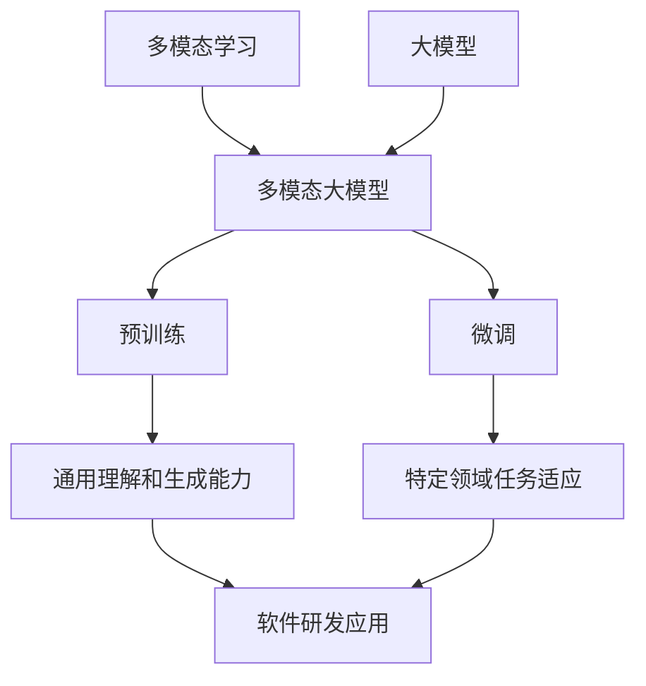

# 多模态大模型：技术原理与实战 大模型在软件研发领域的实战案例与前沿探索

## 1. 背景介绍
### 1.1 多模态大模型的兴起
近年来,随着人工智能技术的飞速发展,多模态大模型(Multimodal Large Models)成为了学术界和工业界的研究热点。多模态大模型能够同时处理文本、图像、音频、视频等多种模态的数据,具有强大的跨模态理解和生成能力,在自然语言处理、计算机视觉、语音识别等领域取得了突破性进展。

### 1.2 多模态大模型在软件研发中的应用前景
多模态大模型在软件研发领域也展现出了广阔的应用前景。传统的软件开发主要依赖程序员编写代码,但随着软件系统复杂度的不断提高,人工编码的效率和质量面临瓶颈。多模态大模型为软件研发带来了新的范式,通过学习海量的代码、文档、图表等数据,模型可以自动生成代码、优化算法、检测缺陷、生成文档等,大大提升了软件研发的效率和质量。

### 1.3 本文的主要内容
本文将深入探讨多模态大模型在软件研发领域的技术原理与实战应用。首先,我们将介绍多模态大模型的核心概念和关键技术。然后,重点阐述多模态大模型在代码生成、算法优化、缺陷检测、文档生成等方面的原理和实现。接着,通过实际项目案例演示多模态大模型在软件研发中的应用。最后,展望多模态大模型在软件研发领域的发展趋势和面临的挑战。

## 2. 核心概念与联系
### 2.1 多模态学习
多模态学习(Multimodal Learning)是指利用不同模态的数据(如文本、图像、音频等)进行联合学习,捕捉不同模态数据之间的关联和互补信息,从而获得更全面、更准确的理解和决策。多模态学习可以克服单一模态数据的局限性,发掘模态间的语义联系,实现知识的迁移和泛化。

### 2.2 大模型
大模型(Large Models)是指参数量巨大(通常在亿级以上)、训练数据规模庞大(TB/PB级)的深度学习模型。大模型通过海量数据的学习,能够掌握领域知识和常识,具备强大的理解、推理、生成等能力。典型的大模型有 GPT-3、BERT、DALL-E 等。

### 2.3 预训练和微调
预训练(Pre-training)是指在大规模无标注数据上进行自监督学习,使模型掌握通用的语言理解和生成能力。微调(Fine-tuning)是在预训练的基础上,用少量特定任务的标注数据对模型进行训练,使其适应特定领域的任务。预训练使模型学会通用知识,微调使模型专门化,两者结合可以实现更好的任务性能。

### 2.4 多模态大模型
多模态大模型是多模态学习和大模型的结合,旨在构建能够处理多种模态数据的大规模预训练模型。通过对文本、图像、代码等异构数据的联合建模,多模态大模型可以学习到更丰富、更准确的跨模态表示,在复杂的认知任务上取得更优异的表现。

### 2.5 核心概念之间的联系
下图展示了多模态学习、大模型、预训练、微调、多模态大模型等核心概念之间的联系:



多模态学习和大模型结合形成了多模态大模型,通过预训练掌握通用理解和生成能力,再通过微调适应特定软件研发任务,最终实现多模态大模型在软件研发领域的应用。

## 3. 核心算法原理具体操作步骤
### 3.1 多模态预训练
多模态大模型的核心是进行大规模的预训练,掌握跨模态的通用表示能力。具体步骤如下:

1. 数据准备:收集大规模的文本、图像、代码等异构数据,构建预训练语料库。
2. 模态编码:对不同模态的数据进行特征提取和表示学习,如使用 Transformer 对文本编码,CNN 对图像编码等。
3. 跨模态对齐:通过对比学习、对偶学习等方法,学习不同模态表示之间的语义对齐,使它们在公共语义空间中对齐。
4. 自监督预训练:设计自监督学习任务,如掩码语言建模、图像-文本匹配等,利用无标注数据进行预训练。
5. 模型优化:使用大批量训练、梯度累积、混合精度训练等技术加速模型训练和优化超参数。

### 3.2 任务适应微调
在预训练的基础上,多模态大模型需要根据具体的软件研发任务进行微调,步骤如下:

1. 任务定义:明确软件研发任务的输入输出形式,如代码生成、缺陷检测等。
2. 数据标注:收集和标注少量特定任务的数据,用于微调。
3. 模型微调:在预训练模型的基础上,使用任务特定的数据对模型进行微调,使其适应任务。可以微调整个模型,也可以只微调部分参数。
4. 任务推理:使用微调后的模型对软件研发任务进行推理,生成结果。
5. 结果评估:评估模型在任务上的性能,分析错误情况,不断迭代优化。

### 3.3 持续学习
为了使多模态大模型适应不断变化的软件研发场景,需要进行持续学习,步骤如下:

1. 数据增量:持续收集软件研发过程中产生的新数据,如新的代码、文档等。
2. 模型更新:定期利用新数据对模型进行增量训练,使其学习新知识,跟上技术发展。
3. 知识蒸馏:使用Teacher-Student知识蒸馏,将大模型的知识压缩到小模型中,提高推理效率。
4. 终身学习:通过持续学习,使模型不断积累和更新知识,适应软件研发技术的变化。

## 4. 数学模型和公式详细讲解举例说明
### 4.1 Transformer 模型
Transformer 是多模态大模型的主要架构,其核心是自注意力机制和前馈神经网络。对于一个输入序列 $\mathbf{x}=(x_1,\dots,x_n)$,Transformer 的计算过程如下:

1. 输入嵌入:将输入 $x_i$ 映射为嵌入向量 $\mathbf{e}_i\in\mathbb{R}^d$。

2. 位置编码:加入位置嵌入 $\mathbf{p}_i\in\mathbb{R}^d$,表示位置信息。

3. 自注意力:计算 Query、Key、Value 矩阵 $\mathbf{Q},\mathbf{K},\mathbf{V}\in\mathbb{R}^{n\times d}$,注意力权重为:

$$
\alpha_{ij}=\frac{\exp(\mathbf{q}_i^\top\mathbf{k}_j)}{\sum_{j=1}^n\exp(\mathbf{q}_i^\top\mathbf{k}_j)}
$$

输出为:

$$
\mathbf{z}_i=\sum_{j=1}^n\alpha_{ij}\mathbf{v}_j
$$

4. 前馈网络:经过两层全连接网络 $\mathbf{FFN}(\cdot)$:

$$
\mathbf{h}_i=\mathbf{FFN}(\mathbf{z}_i)
$$

5. 残差连接和层归一化:

$$
\mathbf{x}^{(l+1)}=\mathbf{LayerNorm}(\mathbf{x}^{(l)}+\mathbf{h}^{(l)})
$$

通过堆叠 $L$ 层 Transformer Block,可以建立深层的序列转换模型。

### 4.2 对比学习
对比学习是跨模态对齐的主要方法,通过最大化正样本对的相似度,最小化负样本对的相似度,学习模态无关的语义表示。以图像-文本对比学习为例:

1. 图像编码:将图像 $\mathbf{v}_i$ 编码为向量 $\mathbf{f}_i=\mathbf{ENC}_v(\mathbf{v}_i)$。

2. 文本编码:将文本 $\mathbf{t}_i$ 编码为向量 $\mathbf{g}_i=\mathbf{ENC}_t(\mathbf{t}_i)$。

3. 对比学习目标:最大化正样本对的相似度,最小化负样本对的相似度:

$$
\mathcal{L}=\sum_i-\log\frac{\exp(\mathbf{f}_i^\top\mathbf{g}_i/\tau)}{\sum_{j}\exp(\mathbf{f}_i^\top\mathbf{g}_j/\tau)}
$$

其中 $\tau$ 是温度超参数。通过优化该目标,可以学习到模态无关的语义表示。

### 4.3 掩码语言模型
掩码语言模型是自监督预训练的主要任务,通过随机掩码输入并预测被掩码的词,学习上下文表示。以 BERT 为例:

1. 随机掩码:以 15% 的概率随机掩码输入序列中的词,替换为 [MASK] 符号。

2. 掩码预测:预测被掩码位置的词:

$$
p(w_i|\mathbf{x}_{\setminus i})=\mathbf{softmax}(\mathbf{W}\mathbf{h}_i+\mathbf{b})
$$

其中 $\mathbf{x}_{\setminus i}$ 表示去掉第 $i$ 个位置的输入序列,$\mathbf{h}_i$ 是第 $i$ 个位置的隐藏层表示。

3. 优化目标:最大化被掩码位置词的对数似然:

$$
\mathcal{L}=\sum_i\log p(w_i|\mathbf{x}_{\setminus i})
$$

通过掩码语言模型预训练,可以学习到上下文相关的语言表示。

## 5. 项目实践：代码实例和详细解释说明
下面以代码生成任务为例,演示多模态大模型在软件研发中的应用。

### 5.1 数据准备
首先收集大规模的代码库,如 GitHub 上的开源项目。对代码进行预处理,提取出函数级别的代码片段及其对应的自然语言描述(如函数名、注释)。构建代码-描述对作为训练数据。

### 5.2 模型训练
使用 Transformer 作为多模态大模型的架构,对代码和描述分别进行编码。然后通过对比学习,最大化代码和描述表示的互信息,学习模态无关的语义表示。同时使用掩码语言模型任务对代码和描述分别进行自监督预训练。

代码编码器示例:
```python
class CodeEncoder(nn.Module):
    def __init__(self, vocab_size, d_model, n_head, n_layers, dropout):
        super().__init__()
        self.embedding = nn.Embedding(vocab_size, d_model)
        self.position = PositionalEncoding(d_model, dropout)
        self.layers = nn.ModuleList([
            TransformerBlock(d_model, n_head, dropout) 
            for _ in range(n_layers)
        ])
    
    def forward(self, x):
        x = self.embedding(x)
        x = self.position(x)
        for layer in self.layers:
            x = layer(x)
        return x
```

对比学习示例:
```python
def contrastive_loss(code_emb, desc_emb, temperature=0.1):
    batch_size = code_emb.shape[0]
    similarity = code_emb @ desc_emb.t()
    labels = torch.arange(batch_size, device=code_emb.device)
    loss = F.cross_entropy(similarity/temperature, labels)
    return loss
```

### 5.3 模型推理
训练好的多模态大模型可以用于代码生成任务。给定自然语言描述,模型可以生成对应的代码。具体步骤如下:

1. 将自然语言描述编码为向量表示 $\mathbf{d}$。
2. 设置初始代码为空字符串 $\mathbf{c}=\varnothing$。
3