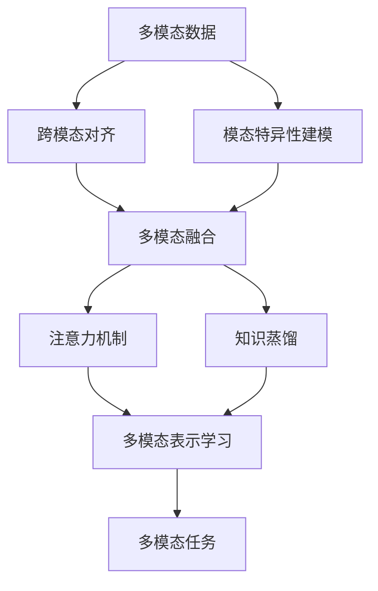

# 多模态大模型：技术原理与实战 集成学习

## 1. 背景介绍
### 1.1 多模态大模型的兴起
近年来,随着深度学习技术的飞速发展,大规模预训练语言模型(如BERT、GPT等)在自然语言处理领域取得了突破性进展。与此同时,计算机视觉、语音识别等其他模态的深度学习模型也不断取得新的里程碑。在这样的背景下,多模态大模型应运而生,旨在统一处理文本、图像、视频、音频等不同模态的数据,实现更加智能、灵活的人机交互。

### 1.2 多模态大模型的优势
与单一模态的模型相比,多模态大模型具有以下优势:

1. 信息互补:不同模态的数据蕴含着互补的信息,多模态模型可以充分利用这些信息,实现更全面、准确的理解和生成。
2. 鲁棒性:多模态模型可以利用不同模态间的相关性,提高模型的鲁棒性和泛化能力。
3. 灵活性:多模态模型可以根据具体任务的需求,灵活地选择和组合不同的模态,实现更加个性化、多样化的应用。

### 1.3 多模态大模型面临的挑战
尽管多模态大模型展现出了巨大的潜力,但其发展仍然面临着诸多挑战:

1. 数据问题:构建高质量的多模态数据集需要大量的人力和资源投入,且不同模态数据的对齐和融合也是一大难题。
2. 模型架构:如何设计高效、可扩展的多模态模型架构,实现不同模态特征的有效融合,仍需要进一步探索。
3. 训练难度:多模态模型的训练复杂度高,对计算资源和优化算法提出了更高的要求。
4. 可解释性:多模态模型的决策过程往往是黑盒,缺乏可解释性,这限制了其在某些领域的应用。

## 2. 核心概念与联系
### 2.1 多模态学习
多模态学习是指利用来自多个模态的信息进行学习和推理的方法。其核心思想是充分挖掘不同模态数据之间的互补性和相关性,实现模态间的信息融合,从而获得更全面、准确的认知。

### 2.2 跨模态对齐
跨模态对齐是多模态学习的关键问题之一,旨在找到不同模态数据之间的语义对应关系。常见的对齐方法包括:

1. 显式对齐:通过人工标注或规则定义建立模态间的对应关系。
2. 隐式对齐:通过学习模态间的共同表示空间,自动发现模态间的语义对应。

### 2.3 多模态融合
多模态融合是指将不同模态的特征进行有效整合,形成统一的多模态表示。主要的融合策略包括:

1. 早期融合:在特征提取阶段将不同模态的原始数据拼接在一起。
2. 晚期融合:在决策阶段将不同模态的预测结果进行组合。
3. 中间融合:在特征提取和决策之间引入融合层,实现模态间的交互。

### 2.4 注意力机制
注意力机制是深度学习中的一种重要技术,通过动态地调整不同区域或特征的权重,使模型能够更加关注输入数据中的关键信息。在多模态学习中,注意力机制可以帮助模型自适应地融合不同模态的信息。

### 2.5 知识蒸馏
知识蒸馏是一种模型压缩技术,通过让大模型(教师模型)指导小模型(学生模型)的训练,实现模型性能的保持或提升。在多模态学习中,知识蒸馏可以用于跨模态的信息传递和模型优化。

下图展示了多模态学习中的核心概念及其关系:



## 3. 核心算法原理具体操作步骤
### 3.1 多模态预训练
多模态预训练是指在大规模多模态数据上,通过自监督学习的方式,预先学习通用的多模态表示。其主要步骤如下:

1. 数据准备:收集和清洗大规模的文本-图像对、视频-音频对等多模态数据。
2. 模态编码:使用模态特异的编码器(如Transformer、CNN等)对不同模态的数据进行特征提取。
3. 对齐学习:通过跨模态匹配、对比学习等任务,学习模态间的语义对齐。
4. 融合建模:引入跨模态注意力机制,实现不同模态特征的深度融合。
5. 预训练优化:使用自监督学习的目标函数(如MLM、ITM等),对多模态模型进行端到端的预训练。

### 3.2 多模态微调
在完成预训练后,我们可以针对具体的下游任务,对多模态模型进行微调。具体步骤包括:

1. 任务适配:根据具体任务的输入输出形式,调整多模态模型的输入层和输出层。
2. 数据增强:使用任务相关的数据增强技术,扩充训练数据集。
3. 参数初始化:使用预训练模型的参数初始化微调模型,加速收敛。
4. 模型微调:使用任务特定的损失函数,对多模态模型进行梯度下降优化。
5. 模型评估:在验证集或测试集上评估微调后的模型性能,进行模型选择和超参数调优。

### 3.3 多模态蒸馏
为了进一步提升多模态模型的效率和性能,我们可以利用知识蒸馏技术,将大型多模态模型的知识迁移到小型模型中。主要步骤如下:

1. 教师模型:选择一个性能优异的大型多模态模型作为教师模型。
2. 学生模型:设计一个结构更加简单、参数更少的小型多模态模型作为学生模型。
3. 蒸馏数据:使用教师模型对大规模多模态数据进行推理,生成软标签作为蒸馏数据。
4. 蒸馏损失:结合学生模型的硬标签损失和软标签损失,构建蒸馏优化目标。
5. 模型蒸馏:使用蒸馏数据和蒸馏损失,对学生模型进行训练,使其尽可能逼近教师模型的性能。

## 4. 数学模型和公式详细讲解举例说明
### 4.1 跨模态对比学习
跨模态对比学习是一种常用的跨模态对齐方法,其核心思想是最大化相同语义的跨模态样本对之间的相似度,同时最小化不同语义的跨模态样本对之间的相似度。

假设我们有一组文本-图像对$(t_i, v_i)$,其中$t_i$表示第$i$个文本样本,$v_i$表示第$i$个图像样本。我们使用文本编码器$f_t$和图像编码器$f_v$分别对文本和图像进行特征提取,得到它们的特征表示$f_t(t_i)$和$f_v(v_i)$。

对于第$i$个文本-图像对,我们定义其跨模态对比损失为:

$$
\mathcal{L}_i = -\log \frac{\exp(\text{sim}(f_t(t_i), f_v(v_i))/\tau)}{\sum_{j=1}^N \exp(\text{sim}(f_t(t_i), f_v(v_j))/\tau)}
$$

其中,$\text{sim}(\cdot,\cdot)$表示两个特征向量之间的相似度度量(如点积或余弦相似度),$\tau$是一个温度超参数,$N$是训练批次中的样本数。

直观地说,上述损失函数鼓励模型学习到一个跨模态对齐的特征空间,使得语义相关的文本-图像对在该空间中的表示更加接近。

### 4.2 多模态注意力融合
多模态注意力融合是一种常用的中间融合策略,通过注意力机制自适应地聚合不同模态的特征。

假设我们有文本特征$\mathbf{T} \in \mathbb{R}^{n \times d_t}$和图像特征$\mathbf{V} \in \mathbb{R}^{m \times d_v}$,其中$n$和$m$分别表示文本和图像的序列长度,$d_t$和$d_v$分别表示文本和图像的特征维度。

我们首先使用线性变换将不同模态的特征映射到同一个维度:

$$
\mathbf{Q} = \mathbf{T} \mathbf{W}_q, \quad \mathbf{K} = \mathbf{V} \mathbf{W}_k, \quad \mathbf{V}' = \mathbf{V} \mathbf{W}_v
$$

其中,$\mathbf{W}_q \in \mathbb{R}^{d_t \times d}$,$\mathbf{W}_k \in \mathbb{R}^{d_v \times d}$,$\mathbf{W}_v \in \mathbb{R}^{d_v \times d}$是可学习的投影矩阵。

然后,我们计算文本特征对图像特征的注意力权重:

$$
\mathbf{A} = \text{softmax}(\frac{\mathbf{Q}\mathbf{K}^T}{\sqrt{d}})
$$

最后,我们使用注意力权重对图像特征进行加权求和,得到融合后的多模态特征:

$$
\mathbf{M} = \mathbf{A} \mathbf{V}'
$$

通过注意力机制,模型可以自动学习不同模态特征之间的关联关系,实现自适应的特征融合。

### 4.3 多模态知识蒸馏
多模态知识蒸馏可以用于将大型多模态模型的知识迁移到小型模型中,提高模型的效率和性能。

假设我们有一个预训练的大型多模态模型(教师模型)$f_T$和一个待训练的小型多模态模型(学生模型)$f_S$。对于一个多模态输入样本$x$,我们分别使用教师模型和学生模型进行前向推理,得到它们的输出概率分布$p_T$和$p_S$。

我们定义蒸馏损失为教师模型和学生模型输出分布之间的KL散度:

$$
\mathcal{L}_{\text{KD}} = \text{KL}(p_T || p_S) = \sum_{i} p_T(i) \log \frac{p_T(i)}{p_S(i)}
$$

其中,$i$表示输出分布中的类别索引。

同时,我们也使用学生模型的真实标签$y$计算硬标签损失(如交叉熵损失):

$$
\mathcal{L}_{\text{CE}} = -\sum_{i} y(i) \log p_S(i)
$$

最终,我们将蒸馏损失和硬标签损失加权求和,得到学生模型的优化目标:

$$
\mathcal{L} = \alpha \mathcal{L}_{\text{KD}} + (1-\alpha) \mathcal{L}_{\text{CE}}
$$

其中,$\alpha$是一个权重超参数,用于平衡两种损失的重要性。

通过优化上述目标函数,学生模型可以同时从教师模型的软标签和真实标签中学习,实现知识的有效迁移。

## 5. 项目实践：代码实例和详细解释说明
下面我们通过一个简单的PyTorch代码实例,演示如何实现一个基于注意力机制的多模态融合模型。

```python
import torch
import torch.nn as nn

class MultimodalAttentionFusion(nn.Module):
    def __init__(self, text_dim, image_dim, hidden_dim):
        super(MultimodalAttentionFusion, self).__init__()
        self.text_proj = nn.Linear(text_dim, hidden_dim)
        self.image_proj = nn.Linear(image_dim, hidden_dim)
        self.attention = nn.MultiheadAttention(hidden_dim, num_heads=8)
        self.fc = nn.Linear(hidden_dim, hidden_dim)
        
    def forward(self, text_feat, image_feat):
        # 特征投影
        text_proj = self.text_proj(text_feat)
        image_proj = self.image_proj(image_feat