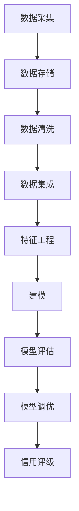

# 大数据技术在银行个人信贷信用评级中的应用研究

## 1.背景介绍

### 1.1 个人信贷的重要性

个人信贷是银行业务中一个非常重要的组成部分。它为个人提供了获取资金的渠道,满足了个人的各种资金需求,如购房、购车、旅游、教育等。同时,个人信贷也是银行的一个重要盈利来源。因此,个人信贷的风险控制对银行的健康经营至关重要。

### 1.2 传统信用评级方法的缺陷

传统的个人信用评级主要依赖于借款人的基本信息,如年龄、收入、职业、教育程度等,以及信用历史。但这种方法存在一些明显的缺陷:

1. 信息来源单一,难以全面评估借款人的信用状况。
2. 评估过程主观性较强,缺乏科学的量化模型支持。
3. 难以及时发现借款人信用状况的变化。

### 1.3 大数据时代的机遇

随着互联网、移动互联网、物联网的快速发展,大数据时代已经到来。人们在网上的各种行为都留下了大量的数字足迹,这些海量的非结构化数据蕴含着极其丰富的信息。如果能够利用大数据技术对这些数据进行深入的挖掘和分析,将有助于更加全面、准确地评估借款人的信用状况,从而降低银行的风险。

## 2.核心概念与联系

### 2.1 大数据概念

大数据(Big Data)是指无法用常规软件工具在合理时间内获取、管理和处理的海量、高增长率和多样化的信息资产。大数据具有4V特征:

- Volume(大量)
- Velocity(高速)
- Variety(多样)
- Value(价值)

### 2.2 大数据技术

大数据技术主要包括以下几个方面:

1. **数据采集**:通过网络爬虫、日志采集等方式获取海量的非结构化数据。
2. **数据存储**:使用分布式文件系统(如HDFS)和NoSQL数据库(如HBase)存储海量数据。
3. **数据处理**:使用分布式计算框架(如MapReduce、Spark)对海量数据进行处理和分析。
4. **数据挖掘**:使用机器学习、深度学习等算法对数据进行挖掘,发现隐藏的模式和规律。
5. **数据可视化**:使用数据可视化工具将分析结果以直观的形式呈现。

### 2.3 个人信用评级

个人信用评级是指根据借款人的信用状况,对其未来按时还款的能力和意愿进行评估,并给出相应的信用等级。信用等级越高,表明借款人违约的风险越小。

个人信用评级是银行进行个人信贷风险管理的重要环节,它直接影响银行是否批准贷款申请以及贷款利率的确定。

## 3.核心算法原理具体操作步骤

### 3.1 数据采集

第一步是采集与借款人相关的各种数据,包括:

1. **结构化数据**:借款人的基本信息、收入状况、信用历史等。
2. **非结构化数据**:借款人在网上的行为足迹,如社交网络活动、网购记录、浏览历史等。
3. **公开数据**:政府公开的人口统计数据、经济数据等。

数据采集可以通过以下方式实现:

1. 网络爬虫技术爬取公开的网络数据。
2. 与第三方数据提供商合作获取数据。
3. 银行自身的业务系统数据。

### 3.2 数据存储

由于采集到的数据量非常庞大,需要使用分布式存储系统进行存储,如Hadoop分布式文件系统HDFS、NoSQL数据库HBase等。这些系统具有高容错性、高扩展性和高并发性,能够存储和管理PB级别的海量数据。

### 3.3 数据处理

对存储的海量数据进行处理和分析,主要包括以下步骤:

1. **数据清洗**:对原始数据进行去重、格式转换、缺失值处理等预处理,提高数据质量。
2. **数据集成**:将来自不同源的数据进行合并和关联,形成统一的数据视图。
3. **特征工程**:从原始数据中提取对信用评级有影响的特征,如年龄、收入、消费习惯等。
4. **建模**:使用机器学习算法(如逻辑回归、决策树、神经网络等)对特征数据进行训练,得到信用评级模型。
5. **模型评估**:使用测试数据对模型进行评估,计算模型的准确性、召回率等指标。
6. **模型调优**:根据评估结果对模型进行调优,提高模型性能。

数据处理可以使用分布式计算框架如Apache Spark、Apache Hadoop MapReduce等进行并行计算,提高处理效率。



### 3.4 信用评级

使用训练好的模型对新的借款人数据进行打分,得到其信用评级。信用评级的结果将作为银行审批贷款申请的重要依据。

## 4.数学模型和公式详细讲解举例说明

在个人信用评级中,常用的机器学习算法有逻辑回归、决策树、随机森林、梯度提升树等。这些算法都属于监督学习范畴,需要使用已知的训练数据对模型进行训练。

以逻辑回归模型为例,它可以用于二分类问题,即将借款人划分为"违约"和"未违约"两类。设特征向量为$\boldsymbol{x} = (x_1, x_2, \ldots, x_n)^T$,其中$x_i$表示第$i$个特征,如年龄、收入等。令$y \in \{0, 1\}$表示标签,其中0表示"未违约",1表示"违约"。逻辑回归模型的目标是学习一个函数$f(\boldsymbol{x})$,使其能够很好地预测$y$的值。

逻辑回归模型定义如下:

$$f(\boldsymbol{x}) = P(y=1|\boldsymbol{x}) = \frac{1}{1 + e^{-(\boldsymbol{w}^T\boldsymbol{x} + b)}}$$

其中$\boldsymbol{w}$是权重向量,$b$是偏置项。模型的输出$f(\boldsymbol{x})$表示$y=1$的概率,取值范围在0到1之间。

对于给定的训练数据集$\{(\boldsymbol{x}_i, y_i)\}_{i=1}^N$,我们需要找到最优的$\boldsymbol{w}$和$b$,使得模型在训练数据上的损失函数最小。损失函数通常选择交叉熵损失:

$$J(\boldsymbol{w}, b) = -\frac{1}{N}\sum_{i=1}^N\left[y_i\log f(\boldsymbol{x}_i) + (1 - y_i)\log(1 - f(\boldsymbol{x}_i))\right]$$

可以使用梯度下降法等优化算法求解$\boldsymbol{w}$和$b$的值。

在实际应用中,我们还需要对特征数据进行标准化处理,防止某些特征的量级过大影响模型的收敛性。此外,我们还可以引入正则化项(如L1或L2范数)来防止模型过拟合。

以上是逻辑回归模型的基本原理,在实际应用中还可以使用更复杂的模型,如神经网络、集成学习等,以获得更高的预测精度。

## 5.项目实践:代码实例和详细解释说明

下面给出一个使用Python语言和scikit-learn机器学习库实现逻辑回归模型的示例代码:

```python
import numpy as np
from sklearn.linear_model import LogisticRegression
from sklearn.model_selection import train_test_split
from sklearn.metrics import accuracy_score, precision_score, recall_score

# 加载数据
data = np.loadtxt('credit_data.csv', delimiter=',')
X = data[:, :-1]  # 特征数据
y = data[:, -1]  # 标签

# 划分训练集和测试集
X_train, X_test, y_train, y_test = train_test_split(X, y, test_size=0.2, random_state=42)

# 创建逻辑回归模型
model = LogisticRegression()

# 训练模型
model.fit(X_train, y_train)

# 在测试集上评估模型
y_pred = model.predict(X_test)
accuracy = accuracy_score(y_test, y_pred)
precision = precision_score(y_test, y_pred)
recall = recall_score(y_test, y_pred)

print(f'Accuracy: {accuracy:.2f}')
print(f'Precision: {precision:.2f}')
print(f'Recall: {recall:.2f}')
```

代码解释:

1. 首先加载包含特征数据和标签的数据集`credit_data.csv`。
2. 使用`train_test_split`函数将数据划分为训练集和测试集,测试集占20%。
3. 创建`LogisticRegression`对象,这是scikit-learn库中逻辑回归模型的实现。
4. 在训练集上使用`fit`方法训练模型。
5. 在测试集上使用`predict`方法进行预测,得到预测标签`y_pred`。
6. 使用`accuracy_score`、`precision_score`和`recall_score`函数计算模型在测试集上的准确率、精确率和召回率。

注意,在实际应用中,我们还需要对特征数据进行标准化处理,并可能需要使用更复杂的模型和技术,如特征选择、模型集成等,以提高模型的性能。

## 6.实际应用场景

大数据技术在个人信用评级领域有着广泛的应用前景,主要包括以下几个方面:

### 6.1 贷前风险评估

在借款人申请贷款时,银行可以利用大数据技术对其进行全面的信用评级,从而更准确地评估其还款能力和违约风险。这有助于银行做出更加审慎的贷款决策,降低不良贷款率。

### 6.2 贷中风险监控

对于已发放的贷款,银行可以持续监控借款人的信用状况变化,一旦发现风险信号,就可以及时采取应对措施,如调整贷款利率、缩减贷款额度等,从而控制风险。

### 6.3 贷后风险管理

对于已经出现违约的贷款,银行可以利用大数据技术分析违约原因,优化催收策略,提高回收率。同时,也可以将这些违约案例加入训练数据,不断优化信用评级模型。

### 6.4 营销策略优化

银行还可以利用大数据技术对客户进行细分,分析不同群体的信贷需求和偏好,从而制定有针对性的营销策略,提高营销效率。

### 6.5 反欺诈

大数据技术可以帮助银行发现欺诈行为的模式和规律,如虚假信息申请贷款、资金挪用等,从而加强反欺诈能力,保护银行的合法权益。

## 7.工具和资源推荐

在大数据个人信用评级项目中,可以使用以下工具和资源:

### 7.1 大数据处理框架

- Apache Hadoop: 分布式存储和计算框架,包括HDFS、MapReduce等组件。
- Apache Spark: 快速通用的大数据处理引擎,支持批处理、流处理、机器学习等。

### 7.2 数据存储

- HDFS: Hadoop分布式文件系统,用于存储海量数据。
- HBase: 基于HDFS的分布式NoSQL数据库,适合存储结构化和半结构化数据。
- Elasticsearch: 分布式搜索和分析引擎,适合存储和检索非结构化数据。

### 7.3 数据处理工具

- Apache Hive: 基于Hadoop的数据仓库工具,提供类SQL接口进行数据查询和分析。
- Apache Pig: 高级数据流语言,用于并行计算任务。
- Apache Kafka: 分布式流处理平台,用于实时数据传输和处理。

### 7.4 机器学习框架

- scikit-learn: Python中流行的机器学习库,提供了多种经典机器学