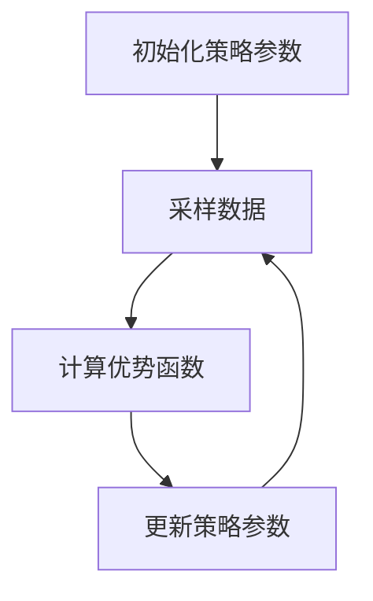

# 大规模语言模型从理论到实践 PPO微调

## 1. 背景介绍

### 1.1 大规模语言模型的兴起

近年来,随着计算能力的飞速提升和海量数据的积累,大规模语言模型在自然语言处理领域取得了令人瞩目的成就。这些模型通过在大量无标注文本数据上进行预训练,学习到了丰富的语言知识和上下文表示能力,为下游的各种自然语言任务提供了强大的语义表示。

GPT(Generative Pre-trained Transformer)、BERT(Bidirectional Encoder Representations from Transformers)、XLNet等大规模预训练语言模型的出现,极大地推动了自然语言处理技术的发展,在机器翻译、文本摘要、问答系统、语义理解等众多领域展现出卓越的性能。

### 1.2 大规模语言模型的挑战

尽管大规模语言模型取得了巨大的成功,但它们也面临着一些挑战:

1. **计算资源需求巨大**: 训练这些庞大的模型需要消耗大量的计算资源,包括GPU、TPU等专用硬件加速器,以及海量的训练数据。这对于普通研究机构和企业来说,可能是一个不小的障碍。

2. **训练过程低效**: 传统的监督学习方法需要大量的人工标注数据,而无监督预训练则需要消化海量的无标注文本数据,两者都存在效率低下的问题。

3. **模型泛化能力有限**: 尽管预训练模型具有很强的语言理解能力,但在特定领域或任务上,它们的泛化性能往往不尽如人意,需要进行进一步的微调(fine-tuning)。

4. **安全性和可解释性**: 大规模语言模型的"黑箱"特性使得它们的决策过程缺乏透明度和可解释性,这在一定程度上影响了它们在关键领域的应用。

为了解决这些挑战,研究人员提出了各种改进方法,其中一种备受关注的方法是PPO(Proximal Policy Optimization)微调。

## 2. 核心概念与联系

### 2.1 强化学习与策略梯度

PPO微调的核心思想源自强化学习(Reinforcement Learning)领域中的策略梯度(Policy Gradient)方法。在强化学习中,智能体(Agent)与环境(Environment)进行交互,根据当前状态采取行动,并从环境中获得奖励信号。目标是学习一个策略(Policy),使得在给定状态下采取的行动序列能够最大化预期的总奖励。

策略梯度方法旨在直接优化这个策略函数,使其输出的行动能够获得更高的奖励。具体来说,它通过计算策略函数相对于奖励的梯度,并沿着梯度的方向更新策略参数,从而逐步提高策略的性能。

虽然策略梯度方法在理论上是有效的,但在实践中却面临一些挑战,如梯度估计的高方差、样本效率低下等问题。为了解决这些问题,研究人员提出了各种改进的策略梯度算法,其中PPO就是一种非常成功的算法。

### 2.2 PPO算法概述

PPO(Proximal Policy Optimization)是一种用于强化学习的策略梯度方法,它在保留策略梯度的有效性的同时,通过限制新老策略之间的差异来降低算法的方差,从而提高了样本效率和稳定性。

PPO算法的核心思想是在每次策略更新时,通过约束新老策略之间的差异,确保新策略不会偏离太远。具体来说,它引入了一个约束条件,要求新策略的概率比率(新策略输出概率与老策略输出概率之比)在一定范围内,从而避免了策略发生剧烈变化。

这种约束方式不仅能够提高算法的稳定性,还能够减小梯度估计的方差,从而提高了样本效率。PPO算法通过交替采样和优化的方式进行训练,每次优化时都会根据采样得到的数据更新策略参数,使策略朝着提高奖励的方向优化。

### 2.3 PPO在语言模型微调中的应用

尽管PPO算法最初是为强化学习设计的,但它同样可以应用于监督学习任务,特别是在微调大规模语言模型时。在这种情况下,我们可以将语言模型视为一个策略,其输出是对下一个词的概率分布;而训练数据则可以看作是环境,为模型提供了奖励信号(即正确的词)。

通过将PPO算法应用于语言模型的微调过程,我们可以更高效、更稳定地优化模型参数,使其在特定任务上的性能得到提升。具体来说,PPO算法会约束新老语言模型之间的差异,避免模型在微调过程中发生剧烈变化,从而提高了训练的稳定性和收敛速度。

此外,PPO算法还能够有效地利用训练数据,提高了样本效率。这一点对于大规模语言模型尤为重要,因为这些模型通常需要消化大量的训练数据,传统的微调方法往往效率低下。

总的来说,PPO微调将强化学习中的优化策略引入到了语言模型的微调过程中,为大规模语言模型在特定任务上的性能提升提供了一种有效的解决方案。

## 3. 核心算法原理具体操作步骤

### 3.1 PPO算法流程概述

PPO算法的核心思想是在每次策略更新时,通过约束新老策略之间的差异,确保新策略不会偏离太远。具体来说,它引入了一个约束条件,要求新策略的概率比率(新策略输出概率与老策略输出概率之比)在一定范围内,从而避免了策略发生剧烈变化。

PPO算法的训练过程可以概括为以下几个步骤:

1. 初始化策略参数
2. 采样数据
3. 计算优势函数(Advantage Function)
4. 更新策略参数
5. 重复步骤2-4,直到收敛

下面我们将详细介绍每个步骤的具体操作。

### 3.2 初始化策略参数

在PPO算法中,我们需要初始化一个策略函数π(a|s;θ),它表示在状态s下采取行动a的概率,其中θ是策略函数的参数。在语言模型的情况下,策略函数就是语言模型本身,它输出下一个词的概率分布。

我们可以使用预训练的语言模型作为初始策略,或者从头开始训练一个新的策略函数。无论采用哪种方式,初始策略参数θ_0都需要被合理地初始化。

### 3.3 采样数据

在每次迭代中,我们需要从环境(训练数据)中采样一批数据,用于后续的优势函数计算和策略更新。具体来说,我们会根据当前的策略π(a|s;θ_old)在训练数据上采样出一系列的状态-行动对(s,a)及其对应的奖励r。

在语言模型的情况下,状态s可以表示当前的文本上下文,行动a则是模型预测的下一个词,奖励r则是该词是否正确的指示函数(0或1)。通过采样,我们可以获得一批(s,a,r)样本数据,用于后续的优势函数计算和策略更新。

### 3.4 计算优势函数

优势函数(Advantage Function)是策略梯度方法中一个非常重要的概念,它衡量了在给定状态下采取某个行动相对于其他行动的优势程度。优势函数的定义为:

$$A(s,a) = Q(s,a) - V(s)$$

其中,Q(s,a)是在状态s下采取行动a的期望回报(Expected Return),而V(s)是状态值函数,表示在状态s下按照当前策略继续执行所能获得的期望回报。

在PPO算法中,我们需要估计优势函数A(s,a),以便计算策略梯度。一种常见的方法是使用基于蒙特卡罗采样的方法估计Q(s,a),然后使用某种函数逼近器(如神经网络)来拟合状态值函数V(s)。

计算出优势函数A(s,a)后,我们就可以进行策略更新了。

### 3.5 更新策略参数

在PPO算法中,我们通过最大化一个目标函数来更新策略参数θ。这个目标函数是基于策略梯度的思想,但同时引入了一个约束条件,用于限制新老策略之间的差异。具体来说,目标函数可以表示为:

$$\max_\theta \frac{1}{N}\sum_{i=1}^N \min\left(r_i(\theta)A_i, \text{clip}(r_i(\theta), 1-\epsilon, 1+\epsilon)A_i\right)$$

其中,N是采样数据的数量,r_i(θ)是第i个样本的概率比率,即新策略输出概率与老策略输出概率之比:

$$r_i(\theta) = \frac{\pi(a_i|s_i;\theta)}{\pi(a_i|s_i;\theta_\text{old})}$$

A_i是第i个样本的优势函数值,而clip函数则用于约束概率比率在一个范围内,避免新策略偏离太多:

$$\text{clip}(r_i(\theta), 1-\epsilon, 1+\epsilon) = \begin{cases}
1-\epsilon, & \text{if } r_i(\theta) < 1-\epsilon \\
r_i(\theta), & \text{if } 1-\epsilon \leq r_i(\theta) \leq 1+\epsilon \\
1+\epsilon, & \text{if } r_i(\theta) > 1+\epsilon
\end{cases}$$

通过最大化这个目标函数,我们可以同时考虑策略的性能提升(通过优势函数A_i)和策略的稳定性(通过约束概率比率r_i(θ))。

在实际操作中,我们可以使用一些优化算法(如Adam或RMSProp)来最大化这个目标函数,从而获得新的策略参数θ_new。然后,我们将θ_old更新为θ_new,进入下一次迭代。

### 3.6 算法收敛与终止条件

PPO算法通过交替采样和优化的方式进行训练,每次优化时都会根据采样得到的数据更新策略参数,使策略朝着提高奖励的方向优化。

在实际操作中,我们需要设置一些终止条件,以判断算法何时收敛。常见的终止条件包括:

1. **最大迭代次数**: 设置一个最大迭代次数,当达到这个次数时,算法终止。
2. **奖励阈值**: 如果策略在训练数据上获得的平均奖励达到一个预设的阈值,则认为算法已经收敛。
3. **策略变化量**: 如果连续多次迭代策略参数的变化量都很小,则认为算法已经收敛。

除了上述终止条件外,我们还可以根据具体任务和需求设置其他合理的终止条件。

在语言模型微调的情况下,我们通常会在验证集上评估模型的性能,当验证集上的指标(如困惑度或精确度)不再显著提升时,就可以认为算法已经收敛,此时可以终止训练过程。

## 4. 数学模型和公式详细讲解举例说明

在PPO算法中,有几个关键的数学概念和公式,我们将详细讲解它们的含义和计算方式,并给出具体的例子说明。

### 4.1 策略函数

策略函数π(a|s;θ)表示在状态s下采取行动a的概率,其中θ是策略函数的参数。在语言模型的情况下,策略函数就是语言模型本身,它输出下一个词的概率分布。

例如,假设我们有一个简单的语言模型,它的输入是一个长度为3的词序列(w_1, w_2, w_3),输出是下一个词w_4的概率分布π(w_4|w_1, w_2, w_3;θ)。那么,对于输入序列("我", "喜欢", "吃"),模型可能会输出如下概率分布:

$$\pi(w_4 | \text{"我", \text{"喜欢"}, \text{"吃"}; \theta) = \begin{bmatrix}
0.1 & 0.2 &