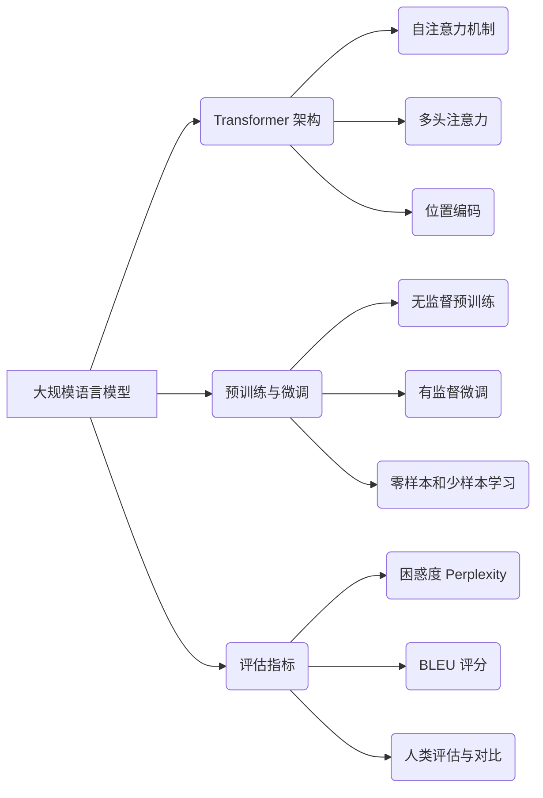

# 大规模语言模型从理论到实践 ROOTS

## 1. 背景介绍

### 1.1 自然语言处理的发展历程

#### 1.1.1 早期的规则和统计方法
#### 1.1.2 神经网络的兴起
#### 1.1.3 Transformer 模型的突破

### 1.2 大规模语言模型的诞生

#### 1.2.1 预训练语言模型的概念
#### 1.2.2 GPT 系列模型的发展
#### 1.2.3 BERT 及其变体

### 1.3 大规模语言模型的应用前景

#### 1.3.1 智能对话与问答系统
#### 1.3.2 文本生成与创作辅助
#### 1.3.3 知识图谱与信息抽取

## 2. 核心概念与联系

### 2.1 Transformer 架构

#### 2.1.1 自注意力机制
#### 2.1.2 多头注意力
#### 2.1.3 位置编码

### 2.2 预训练与微调

#### 2.2.1 无监督预训练
#### 2.2.2 有监督微调
#### 2.2.3 零样本和少样本学习

### 2.3 语言模型评估指标

#### 2.3.1 困惑度 Perplexity
#### 2.3.2 BLEU 评分
#### 2.3.3 人类评估与对比



## 3. 核心算法原理具体操作步骤

### 3.1 Transformer 的编码器-解码器结构

#### 3.1.1 编码器层的计算过程
#### 3.1.2 解码器层的计算过程
#### 3.1.3 编码器-解码器的交互

### 3.2 自注意力机制的计算步骤

#### 3.2.1 计算查询、键、值矩阵
#### 3.2.2 计算注意力权重
#### 3.2.3 加权求和得到输出

### 3.3 位置编码的生成与应用

#### 3.3.1 正弦和余弦函数的位置编码
#### 3.3.2 可学习的位置编码
#### 3.3.3 相对位置编码

## 4. 数学模型和公式详细讲解举例说明

### 4.1 Softmax 注意力

$$
\text{Attention}(Q, K, V) = \text{softmax}(\frac{QK^T}{\sqrt{d_k}})V
$$

其中，$Q$、$K$、$V$ 分别表示查询、键、值矩阵，$d_k$ 为键向量的维度。

### 4.2 多头注意力

$$
\text{MultiHead}(Q, K, V) = \text{Concat}(\text{head}_1, ..., \text{head}_h)W^O
$$

$$
\text{head}_i = \text{Attention}(QW_i^Q, KW_i^K, VW_i^V)
$$

其中，$W_i^Q$、$W_i^K$、$W_i^V$ 和 $W^O$ 为可学习的权重矩阵。

### 4.3 位置编码

对于位置 $pos$ 和维度 $i$，位置编码的计算公式为：

$$
PE_{(pos, 2i)} = \sin(pos / 10000^{2i/d_{model}})
$$

$$
PE_{(pos, 2i+1)} = \cos(pos / 10000^{2i/d_{model}})
$$

其中，$d_{model}$ 为模型的维度。

## 5. 项目实践：代码实例和详细解释说明

### 5.1 使用 PyTorch 实现 Transformer 模型

```python
import torch
import torch.nn as nn

class TransformerModel(nn.Module):
    def __init__(self, ntoken, ninp, nhead, nhid, nlayers, dropout=0.5):
        super(TransformerModel, self).__init__()
        from torch.nn import TransformerEncoder, TransformerEncoderLayer
        self.model_type = 'Transformer'
        self.pos_encoder = PositionalEncoding(ninp, dropout)
        encoder_layers = TransformerEncoderLayer(ninp, nhead, nhid, dropout)
        self.transformer_encoder = TransformerEncoder(encoder_layers, nlayers)
        self.encoder = nn.Embedding(ntoken, ninp)
        self.ninp = ninp
        self.decoder = nn.Linear(ninp, ntoken)

        self.init_weights()

    def generate_square_subsequent_mask(self, sz):
        mask = (torch.triu(torch.ones(sz, sz)) == 1).transpose(0, 1)
        mask = mask.float().masked_fill(mask == 0, float('-inf')).masked_fill(mask == 1, float(0.0))
        return mask

    def init_weights(self):
        initrange = 0.1
        self.encoder.weight.data.uniform_(-initrange, initrange)
        self.decoder.bias.data.zero_()
        self.decoder.weight.data.uniform_(-initrange, initrange)

    def forward(self, src, src_mask):
        src = self.encoder(src) * math.sqrt(self.ninp)
        src = self.pos_encoder(src)
        output = self.transformer_encoder(src, src_mask)
        output = self.decoder(output)
        return output
```

以上代码实现了一个基于 Transformer 的语言模型，包括了位置编码、多头自注意力机制以及前馈神经网络等组件。通过调用 `TransformerModel` 类并传入适当的参数，可以构建一个完整的 Transformer 模型用于自然语言处理任务。

### 5.2 使用 Hugging Face 的 Transformers 库进行预训练和微调

```python
from transformers import AutoTokenizer, AutoModelForSequenceClassification, Trainer, TrainingArguments

# 加载预训练模型和分词器
model_name = "bert-base-uncased"
tokenizer = AutoTokenizer.from_pretrained(model_name)
model = AutoModelForSequenceClassification.from_pretrained(model_name, num_labels=2)

# 准备训练数据
train_texts = [...]  # 训练文本列表
train_labels = [...]  # 训练标签列表

# 将文本转换为模型输入
train_encodings = tokenizer(train_texts, truncation=True, padding=True)

# 定义训练参数
training_args = TrainingArguments(
    output_dir='./results',
    num_train_epochs=3,
    per_device_train_batch_size=16,
    per_device_eval_batch_size=64,
    warmup_steps=500,
    weight_decay=0.01,
    logging_dir='./logs',
)

# 创建 Trainer 对象并开始训练
trainer = Trainer(
    model=model,
    args=training_args,
    train_dataset=train_encodings,
)

trainer.train()
```

以上代码展示了如何使用 Hugging Face 的 Transformers 库对预训练的 BERT 模型进行微调，用于特定的下游任务（如文本分类）。通过加载预训练模型、准备训练数据、定义训练参数并创建 Trainer 对象，可以方便地对模型进行微调，从而在特定任务上取得更好的性能。

## 6. 实际应用场景

### 6.1 智能客服与对话系统

大规模语言模型可以用于构建智能客服和对话系统，通过理解用户的意图并生成相应的回复，提供个性化的服务体验。

### 6.2 内容生成与文案创作

利用大规模语言模型的强大生成能力，可以辅助创作各种类型的文本内容，如新闻报道、产品描述、广告文案等，提高内容生产效率。

### 6.3 情感分析与舆情监测

通过对社交媒体、评论等用户生成内容进行情感分析，大规模语言模型可以帮助企业实时监测舆情动向，把握用户情绪，及时调整策略。

## 7. 工具和资源推荐

### 7.1 开源框架和库

- PyTorch：基于动态计算图的深度学习框架，提供了灵活的 API 和强大的社区支持。
- TensorFlow：由 Google 开发的端到端开源机器学习平台，支持多种硬件设备和分布式训练。
- Hugging Face Transformers：基于 PyTorch 和 TensorFlow 的最先进 NLP 库，提供了大量预训练模型和简洁的 API。

### 7.2 预训练模型和数据集

- BERT：基于双向 Transformer 的预训练语言模型，在多个 NLP 任务上取得了最先进的结果。
- GPT-3：OpenAI 开发的大规模语言模型，具有强大的文本生成和理解能力。
- WikiText：基于维基百科的大规模语言建模数据集，广泛用于评估语言模型的性能。

### 7.3 学习资源和社区

- fast.ai：提供了深度学习和自然语言处理的实用课程和教程，强调从实践中学习。
- Machine Learning Mastery：提供了大量机器学习和深度学习的教程和示例代码，适合初学者入门。
- Reddit r/MachineLearning：机器学习领域的热门讨论社区，汇聚了众多研究者和从业者。

## 8. 总结：未来发展趋势与挑战

### 8.1 模型规模的持续增长

随着计算能力的提升和数据规模的扩大，大规模语言模型的参数量和训练数据量将持续增长，带来更强大的性能和更广泛的应用。

### 8.2 多模态学习的融合

将语言模型与视觉、语音等其他模态的信息进行融合，构建多模态学习系统，实现更全面、更自然的人机交互。

### 8.3 可解释性和公平性

如何提高大规模语言模型的可解释性，了解其决策过程，并确保模型的公平性，避免偏见和歧视，是亟待解决的挑战。

### 8.4 隐私保护与安全

在使用大规模语言模型处理用户数据时，需要重视隐私保护，防止敏感信息泄露，同时确保模型的安全性，避免恶意攻击和滥用。

## 9. 附录：常见问题与解答

### 9.1 大规模语言模型需要多少训练数据？

训练大规模语言模型通常需要海量的文本数据，如 GPT-3 使用了 4500 亿个 token 的训练数据。但具体所需的数据量取决于模型的规模和任务的复杂性。

### 9.2 如何选择合适的预训练模型？

选择预训练模型时，需要考虑模型的架构、规模、预训练任务以及在目标任务上的表现。可以参考论文中的实验结果和社区的经验分享。

### 9.3 微调预训练模型需要注意哪些问题？

微调预训练模型时，需要合理设置学习率、batch size 等超参数，避免过拟合。同时要注意不同任务之间的差异，根据具体任务对模型进行适当的修改和调整。

作者：禅与计算机程序设计艺术 / Zen and the Art of Computer Programming