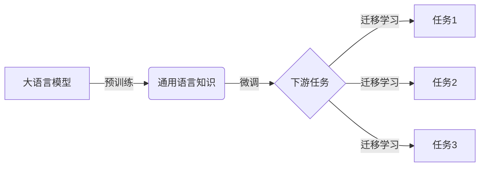

# 大语言模型原理与工程实践：大语言模型微调的挑战和探索

## 1. 背景介绍
### 1.1 大语言模型的兴起
近年来,随着深度学习技术的飞速发展,尤其是 Transformer 架构的提出,大语言模型(Large Language Model,LLM)开始崭露头角。从 GPT、BERT 到 GPT-3、PaLM 等,大语言模型在自然语言处理(NLP)领域取得了令人瞩目的成就,展现出强大的语言理解和生成能力。

### 1.2 大语言模型的应用前景
大语言模型具有广阔的应用前景,可以应用于机器翻译、对话系统、文本摘要、问答系统等诸多 NLP 任务中。它们能够理解语言的语义,捕捉上下文信息,生成流畅自然的文本。这使得大语言模型成为 NLP 领域的重要研究热点。

### 1.3 大语言模型微调的意义
尽管大语言模型展现出卓越的性能,但它们通常是在海量通用语料上预训练得到的。为了更好地适应特定领域或任务,需要在下游任务的数据上对大语言模型进行微调(Fine-tuning)。微调能够使模型更好地理解任务的特点,提升在特定任务上的表现。然而,大语言模型微调也面临着诸多挑战。

## 2. 核心概念与联系
### 2.1 大语言模型
大语言模型是基于海量文本数据训练的语言模型,旨在学习语言的统计规律和语义表示。它们通常采用 Transformer 等深度神经网络架构,具有亿级甚至千亿级的参数规模。代表性的大语言模型包括 GPT 系列、BERT、RoBERTa、T5 等。

### 2.2 预训练与微调
- 预训练(Pre-training):在大规模无标注语料上对模型进行自监督学习,让模型学习通用的语言知识和表示。常见的预训练任务包括语言模型、掩码语言模型等。
- 微调(Fine-tuning):在下游任务的标注数据上对预训练模型进行监督学习,使模型适应特定任务。微调通过利用预训练模型学到的语言知识,能够显著提升下游任务的性能。

### 2.3 迁移学习
迁移学习是将在源任务上学习到的知识迁移到目标任务中的机器学习范式。在大语言模型中,预训练阶段相当于在源任务(如语言模型任务)上学习通用语言知识,微调阶段则将知识迁移到目标任务(如文本分类、命名实体识别等)中。

### 2.4 核心概念之间的联系


## 3. 核心算法原理与具体操作步骤
### 3.1 Transformer 架构
Transformer 是大语言模型的核心架构,由编码器(Encoder)和解码器(Decoder)组成。它采用自注意力机制(Self-Attention)来捕捉文本中的长距离依赖关系。
#### 3.1.1 自注意力机制
自注意力机制计算输入序列中每个位置与其他位置之间的注意力权重,从而获取当前位置对其他位置的依赖程度。具体步骤如下:
1. 将输入序列映射为查询(Query)、键(Key)、值(Value)三个矩阵。
2. 计算查询和键的点积,得到注意力分数。
3. 对注意力分数进行 softmax 归一化,得到注意力权重。
4. 将注意力权重与值矩阵相乘,得到当前位置的注意力输出。

#### 3.1.2 多头注意力
多头注意力是将自注意力机制扩展为多个并行的注意力头(Head)。每个头独立计算注意力,然后将所有头的输出拼接起来,再经过线性变换得到最终的多头注意力输出。多头注意力能够捕捉不同的依赖关系,提升模型的表示能力。

#### 3.1.3 前馈神经网络
在 Transformer 的每个编码器和解码器层中,除了自注意力子层外,还包括一个前馈神经网络子层。前馈神经网络由两个线性变换和一个非线性激活函数(通常为 ReLU)组成,用于对自注意力的输出进行非线性变换。

### 3.2 预训练算法
#### 3.2.1 语言模型预训练
语言模型预训练是让模型学习在给定前面的词的情况下预测下一个词。具体步骤如下:
1. 构建大规模无标注语料库。
2. 将语料库划分为固定长度的序列。
3. 使用语言模型目标函数(如交叉熵损失)训练模型,最小化预测下一个词的损失。

#### 3.2.2 掩码语言模型预训练
掩码语言模型预训练是随机掩盖输入序列中的部分词,让模型预测被掩盖的词。具体步骤如下:
1. 随机选择输入序列中的部分词进行掩码。
2. 将掩码后的序列输入模型,预测被掩盖的词。
3. 使用掩码语言模型目标函数(如交叉熵损失)训练模型,最小化预测被掩盖词的损失。

### 3.3 微调算法
微调是在下游任务的标注数据上对预训练模型进行监督学习。具体步骤如下:
1. 在预训练模型的基础上,根据下游任务的特点添加任务特定的输出层(如分类层、序列标注层等)。
2. 使用下游任务的标注数据对模型进行微调,更新模型参数。
3. 使用任务特定的目标函数(如交叉熵损失、F1 值等)评估模型性能。
4. 根据验证集性能调整超参数,如学习率、批量大小等。
5. 在测试集上评估微调后的模型性能。

## 4. 数学模型和公式详细讲解举例说明
### 4.1 自注意力机制的数学公式
假设输入序列为 $X \in \mathbb{R}^{n \times d}$,其中 $n$ 为序列长度,$d$ 为特征维度。自注意力机制的计算过程如下:

1. 计算查询矩阵 $Q$、键矩阵 $K$、值矩阵 $V$:
$$
\begin{aligned}
Q &= XW^Q \\
K &= XW^K \\
V &= XW^V
\end{aligned}
$$
其中,$W^Q, W^K, W^V \in \mathbb{R}^{d \times d_k}$ 为可学习的权重矩阵,$d_k$ 为注意力头的维度。

2. 计算注意力分数:
$$
\text{Attention}(Q, K, V) = \text{softmax}(\frac{QK^T}{\sqrt{d_k}})V
$$
其中,$\frac{1}{\sqrt{d_k}}$ 为缩放因子,用于控制点积的方差。

3. 计算多头注意力:
$$
\begin{aligned}
\text{MultiHead}(Q, K, V) &= \text{Concat}(\text{head}_1, \ldots, \text{head}_h)W^O \\
\text{head}_i &= \text{Attention}(QW_i^Q, KW_i^K, VW_i^V)
\end{aligned}
$$
其中,$h$ 为注意力头的数量,$W_i^Q, W_i^K, W_i^V \in \mathbb{R}^{d \times d_k}, W^O \in \mathbb{R}^{hd_k \times d}$ 为可学习的权重矩阵。

### 4.2 前馈神经网络的数学公式
前馈神经网络的计算过程如下:
$$
\text{FFN}(x) = \max(0, xW_1 + b_1)W_2 + b_2
$$
其中,$x$ 为输入,$W_1 \in \mathbb{R}^{d \times d_{ff}}, b_1 \in \mathbb{R}^{d_{ff}}, W_2 \in \mathbb{R}^{d_{ff} \times d}, b_2 \in \mathbb{R}^d$ 为可学习的权重矩阵和偏置项,$d_{ff}$ 为前馈神经网络的隐藏层维度。

### 4.3 语言模型预训练的目标函数
语言模型预训练的目标是最小化给定前面词的情况下,预测下一个词的交叉熵损失:
$$
\mathcal{L}_{LM} = -\sum_{i=1}^n \log P(x_i | x_{<i})
$$
其中,$x_i$ 为第 $i$ 个词,$x_{<i}$ 为前 $i-1$ 个词构成的序列。

### 4.4 掩码语言模型预训练的目标函数
掩码语言模型预训练的目标是最小化预测被掩盖词的交叉熵损失:
$$
\mathcal{L}_{MLM} = -\sum_{i \in \mathcal{M}} \log P(x_i | \hat{x}_{\backslash i})
$$
其中,$\mathcal{M}$ 为被掩盖的词的集合,$\hat{x}_{\backslash i}$ 为将第 $i$ 个词掩盖后的输入序列。

## 5. 项目实践：代码实例和详细解释说明
下面是使用 PyTorch 实现 Transformer 编码器层的示例代码:

```python
import torch
import torch.nn as nn

class TransformerEncoderLayer(nn.Module):
    def __init__(self, d_model, nhead, dim_feedforward=2048, dropout=0.1):
        super(TransformerEncoderLayer, self).__init__()
        self.self_attn = nn.MultiheadAttention(d_model, nhead, dropout=dropout)
        self.linear1 = nn.Linear(d_model, dim_feedforward)
        self.dropout = nn.Dropout(dropout)
        self.linear2 = nn.Linear(dim_feedforward, d_model)
        self.norm1 = nn.LayerNorm(d_model)
        self.norm2 = nn.LayerNorm(d_model)
        self.dropout1 = nn.Dropout(dropout)
        self.dropout2 = nn.Dropout(dropout)
        
    def forward(self, src, src_mask=None, src_key_padding_mask=None):
        src2 = self.self_attn(src, src, src, attn_mask=src_mask,
                              key_padding_mask=src_key_padding_mask)[0]
        src = src + self.dropout1(src2)
        src = self.norm1(src)
        src2 = self.linear2(self.dropout(torch.relu(self.linear1(src))))
        src = src + self.dropout2(src2)
        src = self.norm2(src)
        return src
```

代码解释:
- `TransformerEncoderLayer` 类定义了 Transformer 编码器层,包括多头自注意力子层和前馈神经网络子层。
- `__init__` 方法初始化编码器层的组件,包括多头注意力(`self_attn`)、前馈神经网络(`linear1`、`linear2`)、dropout 层和层归一化(`norm1`、`norm2`)。
- `forward` 方法定义了编码器层的前向传播过程:
  1. 通过多头自注意力子层处理输入序列 `src`,得到 `src2`。
  2. 将 `src2` 与输入 `src` 相加,并经过 dropout 和层归一化,得到自注意力子层的输出。
  3. 将自注意力子层的输出传入前馈神经网络子层,得到 `src2`。
  4. 将 `src2` 与自注意力子层的输出相加,并经过 dropout 和层归一化,得到编码器层的最终输出。

使用示例:
```python
d_model = 512
nhead = 8
dim_feedforward = 2048
dropout = 0.1

encoder_layer = TransformerEncoderLayer(d_model, nhead, dim_feedforward, dropout)
src = torch.randn(10, 32, d_model)  # 输入序列,形状为 (seq_len, batch_size, d_model)
out = encoder_layer(src)
print(out.shape)  # 输出形状为 (seq_len, batch_size, d_model)
```

以上代码展示了如何使用 PyTorch 实现 Transformer 编码器层,并给出了使用示例。通过组合多个编码器层,可以构建完整的 Transformer 编码器。类似地,可以实现 Transformer 解码器层和完整的 Transformer 模型。

## 6. 实际应用场景
大语言模型微调技术在各种自然语言处理任务中得到