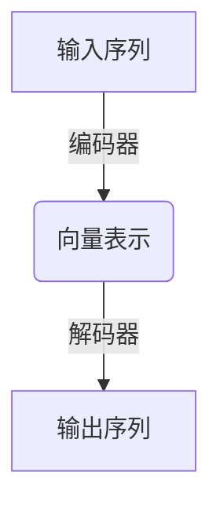
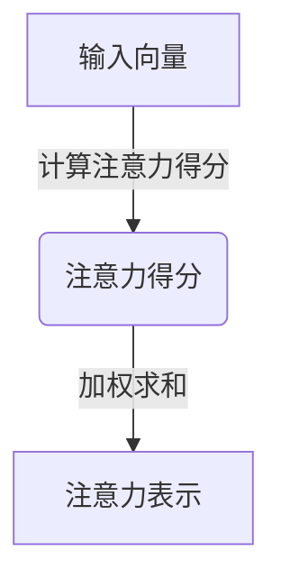
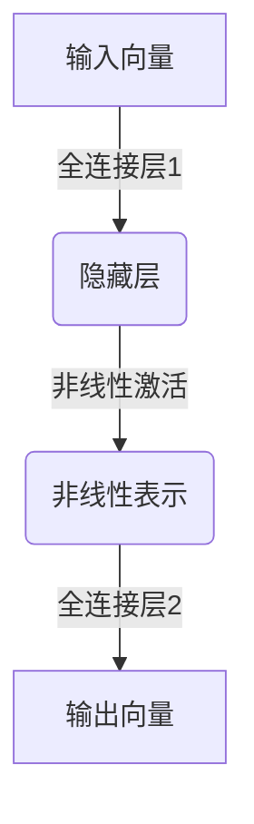
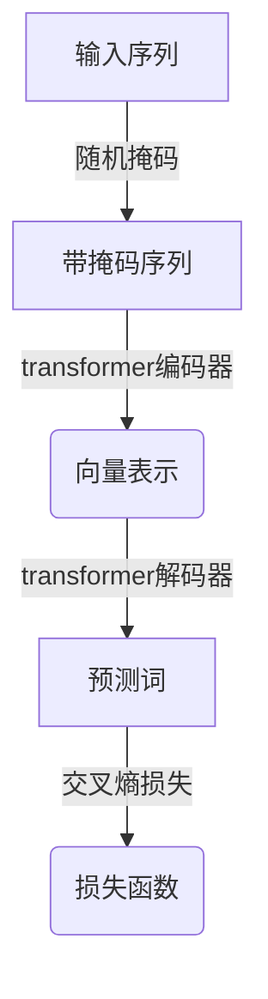
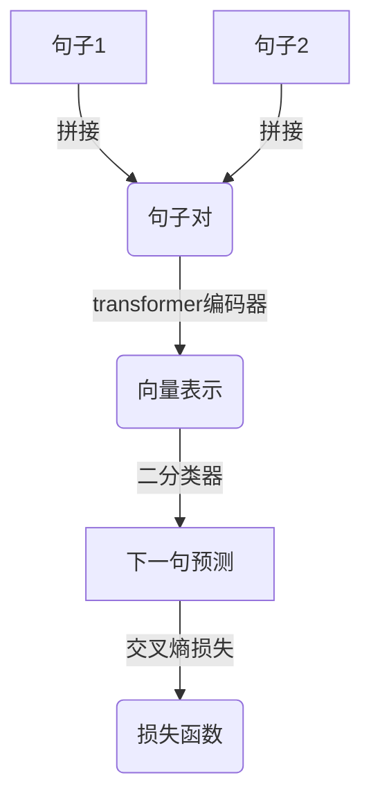
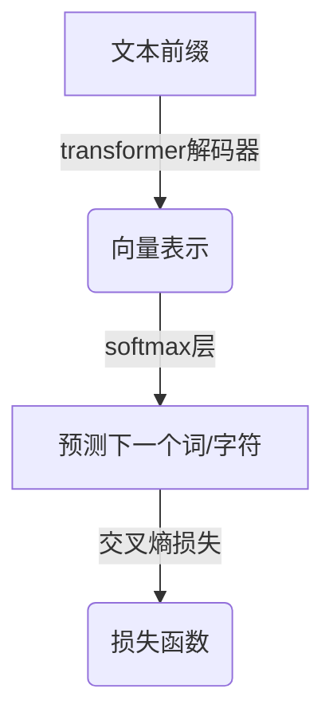

# 大语言模型原理与工程实践：大语言模型的涌现能力

## 1. 背景介绍

### 1.1 人工智能的新时代

人工智能领域正在经历一场革命性的变革。近年来,大型语言模型(Large Language Models, LLMs)的出现,彻底改变了人工智能的发展轨迹。这些模型通过消化海量的文本数据,学习到了惊人的语言理解和生成能力,展现出前所未有的通用性和泛化能力。

### 1.2 大语言模型的崛起

大语言模型的核心思想是利用自监督学习(Self-Supervised Learning)的方式,从大规模的文本语料中学习语言的内在规律和知识表示。这种方法不需要人工标注的数据,可以充分利用互联网上的海量文本资源。经过大规模预训练,模型获得了强大的语言理解和生成能力,可以应用于广泛的自然语言处理任务。

### 1.3 变革性影响

大语言模型的出现,不仅极大地提升了自然语言处理的性能水平,更重要的是,它们展现出了惊人的通用性和泛化能力。这些模型可以在看似不相关的任务之间迁移知识,表现出类似人类的推理和创造性思维能力。这种能力被称为"涌现智能"(Emergent Abilities),它正在推动人工智能向更高层次的通用智能迈进。

## 2. 核心概念与联系

### 2.1 自监督学习

自监督学习是大语言模型训练的核心方法。它不需要人工标注的数据,而是通过设计巧妙的预训练任务,让模型从原始文本数据中自主学习语言的内在规律和知识表示。常见的预训练任务包括掩码语言模型(Masked Language Modeling)和下一句预测(Next Sentence Prediction)等。

### 2.2 transformer 架构

transformer 是大语言模型的核心架构,它完全基于注意力机制(Attention Mechanism)构建,可以有效捕捉长距离依赖关系,并支持高度并行化计算。transformer 架构的出现,使得训练大型语言模型成为可能,极大地提高了模型的表现能力。

### 2.3 知识迁移与泛化

大语言模型在预训练过程中学习到了丰富的语言知识和世界知识,这些知识可以在下游任务中得到很好的迁移和泛化。模型不仅可以应用于传统的自然语言处理任务,还可以解决一些看似不相关的任务,如数学推理、代码生成等,展现出了惊人的通用性和创造性。

### 2.4 涌现智能

大语言模型展现出了一种类似人类的"涌现智能"(Emergent Abilities)。这种智能不是简单的知识累加,而是模型在学习过程中自发获得的一种更高层次的认知能力,包括推理、创造性思维、多任务协同等。这种能力使得大语言模型有望成为通用人工智能(Artificial General Intelligence, AGI)的一种有力探索方向。

## 3. 核心算法原理具体操作步骤

### 3.1 transformer 架构原理

transformer 架构完全基于注意力机制构建,它的核心组件包括编码器(Encoder)和解码器(Decoder)。编码器将输入序列映射为一系列向量表示,解码器则根据这些向量表示生成输出序列。



编码器和解码器都由多个相同的层组成,每一层包含两个子层:多头注意力子层(Multi-Head Attention Sublayer)和前馈网络子层(Feed-Forward Sublayer)。

#### 3.1.1 多头注意力机制

多头注意力机制是 transformer 的核心,它可以有效捕捉输入序列中的长距离依赖关系。具体来说,对于每个输入向量,注意力机制会计算它与其他向量的相关性得分,然后根据这些得分对所有向量进行加权求和,得到该向量的注意力表示。



为了捕捉不同的依赖关系,transformer 使用了多头注意力机制,即对输入序列进行多次注意力计算,得到多个注意力表示,然后将它们拼接起来作为该层的输出。

#### 3.1.2 前馈网络子层

前馈网络子层是一个简单的全连接前馈网络,它对每个向量进行独立的非线性变换,以引入更复杂的特征表示。



前馈网络子层和多头注意力子层交替堆叠,构成了 transformer 编码器和解码器的基本结构。

### 3.2 大语言模型预训练

大语言模型的预训练过程是一种自监督学习,它不需要人工标注的数据,而是通过设计巧妙的预训练任务,让模型从原始文本数据中自主学习语言的内在规律和知识表示。

#### 3.2.1 掩码语言模型(Masked Language Modeling)

掩码语言模型是一种常见的预训练任务。具体来说,模型会随机将输入序列中的一些词替换为特殊的掩码标记(如 [MASK])。模型的目标是根据上下文,正确预测这些被掩码的词。



通过这种方式,模型可以学习到词与上下文之间的关系,以及语言的语义和语法知识。

#### 3.2.2 下一句预测(Next Sentence Prediction)

下一句预测是另一种常见的预训练任务。在这个任务中,模型会接收两个句子作为输入,其中一个句子是正确的下一句,另一个是随机采样的句子。模型的目标是正确判断哪个句子是真正的下一句。



通过这种方式,模型可以学习到句子与句子之间的逻辑关系,以及更高层次的语义理解能力。

#### 3.2.3 自回归语言模型(Autoregressive Language Modeling)

除了上述两种预训练任务,一些大语言模型还采用了自回归语言模型的训练方式。在这种方式下,模型会根据给定的文本前缀,预测下一个词或下一个字符。



自回归语言模型可以更好地捕捉语言的序列性质,并且在生成任务中表现出色。

通过上述预训练任务的组合,大语言模型可以从海量的文本数据中学习到丰富的语言知识和世界知识,为后续的下游任务奠定基础。

## 4. 数学模型和公式详细讲解举例说明

### 4.1 transformer 注意力机制

transformer 的核心是注意力机制,它可以有效捕捉输入序列中的长距离依赖关系。对于一个输入序列 $X = (x_1, x_2, \dots, x_n)$,注意力机制会计算每个输入向量 $x_i$ 与其他向量 $x_j$ 的相关性得分 $e_{ij}$,然后根据这些得分对所有向量进行加权求和,得到 $x_i$ 的注意力表示 $z_i$。

$$z_i = \sum_{j=1}^n \alpha_{ij}(x_j W^V)$$

其中,权重 $\alpha_{ij}$ 是通过 softmax 函数计算得到的:

$$\alpha_{ij} = \frac{e^{e_{ij}}}{\sum_{k=1}^n e^{e_{ik}}}$$

相关性得分 $e_{ij}$ 可以通过多种方式计算,常见的做法是使用缩放点积注意力(Scaled Dot-Product Attention):

$$e_{ij} = \frac{(x_i W^Q)(x_j W^K)^T}{\sqrt{d_k}}$$

其中 $W^Q$、$W^K$、$W^V$ 分别是查询(Query)、键(Key)和值(Value)的线性变换矩阵,用于将输入向量映射到不同的子空间;$d_k$ 是缩放因子,用于避免点积结果过大导致梯度饱和。

为了捕捉不同的依赖关系,transformer 使用了多头注意力机制。具体来说,对于每个注意力头 $h$,都会独立计算一组注意力权重 $\alpha_{ij}^h$,得到一个注意力表示 $z_i^h$。然后,将所有头的注意力表示拼接起来,经过一个线性变换,即得到该层的输出:

$$\text{MultiHead}(X) = \text{Concat}(z_1, z_2, \dots, z_n)W^O$$

其中,

$$z_i = \sum_{h=1}^H z_i^h, \quad z_i^h = \sum_{j=1}^n \alpha_{ij}^h(x_j W_h^V)$$

$H$ 是注意力头的数量,是一个超参数。多头注意力机制可以从不同的子空间捕捉不同的依赖关系,提高了模型的表示能力。

### 4.2 transformer 损失函数

在预训练过程中,大语言模型通常会使用掩码语言模型(Masked Language Modeling)和下一句预测(Next Sentence Prediction)两种任务的组合损失函数进行训练。

对于掩码语言模型任务,给定一个带有掩码标记的输入序列 $X = (x_1, x_2, \dots, x_n)$,模型需要预测被掩码的词 $x_i$。假设模型输出的预测概率分布为 $P(x_i|X)$,真实词的概率为 $y_i$,则该任务的损失函数为:

$$\mathcal{L}_{\text{MLM}} = -\sum_{i \in \text{mask}} \log P(x_i|X)$$

其中,$\text{mask}$ 表示被掩码的位置集合。

对于下一句预测任务,给定两个句子 $S_1$ 和 $S_2$,模型需要判断 $S_2$ 是否是 $S_1$ 的下一句。假设模型输出的预测概率为 $P(y|S_1, S_2)$,真实标签为 $y$,则该任务的损失函数为:

$$\mathcal{L}_{\text{NSP}} = -\log P(y|S_1, S_2)$$

最终,两个任务的损失函数会进行加权求和,作为整个预训练过程的损失函数:

$$\mathcal{L} = \mathcal{L}_{\text{MLM}} + \lambda \mathcal{L}_{\text{NSP}}$$

其中,$\lambda$ 是一个超参数,用于平衡两个任务的重要性。

通过最小化上述损失函数,模型可以学习到丰富的语言知识和世界知识,为后续的下游任务奠定基础。

## 5. 项目实践:代码实例和详细解释说明

为了更好地理解大语言模型的原理和实现,我们将通过一个简化版本的 transformer 模型来进行实践。这个模型将实现基本的编码器-解码器架构,以及掩码语言模型预训练任务。

### 5.1 环境配置

我们将使用 PyTorch 框架进行模型的实现。首先,我们需要安装必要的依赖库:

```bash
pip install torch torchtext
```

### 5.2 数据预处理

我们将使用 torchtext 库来处理文本数据。首先,我们需要定义一个字段对象,用于指定文本数据的预处理方式:

```python
from torchtext.data import Field

text_field = Field(tokenize='spacy',
                   init_token='<sos>',