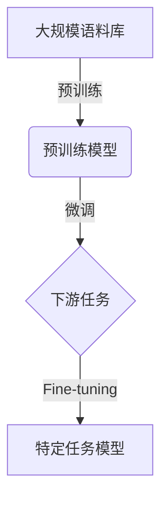

# 大语言模型原理与工程实践：大语言模型训练综述

## 1. 背景介绍

### 1.1 大语言模型的兴起

近年来,大型语言模型(Large Language Models, LLMs)在自然语言处理(Natural Language Processing, NLP)领域取得了令人瞩目的成就。这些模型通过在大规模语料库上进行预训练,学习了丰富的语言知识和上下文信息,展现出了强大的语言理解和生成能力。

大语言模型的兴起可以追溯到2018年,当时谷歌发布了Transformer模型,引入了自注意力(Self-Attention)机制,显著提高了序列建模的性能。随后,OpenAI推出了GPT(Generative Pre-trained Transformer)模型,通过在大量无监督文本数据上预训练,成功学习到了通用的语言表示,在多项自然语言任务上取得了出色的表现。

### 1.2 大语言模型的重要性

大语言模型的出现,为自然语言处理领域带来了革命性的变化。这些模型不仅在传统的NLP任务(如文本分类、机器翻译等)上表现出色,更展现出了强大的泛化能力,能够在看似不相关的任务上获得令人惊叹的性能。

大语言模型的关键优势在于,它们通过在大规模语料库上预训练,学习到了丰富的语言知识和上下文信息,从而获得了强大的语言理解和生成能力。这种通用的语言表示,使得模型能够轻松迁移到新的任务和领域,大大降低了任务专用模型的开发成本。

此外,大语言模型还展现出了出色的少样本学习(Few-Shot Learning)能力,只需要少量的示例数据,就能快速适应新的任务,这为解决数据稀缺问题提供了新的思路。

## 2. 核心概念与联系

### 2.1 自注意力机制(Self-Attention)

自注意力机制是大语言模型的核心组成部分,它允许模型捕捉输入序列中任意两个位置之间的关系,从而更好地建模长距离依赖关系。与传统的循环神经网络(RNN)和卷积神经网络(CNN)相比,自注意力机制具有并行计算的优势,能够更高效地处理长序列输入。

在自注意力机制中,每个位置的表示是所有位置的加权和,其中权重由位置之间的相似性决定。这种灵活的关注机制,使得模型能够自适应地聚焦于输入序列中的关键信息,从而提高了模型的表现。

### 2.2 预训练与微调(Pre-training and Fine-tuning)

大语言模型通常采用两阶段训练策略:预训练(Pre-training)和微调(Fine-tuning)。

在预训练阶段,模型在大规模无监督语料库上进行训练,目标是学习通用的语言表示。常见的预训练目标包括掩码语言模型(Masked Language Modeling)和下一句预测(Next Sentence Prediction)等。通过预训练,模型能够捕捉到丰富的语言知识和上下文信息。

在微调阶段,预训练模型被用作初始化权重,并在特定的下游任务数据上进行进一步训练。由于预训练模型已经学习到了通用的语言表示,只需要对模型进行少量的微调,就能够快速适应新的任务,从而大大降低了任务专用模型的开发成本。

### 2.3 模型规模与性能

大语言模型的性能与模型规模密切相关。一般来说,模型规模越大(参数数量越多),模型在预训练语料库上学习到的语言知识就越丰富,表现也就越出色。

然而,大规模模型也带来了更高的计算和存储开销,以及更严重的环境影响。因此,在追求性能提升的同时,也需要考虑模型的效率和可持续性。一些研究工作致力于通过模型压缩、知识蒸馏等技术,在保持性能的同时减小模型的footprint。

### 2.4 Mermaid流程图

下面的Mermaid流程图展示了大语言模型训练的核心流程:

## 3. 核心算法原理具体操作步骤

### 3.1 Transformer模型

Transformer是大语言模型的核心架构,它完全基于自注意力机制,摒弃了传统的循环和卷积结构。Transformer的主要组成部分包括编码器(Encoder)和解码器(Decoder)。

#### 3.1.1 编码器(Encoder)

编码器的主要作用是将输入序列映射为一系列连续的表示,以捕捉输入序列的上下文信息。编码器由多个相同的层组成,每一层包含两个子层:多头自注意力子层和全连接前馈网络子层。

1. **多头自注意力子层**

   多头自注意力机制允许模型同时关注输入序列中的不同位置,从而捕捉长距离依赖关系。具体操作如下:

   - 将输入序列的每个位置映射为查询(Query)、键(Key)和值(Value)向量。
   - 计算查询和所有键的点积,应用softmax函数得到注意力权重。
   - 将注意力权重与值向量相乘,得到该位置的加权和表示。
   - 对多个注意力头的结果进行拼接,形成该位置的最终表示。

2. **全连接前馈网络子层**

   全连接前馈网络子层对每个位置的表示进行独立的非线性转换,以引入更高层次的特征。具体操作如下:

   - 将上一子层的输出作为输入,通过两个全连接层进行非线性变换。
   - 应用dropout和残差连接,以防止过拟合和保持信息流动。

通过堆叠多个编码器层,模型能够逐步提取输入序列的高层次语义表示。

#### 3.1.2 解码器(Decoder)

解码器的作用是根据编码器的输出,生成目标序列。解码器的结构与编码器类似,也由多个相同的层组成,每一层包含三个子层:掩码多头自注意力子层、编码器-解码器注意力子层和全连接前馈网络子层。

1. **掩码多头自注意力子层**

   与编码器的自注意力子层类似,但引入了掩码机制,确保每个位置的表示只依赖于该位置之前的输入。这种掩码操作是为了保持自回归(Auto-Regressive)特性,即模型在生成序列时,每个位置的输出只依赖于之前的输出。

2. **编码器-解码器注意力子层**

   该子层允许解码器关注编码器的输出,从而融合输入序列的上下文信息。具体操作如下:

   - 将解码器的输出作为查询,编码器的输出作为键和值。
   - 计算查询和所有键的点积,应用softmax函数得到注意力权重。
   - 将注意力权重与值向量相乘,得到编码器上下文的加权和表示。

3. **全连接前馈网络子层**

   与编码器中的全连接前馈网络子层相同,对每个位置的表示进行独立的非线性转换。

通过堆叠多个解码器层,模型能够逐步生成目标序列,同时利用编码器的上下文信息进行条件生成。

### 3.2 预训练目标

大语言模型通常在大规模无监督语料库上进行预训练,以学习通用的语言表示。常见的预训练目标包括:

#### 3.2.1 掩码语言模型(Masked Language Modeling, MLM)

在MLM任务中,模型需要预测输入序列中被掩码(masked)的单词。具体操作步骤如下:

1. 从输入序列中随机选择一些单词位置,将它们替换为特殊的掩码标记(例如[MASK])。
2. 将掩码后的序列输入到编码器中,得到每个位置的表示向量。
3. 对于被掩码的位置,使用该位置的表示向量预测原始单词。
4. 将预测的单词与ground truth进行比较,计算交叉熵损失,并使用该损失函数对模型进行训练。

通过MLM任务,模型被迫学习捕捉输入序列的上下文信息,从而获得更好的语言理解能力。

#### 3.2.2 下一句预测(Next Sentence Prediction, NSP)

NSP任务旨在让模型学习捕捉句子之间的关系。具体操作步骤如下:

1. 从语料库中随机采样一对相邻的句子作为正例,并随机采样另一个句子作为负例。
2. 将正例句子对和负例句子对分别输入到编码器中,得到每对句子的表示向量。
3. 使用这些表示向量预测两个句子是否为相邻句子。
4. 将预测结果与ground truth进行比较,计算二分类损失,并使用该损失函数对模型进行训练。

通过NSP任务,模型被迫学习捕捉句子之间的逻辑关系和上下文信息,从而获得更好的语义理解能力。

### 3.3 微调(Fine-tuning)

在完成预训练后,大语言模型通常需要在特定的下游任务数据上进行微调,以适应新的任务。微调过程通常包括以下步骤:

1. **任务格式化**

   将下游任务的输入数据格式化为与预训练阶段相同的格式,例如将文本分类任务转换为掩码语言模型任务。

2. **数据准备**

   准备下游任务的训练数据和验证数据。

3. **模型初始化**

   使用预训练模型的权重初始化微调模型。

4. **微调训练**

   在下游任务的训练数据上,使用与预训练阶段相同的目标函数(如交叉熵损失)对模型进行微调训练。通常只需要对模型进行少量的微调,就能够快速适应新的任务。

5. **模型评估**

   在下游任务的验证数据上评估微调后模型的性能。

6. **模型部署**

   将微调后的模型部署到实际的应用场景中。

通过微调,大语言模型能够快速迁移到新的任务和领域,从而大大降低了任务专用模型的开发成本。

## 4. 数学模型和公式详细讲解举例说明

### 4.1 自注意力机制(Self-Attention)

自注意力机制是大语言模型的核心组成部分,它允许模型捕捉输入序列中任意两个位置之间的关系。下面我们将详细介绍自注意力机制的数学原理。

给定一个长度为 $n$ 的输入序列 $X = (x_1, x_2, \dots, x_n)$,其中每个 $x_i \in \mathbb{R}^{d_x}$ 是一个 $d_x$ 维的向量表示。自注意力机制的目标是为每个位置 $i$ 计算一个新的向量表示 $z_i$,它是所有位置的加权和,其中权重由位置之间的相似性决定。

具体来说,我们首先将输入序列 $X$ 线性映射为查询(Query)、键(Key)和值(Value)向量:

$$
\begin{aligned}
Q &= XW^Q \\
K &= XW^K \\
V &= XW^V
\end{aligned}
$$

其中 $W^Q \in \mathbb{R}^{d_x \times d_k}$、$W^K \in \mathbb{R}^{d_x \times d_k}$ 和 $W^V \in \mathbb{R}^{d_x \times d_v}$ 是可学习的线性变换矩阵。

然后,我们计算查询 $Q$ 和所有键 $K$ 的点积,应用 softmax 函数得到注意力权重:

$$
\text{Attention}(Q, K, V) = \text{softmax}\left(\frac{QK^\top}{\sqrt{d_k}}\right)V
$$

其中 $\sqrt{d_k}$ 是一个缩放因子,用于防止点积过大导致的梯度不稳定问题。

注意力权重矩阵 $A \in \mathbb{R}^{n \times n}$ 的每个元素 $a_{ij}$ 表示位置 $i$ 对位置 $j$ 的注意力权重,它反映了位置 $i$ 和位置 $j$ 之间的相似性。具体来说:

$$
a