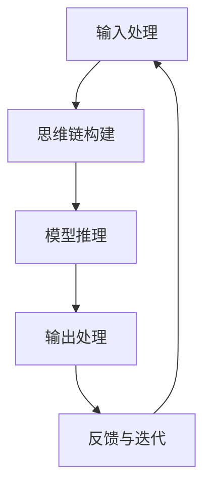

# 大语言模型原理与工程实践：思维链提示

## 1. 背景介绍

随着人工智能和深度学习技术的不断发展,大型语言模型(Large Language Models, LLMs)已成为自然语言处理领域的一股重要力量。LLMs通过在海量文本数据上进行预训练,能够捕捉到丰富的语言知识和上下文信息,从而在广泛的自然语言任务中表现出色,如机器翻译、文本生成、问答系统等。

然而,传统的LLMs存在一些局限性,例如缺乏长期记忆能力、难以保持一致性和连贯性、容易受到提示偏差的影响等。为了解决这些问题,思维链(Chain of Thought, CoT)提示技术应运而生,它通过引导LLMs进行逐步推理和解释,帮助模型更好地理解和解决复杂任务。

## 2. 核心概念与联系

### 2.1 大型语言模型(LLMs)

大型语言模型是一种基于自然语言的深度学习模型,通过在大规模语料库上进行预训练,获得丰富的语言知识和上下文理解能力。常见的LLMs包括GPT(Generative Pre-trained Transformer)、BERT(Bidirectional Encoder Representations from Transformers)、XLNet等。这些模型可以应用于各种自然语言处理任务,如机器翻译、文本生成、问答系统等。

### 2.2 思维链(CoT)提示

思维链提示是一种引导LLMs进行逐步推理和解释的技术。它通过在输入提示中添加一个"思维过程"步骤,要求模型在给出最终答案之前,先解释其推理过程。这种方式可以帮助模型更好地理解问题,避免直接给出不合理的答案。

思维链提示的核心思想是通过显式地要求模型解释其推理过程,来缓解LLMs在复杂任务中可能出现的一致性和连贯性问题。同时,这种技术也有助于提高模型的可解释性和可信度。

## 3. 核心算法原理具体操作步骤

思维链提示技术的核心算法原理可以概括为以下几个步骤:

1. **输入处理**: 将原始输入(如问题或任务描述)转换为适合LLM的提示格式。

2. **思维链构建**: 在提示中添加"思维过程"步骤,要求模型在给出最终答案之前,先解释其推理过程。例如:"为了解决这个问题,我首先需要...接下来我将...最后,我可以得出..."

3. **模型推理**: 将包含思维链的提示输入到LLM中,模型将根据提示生成包含推理过程的输出。

4. **输出处理**: 从模型输出中提取最终答案,并可选地对推理过程进行后处理(如格式化、清理等)。

5. **反馈与迭代**: 根据输出质量,可以对提示进行改进,并重复上述过程,直到获得满意的结果。

这个过程可以通过算法实现自动化,或者由人工进行手动操作。无论采用何种方式,关键是要合理设计思维链提示,引导模型进行有效的推理和解释。



## 4. 数学模型和公式详细讲解举例说明

虽然思维链提示主要是一种启发式方法,但我们仍可以使用一些数学模型来量化和分析其效果。

### 4.1 思维链提示的形式化表示

我们可以将思维链提示形式化为一个函数 $f$,它将原始输入 $x$ 和思维链提示 $p$ 映射到最终输出 $y$:

$$y = f(x, p)$$

其中,思维链提示 $p$ 可以表示为一系列推理步骤的序列:

$$p = [p_1, p_2, \dots, p_n]$$

每个推理步骤 $p_i$ 都是一个子提示,引导模型进行特定的推理操作。

### 4.2 思维链提示的优化目标

为了使思维链提示发挥最大效用,我们可以将其视为一个优化问题,目标是找到最优的思维链提示序列 $p^*$,使得模型输出 $y$ 与期望输出 $y^*$ 之间的损失函数 $L$ 最小化:

$$p^* = \arg\min_p L(f(x, p), y^*)$$

常见的损失函数包括交叉熵损失、均方误差等,具体选择取决于任务类型和评估指标。

### 4.3 思维链提示的生成

生成高质量的思维链提示是一个挑战,因为它需要综合考虑任务复杂度、模型能力和人类可解释性等多个因素。一种可能的方法是利用强化学习,将思维链提示的生成过程建模为一个马尔可夫决策过程(MDP),其中:

- 状态 $s$ 表示当前的推理进度和上下文信息
- 动作 $a$ 表示生成下一个推理步骤 $p_i$
- 奖励 $r$ 反映了生成的思维链提示对最终输出的影响

通过采取适当的策略 $\pi$,我们可以最大化期望的累积奖励,从而生成高质量的思维链提示序列。

$$\pi^* = \arg\max_\pi \mathbb{E}_\pi\left[\sum_{t=0}^\infty \gamma^t r_t\right]$$

其中 $\gamma$ 是折现因子,用于平衡即时奖励和长期奖励。

这只是一个粗略的概述,实际应用中可能需要更复杂的建模和优化技术。但无论如何,数学模型都可以为思维链提示的设计和优化提供有力的理论支持。

## 5. 项目实践:代码实例和详细解释说明

为了更好地理解思维链提示技术的实际应用,我们将通过一个简单的示例项目来演示其实现过程。在这个示例中,我们将使用 Python 和 Hugging Face 的 Transformers 库,构建一个基于思维链提示的问答系统。

### 5.1 准备工作

首先,我们需要导入所需的库和模型:

```python
from transformers import AutoModelForCausalLM, AutoTokenizer

# 加载预训练语言模型和分词器
model = AutoModelForCausalLM.from_pretrained("gpt2")
tokenizer = AutoTokenizer.from_pretrained("gpt2")
```

### 5.2 思维链提示构建函数

接下来,我们定义一个函数,用于将原始输入和思维链提示组合成适合模型输入的格式:

```python
def build_cot_prompt(question, cot_prompt):
    prompt = f"问题: {question}\n思维过程: {cot_prompt}\n答案:"
    return prompt
```

这个函数将原始问题和思维链提示(cot_prompt)组合成一个字符串,模拟人类在解决问题时的思考过程。

### 5.3 模型推理和输出处理

现在,我们可以使用构建好的提示来调用语言模型,并处理模型输出:

```python
def get_model_output(prompt):
    input_ids = tokenizer.encode(prompt, return_tensors="pt")
    output = model.generate(input_ids, max_length=1024, num_beams=5, early_stopping=True)
    output_text = tokenizer.decode(output[0], skip_special_tokens=True)
    return output_text
```

这个函数首先将提示字符串编码为模型可以理解的输入格式,然后调用 `model.generate` 方法生成输出。我们使用了 beam search 解码策略和早停机制,以提高输出质量和效率。最后,将模型输出解码为可读的文本。

### 5.4 示例运行

现在,我们可以将上述函数组合起来,构建一个简单的问答系统:

```python
question = "什么是思维链提示技术?"
cot_prompt = "为了回答这个问题,我首先需要解释什么是思维链提示。思维链提示是一种引导语言模型进行逐步推理和解释的技术。它通过在输入提示中添加一个'思维过程'步骤,要求模型在给出最终答案之前,先解释其推理过程。这种方式可以帮助模型更好地理解问题,避免直接给出不合理的答案。接下来,我将介绍思维链提示的一些优点..."

prompt = build_cot_prompt(question, cot_prompt)
output = get_model_output(prompt)
print(output)
```

在这个示例中,我们提供了一个关于"什么是思维链提示技术"的问题,以及一个相应的思维链提示。运行代码后,模型将根据提示生成一个包含推理过程的答案。

虽然这只是一个简单的示例,但它展示了如何将思维链提示技术应用于实际项目中。在更复杂的场景下,我们可以进一步优化提示的构建方式、模型的fine-tuning策略等,以获得更好的性能。

## 6. 实际应用场景

思维链提示技术可以应用于各种需要复杂推理和解释的自然语言处理任务,例如:

1. **问答系统**: 通过引导语言模型逐步解释推理过程,可以提高问答系统的准确性和可解释性。

2. **数学问题求解**: 对于需要多步骤推导的数学问题,思维链提示可以帮助模型更好地理解问题,并给出详细的解决步骤。

3. **编程任务**: 在编程领域,思维链提示可以用于代码生成、bug修复等任务,模型可以通过解释其思维过程来生成更高质量的代码。

4. **决策支持系统**: 在需要进行复杂决策的场景中(如医疗诊断、金融投资等),思维链提示可以提高模型的可解释性和可信度,为决策提供更可靠的依据。

5. **教育领域**: 思维链提示技术可以应用于智能教学系统中,帮助学生更好地理解知识点,并培养逻辑思维能力。

总的来说,只要是需要进行复杂推理和解释的任务,思维链提示技术都可以发挥作用,帮助语言模型更好地理解和解决问题。

## 7. 工具和资源推荐

如果您对思维链提示技术感兴趣,并希望在实践中应用它,以下是一些推荐的工具和资源:

1. **Hugging Face Transformers**: 这是一个流行的自然语言处理库,提供了各种预训练语言模型和相关工具。您可以使用它来构建和fine-tune思维链提示模型。

2. **OpenAI GPT-3**: GPT-3是一个强大的语言模型,可以用于生成思维链提示。您可以通过OpenAI的API接口来访问和使用GPT-3。

3. **AI21 Studio**: AI21 Studio是一个低代码平台,允许您构建和部署基于思维链提示的应用程序,无需编写大量代码。

4. **Anthropic Constitutional AI**: Anthropic是一家专注于构建可解释和可控AI系统的公司,他们的Constitutional AI技术可以用于生成高质量的思维链提示。

5. **思维链提示数据集**: 一些研究小组已经发布了用于训练和评估思维链提示模型的数据集,如StepInfer和CoT数据集。这些数据集可以帮助您更好地理解和应用思维链提示技术。

6. **相关论文和博客**: 关于思维链提示的研究论文和技术博客是了解最新进展和技术细节的宝贵资源。例如,OpenAI的"Least-to-Most Prompting"论文就介绍了一种生成思维链提示的新方法。

无论您是想深入学习思维链提示的理论基础,还是希望将其应用于实际项目中,上述工具和资源都可以为您提供有力的支持。

## 8. 总结:未来发展趋势与挑战

思维链提示技术为提高语言模型的推理能力和可解释性提供了一种有效的方法。通过引导模型逐步解释其思维过程,我们可以缓解传统语言模型在复杂任务中可能出现的一致性和连贯性问题,从而提高模型的性能和可信度。

然而,思维链提示技术仍然面临一些挑战和未来发展方向:

1. **提示优化**: 如何自动生成高质量的思维链提示是一个关键挑战。目前,大多数思维链提示都是由人工设计的,这既耗时又容易受到