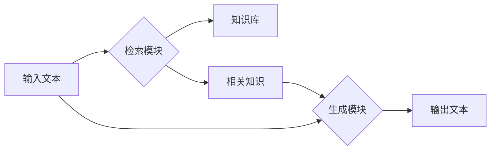

# 大语言模型原理与工程实践：检索增强生成技术

## 1. 背景介绍

### 1.1 大语言模型的发展历程

大语言模型（Large Language Model，LLM）是近年来自然语言处理领域的重大突破之一。从2018年GPT-1的诞生，到如今GPT-3.5、GPT-4等模型的问世，大语言模型在短短几年内取得了令人瞩目的进展。这些模型能够生成流畅自然的文本，完成翻译、摘要、问答等多种任务，展现出接近甚至超越人类的语言理解和生成能力。

### 1.2 大语言模型面临的挑战

尽管大语言模型取得了巨大成功，但它们仍然存在一些局限性和挑战：

1. 知识获取和存储：如何高效地从海量数据中学习和存储知识，是大语言模型面临的重要问题。
2. 推理和逻辑能力：大语言模型在复杂推理和逻辑判断方面还有待加强。
3. 安全和伦理风险：模型生成的内容可能存在错误、偏见甚至危害，需要开发相应的安全防范机制。

### 1.3 检索增强生成技术的提出

为了进一步提升大语言模型的性能，研究者们提出了检索增强生成（Retrieval-Enhanced Generation，REG）技术。该方法通过引入外部知识库，将信息检索与语言生成相结合，增强模型的知识获取和利用能力，同时改善生成内容的准确性和可靠性。本文将深入探讨检索增强生成技术的原理、实践和应用前景。

## 2. 核心概念与联系

### 2.1 语言模型

语言模型是自然语言处理的基础，用于刻画单词序列的概率分布。给定前面的单词，语言模型能够预测下一个最可能出现的单词。常见的语言模型有 n-gram 模型、RNN、Transformer 等。大语言模型通常基于 Transformer 架构，利用海量无标注数据进行预训练，学习语言的统计规律和隐含知识。

### 2.2 信息检索 

信息检索是根据用户的查询需求，从大规模信息集合中找出相关文档的过程。传统的信息检索模型包括布尔模型、向量空间模型、概率模型等。近年来，深度学习技术被广泛应用于信息检索任务，如表示学习、语义匹配等。通过构建文档和查询的连续向量表示，可以更准确地捕捉它们之间的语义相关性。

### 2.3 知识库

知识库是一种结构化的信息存储方式，以事实三元组（主、谓、宾）的形式组织知识。常见的知识库有 Freebase、DBpedia、YAGO 等。知识库能够为语言模型提供丰富的结构化知识，增强其理解和生成能力。但知识库的构建需要大量人工标注，更新速度较慢。因此，如何自动从文本数据中提取和融合知识，是知识库构建的重要研究方向。

### 2.4 检索增强生成 

检索增强生成是语言模型与信息检索技术的结合，其核心思想是在生成过程中引入外部知识。具体而言，给定输入文本，模型首先从知识库中检索出相关的知识片段，然后将这些知识编码为上下文向量，与输入文本一起作为解码器的输入，指导文本生成。这种方式可以帮助语言模型获取特定领域的知识，提高生成内容的信息丰富度和准确性。

下图展示了检索增强生成技术的基本架构：



## 3. 核心算法原理与具体操作步骤

### 3.1 Dense Passage Retrieval (DPR)

DPR 是一种基于双塔式网络的密集检索算法，用于从大规模文档集合中快速检索与查询相关的段落。其主要步骤如下：

1. 对于每个文档段落，使用 BERT 编码器提取其嵌入向量表示 $\mathbf{p}_i$。
2. 对于给定的查询 $q$，使用另一个 BERT 编码器提取其嵌入向量表示 $\mathbf{q}$。 
3. 计算查询向量 $\mathbf{q}$ 与所有段落向量 $\mathbf{p}_i$ 的内积，得到相关性分数。
4. 选取分数最高的 $k$ 个段落作为检索结果。

DPR 的训练过程采用噪声对比估计（NCE）损失：

$$
L(\mathbf{q},\mathbf{p}^+,\mathbf{p}^-_1,\dots,\mathbf{p}^-_n)=-\log\frac{e^{\mathbf{q}^\top\mathbf{p}^+/\tau}}{\sum_{i=1}^ne^{\mathbf{q}^\top\mathbf{p}^-_i/\tau}+e^{\mathbf{q}^\top\mathbf{p}^+/\tau}}
$$

其中 $\mathbf{p}^+$ 为正例段落，$\mathbf{p}^-_i$ 为负例段落，$\tau$ 为温度超参数。该损失函数鼓励查询与正例段落的相似度大于负例段落。

### 3.2 Fusion-in-Decoder (FiD)

FiD 是一种将检索结果融入解码器的生成方法。其主要步骤如下：

1. 使用 DPR 等检索算法，从知识库中检索出与输入相关的 $k$ 个知识片段 $\{p_1,\dots,p_k\}$。
2. 对每个知识片段 $p_i$，使用编码器（如 BERT）提取其上下文向量表示 $\mathbf{h}_i$。
3. 将所有知识片段的上下文向量拼接，得到知识表示矩阵 $\mathbf{H}=[\mathbf{h}_1;\dots;\mathbf{h}_k]$。
4. 在解码器的每个时间步，将当前解码隐状态 $\mathbf{s}_t$ 与知识表示 $\mathbf{H}$ 进行注意力交互，得到知识感知表示 $\mathbf{c}_t$：

$$
\mathbf{c}_t=\text{Attention}(\mathbf{s}_t,\mathbf{H})
$$

5. 将 $\mathbf{c}_t$ 作为解码器的附加输入，指导下一个单词的生成。

FiD 的训练采用标准的极大似然估计，优化目标为：

$$
\mathcal{L}=-\sum_{t=1}^T\log P(y_t|y_{<t},\mathbf{x},\mathbf{H};\theta)
$$

其中 $\mathbf{x}$ 为编码器输入，$\mathbf{y}$ 为解码器输出，$\theta$ 为模型参数。

## 4. 数学模型和公式详细讲解举例说明

### 4.1 检索模型

假设知识库 $\mathcal{C}$ 由 $n$ 个文档段落组成，$\mathcal{C}=\{p_1,\dots,p_n\}$。给定查询 $q$，检索模型的目标是从 $\mathcal{C}$ 中选出与 $q$ 最相关的 $k$ 个段落。

以 DPR 为例，我们用 $f_Q(\cdot)$ 和 $f_P(\cdot)$ 分别表示查询编码器和段落编码器。查询 $q$ 和段落 $p_i$ 的嵌入向量表示为：

$$
\mathbf{q}=f_Q(q),\quad \mathbf{p}_i=f_P(p_i)
$$

它们的相关性分数计算为内积：

$$
\text{score}(q,p_i)=\mathbf{q}^\top\mathbf{p}_i
$$

最终的检索结果为分数最高的 $k$ 个段落：

$$
\mathcal{R}(q)=\text{top-k}_{p_i\in\mathcal{C}}\text{score}(q,p_i)
$$

### 4.2 生成模型

假设生成模型的编码器为 $f_E(\cdot)$，解码器为 $f_D(\cdot)$。给定输入文本 $\mathbf{x}$ 和检索到的知识片段 $\{p_1,\dots,p_k\}$，模型的编码过程为：

$$
\mathbf{h}_i=f_E(p_i),\quad i=1,\dots,k \\
\mathbf{H}=[\mathbf{h}_1;\dots;\mathbf{h}_k]
$$

在解码器的第 $t$ 步，模型根据之前生成的单词 $y_{<t}$ 和知识表示 $\mathbf{H}$ 来预测下一个单词的概率分布：

$$
P(y_t|y_{<t},\mathbf{x},\mathbf{H})=f_D(y_{<t},\mathbf{x},\mathbf{H})
$$

生成的单词序列为概率最大的输出：

$$
\hat{\mathbf{y}}=\arg\max_{\mathbf{y}}P(\mathbf{y}|\mathbf{x},\mathbf{H})
$$

### 4.3 举例说明

以问答任务为例，假设用户的问题是"What is the capital of France?"。

1. 检索模型从知识库中找出与问题相关的段落，如：
   - "Paris is the capital and most populous city of France." 
   - "France is a country located in Western Europe, with several overseas regions and territories."
2. 生成模型将问题和检索到的段落编码为向量表示：

$$
\mathbf{x}=f_E(\text{"What is the capital of France?"}) \\
\mathbf{h}_1=f_E(\text{"Paris is the capital and most populous city of France."}) \\ 
\mathbf{h}_2=f_E(\text{"France is a country located in Western Europe, with several overseas regions and territories."})
$$

3. 解码器根据问题表示 $\mathbf{x}$ 和知识表示 $\mathbf{H}=[\mathbf{h}_1;\mathbf{h}_2]$ 生成答案：

$$
\hat{\mathbf{y}}=\arg\max_{\mathbf{y}}P(\mathbf{y}|\mathbf{x},\mathbf{H})
$$

最终的答案可能是"The capital of France is Paris."，说明模型成功地利用了检索到的知识来生成准确的答案。

## 5. 项目实践：代码实例和详细解释说明

下面是一个使用 Hugging Face 实现 DPR 和 FiD 的简单示例。

```python
import torch
from transformers import DPRQuestionEncoder, DPRContextEncoder, AutoTokenizer, AutoModelForSeq2SeqLM

# 加载预训练的 DPR 编码器和分词器
query_tokenizer = AutoTokenizer.from_pretrained("facebook/dpr-question_encoder-single-nq-base") 
query_encoder = DPRQuestionEncoder.from_pretrained("facebook/dpr-question_encoder-single-nq-base")
passage_tokenizer = AutoTokenizer.from_pretrained("facebook/dpr-ctx_encoder-single-nq-base")
passage_encoder = DPRContextEncoder.from_pretrained("facebook/dpr-ctx_encoder-single-nq-base")

# 加载 FiD 模型和分词器
fid_tokenizer = AutoTokenizer.from_pretrained("facebook/rag-token-nq")
fid_model = AutoModelForSeq2SeqLM.from_pretrained("facebook/rag-token-nq")

def retrieve(query, passages):
    """DPR 检索函数"""
    # 对查询进行编码
    query_inputs = query_tokenizer(query, return_tensors="pt")
    query_embedding = query_encoder(**query_inputs).pooler_output
    
    # 对段落进行编码
    passage_inputs = passage_tokenizer(passages, return_tensors="pt", padding=True, truncation=True)
    passage_embeddings = passage_encoder(**passage_inputs).pooler_output
    
    # 计算内积得到相关性分数
    scores = torch.matmul(query_embedding, passage_embeddings.transpose(0, 1)).squeeze(0)
    
    # 返回分数最高的 k 个段落
    top_k = torch.topk(scores, k=3).indices.tolist()
    return [passages[i] for i in top_k]

def generate(query, passages):
    """FiD 生成函数"""
    # 对查询和段落进行编码
    inputs = fid_tokenizer(query, passages, return_tensors="pt", padding=True, truncation=True)
    
    # 生成答案
    outputs = fid_model.generate(**inputs)
    answer = fid_tokenizer.decode(outputs[0], skip_special_tokens=True)
    
    return answer

# 测试
query = "What is the capital of France?"
passages = [
    "Paris is the capital and most populous city of France.",
    "