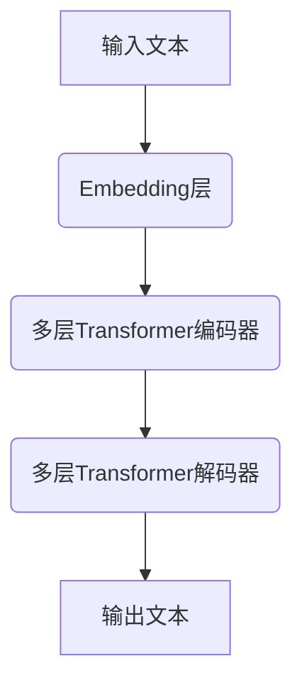

# 大语言模型原理与工程实践：网页数据

## 1.背景介绍

### 1.1 大语言模型的兴起

近年来,大型语言模型(Large Language Models, LLMs)在自然语言处理(NLP)领域取得了令人瞩目的成就。这些模型通过在海量文本数据上进行预训练,学习到了丰富的语言知识和上下文表示能力,可以生成流畅、连贯的文本,并在各种下游NLP任务中表现出色。

代表性的大语言模型包括GPT-3(OpenAI)、PanGu-Alpha(百度)、Wu Dao 2.0(清华)、BLOOM(Hugging Face)等。它们拥有数十亿甚至上百亿参数,在训练过程中吸收了大量互联网文本,涵盖了广泛的知识领域。

### 1.2 网页数据的重要性

在大语言模型的训练数据中,网页数据占据了重要地位。互联网上的网页包含了丰富的人类知识,涉及各个领域,且文本风格多样。与书籍、论文等结构化数据相比,网页数据更接近人类日常使用的自然语言,有助于模型学习到更加自然、多样的语言表达方式。

但与此同时,网页数据也存在质量参差不齐、噪声较多的问题。如何高效地从海量网页数据中提取高质量文本,并有效地利用这些数据训练大语言模型,是一个值得关注的重要课题。

## 2.核心概念与联系

### 2.1 大语言模型的架构

大语言模型通常采用基于Transformer的编码器-解码器架构,如下图所示:



其中:

- Embedding层将输入文本转换为向量表示
- 多层Transformer编码器捕获输入序列的上下文信息
- 多层Transformer解码器根据编码器输出生成目标序列

在预训练阶段,模型在大规模文本数据上学习掌握语言知识和生成能力。在微调阶段,则可将预训练模型应用于特定的下游任务,如文本生成、问答、摘要等。

### 2.2 网页数据处理流程

利用网页数据训练大语言模型,需要经过以下几个关键步骤:

1. **网页爬取**: 使用网络爬虫程序从互联网上大规模抓取网页数据。
2. **数据清洗**: 去除HTML标签、脚本、广告等无用信息,提取出网页正文文本。
3. **数据去重**: 剔除重复的文本数据,降低数据冗余。
4. **数据过滤**: 基于规则或机器学习模型,过滤掉低质量、垃圾内容。
5. **语料构建**: 将清洗、去重后的高质量文本组织成语料库,作为模型训练的数据源。


在这个过程中,数据质量控制是关键,直接影响了最终模型的性能表现。

## 3.核心算法原理具体操作步骤

### 3.1 网页正文内容提取

从网页原始HTML数据中提取出正文内容,是数据清洗的核心环节。常用的算法包括基于规则的方法和基于机器学习的方法。

#### 3.1.1 基于规则的方法

利用HTML标签、CSS样式等特征,通过一系列规则来识别和提取网页正文内容。常见的规则包括:

1. 根据标签层级结构,识别body、article等可能包含正文的节点
2. 根据文本长度、是否包含链接等特征,过滤掉导航、广告等无用内容
3. 根据文本密度、样式等特征,识别正文所在区域

这种方法实现简单,但需要针对不同网站的HTML结构手动设计规则,通用性较差。

#### 3.1.2 基于机器学习的方法

将网页正文提取问题建模为序列标注任务,训练机器学习模型自动完成标注。

1. 构建包含HTML标签、文本等特征的数据集,人工标注每个节点是否属于正文
2. 使用序列标注模型(如CRF、LSTM等)在数据集上训练
3. 将训练好的模型应用于新的网页数据,预测每个节点的标签
4. 根据模型输出,提取被标注为正文的节点的文本

这种方法通用性更强,但需要大量的人工标注数据,且不同领域、语言的网页存在差异,模型往往需要重新训练以适应新的数据分布。

### 3.2 网页质量评估

对于爬取的大规模网页数据,需要有效地评估其质量,过滤掉垃圾、低质量内容。常用的质量评估方法包括:

#### 3.2.1 基于规则的过滤

通过设置一系列规则,过滤掉不符合条件的网页文本。常见规则包括:

- 长度过滤:过短或过长的文本可能是垃圾内容
- 链接密度过滤:链接密度过高的网页可能是垃圾页面
- 非法字符过滤:包含大量非法字符的文本质量较差
- 敏感词过滤:包含不当内容(如色情、暴力等)的文本

这些规则相对简单,但过于僵硬,无法很好地覆盖所有情况。

#### 3.2.2 基于机器学习的评估

将网页质量评估建模为二分类或多分类问题,使用机器学习模型进行自动评估。

1. 构建包含各种特征(如文本长度、链接密度、词汇丰富度等)的数据集,人工标注每个网页的质量分数
2. 使用分类模型(如Logistic回归、SVM、神经网络等)在数据集上训练
3. 将训练好的模型应用于新的网页数据,预测其质量分数
4. 根据质量分数,保留高质量网页,过滤低质量网页

这种方法更加灵活和通用,但需要大量的人工标注数据,且不同领域、语言的数据分布差异较大,模型可能需要重新训练以适应新的数据。

### 3.3 语料构建

经过前期的清洗、去重和过滤,我们可以获得大量高质量的网页文本数据。接下来需要将这些数据组织成结构化的语料库,为大语言模型的训练做好准备。

常见的语料库格式包括:

- **纯文本格式**:每行存储一个文档,文档之间使用空行分隔
- **JSON格式**:每个文档用JSON对象表示,包含元数据(如文档ID、URL等)和正文文本
- **TFRecord格式**:Google开源的二进制数据格式,支持序列化存储各种数据类型,常用于大规模数据处理

构建语料库时,还需要注意以下几个方面:

- **数据分片**:将语料库分割成多个数据分片,方便分布式处理
- **数据采样**:对语料进行采样,保证训练数据的多样性
- **数据增强**:通过插入、删除、置换等方式,生成新的训练样本
- **元数据保留**:保留文档的元数据(如URL、时间戳等),有助于后续的分析和应用

通过上述步骤,我们可以获得高质量、结构化的语料库,为大语言模型的训练打下坚实基础。

## 4.数学模型和公式详细讲解举例说明

### 4.1 Transformer模型

Transformer是大语言模型的核心模块,其中Self-Attention机制是关键。我们先介绍Self-Attention的计算过程。

对于一个长度为$n$的序列$\boldsymbol{x} = (x_1, x_2, \dots, x_n)$,我们计算其Query($\boldsymbol{Q}$)、Key($\boldsymbol{K}$)和Value($\boldsymbol{V}$)矩阵:

$$\begin{aligned}
\boldsymbol{Q} &= \boldsymbol{x}\boldsymbol{W}^Q\\
\boldsymbol{K} &= \boldsymbol{x}\boldsymbol{W}^K\\
\boldsymbol{V} &= \boldsymbol{x}\boldsymbol{W}^V
\end{aligned}$$

其中$\boldsymbol{W}^Q$、$\boldsymbol{W}^K$、$\boldsymbol{W}^V$为可训练的权重矩阵。

接下来计算注意力分数矩阵:

$$\text{Attention}(\boldsymbol{Q}, \boldsymbol{K}, \boldsymbol{V}) = \text{softmax}\left(\frac{\boldsymbol{Q}\boldsymbol{K}^\top}{\sqrt{d_k}}\right)\boldsymbol{V}$$

其中$d_k$为缩放因子,用于防止内积过大导致梯度消失。

Self-Attention的输出就是注意力分数矩阵与Value矩阵的加权和。每个位置的输出向量是其他所有位置的值的加权和,权重由注意力分数决定。这种计算方式能够有效捕获序列中任意两个位置之间的依赖关系。

在Transformer中,Self-Attention被应用于编码器和解码器的每一层。通过多头注意力(Multi-Head Attention)机制,模型可以关注不同的位置和语义子空间,进一步提高表达能力。

### 4.2 BERT模型

BERT(Bidirectional Encoder Representations from Transformers)是一种基于Transformer的双向编码器模型,在预训练阶段引入了两个重要的任务:

1. **Masked Language Modeling (MLM)**:随机将输入序列中的部分词替换为特殊的[MASK]标记,模型需要根据上下文预测被掩码的词。
2. **Next Sentence Prediction (NSP)**:判断两个句子是否为连续句子。

MLM任务使BERT能够双向建模上下文,捕获左右上下文的信息。NSP任务则帮助BERT学习更长的上下文依赖关系。

在预训练过程中,BERT的损失函数为MLM损失和NSP损失之和:

$$\mathcal{L} = \mathcal{L}_\text{MLM} + \mathcal{L}_\text{NSP}$$

其中:

- $\mathcal{L}_\text{MLM}$为MLM任务的交叉熵损失
- $\mathcal{L}_\text{NSP}$为NSP任务的交叉熵损失

通过在大规模语料上预训练,BERT学习到了丰富的语言知识和上下文表示能力。在下游任务中,我们只需要在BERT的基础上添加一个输出层,并进行少量的微调,就可以获得良好的性能表现。

## 5.项目实践:代码实例和详细解释说明

在本节中,我们将通过一个实际项目,演示如何利用网页数据训练一个大语言模型。我们将使用开源的自然语言处理工具包Hugging Face Transformers,基于其提供的BERT模型进行微调。

### 5.1 环境配置

首先,我们需要安装必要的Python库:

```bash
pip install transformers datasets
```

### 5.2 加载数据集

我们使用Hugging Face提供的开源数据集`web_pages_filtered`,该数据集包含了从互联网上爬取并经过清洗和过滤的高质量网页文本。

```python
from datasets import load_dataset

dataset = load_dataset("web_pages_filtered")
```

### 5.3 数据预处理

我们对网页文本进行分词和编码,以适应BERT模型的输入格式。

```python
from transformers import AutoTokenizer

tokenizer = AutoTokenizer.from_pretrained("bert-base-uncased")

def preprocess_function(examples):
    return tokenizer(examples["text"], truncation=True)

tokenized_datasets = dataset.map(preprocess_function, batched=True)
```

### 5.4 微调BERT模型

我们加载预训练的BERT模型,并在网页数据集上进行微调,以适应网页文本的数据分布。

```python
from transformers import AutoModelForMaskedLM, TrainingArguments, Trainer

model = AutoModelForMaskedLM.from_pretrained("bert-base-uncased")

training_args = TrainingArguments(
    output_dir="./results",
    evaluation_strategy="epoch",
    learning_rate=2e-5,
    per_device_train_batch_size=16,
    per_device_eval_batch_size=16,
    num_train_epochs=3,
    weight_decay=0.01,
)

trainer = Trainer(
    model=model,
    args=training_args,
    train_dataset=tokenize