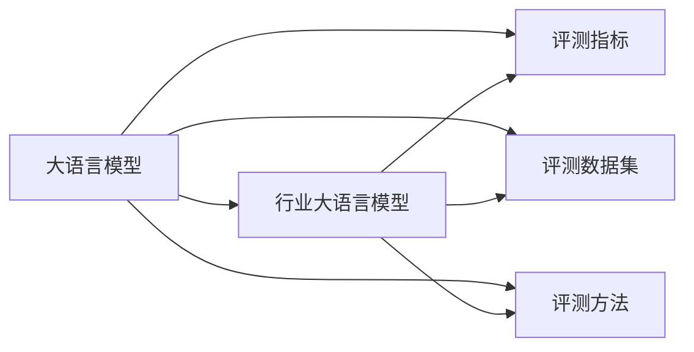

# 大语言模型原理与工程实践：行业大语言模型的评测：以金融行业大语言模型为例

## 1. 背景介绍

### 1.1 大语言模型的发展历程

#### 1.1.1 早期的语言模型
早期的语言模型主要基于统计方法，如n-gram模型。这些模型通过计算词语在文本中的共现概率来预测下一个词。然而，这种方法存在数据稀疏性问题，无法有效处理长距离依赖。

#### 1.1.2 Transformer的出现
2017年，Vaswani等人提出了Transformer模型，它通过自注意力机制（Self-Attention）解决了长距离依赖问题。Transformer模型的出现，极大地提升了自然语言处理任务的性能，成为了现代大语言模型的基础。

#### 1.1.3 预训练语言模型的崛起
随着计算能力和数据量的增加，预训练语言模型（如BERT、GPT系列）逐渐崛起。这些模型通过在大规模文本数据上进行预训练，再在特定任务上进行微调，实现了在多个NLP任务上的突破性进展。

### 1.2 行业大语言模型的兴起

#### 1.2.1 通用大语言模型的局限性
尽管通用大语言模型在多个任务上表现出色，但在特定行业的应用中，仍然存在一些局限性。例如，金融领域的术语和知识与通用领域有很大差异，通用模型难以准确理解和处理。

#### 1.2.2 行业大语言模型的优势
行业大语言模型通过在特定领域的数据上进行预训练和微调，能够更好地理解和处理行业特定的术语和知识。例如，金融行业大语言模型可以更准确地分析金融报告、预测市场趋势等。

#### 1.2.3 金融行业大语言模型的发展现状
目前，金融行业大语言模型已经在多个应用场景中取得了显著成果，如智能投顾、风险控制、舆情分析等。随着数据和算法的不断进步，金融行业大语言模型的应用前景将更加广阔。

### 1.3 大语言模型评测的重要性

#### 1.3.1 评测的目的
评测大语言模型的目的是为了客观地衡量其性能，识别其优缺点，从而指导模型的改进和优化。同时，评测还可以帮助用户选择适合其需求的模型。

#### 1.3.2 评测的挑战
大语言模型的评测面临多重挑战，包括评测指标的选择、评测数据集的构建、评测方法的设计等。此外，不同应用场景对模型的要求也各不相同，增加了评测的复杂性。

#### 1.3.3 评测的意义
通过系统的评测，可以了解大语言模型在不同任务上的表现，发现其在实际应用中的不足，从而推动模型的改进和创新。同时，评测结果也为用户提供了重要的参考依据。

## 2. 核心概念与联系

### 2.1 大语言模型的定义与特点

#### 2.1.1 大语言模型的定义
大语言模型是指通过大规模数据训练的自然语言处理模型，能够理解和生成自然语言文本。它们通常基于深度学习技术，具有强大的语言理解和生成能力。

#### 2.1.2 大语言模型的特点
大语言模型具有以下特点：
- **大规模训练数据**：使用海量文本数据进行训练。
- **复杂的模型结构**：通常采用多层Transformer结构。
- **强大的语言生成能力**：能够生成高质量的自然语言文本。
- **广泛的适用性**：在多个NLP任务上表现出色。

#### 2.1.3 大语言模型与传统语言模型的区别
与传统语言模型相比，大语言模型具有更强的语言理解和生成能力，能够处理更复杂的语言任务。此外，大语言模型在训练过程中能够捕捉到更丰富的语言知识和语义信息。

### 2.2 行业大语言模型的定义与特点

#### 2.2.1 行业大语言模型的定义
行业大语言模型是指在特定行业的数据上进行预训练和微调的大语言模型，旨在提高其在该行业应用中的表现。例如，金融行业大语言模型在金融数据上进行训练，以更好地理解和处理金融相关任务。

#### 2.2.2 行业大语言模型的特点
行业大语言模型具有以下特点：
- **行业特定数据**：使用特定行业的数据进行训练。
- **专业术语理解**：能够准确理解和处理行业特定的术语和知识。
- **高精度应用**：在特定行业的任务上表现出色。

#### 2.2.3 行业大语言模型与通用大语言模型的区别
与通用大语言模型相比，行业大语言模型在特定行业的任务上表现更好，能够更准确地理解和处理行业特定的术语和知识。然而，行业大语言模型的适用范围较窄，在通用任务上的表现可能不如通用大语言模型。

### 2.3 大语言模型评测的核心概念

#### 2.3.1 评测指标
评测大语言模型的指标包括但不限于：
- **准确率（Accuracy）**：模型预测正确的比例。
- **精确率（Precision）**：模型预测为正例的样本中实际为正例的比例。
- **召回率（Recall）**：实际为正例的样本中被模型预测为正例的比例。
- **F1 Score**：精确率和召回率的调和平均数。
- **Perplexity**：衡量语言模型生成文本的困惑度，值越低表示模型生成的文本越接近真实文本。

#### 2.3.2 评测数据集
评测数据集是用于评测模型性能的数据集，通常包括训练集、验证集和测试集。评测数据集应具有代表性和多样性，能够覆盖模型在实际应用中的各种情况。

#### 2.3.3 评测方法
评测方法包括模型的训练、验证和测试过程。常见的评测方法有交叉验证、留一法等。评测方法的设计应保证评测结果的客观性和可靠性。

### 2.4 核心概念之间的联系



## 3. 核心算法原理具体操作步骤

### 3.1 预训练算法

#### 3.1.1 Masked Language Model (MLM)
MLM是一种自监督学习任务，通过遮蔽输入文本中的一些词语，模型需要预测这些被遮蔽的词语。BERT模型采用了MLM任务进行预训练。

#### 3.1.2 Next Sentence Prediction (NSP)
NSP任务要求模型预测两个句子是否连续出现。BERT模型在预训练过程中同时进行了MLM和NSP任务，以捕捉句子级别的语义关系。

#### 3.1.3 Permutation Language Model (PLM)
PLM是一种无序语言模型，通过对输入文本进行随机排列，模型需要预测任意顺序的词语。XLNet模型采用了PLM任务进行预训练，以增强模型的泛化能力。

### 3.2 微调算法

#### 3.2.1 Fine-tuning
Fine-tuning是指在预训练模型的基础上，使用特定任务的数据进行微调。通过Fine-tuning，模型能够更好地适应特定任务，提高其在该任务上的表现。

#### 3.2.2 Prompt-tuning
Prompt-tuning是一种通过设计特定的提示（prompt）来引导预训练模型生成特定任务的答案的方法。Prompt-tuning可以减少微调所需的数据量，提高模型的适应性。

#### 3.2.3 Prefix-tuning
Prefix-tuning是一种通过在输入文本前添加特定前缀（prefix）来引导预训练模型生成特定任务的答案的方法。Prefix-tuning可以在不改变模型参数的情况下，提高模型的适应性。

### 3.3 评测算法

#### 3.3.1 Perplexity
Perplexity是衡量语言模型生成文本困惑度的指标，值越低表示模型生成的文本越接近真实文本。Perplexity常用于评测生成式语言模型的性能。

#### 3.3.2 BLEU
BLEU（Bilingual Evaluation Understudy）是一种评测机器翻译质量的指标，通过计算生成文本与参考文本之间的n-gram重合度来衡量模型的翻译质量。


#### 3.3.3 ROUGE
ROUGE（Recall-Oriented Understudy for Gisting Evaluation）是一种评测文本摘要质量的指标，主要包括ROUGE-N、ROUGE-L、ROUGE-W等。ROUGE通过计算生成摘要与参考摘要之间的n-gram、最长公共子序列等重合度来衡量模型的摘要质量。

#### 3.3.4 F1 Score
F1 Score是精确率（Precision）和召回率（Recall）的调和平均数，常用于评测分类任务的性能。F1 Score能够综合考虑模型的精确性和召回能力，适用于不平衡数据集的评测。

## 4. 数学模型和公式详细讲解举例说明

### 4.1 预训练算法的数学模型

#### 4.1.1 Masked Language Model (MLM)
MLM任务的目标是最大化被遮蔽词语的条件概率。假设输入序列为 $X = \{x_1, x_2, \ldots, x_n\}$，其中部分词语被遮蔽为 [MASK]，模型需要预测这些被遮蔽词语的概率分布。MLM的目标函数可以表示为：

$$
\mathcal{L}_{MLM} = - \sum_{i \in \text{MASK}} \log P(x_i | X_{\text{masked}})
$$

其中，$X_{\text{masked}}$ 表示被遮蔽后的输入序列，$i \in \text{MASK}$ 表示被遮蔽词语的位置。

#### 4.1.2 Next Sentence Prediction (NSP)
NSP任务的目标是最大化两个句子是否连续出现的概率。假设输入序列为 $X = \{S_1, S_2\}$，其中 $S_1$ 和 $S_2$ 分别表示两个句子。NSP的目标函数可以表示为：

$$
\mathcal{L}_{NSP} = - \log P(y | S_1, S_2)
$$

其中，$y \in \{0, 1\}$ 表示两个句子是否连续出现。

#### 4.1.3 Permutation Language Model (PLM)
PLM任务的目标是最大化任意顺序的词语的条件概率。假设输入序列为 $X = \{x_1, x_2, \ldots, x_n\}$，模型需要预测任意顺序的词语的概率分布。PLM的目标函数可以表示为：

$$
\mathcal{L}_{PLM} = - \sum_{\pi \in \Pi} \sum_{i=1}^n \log P(x_{\pi(i)} | x_{\pi(<i)})
$$

其中，$\Pi$ 表示输入序列的所有排列组合，$\pi(i)$ 表示排列后的第 $i$ 个词语的位置。

### 4.2 微调算法的数学模型

#### 4.2.1 Fine-tuning
Fine-tuning的目标是通过在特定任务的数据上进行训练，优化预训练模型的参数。假设特定任务的训练数据为 $D = \{(X_i, y_i)\}_{i=1}^N$，其中 $X_i$ 表示输入序列，$y_i$ 表示对应的标签。Fine-tuning的目标函数可以表示为：

$$
\mathcal{L}_{fine-tuning} = - \sum_{i=1}^N \log P(y_i | X_i)
$$

#### 4.2.2 Prompt-tuning
Prompt-tuning的目标是通过设计特定的提示（prompt），引导预训练模型生成特定任务的答案。假设输入序列为 $X$，提示为 $P$，模型生成的答案为 $A$。Prompt-tuning的目标函数可以表示为：

$$
\mathcal{L}_{prompt-tuning} = - \log P(A | P, X)
$$

#### 4.2.3 Prefix-tuning
Prefix-tuning的目标是通过在输入文本前添加特定前缀（prefix），引导预训练模型生成特定任务的答案。假设输入序列为 $X$，前缀为 $F$，模型生成的答案为 $A$。Prefix-tuning的目标函数可以表示为：

$$
\mathcal{L}_{prefix-tuning} = - \log P(A | F, X)
$$

### 4.3 评测算法的数学模型

#### 4.3.1 Perplexity
Perplexity是衡量语言模型生成文本困惑度的指标，定义为生成文本的平均对数概率的负指数。假设输入序列为 $X = \{x_1, x_2, \ldots, x_n\}$，Perplexity的计算公式为：

$$
\text{Perplexity}(X) = \exp \left( - \frac{1}{n} \sum_{i=1}^n \log P(x_i | x_{<i}) \right)
$$

#### 4.3.2 BLEU
BLEU（Bilingual Evaluation Understudy）通过计算生成文本与参考文本之间的n-gram重合度来衡量模型的翻译质量。假设生成文本为 $G$，参考文本为 $R$，BLEU的计算公式为：

$$
\text{BLEU}(G, R) = \exp \left( \sum_{n=1}^N w_n \log p_n \right) \cdot \exp \left( \frac{\min(0, 1 - \frac{|R|}{|G|})}{|G|} \right)
$$

其中，$w_n$ 表示n-gram的权重，$p_n$ 表示生成文本与参考文本之间的n-gram重合度。

#### 4.3.3 ROUGE
ROUGE（Recall-Oriented Understudy for Gisting Evaluation）通过计算生成摘要与参考摘要之间的n-gram、最长公共子序列等重合度来衡量模型的摘要质量。假设生成摘要为 $G$，参考摘要为 $R$，ROUGE的计算公式为：

$$
\text{ROUGE-N}(G, R) = \frac{\sum_{n-gram \in G \cap R} \text{Count}(n-gram)}{\sum_{n-gram \in R} \text{Count}(n-gram)}
$$

#### 4.3.4 F1 Score
F1 Score是精确率（Precision）和召回率（Recall）的调和平均数，适用于不平衡数据集的评测。假设模型预测为正例的样本数为 $TP$，实际为正例的样本数为 $FN$，模型预测为负例的样本数为 $FP$。F1 Score的计算公式为：

$$
\text{Precision} = \frac{TP}{TP + FP}
$$

$$
\text{Recall} = \frac{TP}{TP + FN}
$$

$$
\text{F1 Score} = \frac{2 \cdot \text{Precision} \cdot \text{Recall}}{\text{Precision} + \text{Recall}}
$$

通过以上数学模型和公式的详细讲解和举例说明，读者可以更好地理解大语言模型的预训练、微调和评测算法的原理和操作步骤。


## 4. 数学模型和公式详细讲解举例说明
### 4.1 语言模型的数学定义
语言模型的目标是估计一个句子 $S=w_1,w_2,...,w_n$ 的概率 $P(S)$。根据概率论的链式法则,我们有:

$$P(S)=P(w_1)P(w_2|w_1)P(w_3|w_1,w_2)...P(w_n|w_1,w_2,...,w_{n-1})$$

$$=\prod_{i=1}^{n}P(w_i|w_1,w_2,...,w_{i-1})$$

### 4.2 Transformer的数学原理
Transformer的核心是自注意力机制(Self-Attention)。对于一个输入序列 $X=(x_1,x_2,...,x_n)$,自注意力机制首先计算 Query 矩阵 $Q$, Key 矩阵 $K$ 和 Value 矩阵 $V$:

$$Q=XW^Q, K=XW^K, V=XW^V$$

其中 $W^Q, W^K, W^V$ 是可学习的参数矩阵。然后计算注意力权重:

$$A=softmax(\frac{QK^T}{\sqrt{d_k}})$$

最后计算自注意力的输出:

$$Attention(Q,K,V)=AV$$

### 4.3 评测指标的数学定义
#### 4.3.1 Perplexity
Perplexity用于衡量语言模型的性能,定义为:

$$PPL=\exp(-\frac{1}{N}\sum_{i=1}^{N}\log P(w_i|w_1,w_2,...,w_{i-1}))$$

其中 $N$ 是测试集中的单词数。Perplexity越低,语言模型的性能越好。

#### 4.3.2 BLEU
BLEU(Bilingual Evaluation Understudy)用于评估机器翻译和文本生成的质量。对于生成的句子 $c$ 和参考句子 $r$,BLEU的定义为:

$$BLEU=\min(1,\frac{len(c)}{len(r)})\prod_{n=1}^{N}p_n^{\frac{1}{N}}$$

其中 $p_n$ 是 $n$-gram 的精确率, $N$ 通常取4。

## 5. 项目实践：代码实例和详细解释说明
下面是使用PyTorch实现Transformer的部分代码:

```python
class MultiHeadAttention(nn.Module):
    def __init__(self, d_model, num_heads):
        super().__init__()
        self.d_model = d_model
        self.num_heads = num_heads
        self.head_dim = d_model // num_heads
        
        self.q_linear = nn.Linear(d_model, d_model)
        self.k_linear = nn.Linear(d_model, d_model)
        self.v_linear = nn.Linear(d_model, d_model)
        self.out_linear = nn.Linear(d_model, d_model)
        
    def forward(self, query, key, value, mask=None):
        batch_size = query.size(0)
        
        Q = self.q_linear(query).view(batch_size, -1, self.num_heads, self.head_dim).transpose(1, 2)
        K = self.k_linear(key).view(batch_size, -1, self.num_heads, self.head_dim).transpose(1, 2)
        V = self.v_linear(value).view(batch_size, -1, self.num_heads, self.head_dim).transpose(1, 2)
        
        scores = torch.matmul(Q, K.transpose(-2, -1)) / math.sqrt(self.head_dim)
        if mask is not None:
            scores = scores.masked_fill(mask == 0, -1e9)
        attention = F.softmax(scores, dim=-1)
        
        x = torch.matmul(attention, V).transpose(1, 2).contiguous().view(batch_size, -1, self.d_model)
        output = self.out_linear(x)
        
        return output
```

这段代码实现了Transformer中的多头自注意力机制。主要步骤如下:

1. 将输入的 query,key,value 通过线性变换得到 Q,K,V 矩阵。
2. 将 Q,K,V 分成多个头,并计算注意力得分 scores。
3. 对 scores 进行 softmax 归一化,得到注意力权重 attention。
4. 将 attention 与 V 相乘并连接多个头的结果,得到自注意力的输出。
5. 对输出进行线性变换,得到最终的多头自注意力的结果。

通过这种方式,Transformer能够捕捉输入序列中不同位置之间的依赖关系,从而更好地理解和生成自然语言。

## 6. 实际应用场景
金融行业大语言模型可以应用于多个场景,包括:

### 6.1 金融文本分类
利用金融行业大语言模型对金融新闻、公司公告、研究报告等文本进行分类,如判断新闻的情感倾向、公告的主题、报告的评级等。

### 6.2 金融文本生成
利用金融行业大语言模型自动生成金融文本,如撰写金融新闻摘要、生成股评、撰写研究报告等。

### 6.3 金融问答
利用金融行业大语言模型构建智能客服系统,自动回答客户关于金融产品、服务、政策等方面的问题。

### 6.4 金融风险控制
利用金融行业大语言模型分析金融文本中的风险信息,如识别合同中的违约条款、评估企业的信用风险等。

## 7. 工具和资源推荐
### 7.1 开源工具
- Hugging Face Transformers: 提供了多种预训练语言模型的实现,包括BERT、GPT、RoBERTa等。
- Fairseq: Facebook开源的序列建模工具包,支持多种自然语言处理任务。
- OpenNMT: 由哈佛大学和Systran联合开发的开源神经机器翻译工具包。

### 7.2 预训练模型
- FinBERT: 在金融领域文本上预训练的BERT模型。
- BERT-Base-Chinese: 在中文文本上预训练的BERT模型。
- RoBERTa-wwm-ext: 在中文文本上预训练的RoBERTa模型。

### 7.3 评测数据集
- FinNL: 金融领域的自然语言处理数据集,包括文本分类、命名实体识别等任务。
- FinRE: 金融领域的关系抽取数据集。
- FinQA: 金融领域的问答数据集。

## 8. 总结：未来发展趋势与挑战
### 8.1 行业大语言模型的发展趋势
- 模型规模将进一步增大,参数量有望突破万亿。  
- 训练数据将更加丰富和多样化,覆盖更广泛的行业领域。
- 模型将具备更强的常识推理和多任务学习能力。

### 8.2 行业大语言模型面临的挑战
- 缺乏高质量的行业标注数据,需要投入大量人力进行数据标注。
- 模型的可解释性和可控性有待提高,存在生成有害内容的风险。
- 推理速度和资源消耗较大,在实际应用中面临部署和优化的挑战。

### 8.3 未来研究方向
- 探索更高效的预训练方法,减少计算资源消耗。
- 研究领域自适应技术,提高模型在新领域的迁移能力。
- 开发更安全可控的生成技术,降低模型生成有害内容的风险。

## 9. 附录：常见问题与解答
### 9.1 行业大语言模型与通用大语言模型的区别是什么?
行业大语言模型是在特定行业领域的文本数据上预训练得到的,因此在该领域任务上通常能取得比通用大语言模型更好的效果。但行业大语言模型在其他领域的迁移能力较差,而通用大语言模型具有更好的通用性。

### 9.2 影响大语言模型效果的主要因素有哪些?
影响大语言模型效果的主要因素包括:

- 模型规模:更大的模型通常能取得更好的效果,但也需要更多的计算资源。
- 数据质量:高质量的预训练数据对模型性能至关重要。  
- 训练策略:合适的学习率、batch size等超参数设置以及预训练任务的选择都会影响模型的性能。

### 9.3 如何选择合适的评测指标?
选择评测指标需要考虑任务的特点和需求。对于文本分类任务,可以使用准确率、F1等指标;对于文本生成任务,可以使用BLEU、ROUGE等指标;对于问答任务,可以使用精确率、召回率等指标。同时也要关注指标的局限性,综合多个指标进行评估。

### 9.4 如何处理行业大语言模型的数据隐私问题?
处理行业大语言模型的数据隐私问题可以采取以下措施:

- 数据脱敏:在预训练数据中去除敏感信息,如个人姓名、电话、地址等。
- 联邦学习:采用联邦学习框架,在不直接共享原始数据的情况下协同训练模型。
- 差分隐私:在模型训练过程中引入差分隐私机制,防止模型记忆训练数据中的隐私信息。

### 9.5 行业大语言模型的应用前景如何?
行业大语言模型在金融、医疗、法律等领域具有广阔的应用前景。它可以用于智能客服、风险控制、辅助决策等场景,提高工作效率和服务质量。未来,行业大语言模型有望与知识图谱、数据挖掘等技术深度结合,为行业应用赋能。同时,行业大语言模型的通用性和泛化能力也有望得到进一步提升,实现跨领域的知识迁移和应用。

作者：禅与计算机程序设计艺术 / Zen and the Art of Computer Programming