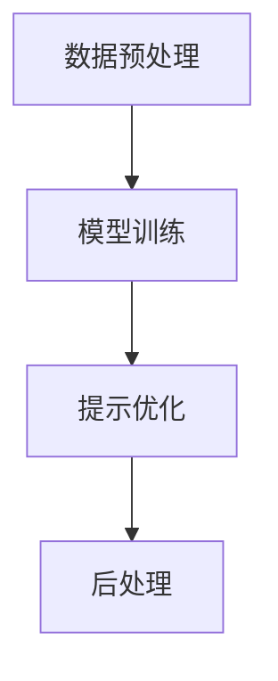

# 大语言模型原理基础与前沿 基于提示的脱毒

## 1.背景介绍

大语言模型（Large Language Model, LLM）是近年来人工智能领域的一个重要突破。它们通过大量的文本数据进行训练，能够生成高质量的自然语言文本，完成翻译、问答、文本生成等多种任务。然而，随着大语言模型的广泛应用，模型生成的文本中可能包含有害内容，如偏见、歧视、虚假信息等，这对社会和用户带来了潜在的风险。因此，如何有效地对大语言模型进行脱毒处理，成为了一个重要的研究方向。

## 2.核心概念与联系

### 2.1 大语言模型

大语言模型是基于深度学习技术，特别是基于Transformer架构的模型。它们通过大量的文本数据进行训练，能够理解和生成自然语言文本。常见的大语言模型包括GPT-3、BERT、T5等。

### 2.2 脱毒

脱毒（Detoxification）是指通过技术手段，减少或消除大语言模型生成的文本中的有害内容。脱毒技术的目标是确保模型生成的文本符合伦理和社会规范，避免传播有害信息。

### 2.3 提示工程

提示工程（Prompt Engineering）是指通过设计和优化输入提示，来引导大语言模型生成符合预期的输出。提示工程在脱毒过程中起到了关键作用，通过设计合适的提示，可以有效地减少模型生成的有害内容。

## 3.核心算法原理具体操作步骤

### 3.1 数据预处理

数据预处理是脱毒的第一步，通过清洗和过滤训练数据，减少有害内容的出现。常见的数据预处理方法包括去除敏感词汇、过滤有害文本等。

### 3.2 模型训练

在数据预处理的基础上，进行模型训练。训练过程中，可以引入对抗训练（Adversarial Training）和多任务学习（Multi-task Learning）等技术，增强模型的鲁棒性和泛化能力。

### 3.3 提示优化

提示优化是脱毒的关键步骤，通过设计和优化输入提示，引导模型生成符合预期的输出。提示优化的方法包括提示模板设计、提示词汇选择、提示长度控制等。

### 3.4 后处理

后处理是脱毒的最后一步，通过对模型生成的文本进行过滤和修正，进一步减少有害内容。常见的后处理方法包括敏感词过滤、文本修正等。



## 4.数学模型和公式详细讲解举例说明

### 4.1 语言模型的数学基础

语言模型的核心是概率论和统计学。给定一个词序列 $w_1, w_2, ..., w_n$，语言模型的目标是计算该序列的概率 $P(w_1, w_2, ..., w_n)$。根据链式法则，这个概率可以分解为：

$$
P(w_1, w_2, ..., w_n) = P(w_1) \cdot P(w_2|w_1) \cdot P(w_3|w_1, w_2) \cdot ... \cdot P(w_n|w_1, w_2, ..., w_{n-1})
$$

### 4.2 Transformer模型

Transformer模型是大语言模型的基础。Transformer通过自注意力机制（Self-Attention Mechanism）来捕捉词与词之间的关系。自注意力机制的计算公式为：

$$
Attention(Q, K, V) = softmax\left(\frac{QK^T}{\sqrt{d_k}}\right)V
$$

其中，$Q$、$K$、$V$分别表示查询（Query）、键（Key）和值（Value）矩阵，$d_k$表示键的维度。

### 4.3 对抗训练

对抗训练是一种增强模型鲁棒性的方法。通过在训练过程中加入对抗样本，模型可以更好地应对有害内容。对抗训练的目标函数为：

$$
L_{adv} = \max_{\delta \in \Delta} L(\theta, x + \delta, y)
$$

其中，$L$表示损失函数，$\theta$表示模型参数，$x$表示输入样本，$\delta$表示对抗扰动，$y$表示标签。

## 5.项目实践：代码实例和详细解释说明

### 5.1 数据预处理代码示例

```python
import re

def clean_text(text):
    # 去除敏感词汇
    sensitive_words = ["badword1", "badword2"]
    for word in sensitive_words:
        text = re.sub(word, "", text)
    return text

# 示例文本
text = "This is a badword1 example."
cleaned_text = clean_text(text)
print(cleaned_text)
```

### 5.2 模型训练代码示例

```python
from transformers import GPT2LMHeadModel, GPT2Tokenizer, Trainer, TrainingArguments

# 加载模型和分词器
model = GPT2LMHeadModel.from_pretrained("gpt2")
tokenizer = GPT2Tokenizer.from_pretrained("gpt2")

# 定义训练参数
training_args = TrainingArguments(
    output_dir="./results",
    num_train_epochs=3,
    per_device_train_batch_size=4,
    save_steps=10_000,
    save_total_limit=2,
)

# 定义训练数据集
train_dataset = ...

# 训练模型
trainer = Trainer(
    model=model,
    args=training_args,
    train_dataset=train_dataset,
)
trainer.train()
```

### 5.3 提示优化代码示例

```python
def generate_text(prompt, model, tokenizer):
    inputs = tokenizer(prompt, return_tensors="pt")
    outputs = model.generate(inputs["input_ids"], max_length=50)
    return tokenizer.decode(outputs[0], skip_special_tokens=True)

# 示例提示
prompt = "Please write a positive review about the product."
generated_text = generate_text(prompt, model, tokenizer)
print(generated_text)
```

### 5.4 后处理代码示例

```python
def filter_sensitive_words(text):
    # 过滤敏感词汇
    sensitive_words = ["badword1", "badword2"]
    for word in sensitive_words:
        text = text.replace(word, "***")
    return text

# 示例文本
text = "This is a badword1 example."
filtered_text = filter_sensitive_words(text)
print(filtered_text)
```

## 6.实际应用场景

### 6.1 社交媒体

在社交媒体平台上，大语言模型可以用于自动生成内容、回复用户评论等。然而，生成的内容中可能包含有害信息，因此需要进行脱毒处理，确保内容的安全性和合规性。

### 6.2 客服系统

大语言模型在客服系统中可以用于自动回复用户问题，提高客服效率。然而，生成的回复中可能包含不当言论，因此需要进行脱毒处理，确保回复的质量和安全性。

### 6.3 内容审核

大语言模型可以用于自动审核用户生成的内容，检测并过滤有害信息。然而，模型本身也可能生成有害内容，因此需要进行脱毒处理，确保审核结果的准确性和可靠性。

## 7.工具和资源推荐

### 7.1 工具

- **Hugging Face Transformers**：一个开源的自然语言处理库，支持多种大语言模型的训练和推理。
- **OpenAI GPT-3**：一个强大的大语言模型，支持多种自然语言处理任务。
- **TensorFlow**：一个开源的机器学习框架，支持大语言模型的训练和推理。

### 7.2 资源

- **论文**：阅读相关领域的最新研究论文，了解大语言模型和脱毒技术的最新进展。
- **教程**：参加在线课程和教程，学习大语言模型和脱毒技术的基础知识和实践方法。
- **社区**：加入相关的技术社区，与其他研究人员和开发者交流，分享经验和心得。

## 8.总结：未来发展趋势与挑战

大语言模型在自然语言处理领域展现了强大的能力，但同时也带来了潜在的风险。脱毒技术的研究和应用，对于确保大语言模型的安全性和合规性具有重要意义。未来，随着技术的不断进步，脱毒技术将会更加成熟和完善。然而，脱毒技术也面临着诸多挑战，如如何平衡模型的生成能力和安全性、如何应对不断变化的有害内容等。只有通过持续的研究和创新，才能更好地应对这些挑战，推动大语言模型的健康发展。

## 9.附录：常见问题与解答

### 9.1 什么是大语言模型？

大语言模型是基于深度学习技术，特别是基于Transformer架构的模型。它们通过大量的文本数据进行训练，能够理解和生成自然语言文本。

### 9.2 什么是脱毒？

脱毒是指通过技术手段，减少或消除大语言模型生成的文本中的有害内容。脱毒技术的目标是确保模型生成的文本符合伦理和社会规范，避免传播有害信息。

### 9.3 什么是提示工程？

提示工程是指通过设计和优化输入提示，来引导大语言模型生成符合预期的输出。提示工程在脱毒过程中起到了关键作用，通过设计合适的提示，可以有效地减少模型生成的有害内容。

### 9.4 如何进行数据预处理？

数据预处理是脱毒的第一步，通过清洗和过滤训练数据，减少有害内容的出现。常见的数据预处理方法包括去除敏感词汇、过滤有害文本等。

### 9.5 如何进行提示优化？

提示优化是脱毒的关键步骤，通过设计和优化输入提示，引导模型生成符合预期的输出。提示优化的方法包括提示模板设计、提示词汇选择、提示长度控制等。

### 9.6 如何进行后处理？

后处理是脱毒的最后一步，通过对模型生成的文本进行过滤和修正，进一步减少有害内容。常见的后处理方法包括敏感词过滤、文本修正等。

---

作者：禅与计算机程序设计艺术 / Zen and the Art of Computer Programming