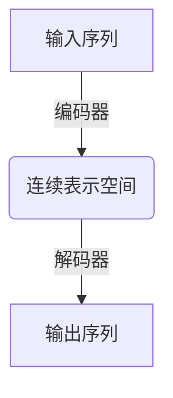
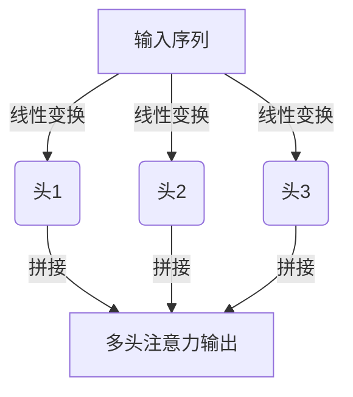
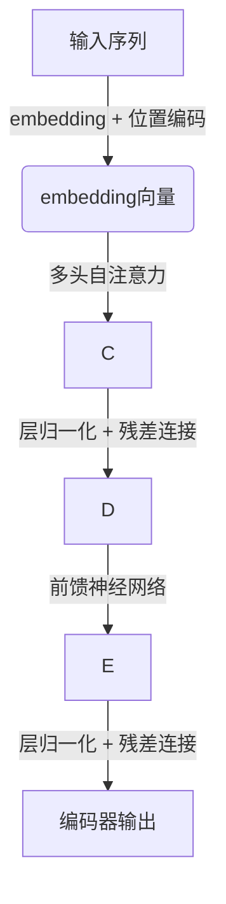
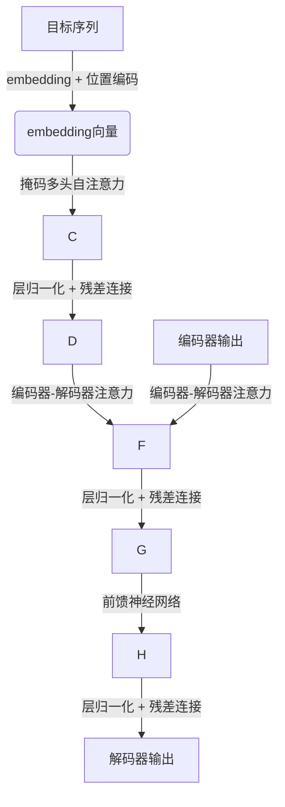

# 大语言模型原理基础与前沿 预训练和微调Transformer带来的新启示

## 1.背景介绍

### 1.1 自然语言处理的重要性

在当今时代,自然语言处理(NLP)已经成为人工智能领域中最重要和最具挑战性的研究方向之一。它旨在使计算机能够理解和生成人类语言,这对于实现人机交互、信息检索、机器翻译、问答系统等广泛应用领域至关重要。随着大数据时代的到来,海量的自然语言数据为NLP研究提供了源源不断的原料,推动着这一领域的快速发展。

### 1.2 统计机器学习时代的局限性

在NLP的早期发展阶段,统计机器学习模型占据主导地位,例如隐马尔可夫模型(HMM)、条件随机场(CRF)、最大熵模型等。这些模型主要依赖于手工设计的特征工程,需要对语言现象进行规则化描述,存在一定的局限性。此外,统计机器学习模型通常是基于浅层结构的,难以捕捉复杂的语义和上下文信息。

### 1.3 深度学习的兴起及其在NLP中的应用

近年来,深度学习在计算机视觉、语音识别等领域取得了巨大成功,也逐渐在NLP领域崭露头角。与传统的统计机器学习模型相比,深度学习模型具有自动学习特征表示的能力,可以从原始数据中挖掘出更加抽象和复杂的模式,从而更好地捕捉语言的内在规律。

### 1.4 Transformer模型的突破性贡献

2017年,Transformer模型在机器翻译任务中取得了突破性的成果,它完全抛弃了传统的循环神经网络(RNN)结构,采用了全新的自注意力(Self-Attention)机制,能够更好地捕捉长距离依赖关系,同时支持并行计算,大大提高了训练效率。Transformer模型的出现,不仅推动了机器翻译技术的发展,也为NLP领域带来了全新的思路和启示。

## 2.核心概念与联系

### 2.1 Transformer模型的核心思想

Transformer模型的核心思想是基于自注意力机制,通过计算输入序列中每个元素与其他元素之间的相关性,来捕捉长距离依赖关系。与传统的RNN模型相比,自注意力机制不再受限于序列的顺序性,可以并行计算,大大提高了计算效率。

Transformer模型主要由编码器(Encoder)和解码器(Decoder)两个部分组成。编码器负责将输入序列映射到一个连续的表示空间,而解码器则根据编码器的输出和目标序列生成最终的输出序列。

### 2.2 自注意力机制

自注意力机制是Transformer模型的核心组件,它通过计算输入序列中每个元素与其他元素之间的相关性,来捕捉长距离依赖关系。具体来说,对于一个长度为n的输入序列,自注意力机制会计算出一个n×n的注意力分数矩阵,其中每个元素表示对应位置的两个元素之间的相关性。

$$
\text{Attention}(Q, K, V) = \text{softmax}\left(\frac{QK^T}{\sqrt{d_k}}\right)V
$$

其中,Q(Query)、K(Key)和V(Value)分别表示查询、键和值,它们都是通过线性变换从输入序列中得到的。注意力分数矩阵的计算过程如上式所示,其中$d_k$是缩放因子,用于防止内积值过大导致softmax函数的梯度消失。

通过自注意力机制,Transformer模型可以有效地捕捉输入序列中元素之间的长距离依赖关系,从而更好地理解和生成自然语言。

### 2.3 多头注意力机制

为了进一步提高模型的表现能力,Transformer引入了多头注意力(Multi-Head Attention)机制。多头注意力机制是将多个注意力机制的输出进行拼接,从而允许模型从不同的子空间捕捉不同的信息。

多头注意力机制可以被形式化地表示为:

$$
\text{MultiHead}(Q, K, V) = \text{Concat}(\text{head}_1, \dots, \text{head}_h)W^O
$$

其中,每个$\text{head}_i$都是一个独立的注意力机制,通过不同的线性变换从输入序列中得到不同的Query、Key和Value。最后,将所有头的输出拼接起来,并通过一个额外的线性变换得到最终的多头注意力输出。

### 2.4 位置编码

由于Transformer模型完全抛弃了RNN结构,因此无法直接捕捉序列的位置信息。为了解决这个问题,Transformer引入了位置编码(Positional Encoding)机制,将位置信息直接编码到输入序列中。

位置编码可以通过不同的函数来实现,例如正弦函数和余弦函数:

$$
\begin{aligned}
\text{PE}_{(pos, 2i)} &= \sin\left(\frac{pos}{10000^{2i/d_\text{model}}}\right) \\
\text{PE}_{(pos, 2i+1)} &= \cos\left(\frac{pos}{10000^{2i/d_\text{model}}}\right)
\end{aligned}
$$

其中,pos表示位置索引,i表示维度索引,$d_\text{model}$是模型的embedding维度。位置编码会被直接加到输入序列的embedding上,从而将位置信息融入到模型中。

### 2.5 前馈神经网络

除了自注意力子层之外,Transformer模型还包含前馈神经网络(Feed-Forward Neural Network)子层,用于进一步提取高阶特征。前馈神经网络子层由两个全连接层组成,中间使用ReLU激活函数:

$$
\text{FFN}(x) = \max(0, xW_1 + b_1)W_2 + b_2
$$

其中,$W_1$、$b_1$、$W_2$和$b_2$分别表示第一层的权重矩阵、偏置向量、第二层的权重矩阵和偏置向量。前馈神经网络子层可以捕捉输入序列中的高阶特征,从而提高模型的表现能力。

### 2.6 层归一化和残差连接

为了加速训练过程并提高模型的泛化能力,Transformer模型采用了层归一化(Layer Normalization)和残差连接(Residual Connection)技术。

层归一化是对每一层的输入进行归一化处理,可以加速梯度传播,缓解梯度消失和梯度爆炸问题。残差连接则是将输入直接与子层的输出相加,从而允许梯度直接反向传播,避免了梯度消失和梯度爆炸问题。

## 3.核心算法原理具体操作步骤

### 3.1 Transformer编码器

Transformer编码器的主要任务是将输入序列映射到一个连续的表示空间中。编码器由多个相同的层组成,每一层包含两个子层:多头自注意力子层和前馈神经网络子层。

具体的操作步骤如下:

1. 将输入序列转换为embedding向量,并加上位置编码。
2. 将embedding向量输入到第一层的多头自注意力子层,捕捉元素之间的依赖关系。
3. 对多头自注意力子层的输出进行层归一化,并通过残差连接与输入相加。
4. 将上一步的输出输入到前馈神经网络子层,提取高阶特征。
5. 对前馈神经网络子层的输出进行层归一化,并通过残差连接与输入相加。
6. 重复步骤2-5,依次通过编码器的所有层。
7. 编码器的最终输出即为输入序列在连续表示空间中的表示。

### 3.2 Transformer解码器

Transformer解码器的主要任务是根据编码器的输出和目标序列生成最终的输出序列。解码器的结构与编码器类似,也由多个相同的层组成,每一层包含三个子层:掩码多头自注意力子层、编码器-解码器注意力子层和前馈神经网络子层。

具体的操作步骤如下:

1. 将目标序列转换为embedding向量,并加上位置编码。
2. 将embedding向量输入到第一层的掩码多头自注意力子层,捕捉元素之间的依赖关系,同时屏蔽掉未来位置的信息。
3. 对掩码多头自注意力子层的输出进行层归一化,并通过残差连接与输入相加。
4. 将上一步的输出与编码器的输出输入到编码器-解码器注意力子层,捕捉输入序列和目标序列之间的依赖关系。
5. 对编码器-解码器注意力子层的输出进行层归一化,并通过残差连接与输入相加。
6. 将上一步的输出输入到前馈神经网络子层,提取高阶特征。
7. 对前馈神经网络子层的输出进行层归一化,并通过残差连接与输入相加。
8. 重复步骤2-7,依次通过解码器的所有层。
9. 解码器的最终输出即为生成的输出序列。

### 3.3 Transformer模型训练

Transformer模型的训练过程与其他序列到序列模型类似,通常采用教师强制训练(Teacher Forcing)和自回归(Auto-Regressive)方式。

具体的训练步骤如下:

1. 准备训练数据,包括输入序列和目标序列。
2. 初始化Transformer模型的参数。
3. 对于每个训练样本:
   a. 将输入序列输入到编码器,得到连续表示空间中的表示。
   b. 将目标序列的前缀(除最后一个元素)输入到解码器,生成对应的输出序列。
   c. 计算输出序列与目标序列的损失函数,通常采用交叉熵损失。
   d. 反向传播计算梯度,更新模型参数。
4. 重复步骤3,直到模型收敛或达到最大训练轮数。

在推理阶段,Transformer模型采用自回归方式生成输出序列。具体来说,解码器会根据输入序列和已生成的部分输出序列,预测下一个元素,直到生成完整的输出序列或达到最大长度。

## 4.数学模型和公式详细讲解举例说明

在前面的章节中,我们已经介绍了Transformer模型的核心概念和算法原理。现在,让我们深入探讨一些关键的数学模型和公式,并通过具体的例子来加深理解。

### 4.1 注意力机制

注意力机制是Transformer模型的核心组件,它通过计算输入序列中每个元素与其他元素之间的相关性,来捕捉长距离依赖关系。具体来说,对于一个长度为n的输入序列,注意力机制会计算出一个n×n的注意力分数矩阵,其中每个元素表示对应位置的两个元素之间的相关性。

假设我们有一个长度为4的输入序列$X = [x_1, x_2, x_3, x_4]$,其中每个$x_i$是一个d维向量。我们将输入序列分别线性变换为Query、Key和Value矩阵:

$$