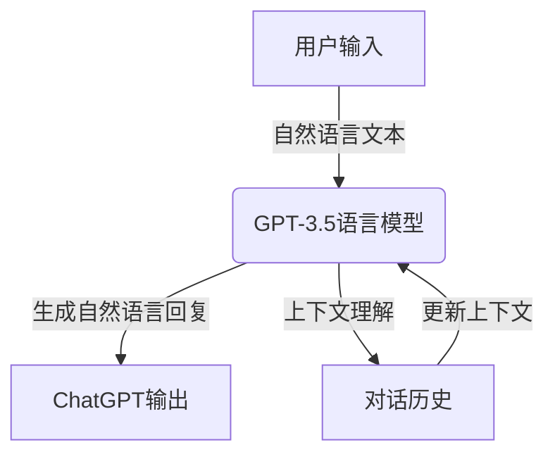
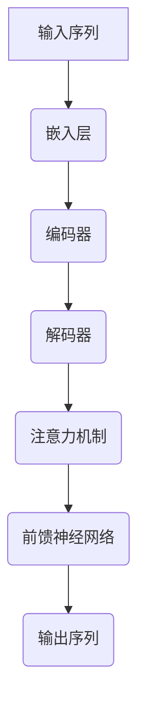
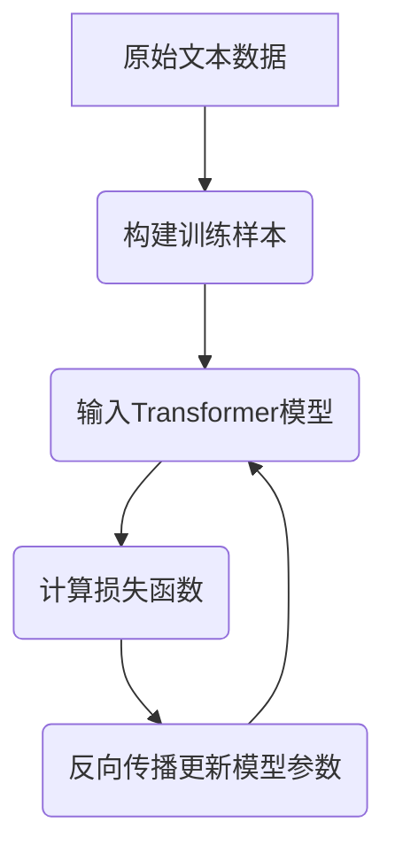

# 大语言模型应用指南：ChatGPT接口与扩展功能详解

## 1. 背景介绍

### 1.1 人工智能的发展历程

人工智能(Artificial Intelligence, AI)是当代科技发展的重要领域,旨在创造出能够模拟人类智能的机器系统。自20世纪50年代AI概念被正式提出以来,经历了几个重要的发展阶段。

- **早期阶段(1950s-1960s)**: 专家系统、逻辑推理等基础理论研究。
- **知识浪潮(1970s-1980s)**: 专家系统、知识库等应用研究。
- **神经网络时代(1990s)**: 神经网络、机器学习等数据驱动方法兴起。
- **深度学习时代(2010s至今)**: benefited from大数据、算力提升,深度学习在语音识别、图像识别等领域取得突破。

### 1.2 大语言模型(Large Language Model, LLM)的兴起

在深度学习的推动下,近年来大语言模型成为AI领域的一股重要力量。大语言模型是一种基于海量文本数据训练而成的深度神经网络模型,能够捕捉自然语言的语义和上下文信息,并生成类似于人类的自然语言输出。

大语言模型的代表有:

- **GPT(Generative Pre-trained Transformer)**: 由OpenAI开发,包括GPT、GPT-2、GPT-3等版本,在自然语言生成、理解等任务中表现出色。
- **BERT(Bidirectional Encoder Representations from Transformers)**: 由Google开发,在自然语言理解任务中取得卓越成绩。
- **T5(Text-to-Text Transfer Transformer)**: 由Google开发,支持多种自然语言处理任务。
- **GPT-3**: 由OpenAI开发,参数高达1750亿,在自然语言生成、问答等任务中表现出人类水平。

### 1.3 ChatGPT的崛起

ChatGPT是一个基于GPT-3.5语言模型的对话式AI助手,由OpenAI于2022年11月推出,在自然语言交互、问答、文本生成等方面表现出色,引发了广泛关注。ChatGPT的出现标志着大语言模型进入了一个新的里程碑,将对未来的人机交互、智能辅助等领域产生深远影响。

## 2. 核心概念与联系

### 2.1 大语言模型的核心概念

大语言模型的核心思想是基于海量文本数据,通过自监督学习的方式捕捉自然语言的语义和上下文信息,从而能够生成类似于人类的自然语言输出。其核心概念包括:

1. **自监督学习(Self-Supervised Learning)**: 利用原始数据本身的信息进行学习,不需要人工标注的监督信号。对于大语言模型,自监督学习的目标是最大化模型预测下一个词或者遮蔽词的概率。

2. **注意力机制(Attention Mechanism)**: 模型在生成每个词时,能够关注输入序列中与当前词相关的部分,从而捕捉长距离依赖关系。

3. **Transformer架构**: 基于注意力机制的序列到序列模型架构,能够并行处理输入序列,提高计算效率。

4. **语料预训练(Pretraining on Corpus)**: 在海量无标注文本数据上进行预训练,使模型学习到通用的语言知识。

5. **微调(Fine-tuning)**: 在特定任务数据上进行进一步训练,使模型适应特定任务。

6. **上下文理解(Context Understanding)**: 模型能够理解输入文本的上下文语义信息,生成与上下文相关的自然语言输出。

7. **开放域对话(Open-Domain Dialogue)**: 模型能够在任意主题领域进行自然语言对话交互。

### 2.2 ChatGPT的核心架构

ChatGPT是基于GPT-3.5语言模型的对话式AI助手,其核心架构如下:

1. **用户输入**: 用户通过自然语言文本与ChatGPT进行交互。

2. **GPT-3.5语言模型**: ChatGPT的核心是基于GPT-3.5的大型语言模型,经过了特殊的训练和优化。

3. **生成自然语言回复**: 模型根据用户输入和对话历史上下文,生成自然语言形式的回复。

4. **上下文理解**: 模型能够理解当前对话的上下文语义信息,并将其纳入生成回复的考虑范围。

5. **对话历史**: ChatGPT会记录与用户的对话历史,作为上下文信息的一部分。

6. **更新上下文**: 每次用户输入后,ChatGPT会更新对话上下文,为下一次回复做准备。

通过上述架构,ChatGPT能够在各种主题领域进行自然、流畅的对话交互,为用户提供智能化的问答和辅助服务。

## 3. 核心算法原理具体操作步骤 

### 3.1 Transformer架构

Transformer是大语言模型的核心架构,其主要组成部分包括:

1. **嵌入层(Embedding Layer)**: 将输入的词元(token)映射到连续的向量空间。

2. **编码器(Encoder)**: 捕捉输入序列的上下文信息,生成对应的序列表示。

3. **解码器(Decoder)**: 根据编码器的输出和之前生成的词元,预测下一个词元。

4. **注意力机制(Attention Mechanism)**: 计算当前词元与输入序列中其他词元的关联程度,捕捉长距离依赖关系。

5. **前馈神经网络(Feed-Forward Neural Network)**: 对注意力输出进行进一步处理和非线性变换。

Transformer的具体操作步骤如下:

1. **输入序列**: 将原始文本序列转换为词元(token)序列作为模型输入。

2. **嵌入层**: 将每个词元映射到连续的向量空间,形成嵌入表示。

3. **编码器**: 利用多头注意力机制和前馈神经网络,捕捉输入序列的上下文信息,生成对应的序列表示。

4. **解码器**: 根据编码器的输出和之前生成的词元,利用掩码多头注意力机制和前馈神经网络,预测下一个词元。

5. **注意力机制**: 计算当前词元与输入序列中其他词元的关联程度,捕捉长距离依赖关系。

6. **前馈神经网络**: 对注意力输出进行进一步处理和非线性变换,得到最终的词元表示。

7. **输出序列**: 根据预测的词元序列,生成最终的自然语言输出。

通过上述操作步骤,Transformer架构能够有效地捕捉输入序列的上下文信息,并生成与之相关的自然语言输出。

### 3.2 自监督学习

大语言模型的训练采用了自监督学习(Self-Supervised Learning)的方法,其核心思想是利用原始数据本身的信息进行学习,不需要人工标注的监督信号。对于大语言模型,自监督学习的目标是最大化模型预测下一个词或者遮蔽词的概率。

自监督学习的具体操作步骤如下:

1. **原始文本数据**: 收集大量的无标注文本数据,如网页、书籍、论文等。

2. **构建训练样本**: 从原始文本中采样出连续的文本片段,并对其进行预处理,如添加特殊标记、遮蔽部分词元等,构建自监督学习的训练样本。

3. **输入Transformer模型**: 将训练样本输入到Transformer模型中,模型会根据上下文信息预测被遮蔽的词元或下一个词元。

4. **计算损失函数**: 将模型的预测结果与真实标签进行比较,计算损失函数值,如交叉熵损失。

5. **反向传播更新模型参数**: 利用反向传播算法,根据损失函数值更新Transformer模型的参数。

6. **迭代训练**: 重复上述步骤,不断优化模型参数,直到模型在验证集上的性能达到满意水平。

通过自监督学习,大语言模型能够从海量无标注数据中学习到通用的语言知识,捕捉自然语言的语义和上下文信息,为后续的微调和应用奠定基础。

## 4. 数学模型和公式详细讲解举例说明

### 4.1 注意力机制(Attention Mechanism)

注意力机制是大语言模型中的关键组成部分,它能够捕捉输入序列中不同位置词元之间的关联关系,从而更好地建模长距离依赖。

给定一个长度为 $n$ 的输入序列 $\boldsymbol{X} = (x_1, x_2, \dots, x_n)$,注意力机制的计算过程如下:

1. **查询(Query)、键(Key)、值(Value)计算**:

$$
\begin{aligned}
\boldsymbol{Q} &= \boldsymbol{X} \boldsymbol{W}^Q \\
\boldsymbol{K} &= \boldsymbol{X} \boldsymbol{W}^K \\
\boldsymbol{V} &= \boldsymbol{X} \boldsymbol{W}^V
\end{aligned}
$$

其中 $\boldsymbol{W}^Q, \boldsymbol{W}^K, \boldsymbol{W}^V$ 分别为查询、键、值的权重矩阵。

2. **注意力分数计算**:

$$
\text{Attention}(\boldsymbol{Q}, \boldsymbol{K}, \boldsymbol{V}) = \text{softmax}\left(\frac{\boldsymbol{Q}\boldsymbol{K}^\top}{\sqrt{d_k}}\right)\boldsymbol{V}
$$

其中 $d_k$ 为键的维度,用于缩放点积的值,防止过大或过小的值。

3. **多头注意力(Multi-Head Attention)**:

$$
\begin{aligned}
\text{MultiHead}(\boldsymbol{Q}, \boldsymbol{K}, \boldsymbol{V}) &= \text{Concat}(\text{head}_1, \dots, \text{head}_h)\boldsymbol{W}^O \\
\text{where}\; \text{head}_i &= \text{Attention}(\boldsymbol{Q}\boldsymbol{W}_i^Q, \boldsymbol{K}\boldsymbol{W}_i^K, \boldsymbol{V}\boldsymbol{W}_i^V)
\end{aligned}
$$

其中 $h$ 为头数, $\boldsymbol{W}_i^Q, \boldsymbol{W}_i^K, \boldsymbol{W}_i^V$ 为第 $i$ 个头的权重矩阵, $\boldsymbol{W}^O$ 为输出权重矩阵。

多头注意力机制能够从不同的子空间捕捉不同的关注信息,提高了模型的表示能力。

### 4.2 掩码自注意力(Masked Self-Attention)

在自监督学习过程中,大语言模型需要预测被遮蔽的词元或下一个词元,这就需要使用掩码自注意力机制。

假设输入序列为 $\boldsymbol{X} = (x_1, x_2, \dots, x_n)$,其中 $x_i$ 为被遮蔽的词元,掩码自注意力的计算过程如下:

1. **构建掩码矩阵**:

$$
\boldsymbol{M} = \begin{bmatrix}
    0 & 0 & \cdots & 0 \\
    0 & 0 & \cdots & 0 \\
    \vdots & \vdots & \ddots & \vdots \\
    0 & 0 & \cdots & -\infty
\end{bmatrix}
$$

其中 $\boldsymbol{M}$ 为 $n \times n$ 的掩码矩阵,对角线及其右上方元素为 $-\infty$,其余元素为 $0$。

2. **计算注意力分数**:

$$