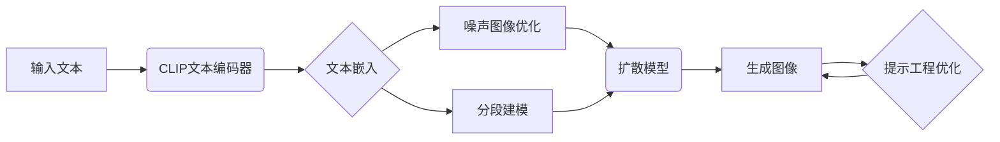

# 大语言模型应用指南：图像生成

## 1. 背景介绍

### 1.1 大语言模型概述

大语言模型(Large Language Models, LLMs)是自然语言处理(NLP)领域近年来的重大突破。它们是在海量文本数据上训练的深度神经网络模型,能够学习语言的统计规律和语义关系,具备强大的语言理解和生成能力。代表模型包括GPT系列、BERT、T5等。

### 1.2 大语言模型的应用

大语言模型凭借其出色的语言能力,在许多NLP任务上取得了显著进展,如机器翻译、对话系统、文本摘要、问答系统等。除此之外,大语言模型还被创新性地应用到其他领域,如代码生成、视觉-语言模型等。其中,利用大语言模型进行图像生成就是一个令人兴奋的方向。

### 1.3 大语言模型图像生成的意义

传统的图像生成主要采用GAN等生成式模型,需要大量的图像数据进行训练,且生成质量和多样性有限。将大语言模型应用于图像生成,可以利用文本来引导图像生成过程,使得生成图像更加可控和符合人类意图。这为图像生成开辟了新的思路,有望突破现有方法的局限性。

## 2. 核心概念与联系

### 2.1 文本-图像生成 

文本-图像生成(Text-to-Image Generation)指的是根据给定的文本描述,自动生成与之匹配的图像。这需要模型理解文本语义,并将其转化为视觉表征。大语言模型可以作为编码器来理解文本,引导图像生成。

### 2.2 多模态学习

多模态学习(Multimodal Learning)研究如何处理和关联来自多种模态的信息,如文本、图像、音频等。将大语言模型用于图像生成,本质上是一种多模态学习,需要建立文本和图像之间的跨模态映射。

### 2.3 扩散模型 

扩散模型(Diffusion Models)是一类生成模型,通过对噪声图像进行逐步去噪来生成真实图像。它们在图像生成领域表现出色。一些工作将扩散模型与大语言模型相结合,用于文本引导的图像生成。

### 2.4 DALL·E和Stable Diffusion

DALL·E和Stable Diffusion是两个代表性的大语言模型图像生成系统。DALL·E由OpenAI开发,使用GPT-3和VAE进行图像生成。Stable Diffusion则结合了CLIP和扩散模型,以更少的参数实现高质量图像生成。它们展示了大语言模型在图像生成中的巨大潜力。

## 3. 核心算法原理与步骤

### 3.1 基于CLIP引导的图像生成

CLIP(Contrastive Language-Image Pre-training)是一种将文本和图像对齐的方法,通过对比学习使文本编码器和图像编码器在同一语义空间中对齐。利用CLIP引导图像生成的基本步骤如下:

1. 使用预训练的CLIP文本编码器将输入文本映射为文本嵌入向量。
2. 随机初始化一个噪声图像,通过优化使其CLIP图像嵌入与文本嵌入相似。
3. 使用训练好的图像生成器(如扩散模型)以噪声图像为条件生成目标图像。
4. 迭代优化噪声图像,使生成图像的CLIP图像嵌入与文本嵌入越来越接近。

### 3.2 基于分段建模的图像生成

分段建模(Segment Anything)是一种新的范式,旨在从复杂场景中分割出任意目标。将其用于文本引导的图像生成可以分以下步骤:

1. 使用分段模型(如SAM)从给定图像中分割出感兴趣的目标区域。
2. 利用CLIP将输入文本映射为文本嵌入向量。 
3. 使用文本嵌入引导图像生成模型(如扩散模型),以分割掩码为条件生成目标区域图像。
4. 将生成的目标区域图像与原图无缝融合,得到最终的图像生成结果。

### 3.3 基于提示工程的图像生成优化

提示工程(Prompt Engineering)是优化大语言模型生成效果的重要技术。在图像生成中,可以通过精心设计提示词来引导模型生成更高质量、更符合要求的图像。一些有效的技巧包括:

1. 使用更具体、更详细的文本描述,提供足够的视觉线索。
2. 在提示中加入风格、构图、光照等额外信息以控制图像风格。
3. 使用视觉属性词如"高清"、"逼真"等来提升图像质量。
4. 通过few-shot示例来引导模型生成特定风格或主题的图像。



## 4. 数学模型与公式讲解

### 4.1 对比语言-图像预训练(CLIP)

CLIP通过最大化文本编码器$f(t)$和图像编码器$g(x)$之间的对比损失来学习它们的对齐:

$$
L = -\frac{1}{N} \sum_{i=1}^N \log \frac{\exp(\mathrm{sim}(f(t_i), g(x_i))/\tau)}{\sum_{j=1}^N \exp(\mathrm{sim}(f(t_i), g(x_j))/\tau)}
$$

其中$\mathrm{sim}$表示余弦相似度,$\tau$是温度超参数。这使得匹配的文本-图像对具有较高的相似度,而不匹配的对相似度较低。

### 4.2 扩散模型

扩散模型通过马尔可夫链对图像进行逐步去噪。正向过程从真实数据$x_0$开始,逐步添加高斯噪声直到得到纯噪声$x_T$:

$$
q(x_t|x_{t-1}) = \mathcal{N}(x_t; \sqrt{1-\beta_t} x_{t-1}, \beta_t \mathbf{I})
$$

其中$\beta_t$是噪声强度的超参数。反向过程则从$x_T$开始,通过神经网络$\epsilon_\theta$逐步去噪直到恢复$x_0$:

$$
p_\theta(x_{t-1}|x_t) = \mathcal{N}(x_{t-1}; \mu_\theta(x_t, t), \sigma_\theta(x_t, t)^2\mathbf{I})
$$

其中$\mu_\theta$和$\sigma_\theta$是神经网络预测的均值和方差。训练目标是最小化正向过程和反向过程的KL散度:

$$
L = \mathbb{E}_{x_0, \epsilon \sim \mathcal{N}(0,\mathbf{I}), t} \left[ \| \epsilon - \epsilon_\theta(\sqrt{\bar{\alpha}_t} x_0 + \sqrt{1-\bar{\alpha}_t} \epsilon, t) \|_2^2 \right]
$$

其中$\bar{\alpha}_t = \prod_{s=1}^t (1-\beta_s)$。生成时,从$x_T$开始,迭代进行去噪采样直到得到$\hat{x}_0$。

## 5. 项目实践

下面是一个使用Stable Diffusion和CLIP进行文本引导图像生成的示例代码:

```python
import torch
from diffusers import StableDiffusionPipeline
from transformers import CLIPTextModel, CLIPTokenizer

# 加载预训练的Stable Diffusion模型和CLIP模型
model_id = "CompVis/stable-diffusion-v1-4"
device = "cuda"
pipe = StableDiffusionPipeline.from_pretrained(model_id, torch_dtype=torch.float16)
pipe = pipe.to(device)
clip_model = CLIPTextModel.from_pretrained("openai/clip-vit-large-patch14").to(device)
clip_tokenizer = CLIPTokenizer.from_pretrained("openai/clip-vit-large-patch14")

# 输入文本提示
prompt = "a photo of an astronaut riding a horse on mars"

# 使用CLIP编码文本
text_input = clip_tokenizer(prompt, return_tensors="pt").to(device)
text_embeddings = clip_model.get_text_features(**text_input)

# 使用Stable Diffusion生成图像
image = pipe(prompt, clip_guidance_scale=1000, num_inference_steps=20, guidance_scale=7.5, 
             text_embeddings=text_embeddings).images[0]

# 显示生成的图像
image.show()
```

这个示例展示了如何使用CLIP对输入文本进行编码,得到文本嵌入向量,然后将其传入Stable Diffusion管道进行图像生成。通过调节`clip_guidance_scale`等参数,可以控制文本对图像生成过程的引导强度。

## 6. 实际应用场景

大语言模型驱动的图像生成在许多领域都有广阔的应用前景,例如:

1. 艺术创作:根据用户输入的文本描述,自动生成对应的插画、概念艺术、漫画等。
2. 设计辅助:根据设计需求的文本说明,生成产品设计草图、建筑设计方案等,辅助设计师进行创意发散和方案优化。
3. 广告营销:根据广告文案,自动生成匹配的广告图片,用于社交媒体推广、海报设计等。
4. 教育娱乐:根据故事情节或场景描述,生成插图,用于儿童绘本、视觉小说等。
5. 虚拟形象:根据用户提供的人物描述,生成虚拟人物形象,用于游戏、虚拟社交等。
6. 数据增强:利用文本描述生成对应的图像数据,扩充训练数据集,提升其他视觉任务的模型性能。

## 7. 工具与资源推荐

以下是一些实用的大语言模型图像生成工具和资源:

1. Stable Diffusion: https://stability.ai/blog/stable-diffusion-public-release
2. DALL·E 2: https://openai.com/dall-e-2/
3. Midjourney: https://www.midjourney.com/
4. CLIP: https://github.com/openai/CLIP
5. diffusers: https://github.com/huggingface/diffusers
6. ControlNet: https://github.com/lllyasviel/ControlNet
7. Prompt Engineering Guide: https://github.com/dair-ai/Prompt-Engineering-Guide

## 8. 未来发展趋势与挑战

大语言模型图像生成是一个充满活力和潜力的研究方向,未来的发展趋势可能包括:

1. 更大规模和更强能力的语言-视觉模型,支持更精细、更复杂的图像生成控制。
2. 跨模态推理和编辑能力,如根据文本对图像进行局部修改、风格转换等。
3. 个性化定制和交互式生成,根据用户反馈动态调整生成结果。
4. 融合知识库、常识推理等,生成更符合现实世界规律的图像。
5. 提高生成图像的高清化、写实化水平,缩小与真实照片的差距。

同时,该领域也面临一些挑战:

1. 提示工程的标准化和自动化,降低使用门槛。
2. 改进生成图像的一致性和逻辑合理性。
3. 解决生成图像的伦理和安全问题,如版权、隐私泄露等。
4. 缓解语言-视觉模型的数据偏差问题,提高生成的公平性。

## 9. 附录:常见问题

### Q1: 文本引导的图像生成可以生成任意内容吗?

A1: 虽然理论上文本引导的图像生成可以生成与输入文本匹配的任意图像,但实际上生成效果受到模型训练数据和能力的限制。一些抽象、罕见或过于复杂的场景可能难以生成令人满意的结果。

### Q2: 生成的图像是否有版权风险?

A2: 由于图像生成模型是在大规模图像数据上训练的,生成图像可能不可避免地与训练数据相似。因此使用生成图像时需要注意潜在的版权问题。一些模型采用了对抗训练等技术来缓解这一问题。

### Q3: 文本引导的图像生成需要大量计算资源吗?

A3: 图像生成通常需要较大的计算资源,尤其是生成高分辨率图像时。