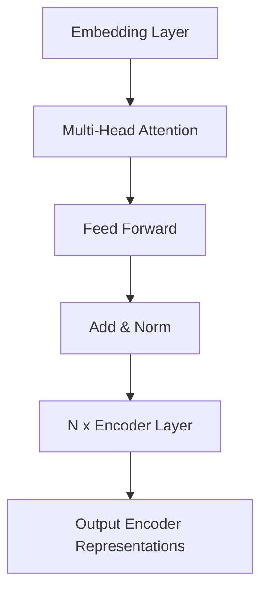

# 大语言模型应用指南：大语言模型的训练过程

## 1. 背景介绍

### 1.1 大语言模型的兴起

近年来,自然语言处理(NLP)领域取得了长足的进步,很大程度上要归功于大型神经网络模型的出现和发展,这些模型被统称为"大语言模型"(Large Language Models, LLMs)。大语言模型通过在海量文本数据上进行预训练,学习到了丰富的语言知识和上下文理解能力,使其能够在广泛的自然语言处理任务中表现出色。

### 1.2 大语言模型的应用前景

大语言模型的强大能力为各种应用场景带来了新的可能性,例如:

- 对话系统和虚拟助手
- 文本生成和创作辅助
- 信息检索和问答系统
- 机器翻译和多语种处理
- 文本分类和情感分析
- 代码生成和程序理解

随着模型规模和性能的不断提升,大语言模型正在成为推动人工智能发展的重要驱动力。

## 2. 核心概念与联系

### 2.1 自然语言处理基础

自然语言处理(NLP)是人工智能的一个重要分支,旨在使计算机能够理解和生成人类语言。NLP涉及多个子领域,包括:

- 词法分析和语法分析
- 词义消歧和命名实体识别
- 句法分析和语义分析
- 话语分析和对话管理

这些基础概念和技术为大语言模型的训练和应用奠定了理论基础。

### 2.2 深度学习与神经网络

深度学习是大语言模型发展的关键驱动力。神经网络模型,尤其是基于Transformer架构的模型,能够通过自注意力机制有效捕捉长距离依赖关系,从而更好地理解和生成自然语言。

常见的神经网络模型包括:

- 循环神经网络(RNN)
- 长短期记忆网络(LSTM)
- 门控循环单元(GRU)
- Transformer
- BERT
- GPT

这些模型架构为大语言模型的设计和训练提供了坚实的基础。

### 2.3 预训练与微调

大语言模型通常采用两阶段训练方式:

1. **预训练(Pre-training)**: 在大规模无标注文本数据上进行自监督学习,获取通用的语言表示能力。
2. **微调(Fine-tuning)**: 在特定任务的标注数据上进行监督学习,将预训练模型适应到具体的应用场景。

预训练和微调的分离使得大语言模型能够高效地转移通用语言知识,并在特定任务上取得优异表现。

### 2.4 核心概念关系

以上概念相互关联,共同构建了大语言模型的理论基础和技术框架。自然语言处理提供了基本概念和任务定义,深度学习则为模型架构和训练算法提供了强大的计算能力,而预训练和微调的范式使得大语言模型能够高效地学习和迁移知识。这些核心概念的融合推动了大语言模型的快速发展和广泛应用。

## 3. 核心算法原理具体操作步骤

### 3.1 预训练阶段

大语言模型的预训练阶段通常采用自监督学习的方式,在海量无标注文本数据上进行训练,目标是学习到通用的语言表示能力。常见的预训练任务包括:

1. **Masked Language Modeling (MLM)**: 随机掩蔽部分输入词,模型需要预测被掩蔽的词。
2. **Next Sentence Prediction (NSP)**: 判断两个句子是否相邻出现。
3. **Causal Language Modeling (CLM)**: 基于前面的上下文预测下一个词或句子。

以BERT为例,其预训练过程包括以下步骤:

1. 准备大规模文本语料库,例如Wikipedia、书籍、网页等。
2. 对文本进行标记化和分词,将文本转换为模型可以处理的输入格式。
3. 对输入序列进行掩蔽,随机选择一些词进行掩蔽(MLM任务)。
4. 构建输入和输出对,输入为掩蔽后的序列,输出为被掩蔽词的正确标签。
5. 使用Transformer编码器模型进行前向传播,计算被掩蔽词的预测概率分布。
6. 计算MLM损失函数,反向传播更新模型参数。
7. 对于NSP任务,同时预测两个句子是否相邻,计算NSP损失函数,与MLM损失函数一起进行联合训练。
8. 在大规模语料库上反复训练,直到模型收敛或达到预期性能。

经过大规模预训练后,BERT模型学习到了丰富的语言知识和上下文理解能力,为后续的微调任务奠定了基础。

### 3.2 微调阶段

在预训练完成后,大语言模型需要进行微调,以适应特定的自然语言处理任务。微调过程通常包括以下步骤:

1. 准备特定任务的标注数据集,例如文本分类、机器阅读理解等。
2. 根据任务类型,设计合适的输入和输出表示形式。
3. 在预训练模型的基础上,添加适当的输出层,用于生成任务相关的预测。
4. 使用任务数据集进行训练,计算任务相关的损失函数,如交叉熵损失等。
5. 反向传播更新模型参数,同时对预训练模型参数进行微调。
6. 在验证集上评估模型性能,根据需要调整超参数和训练策略。
7. 在测试集上评估最终模型性能,并进行模型部署和应用。

通过微调,大语言模型可以将预训练获得的通用语言知识迁移到特定任务上,从而取得优异的性能表现。微调过程相对于从头训练模型更加高效,并且能够充分利用预训练模型的知识。

## 4. 数学模型和公式详细讲解举例说明

### 4.1 Transformer架构

Transformer是大语言模型中广泛使用的核心架构,它基于自注意力机制,能够有效捕捉长距离依赖关系。Transformer的基本结构如下:



其中,每个编码器层的计算过程可以表示为:

$$Q = XW^Q$$
$$K = XW^K$$
$$V = XW^V$$
$$\text{Attention}(Q, K, V) = \text{softmax}(\frac{QK^T}{\sqrt{d_k}})V$$

其中$Q$、$K$、$V$分别表示查询(Query)、键(Key)和值(Value)，通过计算查询与键的相似性得分,对值进行加权求和,从而捕捉输入序列中的长距离依赖关系。

对于机器翻译等序列生成任务,Transformer还包含解码器(Decoder)部分,其结构类似于编码器,但增加了掩码自注意力层,用于处理未来位置的信息。

### 4.2 BERT模型

BERT(Bidirectional Encoder Representations from Transformers)是一种基于Transformer的双向编码器模型,在预训练阶段同时学习左右上下文的表示。BERT的预训练目标包括MLM(Masked Language Modeling)和NSP(Next Sentence Prediction)两个任务。

BERT的核心思想是通过掩蔽部分输入词,让模型基于上下文预测被掩蔽的词,从而学习到双向的语言表示。具体来说,BERT的预训练过程如下:

1. 构建输入序列,包括词嵌入(Word Embeddings)、位置嵌入(Position Embeddings)和段嵌入(Segment Embeddings)。
2. 对输入序列进行掩蔽,随机选择15%的词进行掩蔽。
3. 使用Transformer编码器对掩蔽后的序列进行编码,得到上下文表示。
4. 对于被掩蔽的词,基于上下文表示预测其原始词的概率分布(MLM任务)。
5. 对于NSP任务,基于两个句子的表示预测它们是否相邻出现。
6. 计算MLM损失和NSP损失,反向传播更新模型参数。

通过这种双向预训练方式,BERT能够同时捕捉左右上下文的信息,学习到更加丰富和准确的语言表示,从而在多个下游任务中取得了卓越的性能表现。

### 4.3 GPT模型

GPT(Generative Pre-trained Transformer)是另一种基于Transformer的大语言模型,它采用单向(从左到右)的语言模型预训练方式。GPT的预训练目标是基于前面的上下文预测下一个词或句子,这种方式被称为Causal Language Modeling(CLM)。

GPT的预训练过程可以概括为:

1. 构建输入序列,包括词嵌入和位置嵌入。
2. 使用Transformer解码器对输入序列进行编码,得到上下文表示。
3. 基于上下文表示,预测下一个词的概率分布。
4. 计算交叉熵损失函数,反向传播更新模型参数。

由于GPT采用了单向语言模型预训练,因此它更适合于生成式任务,如文本生成、对话系统等。GPT的后续版本GPT-2和GPT-3通过增加模型规模和训练数据,进一步提升了生成性能。

需要注意的是,GPT模型在预训练阶段无法利用右侧上下文信息,因此在某些理解型任务上可能表现不如BERT模型。但在生成任务中,GPT模型展现出了强大的能力。

## 5. 项目实践:代码实例和详细解释说明

为了更好地理解大语言模型的训练过程,我们将使用Python和Hugging Face的Transformers库,实现一个简化版的BERT预训练和微调过程。

### 5.1 预训练阶段

```python
from transformers import BertForMaskedLM, BertTokenizer

# 加载预训练模型和分词器
model = BertForMaskedLM.from_pretrained('bert-base-uncased')
tokenizer = BertTokenizer.from_pretrained('bert-base-uncased')

# 准备输入数据
text = "The quick brown fox jumps over the lazy dog."
inputs = tokenizer(text, return_tensors='pt')

# 随机掩蔽部分词
masked_inputs = inputs.clone()
mask_token_id = tokenizer.mask_token_id
masked_indices = torch.randint(0, inputs.input_ids.size(-1), (inputs.input_ids.size(-1) // 20,))
masked_inputs.input_ids[0, masked_indices] = mask_token_id

# 前向传播
outputs = model(masked_inputs.input_ids, masked_lm_labels=inputs.input_ids)
loss = outputs.loss

# 反向传播和优化
optimizer = AdamW(model.parameters(), lr=5e-5)
loss.backward()
optimizer.step()
```

在这个示例中,我们首先加载预训练的BERT模型和分词器。然后,我们准备输入数据,并随机掩蔽部分词。接下来,我们使用BERT模型进行前向传播,计算掩蔽语言模型(MLM)的损失函数。最后,我们反向传播并更新模型参数。

这只是一个简化的示例,实际预训练过程需要在大规模语料库上进行多轮迭代训练,并可能包含其他预训练任务,如NSP等。

### 5.2 微调阶段

```python
from transformers import BertForSequenceClassification

# 加载预训练模型
model = BertForSequenceClassification.from_pretrained('bert-base-uncased')

# 准备训练数据
train_dataset = load_dataset('glue', 'mrpc', split='train')
tokenized_train = train_dataset.map(lambda x: tokenizer(x['sentence1'], x['sentence2'], truncation=True, padding='max_length'), batched=True)

# 微调训练
trainer = Trainer(
    model=model,
    args=TrainingArguments(output_dir='./results', num_train_epochs=3),
    train_dataset=tokenized_train,
    eval_dataset=tokenized_val,
    compute_metrics=compute_metrics
)
trainer.train()
```

在这个示例中,我们加载预训练的BERT模型,并准备用于文本相似度任务的训练数据。然后,我们使用Hugging Face的Trainer API进行微调训练。在训练过程中,模型将根据任务数据进行参数更新,以适应文本相似度任务。

需要注意的是,这只是一个简化的微调示例,实际应用中可能