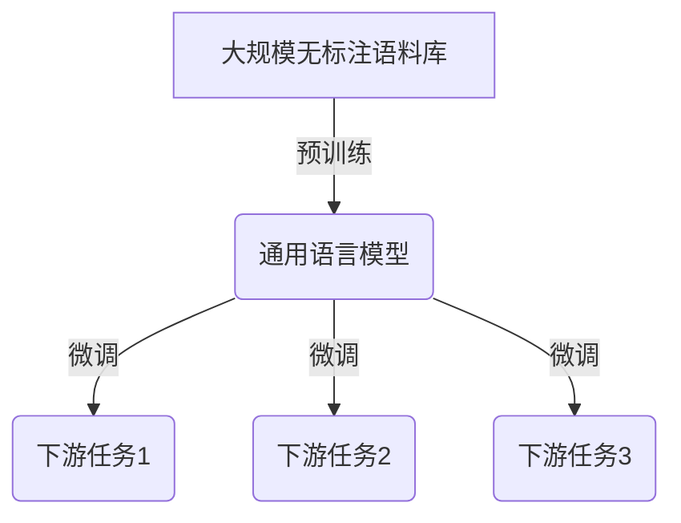

# 大语言模型应用指南：统一自然语言任务

## 1.背景介绍

### 1.1 自然语言处理的重要性

在当今的数字时代,自然语言处理(Natural Language Processing,NLP)已经成为了人工智能领域中最重要和最具挑战性的研究方向之一。随着人机交互日益普及,NLP技术在各种应用场景中扮演着越来越重要的角色,如智能助手、机器翻译、信息检索、情感分析等。

### 1.2 传统NLP方法的局限性

传统的NLP方法通常依赖于手工设计的特征工程和规则,需要大量的人工努力,并且难以捕捉语言的复杂性和多样性。此外,这些方法通常针对特定的任务进行优化,难以泛化到其他领域。

### 1.3 大语言模型的兴起

近年来,benefitting from大规模语料库和强大的计算能力,大型预训练语言模型(Large Pre-trained Language Models,LLMs)在NLP领域取得了突破性进展。这些模型通过在海量无标注文本数据上进行预训练,学习到了丰富的语言知识,并可以通过微调(fine-tuning)的方式快速适应各种下游NLP任务。

## 2.核心概念与联系

### 2.1 大语言模型的核心思想

大语言模型的核心思想是利用自监督学习(Self-Supervised Learning)的方式,从大规模无标注语料库中学习通用的语言表示,捕捉语言的内在规律和知识。这种方法不需要人工标注的数据,可以充分利用互联网上的海量文本资源。

### 2.2 预训练和微调

大语言模型通常分为两个阶段:预训练(Pre-training)和微调(Fine-tuning)。在预训练阶段,模型在大规模无标注语料库上进行自监督学习,学习到通用的语言表示。在微调阶段,模型在特定的下游任务上进行进一步训练,使其能够适应特定的应用场景。



### 2.3 自监督学习目标

大语言模型通常采用两种主要的自监督学习目标:

1. **Masked Language Modeling (MLM)**: 模型需要预测被掩码的单词。这种方式可以让模型学习到单词在上下文中的语义信息。

2. **Next Sentence Prediction (NSP)**: 模型需要判断两个句子是否相邻。这种方式可以让模型学习到跨句子的关系和语义连贯性。

通过这些自监督学习目标,大语言模型可以从大规模语料库中学习到丰富的语言知识,为下游任务提供强大的语言表示能力。

## 3.核心算法原理具体操作步骤

### 3.1 Transformer 架构

大多数大语言模型都采用了 Transformer 架构,该架构由编码器(Encoder)和解码器(Decoder)组成。编码器用于捕捉输入序列的语义表示,而解码器则根据编码器的输出生成目标序列。


Transformer 架构中的关键组件是多头注意力机制(Multi-Head Attention),它允许模型同时关注输入序列中的多个位置,捕捉长距离依赖关系。

### 3.2 自注意力机制

自注意力机制是 Transformer 架构中的核心,它计算每个单词与其他单词的相关性,并根据这些相关性分配注意力权重。具体来说,给定一个输入序列 $X = (x_1, x_2, \dots, x_n)$,自注意力机制计算每个单词 $x_i$ 与所有其他单词的注意力权重 $\alpha_{ij}$,然后根据这些权重对单词表示进行加权求和,得到新的表示 $z_i$:

$$z_i = \sum_{j=1}^n \alpha_{ij} (W_vx_j)$$

其中 $W_v$ 是一个可学习的线性变换。注意力权重 $\alpha_{ij}$ 通过计算查询向量 $q_i$ 与键向量 $k_j$ 的相似性得到:

$$\alpha_{ij} = \frac{\exp(q_i^Tk_j)}{\sum_{l=1}^n \exp(q_i^Tk_l)}$$

查询向量 $q_i$、键向量 $k_j$ 和值向量 $v_j$ 都是通过线性变换从输入单词表示 $x_j$ 得到的。

### 3.3 多头注意力机制

为了捕捉不同的相关性模式,Transformer 采用了多头注意力机制。具体来说,对于每个注意力头 $h$,我们计算一组不同的查询向量 $Q^h$、键向量 $K^h$ 和值向量 $V^h$,并进行注意力计算:

$$\text{head}_h = \text{Attention}(Q^h, K^h, V^h)$$

最后,将所有注意力头的输出进行拼接和线性变换,得到最终的输出表示:

$$\text{MultiHead}(Q, K, V) = \text{Concat}(\text{head}_1, \dots, \text{head}_h)W^O$$

其中 $W^O$ 是一个可学习的线性变换。

通过多头注意力机制,Transformer 可以同时关注输入序列中的多个位置,捕捉不同类型的依赖关系,从而提高了模型的表示能力。

## 4.数学模型和公式详细讲解举例说明

### 4.1 自注意力机制的数学模型

我们以一个具体的例子来详细解释自注意力机制的数学模型。假设输入序列为 $X = (x_1, x_2, x_3)$,我们要计算 $x_2$ 的新表示 $z_2$。

首先,我们将输入序列 $X$ 通过线性变换得到查询向量 $Q$、键向量 $K$ 和值向量 $V$:

$$Q = X W^Q, K = X W^K, V = X W^V$$

其中 $W^Q$、$W^K$ 和 $W^V$ 是可学习的线性变换矩阵。

接下来,我们计算 $x_2$ 与其他单词的注意力权重 $\alpha_{22}$、$\alpha_{21}$ 和 $\alpha_{23}$:

$$\alpha_{22} = \frac{\exp(q_2^Tk_2)}{\exp(q_2^Tk_1) + \exp(q_2^Tk_2) + \exp(q_2^Tk_3)}$$
$$\alpha_{21} = \frac{\exp(q_2^Tk_1)}{\exp(q_2^Tk_1) + \exp(q_2^Tk_2) + \exp(q_2^Tk_3)}$$
$$\alpha_{23} = \frac{\exp(q_2^Tk_3)}{\exp(q_2^Tk_1) + \exp(q_2^Tk_2) + \exp(q_2^Tk_3)}$$

然后,我们根据这些注意力权重对值向量 $V$ 进行加权求和,得到 $x_2$ 的新表示 $z_2$:

$$z_2 = \alpha_{21}v_1 + \alpha_{22}v_2 + \alpha_{23}v_3$$

通过这种方式,自注意力机制可以捕捉输入序列中单词之间的依赖关系,为每个单词赋予不同的注意力权重。

### 4.2 多头注意力机制的数学模型

在多头注意力机制中,我们将查询向量 $Q$、键向量 $K$ 和值向量 $V$ 分别线性变换为 $h$ 个头,每个头对应一组查询向量 $Q^h$、键向量 $K^h$ 和值向量 $V^h$:

$$Q^h = QW_Q^h, K^h = KW_K^h, V^h = VW_V^h$$

其中 $W_Q^h$、$W_K^h$ 和 $W_V^h$ 是可学习的线性变换矩阵。

对于每个头 $h$,我们计算自注意力机制的输出 $\text{head}_h$:

$$\text{head}_h = \text{Attention}(Q^h, K^h, V^h)$$

最后,我们将所有头的输出拼接起来,并通过另一个线性变换得到最终的多头注意力输出 $\text{MultiHead}(Q, K, V)$:

$$\text{MultiHead}(Q, K, V) = \text{Concat}(\text{head}_1, \dots, \text{head}_h)W^O$$

其中 $W^O$ 是一个可学习的线性变换矩阵。

通过多头注意力机制,Transformer 可以同时关注输入序列中的多个位置,捕捉不同类型的依赖关系,从而提高了模型的表示能力。

## 5.项目实践:代码实例和详细解释说明

为了更好地理解大语言模型的实现细节,我们将使用 PyTorch 框架提供一个简化版本的 Transformer 模型代码示例。

```python
import torch
import torch.nn as nn

class MultiHeadAttention(nn.Module):
    def __init__(self, embed_dim, num_heads):
        super().__init__()
        self.embed_dim = embed_dim
        self.num_heads = num_heads
        self.head_dim = embed_dim // num_heads

        self.qkv_proj = nn.Linear(embed_dim, 3 * embed_dim)
        self.out_proj = nn.Linear(embed_dim, embed_dim)

    def forward(self, x):
        batch_size, seq_len, _ = x.size()
        qkv = self.qkv_proj(x)
        q, k, v = qkv.chunk(3, dim=-1)

        q = q.view(batch_size, seq_len, self.num_heads, self.head_dim).transpose(1, 2)
        k = k.view(batch_size, seq_len, self.num_heads, self.head_dim).transpose(1, 2)
        v = v.view(batch_size, seq_len, self.num_heads, self.head_dim).transpose(1, 2)

        attn_scores = torch.matmul(q, k.transpose(-2, -1)) / (self.head_dim ** 0.5)
        attn_weights = torch.softmax(attn_scores, dim=-1)
        out = torch.matmul(attn_weights, v).transpose(1, 2).contiguous().view(batch_size, seq_len, -1)
        out = self.out_proj(out)

        return out
```

这段代码实现了一个简化版本的多头注意力机制。我们首先定义了一个 `MultiHeadAttention` 类,它继承自 PyTorch 的 `nn.Module`。在 `__init__` 方法中,我们初始化了一些超参数,如嵌入维度 `embed_dim` 和注意力头数量 `num_heads`。我们还定义了两个线性层 `qkv_proj` 和 `out_proj`,分别用于将输入映射到查询、键和值向量,以及将注意力输出映射回原始嵌入空间。

在 `forward` 方法中,我们首先将输入 `x` 通过 `qkv_proj` 线性层映射到查询、键和值向量。然后,我们将这些向量重新整形为多头注意力所需的形状。接下来,我们计算注意力分数 `attn_scores`,并通过 softmax 函数得到注意力权重 `attn_weights`。最后,我们使用注意力权重对值向量进行加权求和,得到注意力输出,并通过 `out_proj` 线性层映射回原始嵌入空间。

这只是一个简化版本的实现,实际的大语言模型通常会包含更多的组件和优化技术,如位置编码、层归一化、残差连接等。但是,这个示例代码可以帮助您理解多头注意力机制的核心思想和实现细节。

## 6.实际应用场景

大语言模型在自然语言处理领域有着广泛的应用,包括但不限于以下几个方面:

### 6.1 机器翻译

机器翻译是大语言模型最早也是最成功的应用之一。像 Google 的 GNMT 和 Facebook 的 ConvS2S 等系统都采用了基于 Transformer 的大语言模型架构,显著提高了翻译质量。

### 6.2 文本生成

大语言模型可以用于各种文本生成任务,如新闻摘要、对话系统、创作写作等。著名的 GPT 系列模型就是专门为文本生成而设计的大语言模型。

### 6.3 文本分类和情感分析

通过微调,大语言模型可以很好地适应文本分类和情感分析等任