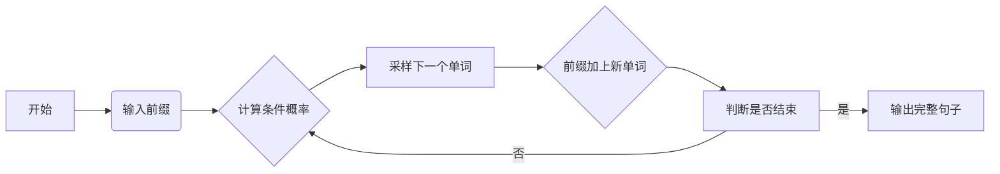
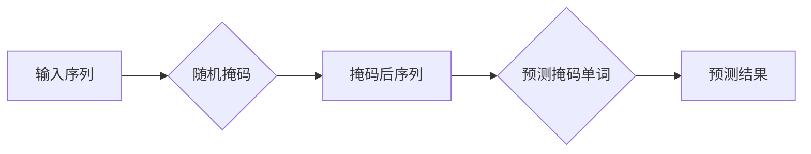
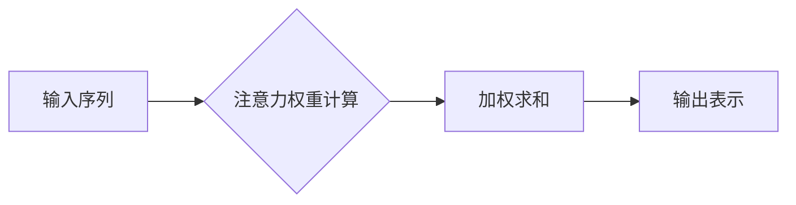
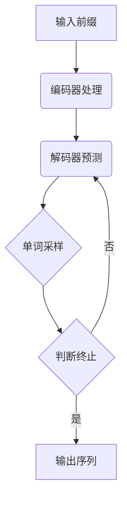

# 大语言模型应用指南：自回归模型与文本生成

## 1.背景介绍

### 1.1 文本生成的重要性

在当今信息时代,文本数据无处不在,从新闻报道、社交媒体、客户评论到技术文档等,都需要高质量的文本生成能力。文本生成已广泛应用于多个领域,如机器翻译、对话系统、自动文摘、内容创作等。高质量的文本生成技术可以极大提高工作效率,节省人力成本,并为人类提供更好的信息服务体验。

### 1.2 传统文本生成方法的局限性  

早期的文本生成主要依赖规则和模板,存在灵活性差、泛化能力弱的缺陷。统计机器翻译等基于统计模型的方法虽然有所改进,但仍无法处理长距离上下文依赖关系。此外,这些传统方法往往需要大量的人工特征工程和规则设计。

### 1.3 大语言模型的兴起

近年来,受益于大数据和强大算力的支持,基于深度学习的大语言模型取得了突破性进展,展现出卓越的文本生成能力。这些模型可以自主学习文本数据中蕴含的丰富语义和上下文信息,克服了传统方法的局限,为高质量文本生成提供了新的可能。

## 2.核心概念与联系

### 2.1 自回归模型

自回归模型(Autoregressive Model)是当前主流的文本生成模型范式。它基于这样一个思想:在生成句子时,模型会根据前面已生成的单词,预测下一个最可能的单词,逐步构建完整的句子。形式化地,给定前缀 $x_1, x_2, ..., x_t$,模型需要最大化 $P(x_{t+1}|x_1, x_2, ..., x_t)$,即下一个单词的条件概率。



### 2.2 掩码语言模型

掩码语言模型(Masked Language Model)是自回归模型的一种变体,常用于预训练大语言模型。与标准语言模型预测下一个单词不同,掩码语言模型会随机掩蔽部分单词,然后基于上下文预测被掩蔽的单词。这种方式可以更好地捕捉双向上下文信息,提高模型的表示能力。



### 2.3 注意力机制

注意力机制(Attention Mechanism)是大语言模型中一种关键技术,可以有效捕捉长距离依赖关系。在生成每个单词时,注意力机制会自动分配不同位置单词的权重,从而更好地融合全局信息。这使得模型可以更好地处理长句子和复杂上下文。



### 2.4 生成式预训练

生成式预训练(Generative Pre-training)是训练大型语言模型的有效范式。该范式先在大规模无监督文本数据上进行预训练,学习通用的语言表示;然后再在特定任务上进行微调(fine-tuning),将通用表示迁移到目标任务。这种预训练+微调的方式大幅提升了模型性能。


## 3.核心算法原理具体操作步骤

### 3.1 Transformer 模型

Transformer 是目前最流行的大语言模型架构,也是自回归模型的核心。它完全基于注意力机制,摒弃了传统的循环和卷积结构,有效解决了长距离依赖问题。Transformer 的主要组成部分有:

1. **嵌入层(Embedding Layer)**: 将输入单词映射到连续向量空间。
2. **编码器(Encoder)**: 捕捉输入序列的上下文信息。
3. **解码器(Decoder)**: 基于编码器输出和先前生成的单词,预测下一个单词。
4. **多头注意力(Multi-Head Attention)**: 并行计算多个注意力表示,提高模型表达能力。
5. **残差连接(Residual Connection)**: 缓解梯度消失问题,促进信息传播。
6. **层归一化(Layer Normalization)**: 加速收敛,提高训练稳定性。


### 3.2 自回归生成算法

自回归生成算法是将 Transformer 等模型应用于文本生成任务的核心步骤:

1. **输入前缀**: 将需要生成的前缀序列输入模型。
2. **编码器处理**: 编码器捕捉前缀的上下文信息。
3. **解码器预测**: 解码器基于编码器输出和先前生成的单词,预测下一个单词的概率分布。
4. **单词采样**: 根据概率分布采样一个单词,添加到已生成序列。
5. **判断终止**: 若达到终止条件(如句子结束标记),则停止生成;否则转至步骤3,继续生成下一个单词。



### 3.3 训练策略

训练高质量的自回归模型需要一些关键的训练策略:

1. **教师强制(Teacher Forcing)**: 在训练时,将上一个时间步的真实目标单词作为解码器输入,而不是使用模型预测的单词。这种方式可以减少训练误差累积。

2. **最大似然估计(Maximum Likelihood Estimation)**: 最小化模型预测和真实单词之间的交叉熵损失,最大化生成真实序列的概率。

3. **标签平滑(Label Smoothing)**: 将一些概率质量从正确单词分配到其他单词,减少过拟合。

4. **梯度裁剪(Gradient Clipping)**: 裁剪梯度值,避免梯度爆炸。

5. **学习率衰减(Learning Rate Decay)**: 在训练后期减小学习率,提高收敛性能。

## 4.数学模型和公式详细讲解举例说明

### 4.1 自回归模型概率

自回归模型的核心目标是最大化生成序列 $y = \{y_1, y_2, ..., y_T\}$ 的条件概率 $P(y|x)$,其中 $x$ 是输入序列。根据链式法则,我们有:

$$P(y|x) = \prod_{t=1}^T P(y_t|y_1, ..., y_{t-1}, x)$$

即将联合概率分解为多个条件概率的乘积。每一步生成单词时,模型需要最大化:

$$\hat{y}_t = \arg\max_{y_t} P(y_t|y_1, ..., y_{t-1}, x)$$

通过重复这个过程,直至生成序列终止符号。

### 4.2 Transformer 注意力计算

Transformer 使用多头注意力机制来捕捉输入序列中的长程依赖关系。对于一个查询向量 $q$、键向量 $k$ 和值向量 $v$,注意力计算公式为:

$$\text{Attention}(q, k, v) = \text{softmax}(\frac{qk^T}{\sqrt{d_k}})v$$

其中 $d_k$ 是缩放因子,用于防止点积过大导致的梯度饱和。多头注意力则是将注意力计算过程独立运行 $h$ 次,然后将结果拼接:

$$\text{MultiHead}(Q, K, V) = \text{Concat}(head_1, ..., head_h)W^O$$
$$\text{where } head_i = \text{Attention}(QW_i^Q, KW_i^K, VW_i^V)$$

这里 $W_i^Q$、$W_i^K$、$W_i^V$ 和 $W^O$ 是可学习的线性投影参数。

### 4.3 交叉熵损失函数

在训练自回归模型时,通常使用交叉熵损失函数最小化模型预测和真实单词之间的差异:

$$\mathcal{L} = -\frac{1}{N}\sum_{i=1}^N\sum_{t=1}^{T_i}\log P(y_t^{(i)}|y_1^{(i)}, ..., y_{t-1}^{(i)}, x^{(i)})$$

其中 $N$ 是训练样本数, $T_i$ 是第 $i$ 个样本的长度。通过最小化这个损失函数,模型可以学习到最大化生成真实序列的条件概率分布。

### 4.4 Beam Search 解码

在生成时,我们通常使用 Beam Search 算法来近似获得全局最优解。Beam Search 维护一个候选集合(beam),每一步保留概率最高的 $k$ 个候选序列,剪枝其他候选序列。设第 $t$ 步 beam 中的候选序列为 $\{y_1^{(1)}, ..., y_t^{(k)}\}$,则第 $t+1$ 步的候选序列为:

$$\text{beam}_{t+1} = \{\text{TopK}[y_1^{(1)}, ..., y_t^{(k)}, w]\}_{w \in V}$$

其中 $V$ 是词表,TopK 表示按概率保留前 $k$ 高的候选序列。通过这种方式,Beam Search 可以有效缓解贪婪搜索的局部最优问题。

## 5.项目实践:代码实例和详细解释说明

为了更好地理解自回归模型在文本生成中的应用,我们提供了一个基于 Transformer 的文本生成项目示例,使用 PyTorch 实现。该示例包括数据预处理、模型定义、训练和生成等核心模块。

### 5.1 数据预处理

```python
import re
import torch

# 文本清理函数
def clean_text(text):
    text = text.lower()
    text = re.sub(r"([?.!,¿])", r" \1 ", text)
    text = re.sub(r'[" "]+', " ", text)
    text = re.sub(r"[^a-zA-Z?.!,¿]+", " ", text)
    text = text.strip()
    return text

# 构建词表
class Vocab:
    def __init__(self, tokens):
        self.tok2idx = {tok: i for i, tok in enumerate(tokens)}
        self.idx2tok = {i: tok for i, tok in enumerate(tokens)}
        
    def __len__(self):
        return len(self.tok2idx)
        
# 文本转换为数字序列        
def text_to_sequence(text, vocab):
    sequence = []
    sequence.append(vocab.tok2idx['<sos>'])
    for token in text.split(' '):
        sequence.append(vocab.tok2idx.get(token, vocab.tok2idx['<unk>']))
    sequence.append(vocab.tok2idx['<eos>'])
    return torch.tensor(sequence)
```

上述代码实现了文本清理、构建词表和文本序列化的功能。首先使用 `clean_text` 函数对原始文本进行标准化预处理,如转小写、去除特殊字符等。然后基于清理后的文本构建 `Vocab` 词表对象,用于将文本映射为数字序列。`text_to_sequence` 函数则将给定文本转换为词表索引序列,添加起止符号。

### 5.2 Transformer 模型定义

```python
import torch.nn as nn

class TransformerEncoder(nn.Module):
    # 编码器模块...
    
class TransformerDecoder(nn.Module):
    # 解码器模块...
    
class Transformer(nn.Module):
    def __init__(self, vocab_size, ...):
        super().__init__()
        self.vocab_size = vocab_size
        self.tok_emb = nn.Embedding(vocab_size, emb_size)
        self.pos_emb = nn.Embedding(max_len, emb_size)
        self.encoder = TransformerEncoder(...)
        self.decoder = TransformerDecoder(...)
        
    def forward(self, src, tgt):
        # 编码器前向传播
        src_emb = self.tok_em