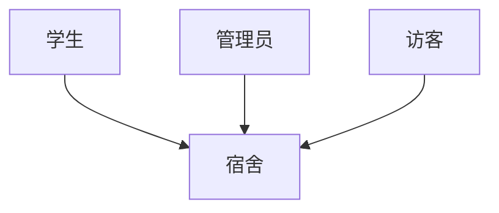

## 1.背景介绍

学生宿舍管理系统是一种用于管理学生宿舍的软件，包括学生入住、退房、换房、维修、访客记录等功能。这个系统可以极大地方便宿舍管理员对学生宿舍的管理工作，也可以方便学生对自己的宿舍情况进行查询。

## 2.核心概念与联系

学生宿舍管理系统主要涉及到以下几个核心概念：

- 学生：每个住在宿舍的人。
- 宿舍：学生居住的地方，每个宿舍有一个唯一的宿舍号。
- 管理员：负责管理学生宿舍的人，具有查看、修改、删除宿舍信息的权限。
- 访客：访问学生宿舍的人，需要记录访客的信息。

这些核心概念之间的联系可以用一个Mermaid流程图表示：



## 3.核心算法原理具体操作步骤

学生宿舍管理系统的核心算法主要包括以下几个部分：

1. 学生入住：当学生入住时，需要在系统中为学生分配一个宿舍，然后记录学生的信息。
2. 学生退房：当学生退房时，需要在系统中删除学生的宿舍信息，然后将宿舍的状态设置为可用。
3. 学生换房：当学生换房时，需要在系统中修改学生的宿舍信息，然后更新宿舍的状态。
4. 宿舍维修：当宿舍需要维修时，需要在系统中记录维修信息，然后将宿舍的状态设置为维修中。
5. 访客记录：当有访客访问宿舍时，需要在系统中记录访客的信息。

## 4.数学模型和公式详细讲解举例说明

在学生宿舍管理系统中，我们可以使用一些数学模型和公式来描述和解决一些问题。例如，我们可以使用图论来描述宿舍的分配问题。

假设我们有$n$个学生和$m$个宿舍，每个学生都有一些自己喜欢的宿舍，我们的目标是找到一个分配方案，使得尽可能多的学生能住在自己喜欢的宿舍。这个问题可以看作是一个二分图的最大匹配问题。

我们可以用一个$n \times m$的矩阵$A$来表示学生和宿舍的喜好关系，如果学生$i$喜欢宿舍$j$，那么$A_{ij} = 1$，否则$A_{ij} = 0$。我们的目标是找到一个匹配矩阵$M$，满足$M_{ij} \leq A_{ij}$，并且$\sum_{i,j} M_{ij}$最大。

这个问题可以用匈牙利算法来解决，匈牙利算法的时间复杂性是$O(n^3)$。

## 5.项目实践：代码实例和详细解释说明

下面是一个简单的学生宿舍管理系统的代码实例，使用Python语言编写。

```python
class Student:
    def __init__(self, name, dormitory):
        self.name = name
        self.dormitory = dormitory

class Dormitory:
    def __init__(self, number):
        self.number = number
        self.students = []

class Manager:
    def __init__(self, name):
        self.name = name

    def add_student(self, student, dormitory):
        dormitory.students.append(student)
        student.dormitory = dormitory

    def remove_student(self, student, dormitory):
        dormitory.students.remove(student)
        student.dormitory = None

    def change_dormitory(self, student, old_dormitory, new_dormitory):
        old_dormitory.students.remove(student)
        new_dormitory.students.append(student)
        student.dormitory = new_dormitory

class Visitor:
    def __init__(self, name, visited_dormitory):
        self.name = name
        self.visited_dormitory = visited_dormitory
```

这段代码定义了四个类：`Student`、`Dormitory`、`Manager`和`Visitor`，分别对应学生、宿舍、管理员和访客。每个类都有一些属性和方法，用于表示和操作相关的信息。

## 6.实际应用场景

学生宿舍管理系统在实际中有很多应用场景，例如：

- 学校：学校可以使用学生宿舍管理系统来管理学生的宿舍，包括分配宿舍、记录学生的入住和退房信息、处理宿舍的维修问题等。
- 学生：学生可以使用学生宿舍管理系统来查询自己的宿舍信息，包括宿舍的位置、宿舍的状态等。
- 访客：访客可以使用学生宿舍管理系统来查询访问的宿舍的信息，包括宿舍的位置、访问的时间等。

## 7.工具和资源推荐

在开发学生宿舍管理系统时，有一些工具和资源可以帮助我们：

- Python：Python是一种易于学习且功能强大的编程语言，可以用来开发各种类型的软件，包括学生宿舍管理系统。
- Django：Django是一个用Python编写的高级Web框架，可以帮助我们快速开发高质量的Web应用。
- MySQL：MySQL是一种关系型数据库管理系统，可以用来存储和管理学生宿舍管理系统的数据。
- Git：Git是一个分布式版本控制系统，可以帮助我们管理项目的源代码。

## 8.总结：未来发展趋势与挑战

随着信息技术的发展，学生宿舍管理系统也会有更多的发展趋势和挑战。

发展趋势：

- 智能化：未来的学生宿舍管理系统可能会更加智能，例如使用人工智能技术来自动分配宿舍，或者使用物联网技术来自动检测宿舍的状态。
- 移动化：随着移动设备的普及，学生宿舍管理系统可能会更加便于移动设备的使用，例如提供移动应用或者响应式网页。

挑战：

- 数据安全：学生宿舍管理系统涉及到大量的个人信息，如何保证这些信息的安全是一个重要的挑战。
- 系统稳定：随着使用人数的增加，如何保证系统的稳定性和可用性也是一个重要的挑战。

## 9.附录：常见问题与解答

Q：学生宿舍管理系统可以用来管理哪些信息？
A：学生宿舍管理系统可以用来管理学生的入住、退房、换房、维修、访客记录等信息。

Q：学生宿舍管理系统的核心算法是什么？
A：学生宿舍管理系统的核心算法包括学生入住、退房、换房、宿舍维修、访客记录等操作。

Q：如何使用匈牙利算法解决宿舍分配问题？
A：我们可以将宿舍分配问题看作是一个二分图的最大匹配问题，然后使用匈牙利算法来解决。

作者：禅与计算机程序设计艺术 / Zen and the Art of Computer Programming