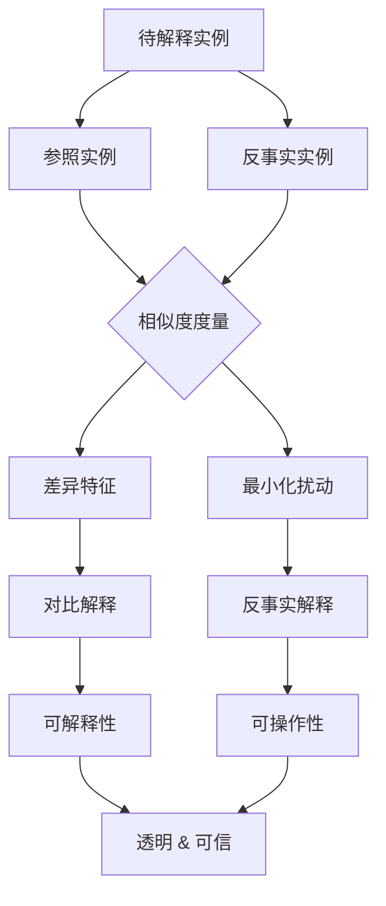

# 对比解释与反事实分析原理与代码实战案例讲解

## 1. 背景介绍

### 1.1 对比解释与反事实分析的定义
对比解释(Contrastive Explanation)和反事实分析(Counterfactual Analysis)是近年来在人工智能可解释性领域备受关注的两个重要概念。它们都旨在为黑盒模型的决策提供更加透明和可理解的解释。

对比解释的目的是通过比较两个相似但结果不同的实例,来揭示模型做出特定决策的关键因素。例如,在信用评分模型中,对比解释可以告诉我们,为什么申请人A的贷款申请被拒绝,而申请人B的申请却被批准,从而帮助我们理解模型的决策逻辑。

反事实分析则是通过构建一个虚拟的、与现实相反的场景,来探究在这种假设情况下,模型的决策会发生怎样的变化。例如,在医疗诊断模型中,反事实分析可以回答这样一个问题:如果患者没有症状X,那么模型是否还会给出相同的诊断结果?通过这种方式,我们可以更深入地理解模型的内部工作机制。

### 1.2 对比解释与反事实分析的重要性
对比解释和反事实分析对于提高人工智能系统的可解释性、可信性和公平性具有重要意义:

1. 增强模型透明度:通过生成易于理解的解释,使得非技术背景的用户也能够理解模型的决策过程,提高了模型的透明度。

2. 识别潜在偏见:通过分析不同实例之间的差异,可以发现模型中可能存在的偏见,如性别歧视、种族歧视等,从而采取措施消除这些偏见。

3. 改进模型性能:通过识别对模型决策产生重大影响的特征,可以有针对性地改进模型,提高其性能和鲁棒性。

4. 促进人机交互:易于理解的解释可以增强用户对人工智能系统的信任,促进人机协作。

5. 满足法规要求:在某些领域,如金融和医疗,法规要求模型具备可解释性。对比解释和反事实分析可以帮助满足这一要求。

### 1.3 对比解释与反事实分析的应用领域
对比解释和反事实分析在各个领域都有广泛的应用,包括:

1. 金融:信用评分、欺诈检测、贷款审批等
2. 医疗:疾病诊断、治疗方案推荐等  
3. 司法:量刑预测、假释决策等
4. 人力资源:简历筛选、绩效评估等
5. 营销:客户流失预测、个性化推荐等

随着人工智能在各行各业的深入应用,对比解释和反事实分析的需求将日益增长,成为实现可解释人工智能不可或缺的关键技术。

## 2. 核心概念与联系

### 2.1 对比解释的核心概念

#### 2.1.1 参照实例(Reference Instance)
参照实例是与待解释实例相似,但模型给出不同预测结果的另一个实例。通过比较这两个实例,可以揭示导致模型做出不同决策的关键因素。

#### 2.1.2 差异特征(Differential Features) 
差异特征指的是待解释实例和参照实例之间存在差异的特征。这些差异是导致模型产生不同预测结果的原因。识别出这些关键的差异特征,对于理解模型的决策至关重要。

#### 2.1.3 相似度度量(Similarity Metric)
为了找到合适的参照实例,需要度量实例之间的相似性。常见的相似度度量包括欧氏距离、余弦相似度等。选择适当的相似度度量方法,对于生成高质量的对比解释非常重要。

### 2.2 反事实分析的核心概念

#### 2.2.1 反事实实例(Counterfactual Instance)
反事实实例是一个虚构的实例,它与原始实例在某些特征上存在最小的差异,但却导致模型做出不同的预测。反事实实例回答了这样一个问题:需要改变哪些特征,才能使模型的决策发生改变?

#### 2.2.2 最小化扰动(Minimal Perturbation) 
生成反事实实例时,我们希望对原始实例进行最小化的扰动,即只改变最关键的特征,而保持其他特征不变。这样可以确保反事实实例在现实中具有可行性和可解释性。

#### 2.2.3 可操作性(Actionability)
反事实实例不仅要在数学上合理,还需要在现实世界中具备可操作性,即提供可行的行动建议。例如,在信用评分中,反事实分析应该给出申请人可以采取哪些措施来提高信用分数,而不是建议一些不可能实现的改变。

### 2.3 对比解释与反事实分析的联系
对比解释和反事实分析是相辅相成的两种方法:

1. 对比解释通过比较实例之间的差异,揭示了模型决策的关键影响因素;而反事实分析则通过构建虚拟实例,直接给出了改变决策所需的最小改变。 

2. 对比解释侧重于解释"为什么",即为什么模型对不同实例做出不同决策;而反事实分析侧重于指导"怎么做",即如何改变特征以达到期望的结果。

3. 对比解释和反事实分析都依赖于相似度度量,以找到合适的参照实例或生成合理的反事实实例。

将对比解释和反事实分析结合起来,可以为人工智能模型提供更全面、更具可操作性的解释。下图展示了对比解释和反事实分析的关键概念及其相互联系:

## 3. 核心算法原理具体操作步骤

### 3.1 对比解释算法

#### 3.1.1 问题定义
给定一个待解释实例 $x$,我们的目标是找到一个参照实例 $x'$,使得:

1. $x'$ 与 $x$ 非常相似;
2. 模型 $f$ 对 $x'$ 的预测结果与对 $x$ 的预测不同,即 $f(x') \neq f(x)$。

通过比较 $x$ 和 $x'$ 的差异,我们可以识别出导致模型做出不同决策的关键特征。

#### 3.1.2 算法步骤

1. 定义相似度度量函数 $d(x, x')$,用于衡量两个实例之间的相似性。常见的选择包括欧氏距离、曼哈顿距离等。

2. 从训练数据中选择一个初始的参照实例 $x'$,使其与 $x$ 的相似度较高,但模型预测结果不同。这可以通过优化以下目标函数来实现:

$$
\arg\min_{x'} d(x, x') \quad s.t. \quad f(x') \neq f(x)
$$

3. 识别 $x$ 和 $x'$ 之间的差异特征集合 $\Delta x$。这可以通过逐个比较两个实例的特征值来实现。

4. 评估每个差异特征对模型决策的影响。一种常见的方法是,针对每个差异特征 $\delta x_i \in \Delta x$,将其从 $x'$ 中移除,得到一个新的实例 $x'_{-i}$,然后比较 $f(x'_{-i})$ 和 $f(x')$ 的差异。影响较大的特征可以被认为是关键特征。 

5. 生成对比解释,突出显示关键的差异特征及其影响。例如:"如果申请人的年收入从 $x'$ 的 5 万元增加到 $x$ 的 10 万元,模型将批准其贷款申请。"

### 3.2 反事实分析算法

#### 3.2.1 问题定义
给定一个待解释实例 $x$ 和一个目标类别 $y'$,我们的目标是找到一个反事实实例 $\tilde{x}$,使得:

1. $\tilde{x}$ 与 $x$ 尽可能相似,但属于目标类别 $y'$;
2. $\tilde{x}$ 与 $x$ 的差异最小化。

通过分析 $x$ 和 $\tilde{x}$ 的差异,我们可以得到一个可操作的建议,告诉用户如何改变某些特征以达到期望的结果。

#### 3.2.2 算法步骤

1. 定义相似度度量函数 $d(x, \tilde{x})$ 和特征变更代价函数 $c(x, \tilde{x})$。相似度度量函数衡量两个实例的相似性,而特征变更代价函数则衡量将 $x$ 转变为 $\tilde{x}$ 所需的代价。

2. 构建优化问题,目标是找到一个反事实实例 $\tilde{x}$,使其与 $x$ 的相似度最高,同时满足目标类别 $y'$:

$$
\arg\min_{\tilde{x}} d(x, \tilde{x}) + \lambda \cdot c(x, \tilde{x}) \quad s.t. \quad f(\tilde{x}) = y'
$$

其中 $\lambda$ 是平衡相似度和变更代价的权重系数。

3. 求解上述优化问题,得到最优的反事实实例 $\tilde{x}$。这通常需要使用优化算法,如梯度下降法、遗传算法等。

4. 识别 $x$ 和 $\tilde{x}$ 之间的差异特征集合 $\Delta x$,并评估每个特征的变更幅度和代价。

5. 生成反事实解释,说明需要如何改变原始实例 $x$ 的特征才能达到目标结果 $y'$。例如:"如果申请人将其信用卡债务从 1 万元降低到 5000 元,模型将批准其贷款申请。"

## 4. 数学模型和公式详细讲解举例说明

### 4.1 对比解释的数学模型

对比解释的核心是找到一个与待解释实例 $x$ 相似但模型预测结果不同的参照实例 $x'$。这可以表示为以下优化问题:

$$
\arg\min_{x'} d(x, x') \quad s.t. \quad f(x') \neq f(x)
$$

其中 $d(x, x')$ 是相似度度量函数,用于衡量两个实例之间的相似性。常见的相似度度量包括:

1. 欧氏距离:

$$
d(x, x') = \sqrt{\sum_{i=1}^n (x_i - x'_i)^2}
$$

2. 曼哈顿距离:

$$
d(x, x') = \sum_{i=1}^n |x_i - x'_i|
$$

3. 余弦相似度:

$$
d(x, x') = 1 - \frac{\sum_{i=1}^n x_i x'_i}{\sqrt{\sum_{i=1}^n x_i^2} \sqrt{\sum_{i=1}^n x'^2_i}}
$$

选择合适的相似度度量函数取决于数据的特点和领域知识。

一旦找到参照实例 $x'$,我们就可以识别出导致模型做出不同决策的关键特征。假设 $x$ 和 $x'$ 之间的差异特征集合为 $\Delta x = \{\delta x_1, \delta x_2, ..., \delta x_m\}$。对于每个差异特征 $\delta x_i$,我们可以通过比较 $f(x'_{-i})$ 和 $f(x')$ 的差异来评估其影响:

$$
Impact(\delta x_i) = |f(x'_{-i}) - f(x')|
$$

其中 $x'_{-i}$ 表示从 $x'$ 中移除特征 $\delta x_i$ 得到的新实例。$Impact(\delta x_i)$ 的值越大,表明特征 $\delta x_i$ 对模型决策的影响越大。

### 4.2 反事实分析的数学模型

反事实分析旨在找到一个与原始实例 $x$ 尽可能相似,但属于目标类别 $y'$ 的反事实实例 $\t