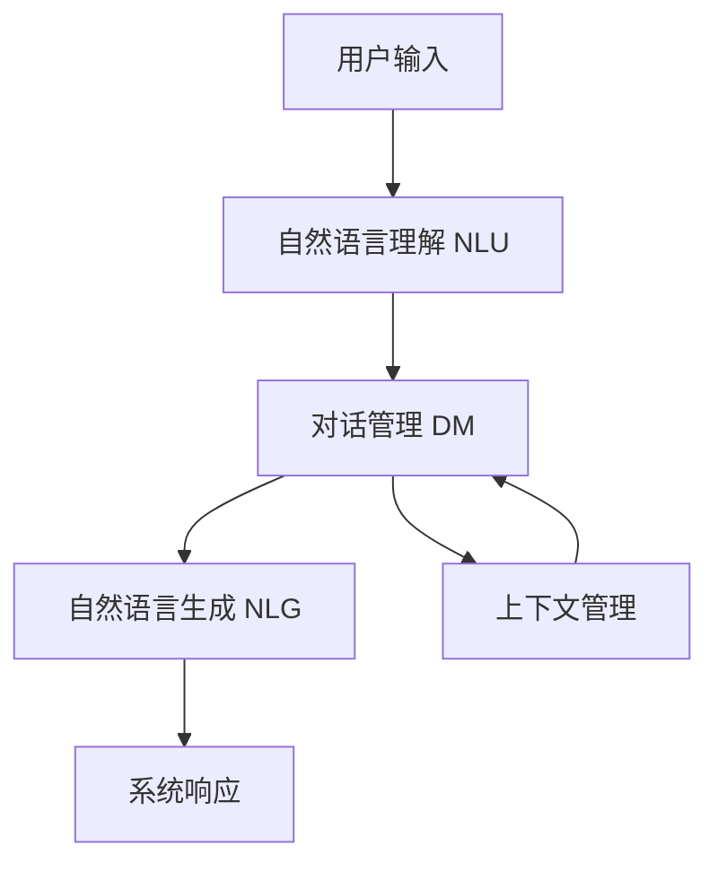

# 对话系统(Chatbots) - 原理与代码实例讲解

## 1.背景介绍

在当今时代,人工智能技术的快速发展推动了对话系统(Chatbots)的广泛应用。对话系统旨在模拟人类的交互方式,通过自然语言处理(NLP)和机器学习算法,实现与人类自然、流畅的对话交互。它们可以被集成到各种应用程序中,如客户服务、个人助理、教育等领域,为用户提供便捷、高效的服务体验。

对话系统的核心在于理解和生成自然语言。传统的基于规则的系统依赖于人工编写的规则集,但往往缺乏灵活性和可扩展性。而现代的基于深度学习的对话系统则能够从大量数据中自动学习语言模式,展现出更加人性化的对话能力。

### 1.1 对话系统的发展历程

对话系统的发展可以追溯到20世纪60年代,当时的ELIZA系统模拟了一位心理治疗师,利用简单的模式匹配和转换规则进行回复。随后,一些基于规则的系统如A.L.I.C.E.和Jabberwacky等应运而生。

21世纪初,benefiting from大数据和计算能力的提升,基于统计方法的对话系统开始兴起,如使用隐马尔可夫模型(HMM)和条件随机场(CRF)等技术。2010年后,深度学习在自然语言处理领域取得突破性进展,推动了基于神经网络的对话系统的发展,例如序列到序列(Seq2Seq)模型、注意力机制(Attention)和transformer等。

近年来,大型语言模型(LLM)的出现进一步推动了对话系统的能力提升。模型如GPT-3、ChatGPT等通过在海量语料上预训练,展现出了惊人的自然语言理解和生成能力,为构建更加智能化的对话系统奠定了基础。

### 1.2 对话系统的应用场景

对话系统在诸多领域均有广泛应用:

- **客户服务**: 智能客服机器人可以7x24小时在线解答用户问题,减轻人工服务压力。
- **个人助理**: 如Siri、Alexa等,可以根据用户的语音或文本指令执行各种任务。
- **教育&培训**: 对话系统可用于在线教学、考试评分、学习辅导等场景。
- **健康&医疗**: 对症状进行初步判断、提供就医建议、用药指导等。
- **电商&营销**: 智能推荐、订单处理、营销咨询等。
- **娱乐&社交**: 如小冰、小爱同学等智能对话伙伴。

## 2.核心概念与联系

对话系统的核心概念主要包括:

1. **自然语言理解(NLU)**: 将用户输入的自然语言(文本或语音)转化为对话系统可以理解的结构化表示,如意图(Intent)和实体(Entity)等。这是对话系统的"输入"理解环节。

2. **对话管理(DM)**: 根据当前对话状态和NLU的结果,决策系统的响应行为,管理对话流程。是对话系统的"大脑"决策中心。

3. **自然语言生成(NLG)**: 将对话系统的结构化响应转化为自然语言(文本或语音),作为对用户的"输出"。

4. **上下文管理**: 跟踪和维护对话过程中的上下文信息,确保对话的连贯性。

此外,还有一些通用的自然语言处理技术为对话系统提供支持:

- **词向量/语义表示**: 将自然语言转化为数值向量表示,用于语义计算。
- **语言模型**: 刻画语言的统计规律,有助于生成更加自然流畅的语言。

这些概念相互关联、环环相扣,共同构成了对话系统的核心框架:

## 3.核心算法原理具体操作步骤  

对话系统的核心算法主要包括以下几个部分:

### 3.1 自然语言理解(NLU)

自然语言理解旨在从用户的自然语言输入中提取出对话系统可以理解的结构化表示,通常包括意图识别和实体提取两个主要任务。

#### 3.1.1 意图识别(Intent Classification)

意图识别的目标是确定用户输入的语句想要表达的意图,如"查询天气"、"预订餐厅"等。常用的算法有:

1. **机器学习算法**:
   - 支持向量机(SVM)
   - 逻辑回归(Logistic Regression)
   - 朴素贝叶斯(Naive Bayes)
   - 决策树(Decision Tree)

   这些传统算法需要人工设计特征,且难以捕捉复杂的语义信息。

2. **深度学习算法**:
   - 卷积神经网络(CNN)
   - 长短期记忆网络(LSTM)
   - 双向LSTM(Bi-LSTM)
   - 注意力机制(Attention)
   - BERT等预训练语言模型

   深度学习算法可以自动学习语义特征,表现优于传统方法。BERT等大型语言模型进一步提升了意图分类的性能。

#### 3.1.2 实体提取(Entity Extraction)

实体提取旨在从用户输入中识别出关键信息,如时间、地点、数量等实体。常用算法包括:

1. **规则匹配**:使用正则表达式或字典匹配的方式提取实体。
2. **条件随机场(CRF)**: 基于统计模型,将实体提取看作序列标注问题。
3. **Bi-LSTM+CRF**: 将Bi-LSTM的上下文特征表示与CRF模型相结合。
4. **BERT+CRF**: 使用BERT预训练模型提取上下文特征,再与CRF模型结合。

### 3.2 对话管理(DM)

对话管理是对话系统的"大脑"决策中心,根据当前对话状态和NLU输出,决定系统的响应行为。主要算法包括:

1. **基于规则的系统**:依赖人工编写的状态转移规则和响应模板。
2. **基于机器学习的系统**:
   - 马尔可夫决策过程(MDP):将对话过程建模为马尔可夫决策过程。
   - 深度强化学习:使用深度神经网络逼近MDP的状态值函数或策略函数。
   - 基于模板的序列生成:将对话管理看作序列到序列(Seq2Seq)的生成问题。
3. **基于检索的系统**:从预先构建的响应库中检索最匹配的回复。
4. **基于生成的系统**:直接生成自然语言响应,通常使用Seq2Seq模型或大型语言模型。

### 3.3 自然语言生成(NLG)

自然语言生成的目标是将对话系统的结构化响应(如对话行为、关键信息等)转化为自然语言输出。主要算法包括:

1. **基于模板的生成**:根据预定义的模板和填槽方式生成响应。
2. **基于统计的生成**:使用统计语言模型(如N-gram)生成响应。
3. **基于神经网络的生成**:
   - 编码器-解码器(Encoder-Decoder):使用Seq2Seq模型将结构化输入编码,再解码生成自然语言。
   - 注意力机制(Attention):允许解码器模块选择性关注输入的不同部分,提高生成质量。
   - 拷贝机制(Copy Mechanism):直接从输入中拷贝某些词元,确保信息的准确性。
   - 覆盖机制(Coverage):避免生成重复的内容。
4. **基于检索的生成**:从预先构建的响应库中检索最匹配的自然语言响应。
5. **基于大型语言模型的生成**:直接利用GPT-3等大型语言模型生成自然语言响应。

### 3.4 上下文管理

对话往往是多轮的,需要跟踪和维护上下文信息,以确保对话的连贯性。常用的上下文管理算法包括:

1. **基于规则的方法**:使用预定义的规则跟踪对话状态和上下文信息。
2. **基于机器学习的方法**:
   - 序列标注:将跟踪上下文视为序列标注问题,使用CRF等模型解决。
   - 记忆网络(MemNN):使用显式存储来维护上下文信息。
   - 注意力机制:通过注意力权重自动捕捉上下文相关信息。

## 4.数学模型和公式详细讲解举例说明

对话系统中广泛使用了各种数学模型和公式,下面将详细介绍其中的一些核心模型。

### 4.1 序列到序列模型(Seq2Seq)

序列到序列(Sequence-to-Sequence,Seq2Seq)模型是对话系统中一种常用的生成模型,广泛应用于自然语言生成(NLG)和对话管理(DM)等任务。它的基本思想是将输入序列(如用户的自然语言输入)编码为向量表示,再将该向量解码为输出序列(如系统的自然语言响应)。

Seq2Seq模型通常由两部分组成:编码器(Encoder)和解码器(Decoder)。编码器将输入序列 $X=(x_1,x_2,...,x_n)$ 映射为向量表示 $c$,解码器则根据 $c$ 生成输出序列 $Y=(y_1,y_2,...,y_m)$。

$$c=Encoder(X)$$
$$Y=Decoder(c)$$

编码器和解码器内部通常使用循环神经网络(RNN)或其变体(如LSTM、GRU)来处理序列数据。编码器将输入序列 $X$ 逐个输入到RNN中,最终隐藏状态 $h_n$ 即为上下文向量 $c$:

$$h_t=\phi(W_hx_t+U_hh_{t-1}+b_h)$$
$$c=h_n$$

其中 $\phi$ 为非线性激活函数,如tanh或ReLU。$W_h$、$U_h$、$b_h$ 为可训练参数。

解码器则根据上下文向量 $c$ 和先前生成的输出序列 $y_1,...,y_{t-1}$ 预测下一个输出 $y_t$:

$$y_t=\arg\max_yP(y|y_1,...,y_{t-1},c)$$
$$P(y|y_1,...,y_{t-1},c)=g(W_sy_t+U_sh_t+b_s)$$

其中 $g$ 为softmax函数,用于计算输出词的概率分布。$W_s$、$U_s$、$b_s$ 为可训练参数。

在训练阶段,Seq2Seq模型的目标是最大化训练数据中的输出序列概率:

$$\max_{\theta}\sum_{(X,Y)\in D}\log P(Y|X;\theta)$$

其中 $\theta$ 为模型参数集合, $D$ 为训练数据集。

### 4.2 注意力机制(Attention)

传统的Seq2Seq模型将整个输入序列编码为单个向量,可能难以很好地捕捉长距离依赖关系。注意力机制(Attention)则允许解码器在生成每个输出时,选择性地关注输入序列的不同部分,从而提高了模型的性能。

具体地,注意力机制为每个解码器时间步 $t$ 计算一个注意力向量 $a_t$,表示当前时间步对输入序列各位置的注意力权重分布。然后将注意力向量与编码器隐藏状态 $h$ 进行加权求和,得到注意力输出 $c_t$,作为解码器的额外输入。

$$a_t=\text{softmax}(e_t)$$
$$e_t=\text{score}(s_{t-1},h)$$
$$c_t=\sum_{j=1}^na_{t,j}h_j$$

其中,注意力分数 $e_t$ 可以通过不同的函数计算,如加性注意力(additive attention)、点积注意力(dot-product attention)等。加性注意力的计算方式为:

$$e_t=v^\top \tanh(W_1s_{t-1}+W_2h)$$

其中 $v$、$W_1$、$W