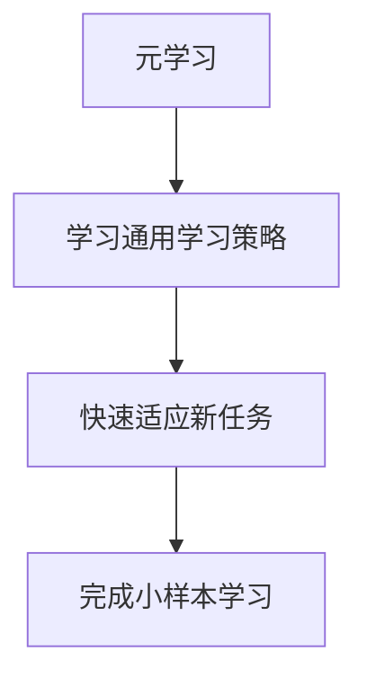
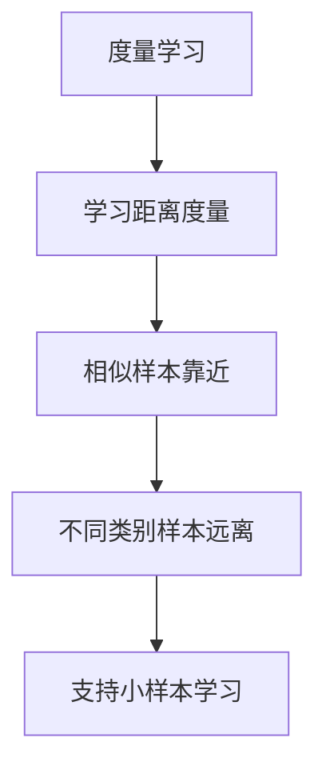
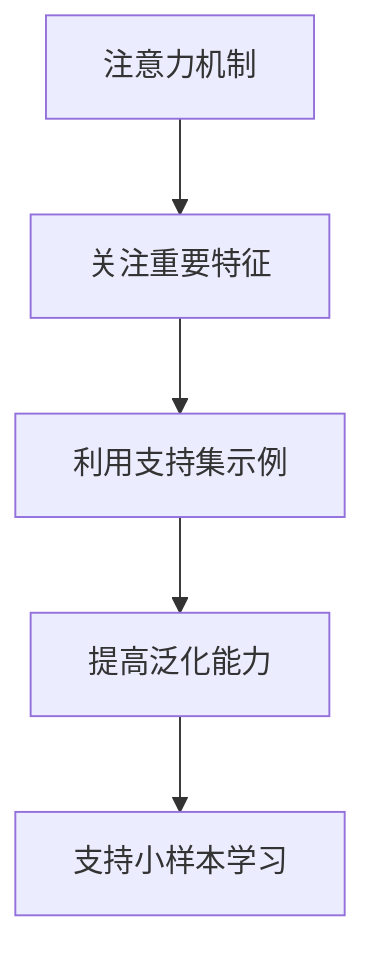
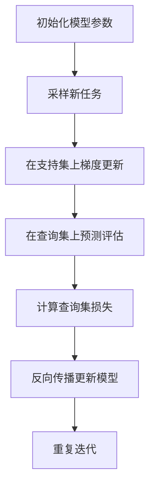
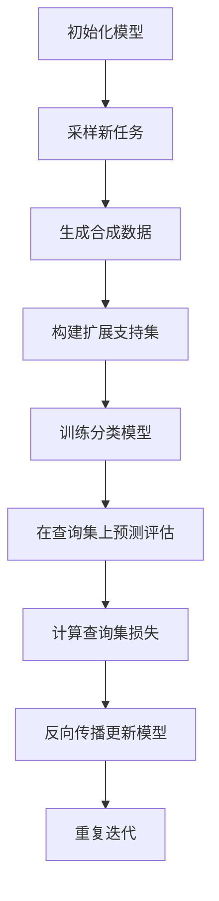

# 小样本学习在学术研究中的最新进展

## 1.背景介绍

### 1.1 小样本学习的概念

小样本学习(Few-Shot Learning)是机器学习领域的一个热门研究方向,旨在使模型能够仅基于少量示例就能快速学习新的概念和任务。在传统的监督学习中,模型需要大量的标注数据进行训练,但在现实世界中,获取大量高质量的标注数据往往是一项艰巨的挑战。小样本学习的出现正是为了解决这一问题,它能够在有限的数据条件下实现有效的学习。

### 1.2 小样本学习的重要性

小样本学习对于推动人工智能的发展具有重要意义。首先,它能够降低数据获取和标注的成本,使得人工智能系统能够应用于更多领域。其次,小样本学习能够模拟人类的学习方式,通过少量示例就能掌握新概念,这对于构建通用人工智能系统至关重要。此外,小样本学习还可以应用于医疗、安全等领域,在有限的数据条件下提供有效的决策支持。

## 2.核心概念与联系

### 2.1 元学习(Meta-Learning)

元学习是小样本学习的核心概念之一。它旨在学习一种通用的学习策略,使模型能够快速适应新任务和新环境。在小样本学习中,模型首先在大量不同任务的数据上进行元训练,学习一种泛化的学习策略。然后,在新的任务上,模型只需要少量示例就能快速适应并完成学习。



### 2.2 度量学习(Metric Learning)

度量学习是另一个与小样本学习密切相关的概念。它旨在学习一个合适的距离度量,使得相似的样本在嵌入空间中彼此靠近,而不同类别的样本则相距较远。在小样本学习中,度量学习可以帮助模型有效地利用少量示例,通过计算新样本与支持集样本之间的距离来进行分类或回归。



### 2.3 注意力机制(Attention Mechanism)

注意力机制是近年来在深度学习领域广泛应用的一种技术,它能够让模型专注于输入数据的关键部分,从而提高模型的性能和解释能力。在小样本学习中,注意力机制可以帮助模型更好地利用支持集中的少量示例,关注重要的特征和模式,从而提高泛化能力。



## 3.核心算法原理具体操作步骤

### 3.1 基于优化的小样本学习算法

基于优化的小样本学习算法是一种常见的方法,它通过在支持集上进行梯度更新,快速适应新任务。具体步骤如下:

1. 初始化模型参数 $\theta$。
2. 从任务分布 $p(\mathcal{T})$ 中采样一个新任务 $\mathcal{T}$,包括支持集 $\mathcal{S}$ 和查询集 $\mathcal{Q}$。
3. 在支持集 $\mathcal{S}$ 上进行梯度更新,得到新的模型参数 $\theta'$:

$$\theta' = \theta - \alpha \nabla_\theta \mathcal{L}_\mathcal{S}(\theta)$$

其中 $\alpha$ 是学习率, $\mathcal{L}_\mathcal{S}$ 是支持集上的损失函数。

4. 使用更新后的模型参数 $\theta'$ 在查询集 $\mathcal{Q}$ 上进行预测和评估。
5. 计算查询集上的损失,并反向传播更新初始模型参数 $\theta$。
6. 重复步骤 2-5,直到模型收敛。



### 3.2 基于生成的小样本学习算法

基于生成的小样本学习算法通过生成合成数据来增强模型的泛化能力。具体步骤如下:

1. 初始化生成模型 $G$ 和分类模型 $F$。
2. 从任务分布 $p(\mathcal{T})$ 中采样一个新任务 $\mathcal{T}$,包括支持集 $\mathcal{S}$ 和查询集 $\mathcal{Q}$。
3. 使用生成模型 $G$ 基于支持集 $\mathcal{S}$ 生成合成数据 $\mathcal{S}_g$。
4. 将支持集 $\mathcal{S}$ 和合成数据 $\mathcal{S}_g$ 合并,得到扩展支持集 $\mathcal{S}_e$。
5. 在扩展支持集 $\mathcal{S}_e$ 上训练分类模型 $F$。
6. 使用训练好的分类模型 $F$ 在查询集 $\mathcal{Q}$ 上进行预测和评估。
7. 计算查询集上的损失,并反向传播更新生成模型 $G$ 和分类模型 $F$。
8. 重复步骤 2-7,直到模型收敛。



## 4.数学模型和公式详细讲解举例说明

在小样本学习中,常见的数学模型和公式包括:

### 4.1 原型网络(Prototypical Networks)

原型网络是一种基于度量学习的小样本学习模型,它通过计算查询样本与每个类别原型之间的距离来进行分类。给定支持集 $\mathcal{S} = \{(x_i, y_i)\}_{i=1}^{N}$,其中 $x_i$ 是样本, $y_i$ 是对应的类别标签,类别原型 $c_k$ 可以计算为:

$$c_k = \frac{1}{|S_k|} \sum_{(x_i, y_i) \in S_k} f_\phi(x_i)$$

其中 $S_k = \{(x_i, y_i) \in \mathcal{S} | y_i = k\}$ 是属于类别 $k$ 的支持集样本, $f_\phi$ 是嵌入函数,将原始样本映射到嵌入空间。

对于查询样本 $x_q$,它的预测类别 $\hat{y}_q$ 可以通过计算与每个原型的距离得到:

$$\hat{y}_q = \arg\min_k d(f_\phi(x_q), c_k)$$

其中 $d(\cdot, \cdot)$ 是距离度量函数,通常使用欧几里得距离或余弦相似度。

### 4.2 关系网络(Relation Networks)

关系网络是一种基于注意力机制的小样本学习模型,它通过学习样本之间的关系来进行分类或回归。给定支持集 $\mathcal{S}$ 和查询样本 $x_q$,关系网络首先计算查询样本与每个支持集样本之间的关系分数:

$$r_{i,q} = g_\phi(f_\phi(x_q), f_\phi(x_i))$$

其中 $f_\phi$ 是嵌入函数, $g_\phi$ 是关系函数,用于计算两个样本之间的关系分数。

然后,关系网络通过注意力机制对关系分数进行加权求和,得到查询样本的预测输出:

$$\hat{y}_q = \sum_{i=1}^{N} \alpha_i r_{i,q}$$

其中 $\alpha_i$ 是注意力权重,通常使用 Softmax 函数计算:

$$\alpha_i = \frac{\exp(s(r_{i,q}))}{\sum_{j=1}^{N} \exp(s(r_{j,q}))}$$

$s(\cdot)$ 是一个评分函数,用于衡量关系分数的重要性。

### 4.3 模型集合(Model Ensemble)

在小样本学习中,常常会使用模型集成的方法来提高性能。给定 $M$ 个模型 $\{f_1, f_2, \ldots, f_M\}$,对于查询样本 $x_q$,模型集成的预测输出可以计算为:

$$\hat{y}_q = \frac{1}{M} \sum_{i=1}^{M} f_i(x_q)$$

也就是说,将每个模型的预测结果进行平均。这种简单的集成方法通常能够提高模型的泛化能力和鲁棒性。

另一种常见的模型集成方法是基于权重的集成,即为每个模型分配一个权重 $w_i$,然后对加权平均的预测结果进行归一化:

$$\hat{y}_q = \frac{\sum_{i=1}^{M} w_i f_i(x_q)}{\sum_{i=1}^{M} w_i}$$

权重 $w_i$ 可以根据每个模型在验证集上的性能来确定。

## 5.项目实践:代码实例和详细解释说明

在这一部分,我们将提供一个基于 PyTorch 的原型网络实现示例,并详细解释代码的各个部分。

```python
import torch
import torch.nn as nn
import torch.nn.functional as F

class PrototypicalNetwork(nn.Module):
    def __init__(self, encoder):
        super(PrototypicalNetwork, self).__init__()
        self.encoder = encoder

    def forward(self, support_images, support_labels, query_images):
        # 计算支持集样本的嵌入
        support_embeddings = self.encoder(support_images)

        # 计算每个类别的原型
        prototypes = compute_prototypes(support_embeddings, support_labels)

        # 计算查询样本的嵌入
        query_embeddings = self.encoder(query_images)

        # 计算查询样本与每个原型的距离
        distances = compute_distances(query_embeddings, prototypes)

        # 计算预测概率
        predictions = -distances

        return predictions

def compute_prototypes(embeddings, labels):
    prototypes = []
    for label in torch.unique(labels):
        # 计算每个类别的原型
        prototype = embeddings[labels == label].mean(dim=0)
        prototypes.append(prototype)
    prototypes = torch.stack(prototypes)
    return prototypes

def compute_distances(query_embeddings, prototypes):
    # 计算查询样本与每个原型的欧几里得距离
    distances = torch.cdist(query_embeddings, prototypes)
    return distances
```

上述代码实现了一个原型网络模型,包括以下几个主要部分:

1. `PrototypicalNetwork` 类继承自 `nn.Module`,是整个模型的主体。它接受一个编码器 `encoder` 作为输入,用于将原始图像数据映射到嵌入空间。

2. `forward` 函数是模型的前向传播过程。它首先计算支持集样本的嵌入,然后使用 `compute_prototypes` 函数计算每个类别的原型。接着,它计算查询样本的嵌入,并使用 `compute_distances` 函数计算查询样本与每个原型的距离。最后,它将距离取负值作为预测概率输出。

3. `compute_prototypes` 函数用于计算每个类别的原型。它遍历所有唯一的类别标签,对于每个类别,它计算属于该类别的所有支持集样本的平均嵌入,作为该类别的原型。

4. `compute_distances` 函数用于计算查询样本与每个原型之间的欧几里得距离。它使用 PyTorch 的 `cdist` 函数来高效地计算两个张量之间的成对距离。

在实际使用时,您需要先初始化一个编码器 `encoder`,例如预训练的卷积神经网络或其他深度模型。然后,将编码器传递给 `PrototypicalNetwork` 构造函数创建模型实例。在训练和测试阶段,