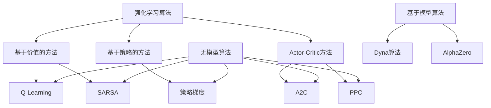

# 强化学习 原理与代码实例讲解

## 1. 背景介绍

强化学习(Reinforcement Learning, RL)是机器学习的一个重要分支,它关注于如何基于环境反馈来学习最优策略,以实现特定目标。与监督学习和无监督学习不同,强化学习的学习过程没有预先给定的输入-输出数据对,而是通过与环境的交互来获取经验,并根据获得的奖励信号来调整策略。

强化学习的思想源于心理学中的行为主义理论,后来被应用于神经网络、控制理论、运筹学等多个领域。近年来,随着深度学习的兴起,结合深度神经网络的强化学习算法取得了令人瞩目的成就,在游戏、机器人控制、自动驾驶等领域展现出巨大的潜力。

### 1.1 强化学习的基本概念

强化学习系统一般由以下几个基本要素组成:

- **环境(Environment)**: 指代理与之交互的外部世界,环境会根据代理的行为给出对应的反馈。
- **状态(State)**: 描述环境在某个时刻的具体情况。
- **行为(Action)**: 代理在当前状态下可以采取的操作。
- **策略(Policy)**: 定义了代理在每个状态下采取行为的策略,是强化学习要学习优化的核心对象。
- **奖励(Reward)**: 环境对代理行为的评价反馈,奖励信号是强化学习算法的关键驱动力。

强化学习的目标是找到一个最优策略,使得在完成任务的同时,能够获得最大的累积奖励。

### 1.2 强化学习的应用场景

强化学习已被广泛应用于以下领域:

- 游戏AI: AlphaGo、AlphaZero等强化学习系统在国际象棋、围棋等复杂游戏中展现出超人的表现。
- 机器人控制: 强化学习可以训练机器人在复杂环境中执行各种任务,如行走、抓取等。
- 自动驾驶: 通过模拟训练,强化学习可以优化自动驾驶策略,提高行驶安全性。
- 资源管理: 在数据中心负载均衡、网络流量优化等场景中,强化学习可以实现高效的资源分配。
- 金融决策: 强化学习可用于自动交易、投资组合优化等金融决策任务。

## 2. 核心概念与联系

强化学习系统可以用马尔可夫决策过程(Markov Decision Process, MDP)来刻画。MDP由一个五元组(S, A, P, R, γ)组成:

- S是状态集合
- A是行为集合  
- P是状态转移概率,P(s'|s,a)表示在状态s执行行为a后,转移到状态s'的概率
- R是奖励函数,R(s,a)表示在状态s执行行为a获得的即时奖励
- γ∈[0,1]是折扣因子,用于权衡未来奖励的重要性

强化学习的目标是找到一个最优策略π*,使得期望的累积折扣奖励最大化:

$$J(\pi) = \mathbb{E}_\pi\left[\sum_{t=0}^\infty \gamma^t r_t\right]$$

其中rt是第t个时间步获得的奖励。

### 2.1 价值函数

为了评估一个策略的好坏,我们引入了价值函数(Value Function)的概念。价值函数定义为在当前状态s下,按照策略π执行后所能获得的期望累积奖励:

$$V^\pi(s) = \mathbb{E}_\pi\left[\sum_{t=0}^\infty \gamma^t r_t|s_0=s\right]$$

类似地,我们可以定义状态-行为价值函数Q(s,a),表示在状态s执行行为a后,按照策略π执行所能获得的期望累积奖励:

$$Q^\pi(s,a) = \mathbb{E}_\pi\left[\sum_{t=0}^\infty \gamma^t r_t|s_0=s, a_0=a\right]$$

价值函数和Q函数之间存在如下关系,称为贝尔曼方程(Bellman Equation):

$$V^\pi(s) = \sum_{a\in A}\pi(a|s)Q^\pi(s,a)$$
$$Q^\pi(s,a) = R(s,a) + \gamma\sum_{s'\in S}P(s'|s,a)V^\pi(s')$$

### 2.2 强化学习算法分类

根据价值函数的估计方式,强化学习算法可分为三大类:

1. **基于价值的方法(Value-based)**:直接估计并优化价值函数或Q函数,例如Q-Learning、SARSA等。
2. **基于策略的方法(Policy-based)**:直接参数化策略函数并优化,例如策略梯度算法。
3. **Actor-Critic方法**:同时估计价值函数和策略函数,价值函数指导策略函数的优化。

另一个重要的分类标准是算法是否基于模型(Model-based或Model-free)。无模型算法直接从环境交互数据中学习,而基于模型的算法则需要先从数据中估计出环境的转移概率和奖励函数。

## 3. 核心算法原理具体操作步骤  

### 3.1 Q-Learning算法

Q-Learning是最经典的基于价值的无模型强化学习算法之一。其核心思想是通过不断更新Q值表格,来逼近最优Q函数,从而得到最优策略。算法步骤如下:

1. 初始化Q表格,所有Q(s,a)值初始化为任意值(如0)
2. 对于每个episode:
    1) 初始化起始状态s
    2) 对于每个时间步:
        1. 在状态s下,选择一个行为a(基于ε-greedy或其他探索策略)
        2. 执行行为a,获得奖励r和下一状态s'
        3. 更新Q(s,a)值:
            $$Q(s,a) \leftarrow Q(s,a) + \alpha[r + \gamma\max_{a'}Q(s',a') - Q(s,a)]$$
            其中α是学习率,γ是折扣因子
        4. 转移到下一状态s' 
    3) 直到episode结束
3. 重复步骤2,直到收敛

通过持续更新Q表格,最终Q函数将收敛到最优Q函数Q*。最优策略π*可以简单地通过每个状态选择具有最大Q值的行为来获得:

$$\pi^*(s) = \arg\max_a Q^*(s,a)$$

### 3.2 Deep Q-Network (DQN)

传统的Q-Learning算法存在一些局限性,如无法应对大规模的连续状态空间、更新Q表格时可能会遇到不稳定性等。Deep Q-Network(DQN)算法结合了Q-Learning和深度神经网络,可以有效解决上述问题。

DQN算法的核心思想是使用一个深度神经网络来拟合Q函数,网络的输入是当前状态s,输出是所有可能行为对应的Q值Q(s,a)。在训练过程中,我们最小化神经网络输出的Q值与真实Q值之间的均方误差损失:

$$L = \mathbb{E}_{(s,a,r,s')\sim D}\left[(r + \gamma\max_{a'}Q(s',a';\theta^-) - Q(s,a;\theta))^2\right]$$

其中D是经验回放池(Experience Replay),θ是神经网络的参数,θ-是目标网络的参数(作为稳定的目标进行更新)。

DQN算法的主要步骤如下:

1. 初始化Q网络和目标Q网络,两者参数相同
2. 对于每个episode:
    1) 初始化起始状态s
    2) 对于每个时间步:
        1. 选择一个行为a,基于ε-greedy策略
        2. 执行行为a,获得奖励r和下一状态s'
        3. 将(s,a,r,s')存入经验回放池D
        4. 从D中采样一个批次的数据
        5. 计算损失函数L,并通过梯度下降更新Q网络参数θ
        6. 每隔一定步数,将Q网络参数θ复制到目标网络参数θ- 
        7. 转移到下一状态s'
    3) 直到episode结束
3. 重复步骤2,直到收敛

DQN算法通过经验回放池和目标网络的引入,大大提高了训练的稳定性和样本利用效率。

### 3.3 Policy Gradient算法

Policy Gradient是一种基于策略的强化学习算法,其直接对策略函数进行参数化,并通过梯度上升的方式优化策略参数,使期望累积奖励最大化。

设策略π由参数θ参数化,π(a|s;θ)表示在状态s下执行行为a的概率。我们的目标是最大化期望累积奖励J(θ):

$$J(\theta) = \mathbb{E}_{\pi_\theta}\left[\sum_{t=0}^\infty \gamma^t r_t\right]$$

根据策略梯度定理,J(θ)关于θ的梯度可以写作:

$$\nabla_\theta J(\theta) = \mathbb{E}_{\pi_\theta}\left[\sum_{t=0}^\infty \nabla_\theta\log\pi_\theta(a_t|s_t)Q^{\pi_\theta}(s_t,a_t)\right]$$

其中Q^(π_θ)(s_t,a_t)是在状态s_t执行行为a_t后,按照策略π_θ执行所能获得的期望累积奖励。

基于上述梯度公式,我们可以通过蒙特卡罗采样的方式估计梯度,并使用梯度上升算法(如SGD)来优化策略参数θ。

REINFORCE算法就是一种基本的Policy Gradient算法,其伪代码如下:

1. 初始化策略参数θ
2. 对于每个episode:
    1) 生成一个episode的轨迹{s_0,a_0,r_0,s_1,a_1,r_1,...}
    2) 计算每个时间步的回报G_t = Σ_k=t^∞ γ^(k-t)r_k  
    3) 计算梯度估计:
        $$\hat{g} = \sum_{t=0}^{T-1}\nabla_\theta\log\pi_\theta(a_t|s_t)G_t$$
    4) 使用梯度上升法更新参数:θ ← θ + α*\hat{g}
3. 重复步骤2,直到收敛

Policy Gradient算法可以直接优化策略,避免了基于价值的算法中估计价值函数的过程。但它也存在一些缺点,如高方差、样本利用效率低等,因此后来提出了一些变体算法(如Actor-Critic)来改进。

## 4. 数学模型和公式详细讲解举例说明

### 4.1 马尔可夫决策过程(MDP)

马尔可夫决策过程(Markov Decision Process, MDP)是强化学习中最基本和最重要的数学模型。一个MDP可以用一个五元组(S, A, P, R, γ)来刻画:

- S是有限的状态集合
- A是有限的行为集合
- P是状态转移概率函数,P(s'|s,a)表示在状态s执行行为a后,转移到状态s'的概率
- R是奖励函数,R(s,a)表示在状态s执行行为a获得的即时奖励
- γ∈[0,1]是折扣因子,用于权衡未来奖励的重要性

在MDP中,我们的目标是找到一个最优策略π*,使得期望的累积折扣奖励最大化:

$$J(\pi) = \mathbb{E}_\pi\left[\sum_{t=0}^\infty \gamma^t r_t\right]$$

为了评估一个策略的好坏,我们引入了价值函数(Value Function)和Q函数(Action-Value Function)的概念。

价值函数V^π(s)定义为在当前状态s下,按照策略π执行后所能获得的期望累积奖励:

$$V^\pi(s) = \mathbb{E}_\pi\left[\sum_{t=0}^\infty \gamma^t r_t|s_0=s\right]$$

Q函数Q^π(s,a