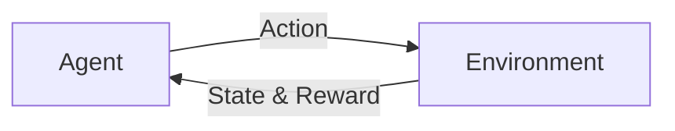

# 强化学习算法：Q-learning 原理与代码实例讲解

## 1. 背景介绍
### 1.1 强化学习概述
#### 1.1.1 强化学习的定义
强化学习(Reinforcement Learning, RL)是机器学习的一个重要分支,它主要关注如何基于环境而行动,以取得最大化的预期利益。不同于监督式学习 (Supervised Learning) 需要明确告知每一步动作,强化学习是一种非监督式学习,通过智能体(Agent)与环境(Environment)的交互,利用反馈信号(Reward)来学习,从而达到预定的目标。

#### 1.1.2 强化学习的基本框架
强化学习的基本框架可以用下图来表示:

在这个框架中,Agent根据当前的状态(State),选择一个动作(Action),这个动作会影响到环境,环境接收到动作后,会反馈给Agent一个新的状态和一个奖励(Reward)。Agent的目标就是要学习一个最优的策略,使得从环境中获得的累积奖励最大化。

### 1.2 Q-learning算法简介
#### 1.2.1 Q-learning的定义
Q-learning是强化学习中的一种无模型(model-free)、异策略(off-policy)的时序差分学习算法。它通过学习一个动作-值函数(Action-Value Function),即Q函数,来给出在某个状态下采取某个动作的优劣评估。Q函数的更新通过不断与环境交互,根据当前状态选择动作,获得下一个状态和即时奖励,然后更新Q值,最终学习到最优策略。

#### 1.2.2 Q-learning的优点
- 无需预先知道环境的转移概率模型,通过与环境交互学习 
- 异策略学习,可以用另一个策略的经验轨迹来更新当前策略
- 简单易实现,收敛性有理论保证

## 2. 核心概念与联系
### 2.1 马尔可夫决策过程(MDP)
马尔可夫决策过程是强化学习问题的经典形式化表达。一个MDP由一个五元组 $\langle \mathcal{S},\mathcal{A},\mathcal{P},\mathcal{R},\gamma \rangle$ 所定义:
- $\mathcal{S}$ 是有限的状态集
- $\mathcal{A}$ 是有限的动作集  
- $\mathcal{P}$ 是状态转移概率矩阵,$\mathcal{P}_{ss'}^a=\mathbb{P}[S_{t+1}=s'|S_t=s,A_t=a]$
- $\mathcal{R}$ 是奖励函数,$\mathcal{R}_s^a=\mathbb{E}[R_{t+1}|S_t=s,A_t=a]$
- $\gamma \in [0,1]$ 是折扣因子,表示对未来奖励的衰减程度

MDP的目标是寻找一个最优策略 $\pi^*$,使得从任意状态s出发,执行该策略获得的期望累积奖励达到最大。

### 2.2 值函数(Value Function)
#### 2.2.1 状态值函数 $V^\pi(s)$
状态值函数 $V^\pi(s)$ 表示从状态s开始,执行策略 $\pi$ 获得的期望回报:

$$V^\pi(s)=\mathbb{E}_\pi[\sum_{k=0}^{\infty}\gamma^k R_{t+k+1}|S_t=s]$$

#### 2.2.2 动作值函数 $Q^\pi(s,a)$  
动作值函数 $Q^\pi(s,a)$ 表示在状态s下选择动作a,然后继续执行策略 $\pi$ 获得的期望回报:

$$Q^\pi(s,a)=\mathbb{E}_\pi[\sum_{k=0}^{\infty}\gamma^k R_{t+k+1}|S_t=s,A_t=a]$$

可以看出,状态值函数和动作值函数满足如下关系:

$$V^\pi(s)=\sum_{a \in \mathcal{A}}\pi(a|s)Q^\pi(s,a)$$

### 2.3 贝尔曼方程(Bellman Equation)
#### 2.3.1 状态值函数的贝尔曼方程
$$V^\pi(s)=\sum_{a}\pi(a|s)\sum_{s',r}p(s',r|s,a)[r+\gamma V^\pi(s')]$$

#### 2.3.2 动作值函数的贝尔曼方程
$$Q^\pi(s,a)=\sum_{s',r}p(s',r|s,a)[r+\gamma \sum_{a'}\pi(a'|s')Q^\pi(s',a')]$$

贝尔曼方程刻画了值函数所满足的递归关系,是值函数学习的理论基础。求解MDP问题就是要寻找最优值函数 $V^*(s)$ 和 $Q^*(s,a)$。

## 3. 核心算法原理具体操作步骤
### 3.1 Q-learning算法流程图
```mermaid
graph TB
A[初始化Q(s,a)] --> B[当前状态s]
B --> C{是否终止}
C -->|Yes| D[结束]
C -->|No| E[基于Q值选取动作a] 
E --> F[执行动作a, 获得奖励r和下一状态s']
F --> G[更新Q值] 
G --> H[s = s'] 
H --> C
```

### 3.2 Q-learning算法伪代码
```
Initialize Q(s,a) arbitrarily
Repeat (for each episode):
    Initialize s
    Repeat (for each step of episode):
        Choose a from s using policy derived from Q (e.g., ε-greedy) 
        Take action a, observe r, s'
        Q(s,a) ← Q(s,a) + α[r + γ maxa' Q(s',a') - Q(s,a)]
        s ← s';
    until s is terminal
```
其中,α是学习率,γ是折扣因子。

### 3.3 Q值更新公式解释
Q-learning的核心是对动作值函数Q的更新:

$$Q(S_t,A_t) \leftarrow Q(S_t,A_t)+\alpha [R_{t+1}+\gamma \max_a Q(S_{t+1},a)-Q(S_t,A_t)]$$

这个更新公式可以这样理解:
- $R_{t+1}+\gamma \max_a Q(S_{t+1},a)$ 是Q值的目标值,由两部分组成:
  - $R_{t+1}$ 是在状态 $S_t$ 执行动作 $A_t$ 后获得的即时奖励
  - $\gamma \max_a Q(S_{t+1},a)$ 是下一状态 $S_{t+1}$ 的最大Q值乘以折扣因子 $\gamma$,表示未来的最大期望回报
- $Q(S_t,A_t)$ 是当前的Q值估计
- $\alpha [R_{t+1}+\gamma \max_a Q(S_{t+1},a)-Q(S_t,A_t)]$ 是TD误差,乘以学习率 $\alpha$ 作为当前Q值的更新量

可以看出,Q-learning算法不断地用估计的目标值去更新当前的Q值,使得Q值估计逐步逼近真实值。

## 4. 数学模型和公式详细讲解举例说明
### 4.1 Q-learning的收敛性证明
Q-learning算法可以被看作是随机逼近(Stochastic Approximation)方法在动作值函数上的应用。在一定条件下,Q-learning算法可以收敛到最优动作值函数 $Q^*$。

定理(Q-learning收敛定理): 考虑一个有限MDP $\langle \mathcal{S},\mathcal{A},\mathcal{P},\mathcal{R},\gamma \rangle$,令 $Q_t(s,a)$ 表示t时刻Q-learning算法对 $Q^*(s,a)$ 的估计值,如果满足:
1. 状态-动作对 $(s,a)$ 被无限次访问;
2. 学习率满足 $\alpha_t(s,a)$ 满足:
$$\sum_{t=1}^{\infty}\alpha_t(s,a)=\infty \quad and \quad \sum_{t=1}^{\infty}\alpha_t^2(s,a)<\infty$$

则 $Q_t(s,a)$ 以概率1收敛到 $Q^*(s,a)$。

证明思路:将Q-learning算法写成如下的随机逼近形式:

$$Q_{t+1}(s,a)=(1-\alpha_t(s,a))Q_t(s,a)+\alpha_t(s,a)(R_{t+1}+\gamma \max_{a'}Q_t(S_{t+1},a'))$$

然后利用随机逼近理论中的收敛定理,在一定条件下可以证明 $Q_t(s,a)$ 依概率收敛到唯一的不动点 $Q^*(s,a)$。

### 4.2 Q-learning在悬崖行走问题中的应用
悬崖行走(Cliff Walking)是强化学习中的一个经典示例问题。智能体在一个网格世界中移动,每走一步奖励为-1,目标是从起点走到终点。网格的底部有一排悬崖,掉下去的话就会获得-100的奖励,然后回到起点。

下面是利用Q-learning算法求解悬崖行走问题的Python代码实现:

```python
import numpy as np
import matplotlib.pyplot as plt

# 悬崖行走环境
class CliffWalkingEnv:
    def __init__(self, ncol, nrow):
        self.nrow = nrow
        self.ncol = ncol
        self.x = 0  # 记录当前智能体位置的横坐标
        self.y = self.nrow - 1  # 记录当前智能体位置的纵坐标

    def step(self, action):  # 外部调用这个函数来改变当前位置
        # 4种动作, change[0]:上, change[1]:下, change[2]:左, change[3]:右。坐标系原点(0,0)
        # 定义在左上角
        change = [[0, -1], [0, 1], [-1, 0], [1, 0]]
        self.x = min(self.ncol - 1, max(0, self.x + change[action][0]))
        self.y = min(self.nrow - 1, max(0, self.y + change[action][1]))
        next_state = self.y * self.ncol + self.x
        reward = -1
        done = False
        if self.y == self.nrow - 1 and self.x > 0:  # 下一个位置在悬崖或者目标
            done = True
            if self.x != self.ncol - 1:
                reward = -100
        return next_state, reward, done

    def reset(self):  # 回归初始状态,坐标轴原点在左上角
        self.x = 0
        self.y = self.nrow - 1
        return self.y * self.ncol + self.x
      
# Q-learning算法
def QLearning(ncol, nrow, epsilon, alpha, gamma, n_iterations):
    env = CliffWalkingEnv(ncol, nrow)
    Q = np.zeros((nrow * ncol, 4))  
    rewards = []
    for i in range(n_iterations):
        total_reward = 0
        done = False
        state = env.reset()
        while not done:
            if np.random.uniform(0, 1) < epsilon:  # epsilon-greedy策略
                action = np.random.choice(4) 
            else:
                action = np.argmax(Q[state, :])
            next_state, reward, done = env.step(action) 
            total_reward += reward
            Q[state, action] += alpha * (reward + gamma * np.max(Q[next_state, :]) - Q[state, action])
            state = next_state
        rewards.append(total_reward)
        
    return Q, rewards

ncol = 12
nrow = 4
epsilon = 0.1
alpha = 0.5
gamma = 0.9
n_iterations = 500

Q, rewards = QLearning(ncol, nrow, epsilon, alpha, gamma, n_iterations)

# 绘制学习曲线
plt.plot(rewards)
plt.xlabel('Episode')
plt.ylabel('Total Reward')
plt.show()
```

在悬崖行走环境中,Q-learning算法能够学习到最优策略,即在悬崖边沿行走直至目标。随着训练的进行,每个episode获得的总奖励不断提高,最终趋于稳定。

## 5. 项目实践：代码实例和详细解释说明
下面我们用PyTorch实现一个基于Q-learning算法的网格世界导航智能体。智能体的任务是在一个网格环境中从起点走到终点,同时避开中间的障碍物。

### 5.1 环境设置
我们考虑一个4x4的网格环境,用0表示可通行区域,1表示障碍物,2表示起点,3表示终点。环境如下:
```
[[2 0 1 0]
 [0 0 1 0]
 [0 0 1 0]
 [0 0 0 3]]
```
智能体有4个动作:0(上),1(下),2(左),3(右)。

### 5.2 Q网