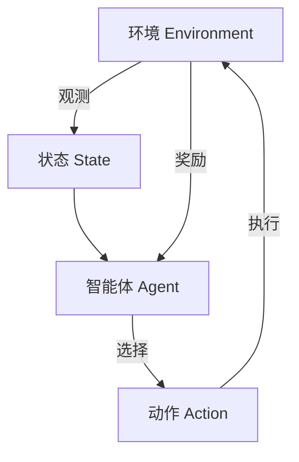
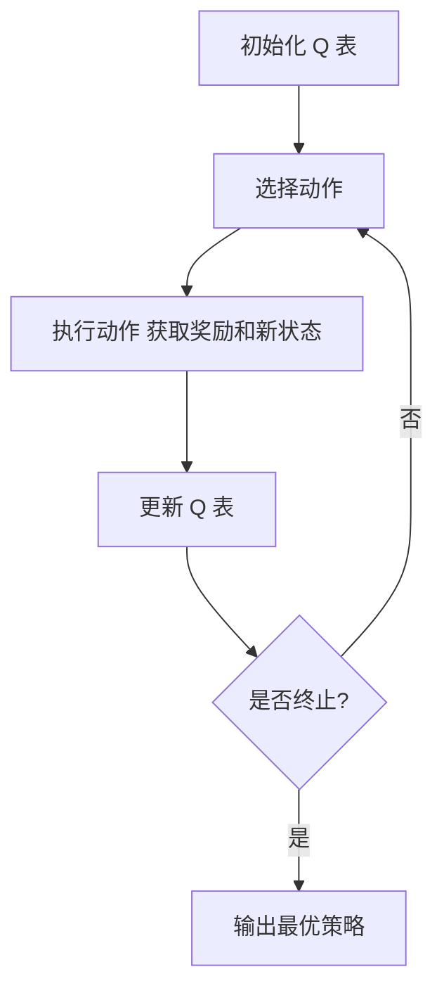
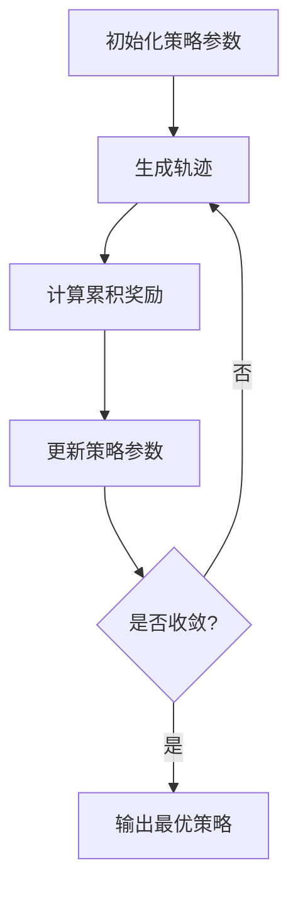

# 强化学习：在快递派送中的应用

## 1.背景介绍

### 1.1 快递行业的挑战

随着电子商务的蓬勃发展,快递行业也迎来了前所未有的繁荣。然而,快递公司也面临着诸多挑战,如何高效利用有限的人力和车辆资源、如何优化路线规划、如何提高配送效率等。传统的路线规划方法往往依赖人工经验,难以适应动态多变的实际情况。

### 1.2 强化学习的优势

强化学习(Reinforcement Learning,RL)作为机器学习的一个重要分支,具有处理序列决策问题的独特优势。它通过与环境的交互来学习,不需要事先的规则或监督数据,能够自主探索最优策略。这使得强化学习在路线优化、调度决策等领域展现出巨大的应用潜力。

## 2.核心概念与联系

### 2.1 强化学习基本概念

强化学习系统通常由四个核心要素组成:

- 环境(Environment)
- 状态(State)
- 动作(Action)
- 奖励(Reward)

智能体(Agent)通过与环境交互,观测当前状态,选择合适的动作,并获得相应的奖励或惩罚。目标是学习一个策略(Policy),使得在给定状态下选择的动作序列能够最大化预期的累积奖励。



### 2.2 马尔可夫决策过程(MDP)

快递派送问题可以建模为马尔可夫决策过程(Markov Decision Process, MDP),它是强化学习的数学基础。MDP由以下要素组成:

- 状态集合 $\mathcal{S}$
- 动作集合 $\mathcal{A}$
- 转移概率 $\mathcal{P}_{ss'}^a = \Pr(s' | s, a)$
- 奖励函数 $\mathcal{R}_s^a$

其中,转移概率表示在状态 $s$ 下执行动作 $a$ 后,转移到状态 $s'$ 的概率。奖励函数定义了在状态 $s$ 执行动作 $a$ 后获得的即时奖励。

### 2.3 价值函数与贝尔曼方程

价值函数(Value Function)是强化学习的核心概念之一,用于评估一个状态或状态-动作对的长期价值。

$$
V^{\pi}(s) = \mathbb{E}_{\pi}\left[ \sum_{t=0}^{\infty} \gamma^t r_{t+1} | s_0 = s \right]
$$

其中,$\pi$ 表示策略,$\gamma \in [0, 1)$ 是折现因子,用于平衡当前奖励和未来奖励的权重。

贝尔曼方程(Bellman Equation)描述了价值函数与即时奖励和后继状态价值之间的关系,是求解最优策略的基础。

$$
V^*(s) = \max_a \mathbb{E}_{s' \sim \mathcal{P}}\left[ R_s^a + \gamma V^*(s') \right]
$$

## 3.核心算法原理具体操作步骤

强化学习算法可分为基于价值函数(Value-based)和基于策略(Policy-based)两大类。以下介绍两种典型算法的原理和操作步骤。

### 3.1 Q-Learning

Q-Learning 是一种基于价值函数的经典算法,通过不断更新状态-动作值函数 $Q(s, a)$ 来逼近最优策略。算法步骤如下:

1. 初始化 $Q(s, a)$ 为任意值
2. 对于每个Episode:
    - 初始化起点状态 $s_0$
    - 对于每个时间步 $t$:
        - 选择动作 $a_t = \arg\max_a Q(s_t, a)$ (探索/利用策略)
        - 执行动作 $a_t$,观测奖励 $r_{t+1}$ 和新状态 $s_{t+1}$
        - 更新 $Q(s_t, a_t) \leftarrow Q(s_t, a_t) + \alpha \left[ r_{t+1} + \gamma \max_{a'} Q(s_{t+1}, a') - Q(s_t, a_t) \right]$
        - $s_t \leftarrow s_{t+1}$
    - 直到达到终止状态

其中,$\alpha$ 是学习率,用于控制更新幅度。



### 3.2 策略梯度算法(REINFORCE)

策略梯度算法是基于策略的强化学习方法,直接优化策略参数以最大化预期累积奖励。REINFORCE 算法步骤如下:

1. 初始化策略参数 $\theta$
2. 对于每个Episode:
    - 生成一个轨迹 $\tau = (s_0, a_0, r_1, s_1, a_1, \dots, r_T)$
    - 计算轨迹的累积奖励 $R(\tau) = \sum_{t=0}^{T} r_t$
    - 更新策略参数:
        $$\theta \leftarrow \theta + \alpha \gamma^t \nabla_{\theta} \log \pi_{\theta}(a_t | s_t) R(\tau)$$
    - 直到收敛

其中,$\pi_{\theta}(a|s)$ 是策略网络输出的动作概率分布,$\alpha$ 是学习率。



## 4.数学模型和公式详细讲解举例说明

### 4.1 马尔可夫决策过程建模

将快递派送问题建模为马尔可夫决策过程(MDP),具体要素如下:

- 状态 $s$:包含车辆位置、未配送订单等信息
- 动作 $a$:选择下一个配送地点
- 转移概率 $\mathcal{P}_{ss'}^a$:根据路径距离、交通状况等计算到达下一状态的概率
- 奖励函数 $\mathcal{R}_s^a$:可设置为负的路程距离,以鼓励选择更短路径

例如,假设有一辆配送车需要将 $n$ 个订单分别配送到 $n$ 个不同地点。令 $s_t = (x_t, y_t, U_t)$ 表示第 $t$ 个时间步的状态,其中 $(x_t, y_t)$ 是车辆位置, $U_t$ 是未配送订单集合。

如果选择动作 $a_t$ 将订单 $i \in U_t$ 配送到地点 $l_i$,则转移到新状态 $s_{t+1} = (l_i, U_t \setminus \{i\})$,奖励为 $r_{t+1} = -d(x_t, y_t, l_i)$,其中 $d(\cdot)$ 计算两点间的距离。

### 4.2 时间差分学习

时间差分(Temporal Difference, TD)学习是一种重要的价值函数近似方法,通过估计当前状态价值与后继状态价值之差(时间差分误差)来更新价值函数。

$$
\delta_t = r_{t+1} + \gamma V(s_{t+1}) - V(s_t)
$$

$$
V(s_t) \leftarrow V(s_t) + \alpha \delta_t
$$

其中,$\alpha$ 是学习率。TD 学习可以应用于 Q-Learning 等算法中,通过不断缩小时间差分误差来逼近最优价值函数。

例如,在快递派送场景中,如果当前车辆位置为 $s_t = (x_t, y_t, U_t)$,选择动作 $a_t$ 将订单 $i$ 配送到 $l_i$,获得奖励 $r_{t+1} = -d(x_t, y_t, l_i)$,转移到新状态 $s_{t+1} = (l_i, U_t \setminus \{i\})$,则时间差分误差为:

$$
\delta_t = -d(x_t, y_t, l_i) + \gamma \max_{a'} Q(s_{t+1}, a') - Q(s_t, a_t)
$$

通过不断缩小 $\delta_t$,可以更新 $Q(s_t, a_t)$ 逼近其最优值。

### 4.3 策略梯度算法推导

策略梯度算法的目标是直接优化策略参数 $\theta$,使得预期累积奖励 $J(\theta)$ 最大化:

$$
J(\theta) = \mathbb{E}_{\tau \sim \pi_{\theta}} \left[ R(\tau) \right] = \mathbb{E}_{\tau \sim \pi_{\theta}} \left[ \sum_{t=0}^{T} r_t \right]
$$

根据策略梯度定理,可以计算梯度 $\nabla_{\theta} J(\theta)$ 并采用梯度上升法更新 $\theta$:

$$
\begin{aligned}
\nabla_{\theta} J(\theta) &= \mathbb{E}_{\tau \sim \pi_{\theta}} \left[ \sum_{t=0}^{T} \nabla_{\theta} \log \pi_{\theta}(a_t | s_t) R(\tau) \right] \\
&\approx \frac{1}{N} \sum_{i=1}^{N} \sum_{t=0}^{T_i} \nabla_{\theta} \log \pi_{\theta}(a_t^{(i)} | s_t^{(i)}) R(\tau^{(i)})
\end{aligned}
$$

其中,第二个等式是通过采样 $N$ 条轨迹 $\tau^{(i)}$ 来近似期望。

在快递派送场景中,策略网络 $\pi_{\theta}(a|s)$ 可以输出在状态 $s$ 下选择每个可能动作 $a$ 的概率分布。通过采样多条轨迹,计算每条轨迹的累积奖励 $R(\tau)$,并根据上式更新策略参数 $\theta$,就可以逐步优化策略,使其收敛到最优解。

## 5.项目实践:代码实例和详细解释说明

为了更好地理解强化学习在快递派送中的应用,我们提供了一个基于 Python 的简单实现示例。该示例使用 Q-Learning 算法求解一个简化的快递派送问题。

### 5.1 问题描述

假设有一辆配送车需要将 $n$ 个订单分别配送到 $n$ 个不同地点。车辆初始位置和各订单地点的坐标已知。我们需要找到一条最优路线,使得总行驶距离最短。

### 5.2 环境模拟

我们首先定义环境类 `DeliveryEnv`,用于模拟快递派送过程:

```python
class DeliveryEnv:
    def __init__(self, locations):
        self.locations = locations
        self.n_locations = len(locations)
        self.reset()

    def reset(self):
        self.vehicle_loc = 0  # 车辆初始位置
        self.unvisited = set(range(1, self.n_locations))  # 未配送订单集合
        return self.vehicle_loc, self.unvisited

    def step(self, action):
        next_loc = action
        self.unvisited.remove(next_loc)
        reward = -distance(self.locations[self.vehicle_loc], self.locations[next_loc])
        self.vehicle_loc = next_loc
        done = len(self.unvisited) == 0
        return self.vehicle_loc, self.unvisited, reward, done
```

其中,`locations` 是一个包含所有地点坐标的列表,`reset` 方法初始化车辆位置和未配送订单集合,`step` 方法执行配送动作并返回新状态、奖励和是否终止的标志。

### 5.3 Q-Learning 实现

接下来,我们实现 Q-Learning 算法:

```python
import random

class QLearning:
    def __init__(self, env, alpha=0.1, gamma=0.9, epsilon=0.1):
        self.env = env
        self.alpha = alpha  # 学习率
        self.gamma = gamma  # 折现因子
        self.epsilon = epsilon  # 探索率
        self.q_table = {}  # Q 表

    def get_q_value(self, state, action):
        key = (state, action)
        return self.q_table.get(key, 0.0)

    def update_q_value(self, state, action, reward, next_state):