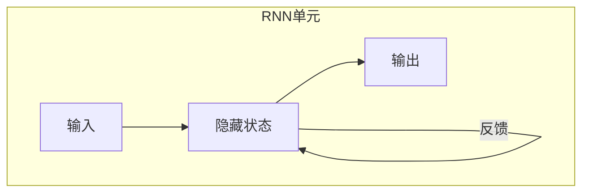

# 循环神经网络(RNN)：序列数据的得力助手

## 1.背景介绍

在过去的几十年里，神经网络在处理结构化数据方面取得了巨大的成功。然而，当涉及到序列数据(如自然语言、语音、视频等)时,传统的神经网络模型就显得力不从心了。这主要是因为传统模型无法很好地捕捉序列数据中的时间依赖关系。

为了解决这个问题,循环神经网络(Recurrent Neural Networks, RNN)应运而生。RNN是一种特殊的神经网络,它能够处理序列数据,并且在处理当前输入时,可以利用之前的状态信息。这使得RNN在自然语言处理、语音识别、机器翻译等领域大显身手。

### 1.1 序列数据的挑战

序列数据的一个显著特点是,当前的输出不仅取决于当前的输入,还取决于之前的输入序列。以自然语言为例,句子"我今天去了公园"的意义,需要结合前面的上下文信息才能完全理解。传统的前馈神经网络很难有效地处理这种长期依赖关系。

### 1.2 RNN的优势

相比传统神经网络,RNN的主要优势在于:

- 具有记忆能力,能捕捉序列数据中的时间依赖关系
- 对输入和输出序列长度没有严格要求,可处理任意长度序列
- 在许多序列数据任务上表现出色,如语音识别、机器翻译等

## 2.核心概念与联系

### 2.1 RNN的基本结构

RNN的核心思想是在神经网络中引入状态(state)的概念,使得网络在处理序列当前元素时,可以综合考虑之前元素的信息。

RNN的基本结构如下所示的Mermaid流程图:

其中:

- 输入(Input): 当前时刻的输入数据
- 隐藏状态(Hidden State): 网络的记忆或状态,它综合了当前输入和之前状态的信息
- 输出(Output): 根据当前隐藏状态计算得到的输出

在处理序列数据时,RNN的隐藏状态会传递至下一个时刻,这样就能捕捉整个序列的时间依赖关系。

### 2.2 RNN的计算过程

设当前时刻输入为 $x_t$,上一时刻隐藏状态为 $h_{t-1}$,则 RNN 在当前时刻的隐藏状态 $h_t$ 计算公式为:

$$h_t = \tanh(W_{hh}h_{t-1} + W_{xh}x_t)$$

其中 $W_{hh}$ 和 $W_{xh}$ 分别为隐藏层与隐藏层之间、输入层与隐藏层之间的权重矩阵。$\tanh$ 为双曲正切激活函数。

基于当前隐藏状态 $h_t$,可计算当前时刻的输出 $y_t$:

$$y_t = W_{yh}h_t$$

其中 $W_{yh}$ 为隐藏层与输出层之间的权重矩阵。

通过以上公式,RNN 可以一步步处理整个序列数据,并产生对应的输出序列。

### 2.3 RNN的反向传播

与传统神经网络类似,RNN 也可以通过反向传播算法进行训练。然而,由于 RNN 涉及序列操作,因此反向传播时需要沿着时间维度进行计算,这一过程被称为反向传播through time (BPTT)。

BPTT 算法的基本思路是:从输出端开始,计算损失函数对每个权重的梯度,然后沿序列方向逐步传播至输入端,累加每一时刻的梯度,最终得到每个权重的总梯度。

## 3.核心算法原理具体操作步骤

### 3.1 RNN正向计算过程

给定一个长度为 T 的序列 $(x_1, x_2, ..., x_T)$,RNN 按照如下步骤进行正向计算:

1) 对于序列的第一个元素 $x_1$,计算初始隐藏状态 $h_1$:

$$h_1 = \tanh(W_{xh}x_1 + b_h)$$

其中 $b_h$ 为隐藏层的偏置项。

2) 对于后续的每个时刻 t (t=2,3,...,T):
   
   a) 计算当前隐藏状态:
      
   $$h_t = \tanh(W_{hh}h_{t-1} + W_{xh}x_t)$$
   
   b) 基于当前隐藏状态计算输出:
      
   $$y_t = W_{yh}h_t + b_y$$
   
   其中 $b_y$ 为输出层的偏置项。

通过以上步骤,RNN 可以产生一个与输入序列等长的输出序列 $(y_1, y_2, ..., y_T)$。

### 3.2 RNN反向传播过程

为了训练 RNN 模型,需要使用 BPTT 算法计算损失函数对各个权重的梯度。假设损失函数为 $\mathcal{L}$,则 BPTT 算法步骤如下:

1) 初始化各个权重的梯度为0: $\nabla W_{xh} = \nabla W_{hh} = \nabla W_{yh} = 0$

2) 从最后一个时刻 T 开始,计算每个时刻的梯度:

   a) 对于最后一个时刻 T:
      
      $$
      \begin{aligned}
      \nabla_{y_T}\mathcal{L} &= \frac{\partial \mathcal{L}}{\partial y_T} \\
      \nabla_{h_T}\mathcal{L} &= \nabla_{y_T}\mathcal{L} W_{yh}^T \\
      \nabla W_{yh} &\leftarrow \nabla W_{yh} + \nabla_{y_T}\mathcal{L} h_T^T \\
      \nabla W_{hh} &\leftarrow \nabla W_{hh} + \nabla_{h_T}\mathcal{L} (1 - h_T^2) h_{T-1}^T \\
      \nabla W_{xh} &\leftarrow \nabla W_{xh} + \nabla_{h_T}\mathcal{L} (1 - h_T^2) x_T^T
      \end{aligned}
      $$

   b) 对于时刻 t (t=T-1, T-2, ..., 1):

      $$
      \begin{aligned}
      \nabla_{y_t}\mathcal{L} &= \frac{\partial \mathcal{L}}{\partial y_t} \\
      \nabla_{h_t}\mathcal{L} &= \nabla_{y_t}\mathcal{L} W_{yh}^T + \nabla_{h_{t+1}}\mathcal{L} W_{hh}^T (1 - h_{t+1}^2) \\
      \nabla W_{yh} &\leftarrow \nabla W_{yh} + \nabla_{y_t}\mathcal{L} h_t^T \\
      \nabla W_{hh} &\leftarrow \nabla W_{hh} + \nabla_{h_t}\mathcal{L} (1 - h_t^2) h_{t-1}^T \\
      \nabla W_{xh} &\leftarrow \nabla W_{xh} + \nabla_{h_t}\mathcal{L} (1 - h_t^2) x_t^T
      \end{aligned}
      $$

3) 使用计算得到的梯度,通过优化算法(如SGD)更新各个权重矩阵。

以上就是 RNN 在单个训练样本上的正向计算和反向传播过程。在实际训练中,需要对整个训练集进行多次迭代,不断优化模型权重。

## 4.数学模型和公式详细讲解举例说明

在上一节中,我们已经介绍了 RNN 的核心计算过程,包括正向计算和反向传播。现在,我们通过一个具体的数值例子,进一步解释 RNN 的数学模型和公式。

### 4.1 正向计算示例

假设我们有一个简单的 RNN 模型,隐藏层只有一个单元,输入和输出也只有一个单元。给定一个长度为3的序列 $(0.5, 0.1, 0.6)$,权重矩阵如下:

$$
W_{xh} = 0.1, W_{hh} = 0.3, W_{yh} = 0.5, b_h = 0.2, b_y = 0.1
$$

我们来计算这个 RNN 在处理该序列时的隐藏状态和输出。

1) 时刻 t=1:

$$
\begin{aligned}
h_1 &= \tanh(W_{xh}x_1 + b_h) \\
    &= \tanh(0.1 \times 0.5 + 0.2) \\
    &= 0.375 \\
y_1 &= W_{yh}h_1 + b_y \\
    &= 0.5 \times 0.375 + 0.1 \\
    &= 0.2875
\end{aligned}
$$

2) 时刻 t=2:

$$
\begin{aligned}
h_2 &= \tanh(W_{hh}h_1 + W_{xh}x_2) \\
    &= \tanh(0.3 \times 0.375 + 0.1 \times 0.1) \\
    &= 0.1875 \\
y_2 &= W_{yh}h_2 + b_y \\
    &= 0.5 \times 0.1875 + 0.1 \\
    &= 0.19375
\end{aligned}
$$

3) 时刻 t=3:

$$
\begin{aligned}
h_3 &= \tanh(W_{hh}h_2 + W_{xh}x_3) \\
    &= \tanh(0.3 \times 0.1875 + 0.1 \times 0.6) \\
    &= 0.3375 \\
y_3 &= W_{yh}h_3 + b_y \\
    &= 0.5 \times 0.3375 + 0.1 \\
    &= 0.27875
\end{aligned}
$$

因此,对于输入序列 $(0.5, 0.1, 0.6)$,该 RNN 模型的输出序列为 $(0.2875, 0.19375, 0.27875)$。

通过这个例子,我们可以清楚地看到 RNN 如何利用隐藏状态来捕捉序列数据的时间依赖关系。每个时刻的隐藏状态都是基于上一时刻的隐藏状态和当前输入计算得到的。

### 4.2 反向传播示例

接下来,我们以同一个 RNN 模型为例,演示反向传播的过程。假设在时刻 t=3 的损失函数值为 $\mathcal{L} = 0.1$,我们来计算各个权重矩阵的梯度。

1) 时刻 t=3:

$$
\begin{aligned}
\nabla_{y_3}\mathcal{L} &= \frac{\partial \mathcal{L}}{\partial y_3} = 1 \\
\nabla_{h_3}\mathcal{L} &= \nabla_{y_3}\mathcal{L} W_{yh}^T = 1 \times 0.5 = 0.5 \\
\nabla W_{yh} &\leftarrow 0 + 1 \times 0.3375 = 0.3375 \\
\nabla W_{hh} &\leftarrow 0 + 0.5 \times (1 - 0.3375^2) \times 0.1875 = 0.03125 \\
\nabla W_{xh} &\leftarrow 0 + 0.5 \times (1 - 0.3375^2) \times 0.6 = 0.1
\end{aligned}
$$

2) 时刻 t=2:

$$
\begin{aligned}
\nabla_{y_2}\mathcal{L} &= \frac{\partial \mathcal{L}}{\partial y_2} = 0 \\
\nabla_{h_2}\mathcal{L} &= \nabla_{y_2}\mathcal{L} W_{yh}^T + \nabla_{h_3}\mathcal{L} W_{hh}^T (1 - h_3^2) \\
                       &= 0 + 0.5 \times 0.3 \times (1 - 0.3375^2) \\
                       &= 0.05625 \\
\nabla W_{yh} &\leftarrow 0.3375 + 0 \times 0.1875 = 0.3375 \\
\nabla W_{hh} &\leftarrow 0.03125 + 0.05625 \times (1 - 0.1875^2) \times 0.375 = 0.05859 \\
\nabla W_{xh} &\leftarrow 0.1 + 0.