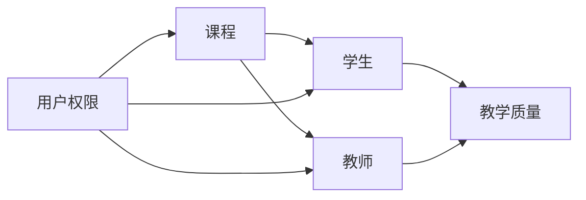

# 教学管理系统详细设计与具体代码实现

## 1. 背景介绍

### 1.1 教学管理系统的重要性

在现代化教育中，教学管理系统扮演着至关重要的角色。它能够有效地简化教学管理流程，提高教学质量和效率，为教师、学生和管理者提供便利。一个优秀的教学管理系统能够实现教学资源的共享、学生学习过程的跟踪、教学质量的评估等功能，从而推动教育的现代化发展。

### 1.2 教学管理系统的主要功能

一个完善的教学管理系统通常包括以下主要功能：

1. 课程管理：包括课程信息的录入、修改、删除等功能，以及课程资源的上传和下载。
2. 学生管理：包括学生信息的录入、修改、删除等功能，以及学生选课、成绩录入和查询等功能。
3. 教师管理：包括教师信息的录入、修改、删除等功能，以及教师授课安排、教学任务分配等功能。
4. 教学质量评估：包括学生评教、教师互评、教学督导等功能，用于评估教学质量和教师教学水平。
5. 系统管理：包括用户权限管理、数据备份与恢复、系统日志管理等功能，用于保障系统的安全稳定运行。

### 1.3 教学管理系统的开发技术

目前，常用的教学管理系统开发技术包括：

1. 前端技术：HTML、CSS、JavaScript、Vue.js、React.js等。
2. 后端技术：Java、Python、PHP、Node.js等。
3. 数据库技术：MySQL、Oracle、MongoDB等。
4. 开发框架：Spring Boot、Django、Laravel等。

选择合适的开发技术和框架，能够提高系统开发的效率和质量，同时也能够降低开发成本和维护难度。

## 2. 核心概念与联系

### 2.1 教学管理系统的核心概念

教学管理系统中的核心概念包括：

1. 课程：指教学活动中的教学内容和教学目标，是教学管理系统中的基本单位。
2. 学生：指参与教学活动的学习者，是教学管理系统的服务对象之一。
3. 教师：指负责教学活动的组织和实施的教育工作者，是教学管理系统的服务对象之一。
4. 教学质量：指教学活动的效果和效率，是教学管理系统的重要评估指标。
5. 用户权限：指不同用户在系统中的操作权限和数据访问权限，是保障系统安全和数据隐私的重要手段。

### 2.2 核心概念之间的联系

教学管理系统中的核心概念之间存在着紧密的联系，如下图所示：



从图中可以看出，课程是联系学生和教师的纽带，学生和教师共同决定了教学质量的高低。同时，用户权限贯穿于整个系统中，对课程、学生和教师的管理都起着重要的作用。

## 3. 核心算法原理具体操作步骤

### 3.1 课程管理算法

课程管理是教学管理系统的核心功能之一，其主要算法包括：

1. 课程信息的增删改查算法：
   - 增加课程：将新课程的信息插入到数据库中的课程表中。
   - 删除课程：根据课程ID从数据库中的课程表中删除对应的课程信息。
   - 修改课程：根据课程ID从数据库中的课程表中查询出对应的课程信息，修改后更新到数据库中。
   - 查询课程：根据课程ID或课程名称从数据库中的课程表中查询出对应的课程信息。

2. 课程资源的上传和下载算法：
   - 上传资源：将资源文件上传到服务器指定目录，并将资源信息插入到数据库中的资源表中。
   - 下载资源：根据资源ID从数据库中的资源表中查询出对应的资源信息，从服务器指定目录中读取资源文件并下载。

### 3.2 学生管理算法

学生管理是教学管理系统的另一个核心功能，其主要算法包括：

1. 学生信息的增删改查算法：
   - 增加学生：将新学生的信息插入到数据库中的学生表中。
   - 删除学生：根据学生ID从数据库中的学生表中删除对应的学生信息。
   - 修改学生：根据学生ID从数据库中的学生表中查询出对应的学生信息，修改后更新到数据库中。
   - 查询学生：根据学生ID或学生姓名从数据库中的学生表中查询出对应的学生信息。

2. 学生选课算法：
   - 选课：将学生ID和课程ID插入到数据库中的选课表中。
   - 退选：根据学生ID和课程ID从数据库中的选课表中删除对应的选课信息。
   - 查询选课：根据学生ID从数据库中的选课表中查询出该学生选修的所有课程信息。

3. 学生成绩管理算法：
   - 录入成绩：根据学生ID和课程ID将成绩信息插入到数据库中的成绩表中。
   - 修改成绩：根据学生ID和课程ID从数据库中的成绩表中查询出对应的成绩信息，修改后更新到数据库中。
   - 查询成绩：根据学生ID和课程ID从数据库中的成绩表中查询出对应的成绩信息。

### 3.3 教师管理算法

教师管理是教学管理系统中不可或缺的功能，其主要算法包括：

1. 教师信息的增删改查算法：
   - 增加教师：将新教师的信息插入到数据库中的教师表中。
   - 删除教师：根据教师ID从数据库中的教师表中删除对应的教师信息。
   - 修改教师：根据教师ID从数据库中的教师表中查询出对应的教师信息，修改后更新到数据库中。
   - 查询教师：根据教师ID或教师姓名从数据库中的教师表中查询出对应的教师信息。

2. 教师授课管理算法：
   - 安排授课：将教师ID和课程ID插入到数据库中的授课表中。
   - 取消授课：根据教师ID和课程ID从数据库中的授课表中删除对应的授课信息。
   - 查询授课：根据教师ID从数据库中的授课表中查询出该教师授课的所有课程信息。

## 4. 数学模型和公式详细讲解举例说明

### 4.1 学生成绩加权平均分模型

在教学管理系统中，学生成绩的加权平均分是一个重要的评估指标，其数学模型如下：

$$
\bar{x} = \frac{\sum_{i=1}^{n} w_i x_i}{\sum_{i=1}^{n} w_i}
$$

其中，$\bar{x}$ 表示加权平均分，$x_i$ 表示第 $i$ 门课程的成绩，$w_i$ 表示第 $i$ 门课程的学分，$n$ 表示课程总数。

例如，某学生修读了3门课程，各课程的成绩和学分如下：

| 课程 | 成绩 | 学分 |
| ---- | ---- | ---- |
| 数学 | 85   | 4    |
| 英语 | 90   | 3    |
| 计算机 | 80 | 5    |

则该学生的加权平均分为：

$$
\bar{x} = \frac{85 \times 4 + 90 \times 3 + 80 \times 5}{4 + 3 + 5} = 84.17
$$

### 4.2 教学质量评估模型

教学质量评估是教学管理系统的重要功能之一，其数学模型可以用加权平均法来表示：

$$
Q = \sum_{i=1}^{n} w_i q_i
$$

其中，$Q$ 表示教学质量综合评分，$q_i$ 表示第 $i$ 个评估指标的得分，$w_i$ 表示第 $i$ 个评估指标的权重，$n$ 表示评估指标总数。

例如，某课程的教学质量评估包括4个指标，各指标的得分和权重如下：

| 评估指标 | 得分 | 权重 |
| -------- | ---- | ---- |
| 教学内容 | 85   | 0.3  |
| 教学方法 | 90   | 0.3  |
| 教学态度 | 95   | 0.2  |
| 教学效果 | 80   | 0.2  |

则该课程的教学质量综合评分为：

$$
Q = 85 \times 0.3 + 90 \times 0.3 + 95 \times 0.2 + 80 \times 0.2 = 87.5
$$

## 5. 项目实践：代码实例和详细解释说明

下面以Java语言为例，给出教学管理系统中几个核心功能的代码实现。

### 5.1 课程管理模块

```java
// 课程实体类
public class Course {
    private Long id;
    private String name;
    private Integer credit;
    // 省略getter和setter方法
}

// 课程DAO接口
public interface CourseDAO {
    void addCourse(Course course);
    void deleteCourse(Long id);
    void updateCourse(Course course);
    Course getCourseById(Long id);
    List<Course> getAllCourses();
}

// 课程Service接口
public interface CourseService {
    void addCourse(Course course);
    void deleteCourse(Long id);
    void updateCourse(Course course);
    Course getCourseById(Long id);
    List<Course> getAllCourses();
}

// 课程Service实现类
@Service
public class CourseServiceImpl implements CourseService {
    @Autowired
    private CourseDAO courseDAO;
    
    @Override
    public void addCourse(Course course) {
        courseDAO.addCourse(course);
    }
    
    @Override
    public void deleteCourse(Long id) {
        courseDAO.deleteCourse(id);
    }
    
    @Override
    public void updateCourse(Course course) {
        courseDAO.updateCourse(course);
    }
    
    @Override
    public Course getCourseById(Long id) {
        return courseDAO.getCourseById(id);
    }
    
    @Override
    public List<Course> getAllCourses() {
        return courseDAO.getAllCourses();
    }
}
```

上述代码实现了课程管理模块的基本功能，包括课程的增删改查。其中，`Course`类是课程实体类，包含课程的基本信息；`CourseDAO`接口定义了课程数据访问的基本方法；`CourseService`接口定义了课程业务逻辑的基本方法；`CourseServiceImpl`类是`CourseService`接口的实现类，通过调用`CourseDAO`接口的方法来实现课程管理的业务逻辑。

### 5.2 学生管理模块

```java
// 学生实体类
public class Student {
    private Long id;
    private String name;
    private String gender;
    private Date birthday;
    // 省略getter和setter方法
}

// 学生DAO接口
public interface StudentDAO {
    void addStudent(Student student);
    void deleteStudent(Long id);
    void updateStudent(Student student);
    Student getStudentById(Long id);
    List<Student> getAllStudents();
}

// 学生Service接口
public interface StudentService {
    void addStudent(Student student);
    void deleteStudent(Long id);
    void updateStudent(Student student);
    Student getStudentById(Long id);
    List<Student> getAllStudents();
}

// 学生Service实现类
@Service
public class StudentServiceImpl implements StudentService {
    @Autowired
    private StudentDAO studentDAO;
    
    @Override
    public void addStudent(Student student) {
        studentDAO.addStudent(student);
    }
    
    @Override
    public void deleteStudent(Long id) {
        studentDAO.deleteStudent(id);
    }
    
    @Override
    public void updateStudent(Student student) {
        studentDAO.updateStudent(student);
    }
    
    @Override
    public Student getStudentById(Long id) {
        return studentDAO.getStudentById(id);
    }
    
    @Override
    public List<Student> getAllStudents() {
        return studentDAO.getAllStudents();
    }
}
```

上述代码实现了学生管理模块的基本功能，包括学生的增删改查。其中，`Student`类是学生实体类，包含学生的基本信息；`StudentDAO`接口定义了学生数据访问的基本方法；`StudentService`接口定义了学生业务逻辑的基本方法；`StudentServiceImpl`类是`StudentService`接口的实现类，通过调用`StudentDAO`接口的方法来实现学生管理的业务逻辑。

### 5.3 教师管理模块

```java
// 教师实体