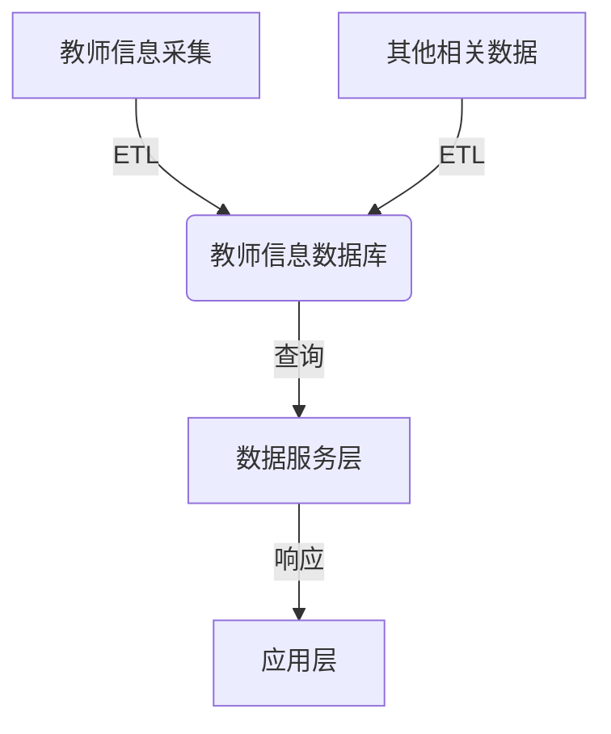
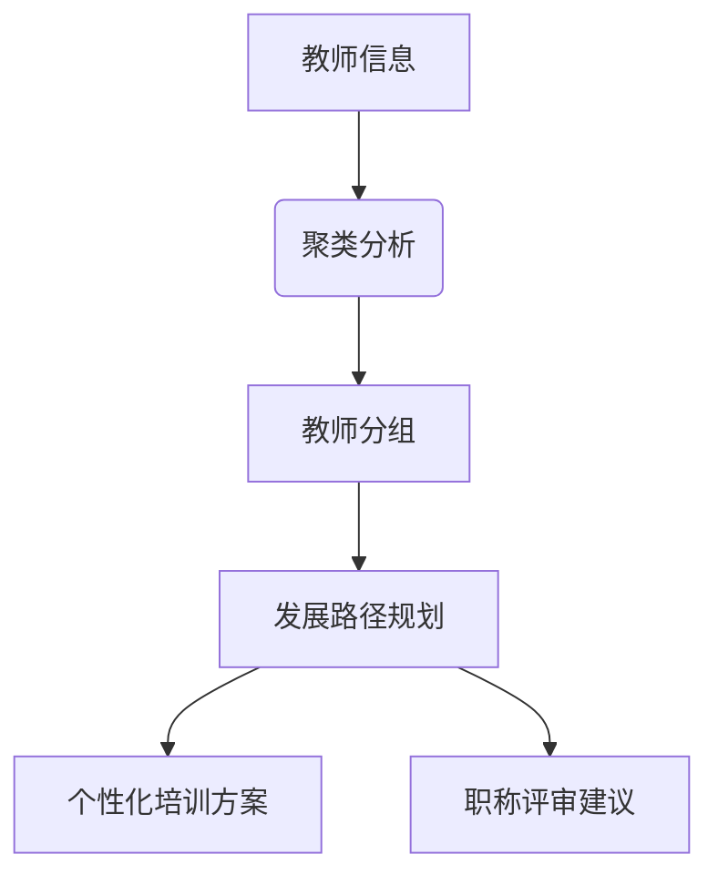
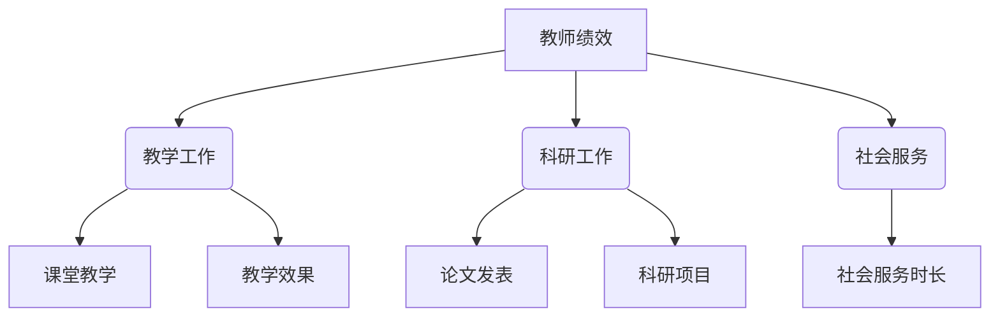
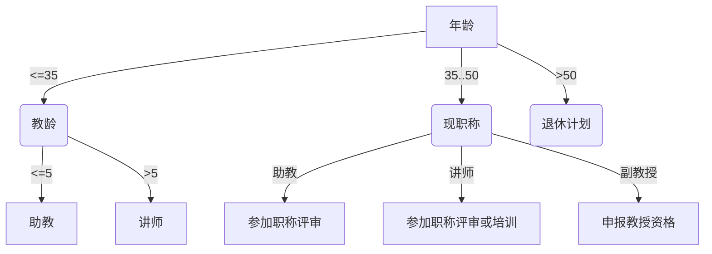

# 教师管理系统详细设计与具体代码实现

## 1.背景介绍

教育事业是国家发展的基石,而教师则是教育事业的中坚力量。随着信息技术的飞速发展,教育领域也在不断地融入新的技术手段,以提高教学质量和管理效率。教师管理系统作为学校管理的重要组成部分,旨在实现对教师信息的集中管理、高效调配和科学决策。

传统的教师管理方式存在诸多弊端,如信息孤岛、重复劳动、低效率等,亟需通过信息化手段予以改革和优化。教师管理系统的出现,可以有效整合教师信息资源,实现跨部门、跨地区的数据共享,为学校领导提供决策支持,为教师提供便利服务,促进教育事业的持续健康发展。

## 2.核心概念与联系

教师管理系统的核心概念包括:

1. **教师信息管理**:包括教师的基本信息、职称信息、培训信息、奖惩信息等,实现教师全生命周期的信息管理。

2. **教学管理**:涉及教师的课程安排、教学计划、教学评价等,为教学工作提供支撑。

3. **绩效考核**:根据学校制定的考核标准,对教师的教学、科研、社会服务等方面进行量化评估,作为晋级晋薪的重要依据。

4. **培训管理**:包括培训需求调研、培训计划制定、培训实施跟踪、培训效果评估等,促进教师职业发展。

5. **决策分析**:基于教师信息数据,结合数据挖掘、决策树等技术,为学校领导提供决策支持。

这些核心概念相互关联、环环相扣,共同构建了一个完整的教师管理体系。其中,教师信息管理是基础,决策分析是目标,其他模块是支撑和延伸。

## 3.核心算法原理具体操作步骤

教师管理系统的核心算法主要包括:

### 3.1 数据建模与存储



教师信息通过各种渠道采集后,需要进行数据清洗、转换和加载(ETL),构建统一的教师信息数据库。同时,还需要整合其他相关数据,如课程信息、考核标准等,为系统的正常运行提供数据支撑。

数据服务层负责对底层数据库进行访问和查询,为上层应用提供所需数据。

### 3.2 教师绩效考核算法

教师绩效考核是教师管理系统的核心功能之一,通常采用加权评分的方式进行量化评估。具体步骤如下:

1. 确定考核指标体系,包括教学工作、科研工作、社会服务等方面的指标及权重。

2. 对每个指标进行打分,可采用专家评分、学生评教等方式。

3. 计算加权分数:

$$
\text{总分} = \sum_{i=1}^{n}w_i \times s_i
$$

其中,$w_i$表示第$i$个指标的权重,$s_i$表示第$i$个指标的得分。

4. 根据总分和预设的分数段,确定教师的绩效等级。

该算法可根据实际需求进行调整和优化,例如引入模糊评判、层次分析等方法,以提高评价的科学性和公正性。

### 3.3 教师职业发展路径规划



通过对教师的基本信息、培训经历、工作表现等数据进行聚类分析,可以将教师划分为不同的群体。然后,针对不同群体的特点,规划不同的职业发展路径,制定个性化的培训方案,或给出职称评审的建议,为教师的职业生涯提供指导和帮助。

## 4.数学模型和公式详细讲解举例说明

### 4.1 教师绩效考核模型

教师绩效考核模型可以借鉴层次分析法(AHP)的思想,构建一个多层次、多指标的评价体系。具体步骤如下:

1. 建立层次结构模型

将教师绩效考核目标按层次分解为多个子目标或准则,形成层次结构模型。例如,可以将"教师绩效"作为总目标,分解为"教学工作"、"科研工作"、"社会服务"等准则,每个准则下又可细分为具体的考核指标。

2. 构造判断矩阵

针对每个层次,构造判断矩阵,通过专家打分的方式确定各准则或指标间的相对重要性。设$C_1,C_2,...,C_n$为某一层次上的$n$个准则或指标,则判断矩阵$A=(a_{ij})_{n\times n}$的元素$a_{ij}$表示$C_i$相对于$C_j$的重要程度。

3. 层次单排序及一致性检验

计算得到判断矩阵的特征值和特征向量,其中最大特征值对应的特征向量即为该层次上各准则或指标的权重向量。同时,需要对权重向量进行一致性检验,确保判断矩阵的一致性。

4. 层次总排序

按层次依次计算各层次的权重向量,并通过加权求和的方式得到总排序权重,作为教师绩效的综合评分。

以某学校的教师绩效考核为例,假设总目标为"教师绩效",准则层为"教学工作"、"科研工作"、"社会服务",指标层包括"课堂教学"、"教学效果"、"论文发表"、"科研项目"、"社会服务时长"等,则可以构建如下层次结构模型:



通过专家打分构造判断矩阵,计算各层次的权重向量,最终得到各指标的综合权重,即可完成教师绩效的评分和排序。

### 4.2 教师职业发展路径规划模型

教师职业发展路径规划可以借助聚类分析和决策树算法,根据教师的个人特征和职业期望,为其制定个性化的发展路径。

1. **聚类分析**

首先,基于教师的年龄、职称、工作年限、培训经历、教学评分等信息,采用K-Means聚类算法或层次聚类算法,将教师划分为若干个群体。

设有$n$个教师,$X=\{x_1,x_2,...,x_n\}$为教师数据集,其中$x_i=(x_{i1},x_{i2},...,x_{im})$表示第$i$个教师的$m$维特征向量。聚类算法的目标是将$X$划分为$k$个互不相交的簇$C=\{C_1,C_2,...,C_k\}$,使得簇内相似度高,簇间相似度低。

常用的聚类算法包括:

- K-Means算法:以样本到簇质心的距离作为相似度度量,迭代优化簇划分,直至收敛。
- 层次聚类算法:基于样本间的距离,通过聚合或分裂的策略构建层次聚类树。

2. **决策树模型**

对于每个聚类簇,根据簇内教师的共性特征,结合学校的职称评审标准、培训计划等,构建一个决策树模型,为该簇内的教师生成职业发展路径。

决策树是一种基于实例属性对实例进行分类的监督学习算法,常用的构建算法有ID3、C4.5、CART等。以CART决策树为例,其构建过程包括:

- 根据训练数据,选择最优特征,作为决策树的根节点。
- 对于根节点的每个取值,递归地构建子树。
- 直至所有实例属于同一类别,或没有剩余特征可以用于分类,则生成叶节点。

例如,对于一个教师聚类簇,可以根据其年龄、现有职称、教龄等特征,生成如下决策树:



根据该决策树,可以为不同教师生成个性化的职业发展路径,如晋升计划、培训安排等,为教师的职业生涯提供指导和帮助。

## 5.项目实践:代码实例和详细解释说明

为了更好地理解教师管理系统的实现,我们提供了一个基于Python的简单示例项目。该项目包括以下几个核心模块:

### 5.1 数据模型

```python
from sqlalchemy import Column, Integer, String, Float, Date
from sqlalchemy.ext.declarative import declarative_base

Base = declarative_base()

class Teacher(Base):
    __tablename__ = 'teachers'

    id = Column(Integer, primary_key=True)
    name = Column(String)
    age = Column(Integer)
    title = Column(String)
    department = Column(String)
    hire_date = Column(Date)
    salary = Column(Float)

    def __repr__(self):
        return f"Teacher(id={self.id}, name='{self.name}', age={self.age}, title='{self.title}', department='{self.department}', hire_date='{self.hire_date}', salary={self.salary})"
```

这个模型定义了教师信息表的结构,包括教师ID、姓名、年龄、职称、所属部门、入职日期和薪资等字段。

### 5.2 数据操作

```python
from sqlalchemy import create_engine
from sqlalchemy.orm import sessionmaker

engine = create_engine('sqlite:///teachers.db')
Session = sessionmaker(bind=engine)

# 添加教师
def add_teacher(teacher):
    session = Session()
    session.add(teacher)
    session.commit()
    session.close()

# 查询教师
def get_teachers(filters=None):
    session = Session()
    query = session.query(Teacher)
    if filters:
        query = query.filter_by(**filters)
    teachers = query.all()
    session.close()
    return teachers
```

这部分代码实现了教师信息的添加和查询功能。`add_teacher`函数用于将新教师信息插入数据库,`get_teachers`函数则可以根据过滤条件查询教师信息。

### 5.3 绩效考核

```python
from sklearn.tree import DecisionTreeRegressor

# 加载教师数据
teachers = get_teachers()
X = [[t.age, t.hire_date.year - 2000, ...] for t in teachers]  # 特征矩阵
y = [t.salary for t in teachers]  # 目标变量

# 训练决策树模型
model = DecisionTreeRegressor()
model.fit(X, y)

# 预测新教师薪资
new_teacher = [35, 5, ...]
predicted_salary = model.predict([new_teacher])[0]
print(f"Predicted salary for new teacher: {predicted_salary}")
```

在这个示例中,我们使用scikit-learn库中的决策树回归算法,基于现有教师的年龄、入职年限等特征,对教师薪资进行预测。这种方法可以扩展到更复杂的绩效考核场景,如引入更多特征、采用集成模型等。

### 5.4 Web应用

```python
from flask import Flask, render_template, request
from models import Teacher
from utils import add_teacher, get_teachers

app = Flask(__name__)

@app.route('/')
def index():
    teachers = get_teachers()
    return render_template('index.html', teachers=teachers)

@app.route('/add', methods=['GET', 'POST'])
def add():
    if request.method == 'POST':
        name = request.form['name']
        age = int(request.form['age'])
        # ... 其他字段
        teacher = Teacher(name=name, age=age, ...)
        add_teacher(teacher)
        return redirect(url_for('index'))
    return render_template('add.html')

if __name__ == '__main__':
    app.run(debug=True)
```

这是一个基于Flask框架的简单