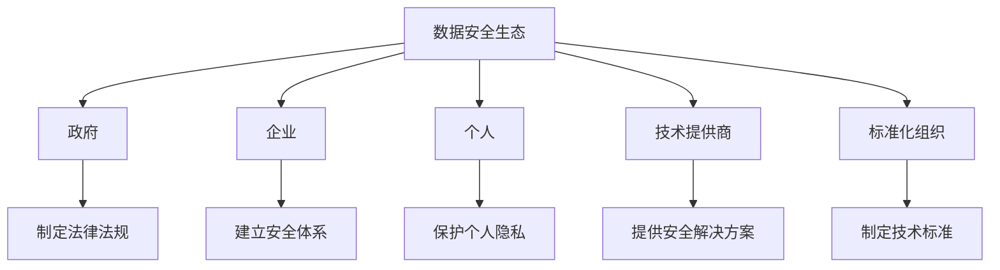

# 数据安全倡议：共建安全、共享、共治的数据安全生态

## 1. 背景介绍

### 1.1 数据安全的重要性

在当今的数字时代,数据已经成为了一种关键的战略资源。无论是个人、企业还是政府机构,都在不断产生和收集大量的数据。这些数据不仅包含了宝贵的商业信息、个人隐私,还涉及到国家安全等关键领域。因此,确保数据的安全性和隐私性就显得尤为重要。

### 1.2 数据安全面临的挑战

然而,随着数据量的快速增长和技术的不断发展,数据安全也面临着越来越多的挑战。网络攻击手段日益复杂,数据泄露事件时有发生。同时,数据共享和跨境数据流动也带来了新的安全隐患。此外,不同的利益相关方对于数据安全有着不同的需求和期望,这也增加了数据安全治理的复杂性。

### 1.3 数据安全倡议的必要性

为了应对这些挑战,构建一个安全、共享、共治的数据安全生态就显得尤为迫切。我们需要一个全面的数据安全倡议,来统一不同利益相关方的利益,制定统一的标准和规范,推动数据安全技术的创新和发展,从而为数字经济的可持续发展奠定坚实的基础。

## 2. 核心概念与联系

### 2.1 数据安全生态

数据安全生态是指数据安全领域中各个利益相关方之间的关系和相互作用。它包括了政府、企业、个人、技术提供商、标准化组织等多个层面。这些利益相关方在数据安全方面存在着密切的联系和相互依赖。



### 2.2 安全、共享、共治

"安全、共享、共治"是数据安全倡议的三大核心理念:

- **安全**:确保数据在整个生命周期中的机密性、完整性和可用性,防止数据泄露、篡改和滥用。
- **共享**:在保护数据安全的前提下,实现数据的合理共享和流动,释放数据的价值。
- **共治**:建立统一的数据安全治理体系,协调不同利益相关方的需求,实现有效的数据安全管理。

这三个理念相互关联、相辅相成,共同构建了一个健康、可持续的数据安全生态。

## 3. 核心算法原理具体操作步骤

在数据安全领域,有许多核心算法和技术原理被广泛应用。以下是其中一些重要算法的具体操作步骤:

### 3.1 加密算法

加密算法是保护数据机密性的关键技术。常用的加密算法包括对称加密算法(如AES)和非对称加密算法(如RSA)。

1. **对称加密算法操作步骤**:
   1) 生成密钥
   2) 使用密钥对明文进行加密,得到密文
   3) 传输或存储密文
   4) 使用相同的密钥对密文进行解密,恢复明文

2. **非对称加密算法操作步骤**:
   1) 生成公钥和私钥对
   2) 使用公钥对明文进行加密,得到密文
   3) 传输或存储密文
   4) 使用对应的私钥对密文进行解密,恢复明文

### 3.2 哈希算法

哈希算法用于生成数据的固定长度的哈希值或摘要,常用于数据完整性验证和数字签名。常见的哈希算法包括MD5、SHA-256等。

1. **哈希算法操作步骤**:
   1) 选择合适的哈希算法
   2) 将待哈希的数据输入到哈希函数中
   3) 计算得到固定长度的哈希值
   4) 将哈希值与原始数据一起传输或存储
   5) 接收方重新计算数据的哈希值,并与接收到的哈希值进行比对,验证数据的完整性

### 3.3 数字签名算法

数字签名算法结合了加密和哈希算法,用于确保数据的真实性、完整性和不可抵赖性。常见的数字签名算法包括RSA数字签名算法和DSA数字签名算法。

1. **RSA数字签名算法操作步骤**:
   1) 发送方使用自己的私钥对数据的哈希值进行加密,生成数字签名
   2) 将数字签名附加到原始数据中
   3) 接收方使用发送方的公钥对数字签名进行解密,得到哈希值
   4) 接收方重新计算原始数据的哈希值,并与解密后的哈希值进行比对,验证数据的真实性和完整性

### 3.4 密钥管理算法

密钥管理是加密系统的关键环节,包括密钥的生成、分发、更新、撤销等操作。常见的密钥管理算法包括Diffie-Hellman密钥交换算法和证书管理算法。

1. **Diffie-Hellman密钥交换算法操作步骤**:
   1) 双方事先约定一个大素数p和一个基数g
   2) Alice选择一个私钥a,计算公钥A=g^a mod p,并将A发送给Bob
   3) Bob选择一个私钥b,计算公钥B=g^b mod p,并将B发送给Alice
   4) Alice计算共享密钥K=B^a mod p
   5) Bob计算共享密钥K=A^b mod p
   6) Alice和Bob使用共享密钥K进行加密通信

这些算法原理为数据安全提供了坚实的理论基础和技术支撑。

## 4. 数学模型和公式详细讲解举例说明

在数据安全领域,数学模型和公式扮演着重要的角色。以下是一些常见的数学模型和公式,以及它们在数据安全中的应用:

### 4.1 信息熵

信息熵是信息论中的一个重要概念,用于衡量信息的不确定性或随机性。在密码学中,信息熵被用于评估密钥的强度和随机性。

$$H(X) = -\sum_{i=1}^{n} P(x_i) \log_2 P(x_i)$$

其中,H(X)表示随机变量X的信息熵,P(x_i)表示事件x_i发生的概率。

例如,对于一个8位的密钥,如果每一位都是真随机的,那么它的信息熵就是8比特。但如果密钥中存在一些模式或偏差,那么它的实际信息熵就会小于8比特,从而降低了密钥的强度。

### 4.2 模运算

模运算在密码学中有着广泛的应用,特别是在公钥密码算法中。模运算的基本定义如下:

$$a \bmod n = r,\ \text{where}\ a = qn + r,\ 0 \leq r < n$$

其中,a是被模的数,n是模数,r是余数,q是商。

以RSA算法为例,它的核心操作就是基于模运算的指数运算。假设p和q是两个大素数,n=pq,e是公钥指数,d是私钥指数,那么加密和解密过程如下:

1. 加密: $c = m^e \bmod n$
2. 解密: $m = c^d \bmod n$

其中,m是明文,c是密文。

### 4.3 离散对数问题

离散对数问题是一个著名的数学难题,它是基于有限域上的指数运算的可逆性。在有限域GF(p)中,对于给定的g和y,求解x使得$y = g^x \bmod p$被称为离散对数问题。

离散对数问题在密码学中有着重要的应用,例如Diffie-Hellman密钥交换协议和ElGamal加密系统等,都是建立在离散对数问题的困难性之上的。

目前,还没有已知的有效算法可以在多项式时间内解决大数的离散对数问题,这就为基于离散对数问题的密码系统提供了理论上的安全保证。

通过上述数学模型和公式,我们可以更好地理解和分析数据安全算法的原理和安全性,从而设计出更加可靠和高效的数据安全解决方案。

## 5. 项目实践:代码实例和详细解释说明

为了更好地理解数据安全算法的实现,我们来看一些实际的代码示例。以下是使用Python语言实现的一些常见数据安全算法:

### 5.1 AES加密算法

AES(Advanced Encryption Standard)是一种广泛使用的对称加密算法。以下是使用Python的`pycryptodome`库实现AES加密和解密的代码示例:

```python
from Crypto.Cipher import AES
from Crypto.Util.Padding import pad, unpad

# 密钥长度必须为16、24或32字节
key = b'0123456789abcdef'  # 16字节密钥

# 创建AES加密器对象
cipher = AES.new(key, AES.MODE_ECB)

# 加密明文
plaintext = b'This is a secret message.'
padded_plaintext = pad(plaintext, AES.block_size)
ciphertext = cipher.encrypt(padded_plaintext)
print(f"Ciphertext: {ciphertext.hex()}")

# 解密密文
decipher = AES.new(key, AES.MODE_ECB)
padded_plaintext = decipher.decrypt(ciphertext)
plaintext = unpad(padded_plaintext, AES.block_size)
print(f"Plaintext: {plaintext.decode()}")
```

在这个示例中,我们首先创建了一个16字节的密钥。然后,我们使用`AES.new()`函数创建了一个AES加密器对象,并指定了加密模式为ECB(Electronic Codebook)模式。

接下来,我们对明文进行了填充,因为AES算法要求明文长度必须是16字节的整数倍。然后,我们使用`cipher.encrypt()`函数对填充后的明文进行加密,得到了密文。

解密过程与加密过程相反,我们首先创建了一个AES解密器对象,然后使用`decipher.decrypt()`函数对密文进行解密,得到了填充后的明文。最后,我们使用`unpad()`函数去除填充,恢复原始的明文。

### 5.2 RSA数字签名算法

RSA数字签名算法是一种广泛使用的非对称加密算法,用于确保数据的真实性和完整性。以下是使用Python的`pycryptodome`库实现RSA数字签名的代码示例:

```python
from Crypto.PublicKey import RSA
from Crypto.Signature import PKCS1_v1_5
from Crypto.Hash import SHA256
import binascii

# 生成RSA密钥对
key = RSA.generate(2048)
private_key = key.export_key()
public_key = key.publickey().export_key()

# 待签名的数据
data = b'This is some important data.'

# 使用私钥对数据进行数字签名
hash_obj = SHA256.new(data)
signer = PKCS1_v1_5.new(RSA.import_key(private_key))
signature = signer.sign(hash_obj)
print(f"Signature: {binascii.hexlify(signature)}")

# 使用公钥验证数字签名
hash_obj = SHA256.new(data)
verifier = PKCS1_v1_5.new(RSA.import_key(public_key))
if verifier.verify(hash_obj, signature):
    print("Signature is valid.")
else:
    print("Signature is invalid.")
```

在这个示例中,我们首先使用`RSA.generate()`函数生成了一对RSA密钥对,包括私钥和公钥。

接下来,我们定义了一个待签名的数据`data`。然后,我们使用`SHA256`哈希算法对数据进行哈希计算,得到哈希值`hash_obj`。

为了对数据进行数字签名,我们创建了一个`PKCS1_v1_5`签名器对象,并使用私钥对哈希值进行签名,得到了数字签名`signature`。

最后,我们使用公钥创建了一个`PKCS1_v1_5`验证器对象,并使用`verifier.verify()`函数对数字签名进行验证。如果验证通过,则说明数据的真实性和完整性得到了保证。

通过这些代码示例,我们