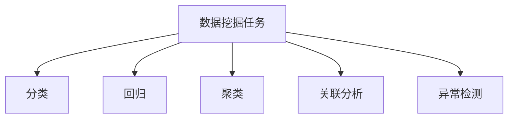

# 数据挖掘 原理与代码实例讲解

## 1.背景介绍

### 1.1 数据挖掘的定义与意义

数据挖掘(Data Mining)是一个从大量的、不完全的、有噪声的、模糊的、随机的实际应用数据中，提取隐含在其中的、人们事先未知的、但又是潜在有用的信息和知识的过程。它是数据库知识发现(Database Knowledge Discovery)的核心步骤，属于决策支持系统的一个组成部分。

数据挖掘技术的发展源于人们对海量数据进行分析和利用的需求。在当今大数据时代，各行各业都在积累和产生海量数据，如何从浩如烟海的数据中快速获取有价值的信息，成为企业获得竞争优势的关键。数据挖掘技术应运而生，通过机器学习、统计学、数据库等多个学科的交叉融合，实现对数据的分析挖掘，发现隐藏的模式和知识，为决策提供依据。

### 1.2 数据挖掘的应用领域

数据挖掘在多个领域有广泛的应用，主要包括：

1. 商业智能：利用数据挖掘技术分析销售数据、客户数据，发现客户购买模式，进行精准营销、个性化推荐等。

2. 金融风控：通过对交易数据、用户行为数据的挖掘，构建风险评估模型，实现金融欺诈检测、信用评分等。

3. 医疗健康：对医疗影像、基因数据、电子病历等进行挖掘分析，辅助疾病诊断、药物研发、精准医疗等。

4. 社交网络：分析社交网络中的用户互动、关系链、兴趣爱好等数据，发现社交影响力、社群detection等。

5. 工业制造：对设备运行数据、质量检测数据等进行挖掘，实现设备故障预测、工艺优化、质量管控等。

6. 其他领域如教育、交通、电信、能源等，数据挖掘也有广泛应用。

## 2.核心概念与联系

### 2.1 数据挖掘的过程

数据挖掘通常包括以下几个主要步骤：

1. 业务理解：明确挖掘目标，理解具体业务需求。

2. 数据理解：收集、描述数据，探索数据，验证数据质量。

3. 数据准备：选择、清洗、构建、集成、格式化数据。

4. 建模：选择建模技术，生成测试设计，构建模型，评估模型。

5. 评估：评估结果，审查过程，确定下一步。

6. 部署：规划部署，监控和维护，编写最终报告，评审项目。


### 2.2 数据挖掘的任务类型

数据挖掘主要解决几类任务：

1. 分类：根据已知类别的训练样本，构建分类模型，将新样本映射到某个类别。如垃圾邮件识别等。

2. 回归：找出自变量和因变量之间的数量关系。如房价预测等。

3. 聚类：将物理或抽象对象的集合组成为由类似的对象组成的多个类的过程。如用户分群等。

4. 关联分析：发现数据项之间的关联模式。如购物篮分析等。

5. 异常检测：识别出偏离正常行为的罕见项目、事件或观察值。如欺诈检测等。



### 2.3 数据挖掘与机器学习、统计学等的关系

数据挖掘与机器学习、统计学、数据库、可视化等多个领域密切相关。

机器学习为数据挖掘提供了大量的算法和模型，如决策树、支持向量机、神经网络等，是数据挖掘的核心。

统计学为数据挖掘提供了数理基础和评估方法，如假设检验、回归分析、主成分分析等。

数据库技术为数据挖掘提供了数据存储、查询、索引等基础支撑。

可视化技术帮助直观展现数据挖掘的过程和结果，加强对挖掘结果的解释和呈现。

## 3.核心算法原理具体操作步骤

本节介绍几种常见的数据挖掘算法的原理和步骤。

### 3.1 决策树

决策树通过树形结构来表示分类或回归的过程。构建决策树的核心是特征选择，常用指标有信息增益、增益率、基尼指数等。

以C4.5算法为例，其主要步骤如下：

1. 创建节点N
2. 如果样本都在同一类别C，将N标记为C类叶子节点
3. 否则，基于最大化信息增益比选择最佳分裂特征F
4. 根据F的取值将样本分裂成V1,V2,...子集
5. 对每个子集Vi，递归调用步骤1~4，得到子树Ti，将其连接到N上

### 3.2 K-Means聚类

K-Means通过迭代的方式将数据点划分到K个簇中，使得簇内相似度高，簇间相似度低。

其主要步骤如下：

1. 随机选择K个对象作为初始聚类中心
2. repeat
3.  将每个对象指派到与其最相似的聚类中心所在的簇 
4.  更新每个簇的聚类中心
5. until 准则函数收敛

这里的准则函数通常基于平方误差，即：
$$
E=\sum_{i=1}^k\sum_{x\in C_i} ||x-\mu_i||^2
$$
其中$\mu_i$是第$i$个簇$C_i$的中心。

### 3.3 Apriori关联规则挖掘

Apriori算法用于发现频繁项集和关联规则。其基于先验性质：频繁项集的所有非空子集也必须是频繁的。

Apriori算法分两个步骤：

1. 找出所有频繁项集：
   - 扫描数据库，累计每个项的计数，收集满足最小支持度的频繁1项集，记为L1
   - 由L1找L2，由L2找L3，...，由L{k-1}找Lk
   - 每次找下一级频繁项集时，先由上一级频繁项集的集合生成候选集，再判断候选集里的项集是否频繁，从而得到下一级频繁项集
2. 由频繁项集产生强关联规则：
   - 对每个频繁项集l，产生l的所有非空子集
   - 对每个非空子集a，若$conf(l-a\Rightarrow a)$满足最小置信度，则输出关联规则$l-a\Rightarrow a$

## 4.数学模型和公式详细讲解举例说明

本节对数据挖掘中的一些常见数学模型和公式进行详细讲解和举例说明。

### 4.1 支持度与置信度

支持度和置信度是关联规则挖掘的两个重要指标。

设$I=\{i_1,i_2,...,i_m\}$为项的集合，$D$为事务数据库。每个事务$T$是$I$的子集。

项集$A$的支持度定义为包含$A$的事务占总事务的比例：
$$
support(A)=\frac{|\{T\in D|A\subseteq T\}|}{|D|}
$$

关联规则$A\Rightarrow B$的置信度定义为包含$A$的事务中同时包含$B$的比例：
$$
confidence(A\Rightarrow B)=\frac{support(A\cup B)}{support(A)}
$$

举例：假设有100个事务，其中10个包含面包和牛奶，5个只包含面包，2个只包含牛奶。则：
- $support(面包)=(10+5)/100=15\%$
- $support(牛奶)=(10+2)/100=12\%$  
- $support(面包\cup 牛奶)=10/100=10\%$
- $confidence(面包\Rightarrow 牛奶)=10/(10+5)=66.7\%$

### 4.2 TF-IDF

TF-IDF(Term Frequency-Inverse Document Frequency)是一种用于文本挖掘的加权技术，用以评估一个词语对于一个文件集或一个语料库中的其中一份文件的重要程度。

TF(Term Frequency)表示词条在文档中出现的频率：
$$
tf_{t,d}=\frac{n_{t,d}}{\sum_{k}n_{k,d}}
$$
其中$n_{t,d}$为词条$t$在文档$d$中出现的次数，$\sum_{k}n_{k,d}$为文档$d$中所有词条的出现次数之和。

IDF(Inverse Document Frequency)表示词条的逆向文档频率：
$$
idf_t=\log\frac{|D|}{|\{d\in D:t\in d\}|}
$$
其中$|D|$为语料库中文档总数，$|\{d\in D:t\in d\}|$为包含词条$t$的文档数。

TF-IDF就是将二者相乘：
$$
tfidf_{t,d}=tf_{t,d}\times idf_t
$$

直观上看，TF-IDF意味着：
- 如果某个词在一篇文章中出现频率高，但在其他文章中很少出现，则认为此词对这篇文章具有很高的代表性
- 如果某个词在这篇文章中出现频率不高，但在其他文章中也很少出现，则认为此词也可能对这篇文章有较高的代表性
- 如果某个词在很多文章中多次出现，那它可能是一个比较通用的词，对文章的代表性不高

## 5.项目实践：代码实例和详细解释说明

本节通过Python代码实例，对数据挖掘的常见任务进行演示。

### 5.1 决策树分类

使用scikit-learn库实现决策树分类：

```python
from sklearn.datasets import load_iris
from sklearn.tree import DecisionTreeClassifier
from sklearn.model_selection import train_test_split

# 加载鸢尾花数据集
iris = load_iris()
X = iris.data
y = iris.target

# 划分训练集和测试集
X_train, X_test, y_train, y_test = train_test_split(X, y, test_size=0.3)

# 创建决策树分类器
clf = DecisionTreeClassifier()

# 训练模型
clf.fit(X_train, y_train)

# 模型评估
print(clf.score(X_test, y_test))
```

这段代码首先加载内置的鸢尾花数据集，然后将数据划分为训练集和测试集。接着创建一个决策树分类器，调用`fit`方法在训练集上训练模型，最后用`score`方法在测试集上评估模型的准确率。

### 5.2 K-Means聚类

使用scikit-learn库实现K-Means聚类：

```python
from sklearn.datasets import make_blobs
from sklearn.cluster import KMeans

# 生成样本数据
X, _ = make_blobs(n_samples=1000, centers=4, random_state=0)

# 创建K-Means聚类器
kmeans = KMeans(n_clusters=4)

# 训练模型
kmeans.fit(X)

# 打印聚类中心
print(kmeans.cluster_centers_)

# 预测新样本的簇标签
print(kmeans.predict([[0, 0], [4, 4]]))
```

这段代码首先用`make_blobs`函数生成一些聚类状态明显的数据。然后创建一个K-Means聚类器，设置聚类数为4。调用`fit`方法训练模型，训练完成后可以查看得到的聚类中心。最后，可以用`predict`方法预测新样本点的簇标签。

### 5.3 Apriori关联规则挖掘

使用efficient_apriori库实现Apriori算法：

```python
from efficient_apriori import apriori

# 生成样本数据
transactions = [
    ('牛奶','面包','尿布'),  
    ('可乐','面包', '尿布', '啤酒'),
    ('牛奶','尿布', '啤酒', '鸡蛋'),
    ('面包', '牛奶', '尿布', '啤酒'),
    ('面包', '牛奶', '尿布', '可乐')
]

# 挖掘频繁项集和关联规则
itemsets, rules = apriori(transactions, min_support=