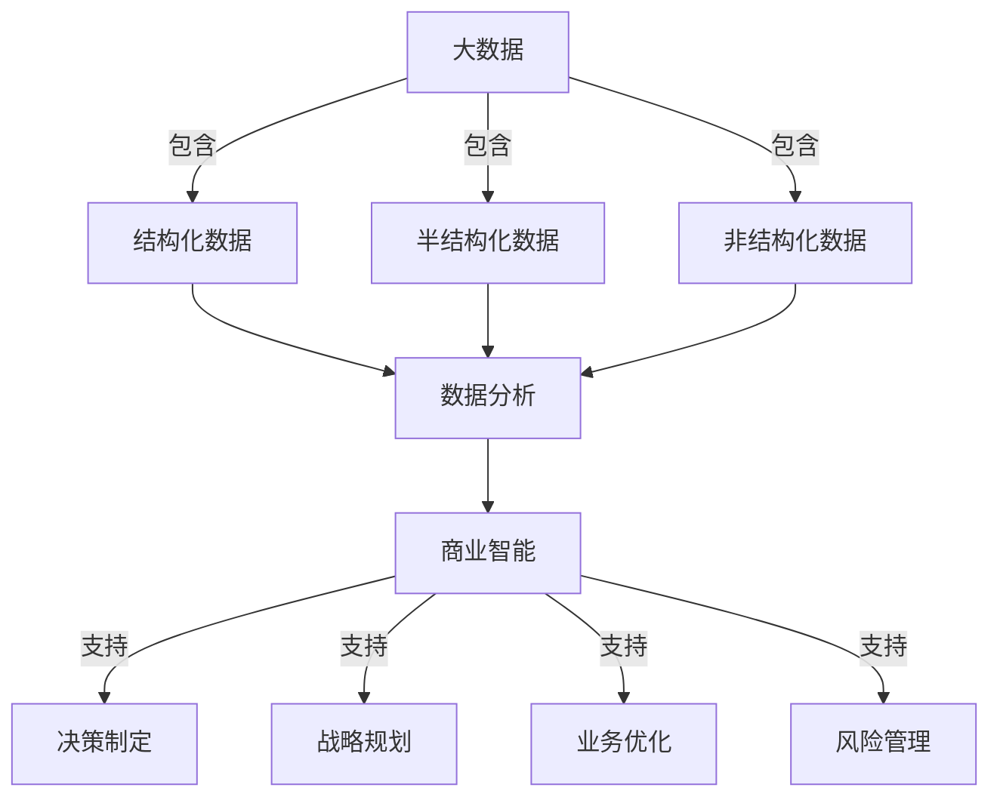

# 数据的力量:大数据分析与商业智能融合

## 1.背景介绍

### 1.1 数据时代的到来

在当今时代,数据已经成为了一种新的战略性资源和生产力。随着互联网、移动互联网、物联网等新技术的飞速发展,海量的数据被不断地产生和积累。这些数据蕴含着巨大的价值和洞见,如果能够被有效地分析和利用,将为企业带来前所未有的商业机遇和竞争优势。

### 1.2 数据分析的重要性

数据分析是从庞大的数据中提取有价值信息和知识的过程。通过数据分析,企业可以发现隐藏在数据背后的模式、趋势和关联,从而更好地了解客户需求、优化业务流程、制定精准营销策略、降低运营成本、提高决策质量等。因此,数据分析已经成为企业保持竞争力和实现可持续发展的关键因素之一。

### 1.3 商业智能的概念

商业智能(Business Intelligence,BI)是指通过收集、整理、分析和呈现数据,为企业的决策提供支持的一系列技术和应用。商业智能旨在帮助企业更好地理解自身的业务运营情况,发现潜在的机会和风险,从而做出更明智的决策。

## 2.核心概念与联系

### 2.1 大数据与数据分析

大数据(Big Data)是指规模巨大、种类繁多、增长迅速的数据集合,其特点包括海量(Volume)、多样(Variety)、高速(Velocity)等。大数据分析则是指对这些海量、多样、高速的数据进行捕获、存储、管理、处理和分析,以发现隐藏其中的模式、趋势和洞见。

大数据分析与传统的数据分析有着本质的区别。传统的数据分析主要针对结构化数据(如数据库中的表格数据),而大数据分析则需要处理包括结构化数据、半结构化数据(如XML、JSON等)和非结构化数据(如文本、图像、视频等)在内的各种类型的数据。此外,大数据分析还需要采用分布式计算、实时流处理等新技术来应对海量数据的存储和计算挑战。

### 2.2 商业智能与数据分析

商业智能和数据分析是密切相关的概念,但它们侧重点不同。数据分析更多地关注从数据中发现模式、趋势和洞见的技术和方法,而商业智能则侧重于如何将这些发现应用于企业的决策过程中,以支持企业的战略规划、业务优化和风险管理等。

商业智能通常包括以下几个关键组成部分:

1. **数据集成(Data Integration)**: 从不同的数据源中收集和整合数据,确保数据的一致性和完整性。
2. **数据仓库(Data Warehouse)**: 用于存储和管理企业内部和外部的历史数据。
3. **数据挖掘(Data Mining)**: 应用各种统计和机器学习算法,从数据中发现隐藏的模式和规律。
4. **分析和报告(Analysis and Reporting)**: 通过可视化工具和报表,呈现数据分析的结果,支持决策制定。
5. **监控和预测(Monitoring and Forecasting)**: 持续监控关键业务指标,并基于历史数据进行预测和模拟。

因此,数据分析为商业智能提供了技术基础,而商业智能则为数据分析提供了应用场景和目标导向。



## 3.核心算法原理具体操作步骤

大数据分析和商业智能涉及了多种算法和技术,其中一些核心算法和原理包括:

### 3.1 数据预处理

在进行数据分析之前,通常需要对原始数据进行预处理,以提高数据质量和分析效果。常见的数据预处理步骤包括:

1. **数据清洗(Data Cleaning)**: 处理缺失值、异常值和重复数据等问题。
2. **数据集成(Data Integration)**: 从多个异构数据源中提取、转换和加载数据,实现数据的统一和一致性。
3. **数据转换(Data Transformation)**: 对数据进行规范化、离散化、编码等转换,使其更适合后续的分析。
4. **数据减dimensionality)**: 通过特征选择或特征提取等方法,降低数据的维度,减少冗余信息。

### 3.2 关联规则挖掘

关联规则挖掘(Association Rule Mining)是一种常用的数据挖掘技术,旨在发现数据集中的频繁项集和关联规则。它广泛应用于购物篮分析、网页推荐、基因序列分析等领域。

关联规则挖掘算法通常分为两个步骤:

1. **频繁项集发现(Frequent Itemset Generation)**: 使用Apriori算法或FP-Growth算法等,发现数据集中出现频率高于给定阈值的项集。
2. **规则生成(Rule Generation)**: 基于频繁项集,生成满足最小置信度和支持度要求的关联规则。

### 3.3 聚类分析

聚类分析(Cluster Analysis)是一种无监督学习技术,旨在将数据对象划分为多个相似的簇或组。聚类分析在客户细分、图像分割、基因表达分析等领域有广泛应用。

常用的聚类算法包括:

1. **K-Means算法**: 基于距离度量,将数据对象划分为K个簇。
2. **层次聚类算法(Hierarchical Clustering)**: 通过递归的聚合或划分过程,构建层次聚类树。
3. **密度聚类算法(Density-Based Clustering)**: 基于数据对象的密度分布,识别任意形状的聚类,如DBSCAN算法。

### 3.4 决策树学习

决策树(Decision Tree)是一种常用的监督学习算法,通过构建决策树模型,可以对数据进行分类或回归预测。决策树模型易于理解和解释,广泛应用于信用评分、疾病诊断、欺诈检测等领域。

构建决策树的典型算法包括:

1. **ID3算法(Iterative Dichotomiser 3)**: 基于信息增益准则,递归地构建决策树。
2. **C4.5算法**: 在ID3算法的基础上,引入了信息增益比准则,并支持连续值和缺失值处理。
3. **CART算法(Classification and Regression Trees)**: 支持分类和回归任务,使用基尼指数或均方差减少作为节点分裂准则。

### 3.5 数据可视化

数据可视化是将数据以图形或图像的形式呈现,有助于人类直观地理解和分析数据。常用的数据可视化技术包括:

1. **统计图表(Statistical Graphics)**: 如折线图、柱状图、饼图、散点图等。
2. **信息可视化(Information Visualization)**: 如树状图、网络图、并行坐标图等,适用于可视化抽象数据。
3. **科学可视化(Scientific Visualization)**: 如体数据可视化、流场可视化等,适用于可视化科学数据。
4. **地理信息可视化(Geographic Information Visualization)**: 如地图可视化、空间数据可视化等。

## 4.数学模型和公式详细讲解举例说明

### 4.1 关联规则评价指标

在关联规则挖掘中,常用的评价指标包括支持度(Support)和置信度(Confidence)。

**支持度**定义为包含项集X的交易记录数占总交易记录数的比例,用来衡量项集X在整个数据集中出现的频率:

$$\text{Support}(X) = \frac{\text{包含项集X的交易记录数}}{\text{总交易记录数}}$$

**置信度**定义为包含项集X的交易记录中同时包含Y的比例,用来衡量关联规则"X→Y"的可信程度:

$$\text{Confidence}(X \rightarrow Y) = \frac{\text{Support}(X \cup Y)}{\text{Support}(X)}$$

例如,在一个购物篮数据集中,如果支持度阈值设为0.05,置信度阈值设为0.7,那么可能会发现这样一条关联规则:"购买面包和牛奶的顾客,置信度为80%也会购买鸡蛋"。这条规则的支持度为0.06,置信度为0.8,因此满足阈值要求。

### 4.2 K-Means聚类距离度量

在K-Means聚类算法中,需要定义一种距离度量来衡量数据对象与聚类中心之间的相似性。常用的距离度量包括欧几里得距离、曼哈顿距离和余弦相似度等。

**欧几里得距离**是最常用的距离度量,它定义为两个数据对象在欧几里得空间中的距离:

$$d(x, y) = \sqrt{\sum_{i=1}^{n}(x_i - y_i)^2}$$

其中,x和y分别表示n维空间中的两个数据对象。

**曼哈顿距离**也称为城市区块距离,它定义为两个数据对象在每个维度上绝对差值的总和:

$$d(x, y) = \sum_{i=1}^{n}|x_i - y_i|$$

**余弦相似度**通常用于衡量两个非零向量之间的相似性,定义为它们夹角的余弦值:

$$\text{sim}(x, y) = \frac{x \cdot y}{\|x\| \|y\|} = \frac{\sum_{i=1}^{n}x_iy_i}{\sqrt{\sum_{i=1}^{n}x_i^2}\sqrt{\sum_{i=1}^{n}y_i^2}}$$

其值范围在[-1, 1]之间,余弦相似度越大,表示两个向量越相似。

在实际应用中,需要根据数据的特征选择合适的距离度量,以获得更好的聚类效果。

### 4.3 决策树构建算法

以ID3算法为例,它采用信息增益(Information Gain)作为选择特征的准则,递归地构建决策树。

对于给定的训练数据集D,特征A的信息增益定义为:

$$\text{Gain}(D, A) = \text{Entropy}(D) - \sum_{v \in \text{Values}(A)}\frac{|D_v|}{|D|}\text{Entropy}(D_v)$$

其中,Entropy(D)表示数据集D的信息熵,用于衡量数据集的无序程度:

$$\text{Entropy}(D) = -\sum_{i=1}^{c}p_i\log_2p_i$$

其中,c是类别的个数,p_i是属于第i个类别的样本占总样本的比例。

Values(A)表示特征A的所有可能取值,Dv是数据集D中特征A取值为v的子集,|Dv|和|D|分别表示Dv和D的样本数量。

算法会选择信息增益最大的特征作为当前节点,并对每个子节点递归地调用相同的算法,构建决策树。

通过计算信息增益,ID3算法能够有效地选择对数据集进行分类的最优特征,从而构建出精确的决策树模型。

## 5.项目实践:代码实例和详细解释说明

为了更好地理解大数据分析和商业智能的实际应用,我们以一个基于Python的电子商务数据分析项目为例,演示关键技术和代码实现。

### 5.1 项目概述

该项目旨在分析一家在线零售商的销售数据,以发现有价值的洞见和模式,为商业决策提供支持。数据集包含订单、产品、客户和促销活动等信息。

### 5.2 数据预处理

```python
import pandas as pd

# 读取数据
orders = pd.read_csv('orders.csv')
products = pd.read_csv('products.csv')
customers = pd.read_csv('customers.csv')

# 处理缺失值
orders = orders.dropna(subset=['order_id', 'product_id', 'customer_id'])
products = products.fillna({'product_category': 'Unknown'})

# 数据集成
data = orders.merge(products, on='product_id').merge(customers, on='customer_id')

# 特征工程
data['order_