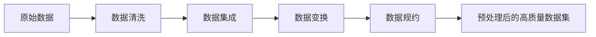

# 数据集炼金术：数据清洗与预处理

## 1. 背景介绍
### 1.1 数据质量的重要性
在当今大数据时代,企业和组织每天都在生成和收集海量的数据。然而,原始数据通常包含噪声、缺失值、异常值等问题,直接使用这些"脏数据"进行分析和建模,往往会得到误导性的结果。因此,数据清洗与预处理成为了数据分析与挖掘过程中的关键一环,它决定了后续工作的质量和效率。

### 1.2 数据清洗与预处理概述
数据清洗与预处理是指在数据分析之前,对原始数据进行一系列处理,包括数据清洗、数据集成、数据变换和数据规约等,目的是提高数据质量,使其更加规整、标准、易于分析。通过系统性的数据预处理,能够最大限度地挖掘数据的价值。

## 2. 核心概念与联系
### 2.1 数据质量维度
- 完整性:数据记录和字段是否完整,有无缺失值。
- 唯一性:数据记录是否存在重复。  
- 准确性:数据是否准确反映真实世界。
- 一致性:数据在不同数据源之间是否一致。
- 及时性:数据是否是最新的。

### 2.2 数据清洗
数据清洗是指检测并纠正数据文件中可识别的错误,包括处理缺失数据、识别outlier、平滑噪声数据、纠正数据不一致等任务。常用方法有:
- 填充缺失值:根据业务特点选择合适的填充策略,如均值/中位数填充、固定值填充、回归填充等。
- 异常值检测:使用统计方法(如3-Sigma)或基于距离的方法(如LOF)等检测异常值。

### 2.3 数据集成 
数据集成是将多个数据源中的数据合并存放在一个一致的数据存储中(如数据仓库)的过程。需要解决数据冗余、数据值冲突等问题。常用方法有:
- ETL:将数据从源抽取(Extract)、转换(Transform)并加载(Load)到目标数据存储的过程。
- Schema匹配:识别不同数据源中语义相同的元素。

### 2.4 数据变换
数据变换是指将数据转换为适用于挖掘任务的形式,如归一化、构建新特征等。常用方法有:
- 归一化:将特征数据按比例缩放到统一范围,如Min-Max归一化。
- 特征构建:利用原始特征构造新的特征,如组合特征、交叉特征等。

### 2.5 数据规约
数据规约是指降低数据量以提高挖掘效率,包括降维和数值规约。常用方法有:
- PCA:通过正交变换把线性相关的高维数据映射到低维空间。
- 采样:从大规模数据集中抽取具有代表性的子集用于分析。

### 2.6 各概念之间的联系



## 3. 核心算法原理与操作步骤
### 3.1 缺失值填充算法
#### 3.1.1 均值/中位数填充
1. 计算某个特征的非缺失值的均值或中位数。
2. 将该特征的缺失值统一替换为均值或中位数。

#### 3.1.2 KNN填充
1. 对于缺失值所在的样本,找到特征空间中最近的K个邻居(欧氏距离)。
2. 根据K个邻居的目标特征值,计算加权平均值。权重通常采用距离的倒数。
3. 用加权平均值替换缺失值。

### 3.2 异常值检测算法
#### 3.2.1 3-Sigma检测
1. 计算某个特征的均值μ和标准差σ。
2. 确定异常阈值上限 μ + 3σ 和下限 μ - 3σ。
3. 超出上下限的值视为异常值。

#### 3.2.2 LOF局部异常因子检测
1. 计算每个样本点的第k距离(到第k个最近邻居的距离)。
2. 计算每个样本点的可达密度(第k距离的倒数)。 
3. 计算每个样本点相对于其邻居的局部可达密度(LOF)。
4. LOF显著大于1的样本视为异常点。

### 3.3 数据集成算法
#### 3.3.1 ETL
1. 从不同的源数据库中抽取数据。
2. 对抽取的数据进行转换,如数据类型转换、字段拆分/合并等。
3. 将转换后的数据加载到目标数据库。

#### 3.3.2 Schema匹配
1. 计算源表和目标表的schema之间的相似度。可采用基于字符串相似度的算法,如编辑距离、jaccard系数等。
2. 选择相似度最高的schema映射。
3. 根据确定的映射关系,合并数据。

### 3.4 数据变换算法
#### 3.4.1 Min-Max归一化
1. 计算某个特征的最大值max和最小值min。 
2. 对每个特征值x,按照以下公式进行归一化:
$x' = \frac{x - min}{max - min}$

#### 3.4.2 组合特征构建
1. 根据业务理解,选择需要组合的特征。
2. 对选定的多个特征进行算术或逻辑运算,生成新特征。如:
$x_{new} = \frac{x_1 + x_2}{x_3}$ 或 $x_{new} = x_1 \& \& x_2$

### 3.5 数据规约算法
#### 3.5.1 PCA
1. 对原始数据进行中心化(每个特征减去均值)。
2. 计算协方差矩阵。
3. 对协方差矩阵进行特征值分解,得到特征向量。
4. 选择前k个最大特征值对应的特征向量,形成变换矩阵。
5. 用变换矩阵左乘原始数据,得到降维后的新数据。

#### 3.5.2 分层采样
1. 将数据集按照某个类别特征分层。
2. 确定采样比例,在每个分层内部进行等比例随机采样。
3. 将采样后的各层数据合并,得到具有代表性的数据子集。

## 4. 数学模型与公式详解
### 4.1 缺失值填充
#### 4.1.1 均值填充
设特征X有n个非缺失值,分别为 $x_1, x_2, ..., x_n$,则均值 $\bar{x}$ 为:

$$\bar{x} = \frac{1}{n}\sum_{i=1}^n x_i$$

缺失值统一替换为 $\bar{x}$。

#### 4.1.2 KNN填充
设缺失值所在样本为p,特征空间中p的k个最近邻居为 $q_1, q_2, ..., q_k$,它们与p的欧氏距离分别为 $d_1, d_2, ..., d_k$,邻居$q_i$在目标特征上的取值为$x_i$,则p在该特征上的填充值$x_p$为:

$$x_p = \frac{\sum_{i=1}^k \frac{1}{d_i} x_i}{\sum_{i=1}^k \frac{1}{d_i}}$$

### 4.2 异常值检测
#### 4.2.1 3-Sigma检测
设特征X的均值为μ,标准差为σ,则X的取值范围为:

$$[\mu - 3\sigma, \mu + 3\sigma]$$

超出该范围的值视为异常值。这是因为在正态分布的假设下,位于μ±3σ之外的值出现的概率小于0.003。

#### 4.2.2 LOF检测
设样本点p,其第k距离为k-distance(p),第k距离内的邻居数量为|Nk(p)|,则p的可达密度为:

$$\text{reachability-density}_k(p) = 1/\frac{\sum_{o \in N_k(p)} \text{max}(k\text{-distance}(o), d(p,o))}{|N_k(p)|}$$

进而,p的局部异常因子为:

$$\text{LOF}_k(p) = \frac{\sum_{o \in N_k(p)} \frac{\text{reachability-density}_k(o)}{\text{reachability-density}_k(p)}}{|N_k(p)|}$$

若$\text{LOF}_k(p)$显著大于1,则p为异常点。直观地,这意味着p的可达密度显著小于其邻居的可达密度平均值。

### 4.3 数据变换
#### 4.3.1 Min-Max归一化
设特征X的最小值为min,最大值为max,则X的一个取值x归一化后的新取值x'为:

$$x' = \frac{x - min}{max - min}$$

经过变换后,x'位于[0,1]区间内。该方法适用于有明显边界的数据。

### 4.4 数据规约
#### 4.4.1 PCA
设原始数据矩阵为X(n行m列),中心化后的矩阵为 $\mathbf{\hat{X}}$,则协方差矩阵C为:

$$\mathbf{C} = \frac{1}{n-1} \mathbf{\hat{X}}^T\mathbf{\hat{X}}$$

对C进行特征值分解:

$$\mathbf{C} = \mathbf{Q} \mathbf{\Lambda} \mathbf{Q}^{-1}$$

其中,Q为特征向量矩阵, $\mathbf{\Lambda}$ 为特征值构成的对角矩阵。

取前k个最大特征值对应的特征向量,构成变换矩阵 $\mathbf{P} \in \mathbb{R}^{m \times k}$,则降维后的新数据 $\mathbf{Y} \in \mathbb{R}^{n \times k}$ 为:

$$\mathbf{Y} = \mathbf{X} \mathbf{P}$$

PCA的目标是在最小化均方重构误差的意义下,找到最优的低维子空间。

## 5. 项目实践
### 5.1 使用Pandas进行数据清洗

```python
import pandas as pd
import numpy as np

# 读取数据
data = pd.read_csv('raw_data.csv') 

# 填充缺失值
data['col1'].fillna(data['col1'].mean(), inplace=True) # 均值填充
data['col2'].fillna(method='ffill', inplace=True) # 前向填充

# 异常值处理
upper_lim = data['col3'].mean() + 3 * data['col3'].std() # 上限
lower_lim = data['col3'].mean() - 3 * data['col3'].std() # 下限
data = data[(data['col3'] < upper_lim) & (data['col3'] > lower_lim)] # 3-sigma法

# 数据归一化
data['col4'] = (data['col4'] - data['col4'].min()) / (data['col4'].max() - data['col4'].min())
```

### 5.2 使用Sklearn进行数据变换

```python
from sklearn.preprocessing import MinMaxScaler, StandardScaler
from sklearn.decomposition import PCA

# 归一化
scaler = MinMaxScaler()
X_scaled = scaler.fit_transform(X)

# 标准化
scaler = StandardScaler()
X_scaled = scaler.fit_transform(X)

# PCA降维
pca = PCA(n_components=k) 
X_pca = pca.fit_transform(X)
```

### 5.3 使用FeatureTools自动化特征工程

```python
import featuretools as ft

# 定义实体集
es = ft.EntitySet(id='data')
es.entity_from_dataframe(entity_id='main_table', dataframe=data, index='id')

# 定义特征基元
feature_matrix, feature_defs = ft.dfs(entityset=es, target_entity='main_table')
```

## 6. 实际应用场景
### 6.1 金融风控
在信贷申请数据中,通过数据清洗去除不合理的申请记录,通过特征构建衍生出如收入负债比等新指标,并用降维方法提取出主要因子,构建风险评分模型,控制坏账率。

### 6.2 设备预测性维护
对于工业设备的传感器时序数据,通过异常检测方法及时发现设备异常,再通过数据集成将业务数据与传感器数据关联,挖掘设备故障的关键影响因素,构建预测性维护模型。

### 6.3 智慧城市
对于城市交通、环境等多源异构数据,需要先通过数据集成将它们整合到统一