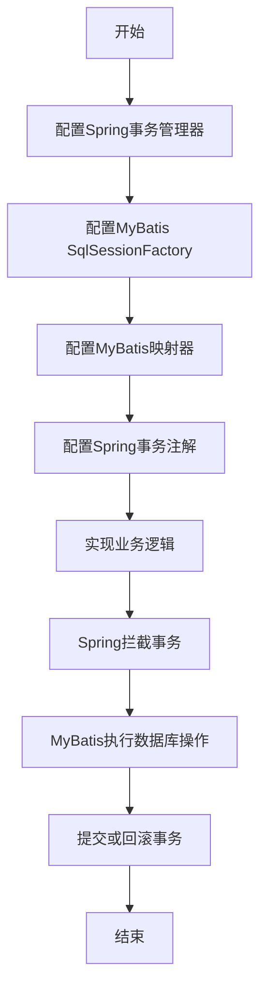

# 整合Spring和MyBatis事务管理

## 1.背景介绍

在现代企业级应用程序开发中,事务管理是一个非常重要的概念。事务可确保数据的一致性、完整性和持久性,防止由于系统故障或并发访问而导致的数据损坏。Spring和MyBatis是两个广泛使用的Java框架,分别用于企业应用程序的开发和对象关系映射(ORM)。将这两个框架整合在一起,可以实现强大的事务管理功能,提高应用程序的可靠性和性能。

### 1.1 Spring框架概述

Spring是一个轻量级的企业级应用程序开发框架,提供了一系列功能模块,如IoC容器、AOP编程、事务管理、MVC Web框架等。Spring的核心思想是通过依赖注入(DI)和面向切面编程(AOP),实现松耦合的应用程序设计,提高代码的可重用性和可维护性。

### 1.2 MyBatis框架概述

MyBatis是一个优秀的持久层框架,它支持定制化SQL、存储过程以及高级映射。MyBatis采用ORM思想,通过XML或注解将Java对象与数据库表建立映射关系,免除了手工编写SQL语句的繁琐工作,提高了开发效率。

### 1.3 事务管理的重要性

在企业级应用程序中,一个业务操作通常需要执行多个数据库操作。如果其中某个操作失败,则需要回滚之前的所有操作,以保证数据的一致性和完整性。事务管理可以确保这些操作要么全部成功,要么全部失败,从而避免数据的不一致性和损坏。

## 2.核心概念与联系

### 2.1 Spring事务管理

Spring提供了一个抽象层,用于集成各种事务管理实现,如JTA、JDBC、Hibernate等。Spring的事务管理基于AOP,通过配置事务通知和切入点,可以将事务逻辑与业务逻辑解耦。Spring支持声明式事务管理和编程式事务管理两种方式。

### 2.2 MyBatis事务管理

MyBatis本身并不提供事务管理功能,它依赖于外部的事务管理器,如JDBC、Spring等。在MyBatis中,事务是通过SqlSession对象管理的,每个SqlSession对象代表一个事务。

### 2.3 整合Spring和MyBatis事务管理

将Spring和MyBatis整合在一起,可以利用Spring强大的事务管理功能,同时享受MyBatis优秀的持久层支持。Spring提供了一个MyBatis特殊的事务管理器,可以方便地集成MyBatis的SqlSession对象。通过配置Spring的事务管理器和MyBatis的SqlSessionFactory,可以实现声明式事务管理,简化事务处理的代码。

## 3.核心算法原理具体操作步骤

整合Spring和MyBatis事务管理的核心算法原理和具体操作步骤如下:



### 3.1 配置Spring事务管理器

在Spring配置文件中,需要定义一个事务管理器(TransactionManager)。Spring提供了多种事务管理器实现,对于MyBatis,我们通常使用DataSourceTransactionManager。

```xml
<!-- 配置事务管理器 -->
<bean id="transactionManager" class="org.springframework.jdbc.datasource.DataSourceTransactionManager">
    <property name="dataSource" ref="dataSource" />
</bean>
```

### 3.2 配置MyBatis SqlSessionFactory

在Spring配置文件中,需要定义一个MyBatis的SqlSessionFactory。SqlSessionFactory用于创建SqlSession对象,SqlSession对象是MyBatis执行SQL语句的核心对象。

```xml
<!-- 配置MyBatis SqlSessionFactory -->
<bean id="sqlSessionFactory" class="org.mybatis.spring.SqlSessionFactoryBean">
    <property name="dataSource" ref="dataSource" />
    <property name="mapperLocations" value="classpath*:mappers/*.xml" />
</bean>
```

### 3.3 配置MyBatis映射器

Spring提供了一个MapperScannerConfigurer,可以自动扫描指定包下的MyBatis映射器接口,并将它们注册为Spring Bean。

```xml
<!-- 配置MyBatis映射器扫描 -->
<bean class="org.mybatis.spring.mapper.MapperScannerConfigurer">
    <property name="basePackage" value="com.example.mapper" />
    <property name="sqlSessionFactoryBeanName" value="sqlSessionFactory" />
</bean>
```

### 3.4 配置Spring事务注解

Spring支持使用注解来声明事务,如@Transactional。我们需要在Spring配置文件中启用注解驱动,并指定事务管理器。

```xml
<!-- 启用注解驱动 -->
<tx:annotation-driven transaction-manager="transactionManager" />
```

### 3.5 实现业务逻辑

在业务逻辑代码中,我们可以通过注入MyBatis映射器接口来执行数据库操作。Spring会自动为映射器接口创建代理对象,并将事务逻辑织入其中。

```java
@Service
public class UserService {
    @Autowired
    private UserMapper userMapper;

    @Transactional
    public void createUser(User user) {
        userMapper.insert(user);
        // 其他业务逻辑
    }
}
```

### 3.6 Spring拦截事务

当业务方法被调用时,Spring会拦截带有@Transactional注解的方法,并根据配置的传播行为、隔离级别等属性创建一个事务。

### 3.7 MyBatis执行数据库操作

在事务范围内,MyBatis映射器接口的方法会被Spring代理对象拦截,并将SQL语句执行到数据库中。

### 3.8 提交或回滚事务

如果业务方法执行成功,Spring会自动提交事务。如果发生异常,Spring会自动回滚事务,保证数据的一致性。

## 4.数学模型和公式详细讲解举例说明

在整合Spring和MyBatis事务管理的过程中,并没有直接涉及复杂的数学模型和公式。不过,我们可以通过一些简单的公式来说明事务的一些基本概念。

### 4.1 事务的ACID特性

事务具有原子性(Atomicity)、一致性(Consistency)、隔离性(Isolation)和持久性(Durability)四个特性,通常被称为ACID特性。这些特性可以用以下公式表示:

$$
\text{ACID} = \text{Atomicity} \cap \text{Consistency} \cap \text{Isolation} \cap \text{Durability}
$$

- 原子性(Atomicity):一个事务中的所有操作要么全部完成,要么全部不完成,不会出现部分完成的情况。
- 一致性(Consistency):事务执行前后,数据库的状态必须保持一致。
- 隔离性(Isolation):并发执行的多个事务之间不会相互影响,每个事务都会有一个独立的执行环境。
- 持久性(Durability):一旦事务提交,对数据库的修改就是永久性的,不会因为系统故障或其他原因而丢失。

### 4.2 事务隔离级别

事务的隔离级别决定了并发执行的事务之间的相互影响程度。SQL标准定义了四种事务隔离级别,可以用以下公式表示:

$$
\text{Isolation Levels} = \{\text{READ UNCOMMITTED}, \text{READ COMMITTED}, \text{REPEATABLE READ}, \text{SERIALIZABLE}\}
$$

- READ UNCOMMITTED:最低的隔离级别,可能会读取到其他未提交事务的数据。
- READ COMMITTED:只能读取已提交的数据,但可能会出现不可重复读的问题。
- REPEATABLE READ:在同一个事务中,多次读取同一条记录时,结果是一致的,但可能会出现幻读的问题。
- SERIALIZABLE:最高的隔离级别,事务执行时会加锁,完全避免并发问题,但性能较低。

不同的隔离级别可以有效地防止脏读(Dirty Read)、不可重复读(Non-Repeatable Read)和幻读(Phantom Read)等并发问题。

## 5.项目实践:代码实例和详细解释说明

为了更好地理解如何整合Spring和MyBatis事务管理,我们将通过一个简单的示例项目来进行实践。

### 5.1 项目结构

```
example-project
├── pom.xml
└── src
    ├── main
    │   ├── java
    │   │   └── com
    │   │       └── example
    │   │           ├── config
    │   │           │   └── AppConfig.java
    │   │           ├── mapper
    │   │           │   └── UserMapper.java
    │   │           ├── model
    │   │           │   └── User.java
    │   │           └── service
    │   │               └── UserService.java
    │   └── resources
    │       ├── mappers
    │       │   └── UserMapper.xml
    │       └── spring-config.xml
    └── test
        └── java
            └── com
                └── example
                    └── service
                        └── UserServiceTest.java
```

### 5.2 Maven依赖

在`pom.xml`文件中,我们需要添加Spring和MyBatis的依赖。

```xml
<dependencies>
    <dependency>
        <groupId>org.springframework</groupId>
        <artifactId>spring-context</artifactId>
        <version>5.3.22</version>
    </dependency>
    <dependency>
        <groupId>org.springframework</groupId>
        <artifactId>spring-jdbc</artifactId>
        <version>5.3.22</version>
    </dependency>
    <dependency>
        <groupId>org.mybatis</groupId>
        <artifactId>mybatis</artifactId>
        <version>3.5.10</version>
    </dependency>
    <dependency>
        <groupId>org.mybatis</groupId>
        <artifactId>mybatis-spring</artifactId>
        <version>2.0.7</version>
    </dependency>
    <dependency>
        <groupId>com.h2database</groupId>
        <artifactId>h2</artifactId>
        <version>2.1.212</version>
    </dependency>
    <dependency>
        <groupId>junit</groupId>
        <artifactId>junit</artifactId>
        <version>4.13.2</version>
        <scope>test</scope>
    </dependency>
</dependencies>
```

### 5.3 Spring配置

在`spring-config.xml`文件中,我们需要配置数据源、事务管理器、SqlSessionFactory和MyBatis映射器扫描。

```xml
<?xml version="1.0" encoding="UTF-8"?>
<beans xmlns="http://www.springframework.org/schema/beans"
       xmlns:xsi="http://www.w3.org/2001/XMLSchema-instance"
       xmlns:tx="http://www.springframework.org/schema/tx"
       xmlns:context="http://www.springframework.org/schema/context"
       xsi:schemaLocation="
        http://www.springframework.org/schema/beans
        http://www.springframework.org/schema/beans/spring-beans.xsd
        http://www.springframework.org/schema/tx
        http://www.springframework.org/schema/tx/spring-tx.xsd
        http://www.springframework.org/schema/context
        http://www.springframework.org/schema/context/spring-context.xsd">

    <!-- 配置数据源 -->
    <bean id="dataSource" class="org.springframework.jdbc.datasource.DriverManagerDataSource">
        <property name="driverClassName" value="org.h2.Driver" />
        <property name="url" value="jdbc:h2:mem:testdb" />
        <property name="username" value="sa" />
        <property name="password" value="" />
    </bean>

    <!-- 配置事务管理器 -->
    <bean id="transactionManager" class="org.springframework.jdbc.datasource.DataSourceTransactionManager">
        <property name="dataSource" ref="dataSource" />
    </bean>

    <!-- 配置MyBatis SqlSessionFactory -->
    <bean id="sqlSessionFactory" class="org.mybatis.spring.SqlSessionFactoryBean">
        <property name="dataSource" ref="dataSource" />
        <property name="mapperLocations" value="classpath*:mappers/*.xml" />
    </bean>

    <!-- 配置MyBatis映射器扫描 -->
    <bean class="org.mybatis.spring.mapper.MapperScannerConfigurer">
        <property name="basePackage" value="com.example.mapper" />
        <property name="sqlSessionFactoryBeanName" value="sqlSessionFactory" />
    </bean>

    <!-- 启用注解驱动 -->
    <tx:annotation-driven transaction-manager="transactionManager" />

    <!-- 启用组件扫描 -->
    <context:component-scan base-package="com.example" />
</beans>
```

### 5.4 MyBatis映射器

我们定义了一个`UserMapper`接口和对应的`UserMapper.xml`映射文件。

```java
// UserMapper.java
public interface UserMapper {
    void insert(User user);
    User findById(Long id);
}
```

```xml
<!-- UserMapper.xml -->
<?xml version="1.0" encoding="UTF-8" ?>
<!DOCTYPE mapper PUBLIC "-//mybatis.org//