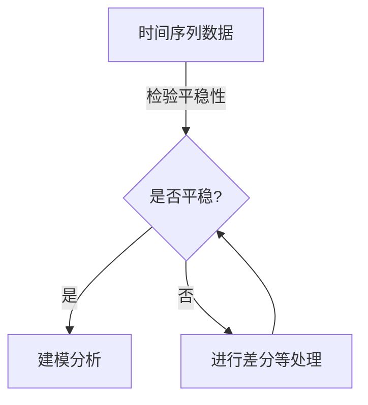
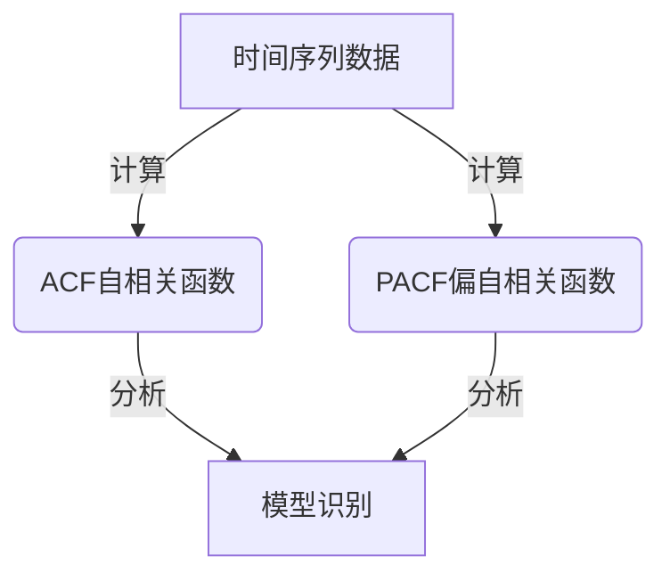
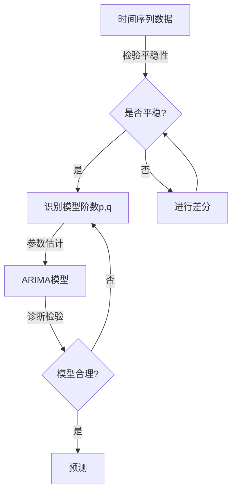

# 时间序列分析(Time Series Analysis) - 原理与代码实例讲解

## 1.背景介绍

### 1.1 什么是时间序列

时间序列(Time Series)是一组按时间顺序排列的数据点集合,通常是按相等的时间间隔(如每小时、每天、每周等)收集的。时间序列广泛存在于各个领域,如金融、经济、气象、工业生产等。通过分析时间序列数据,我们可以发现其中隐藏的规律和趋势,进而对未来进行预测和决策。

### 1.2 时间序列分析的重要性

时间序列分析在现代社会中扮演着重要角色,为各行业提供了宝贵的洞见和预测能力。例如:

- 金融领域:预测股票、外汇等金融资产的走势
- 零售业:预测产品销量,优化供应链管理
- 能源行业:预测能源需求,规划发电量
- 气象部门:预报天气变化,为农业生产等提供决策依据

### 1.3 时间序列分析的挑战

尽管时间序列分析具有重要意义,但也面临着一些挑战:

- 数据噪声:时间序列数据常常包含噪声,需要去除噪声以发现真实模式
- 非平稳性:许多时间序列数据不是平稳的,需要进行差分等处理
- 周期性:一些时间序列存在周期性波动,需要特殊处理
- 多变量影响:时间序列数据可能受多个变量的影响,需要建立合适的多元模型

## 2.核心概念与联系

时间序列分析涉及多个核心概念,下面将对这些概念进行介绍并阐明它们之间的联系。

### 2.1 平稳性(Stationarity)

平稳性是时间序列分析的基础概念。一个严格平稳的时间序列指的是其统计特性(如均值、方差、自协方差等)在时间上保持不变。非平稳序列需要通过差分等方法转换为平稳序列后才能建模分析。

平稳性检验方法有:

- 可视化观察
- 单位根检验(ADF检验等)
- KPSS检验

### 2.2 自相关(Autocorrelation)和偏自相关(Partial Autocorrelation)

自相关描述了时间序列在不同时间点之间的相关性,是时间序列分析的重要工具。自相关函数(ACF)给出了序列与其自身在不同滞后时间的相关系数。

偏自相关函数(PACF)描述了在去除了其他滞后影响后,时间序列在某个滞后时间与自身的相关性。PACF常用于确定模型的阶数。

### 2.3 白噪声(White Noise)

白噪声是指均值为0、方差为常数的随机过程,是建模的基础。许多时间序列模型都建立在白噪声的假设之上。

### 2.4 ARIMA模型

ARIMA(AutoRegressive Integrated Moving Average)模型是时间序列分析中最常用的模型之一,包括三个部分:

- AR(AutoRegressive):自回归部分
- I(Integrated):差分阶数
- MA(Moving Average):移动平均部分

ARIMA模型可以很好地描述和预测许多不同类型的时间序列数据。

### 2.5 其他模型

除了ARIMA模型外,时间序列分析还有其他常用模型,如:

- ARIMA变体模型(SARIMA、ARIMAX等)
- 指数平滑模型
- 深度学习模型(RNN、LSTM等)

不同模型适用于不同类型的时间序列数据,需要根据具体问题选择合适的模型。

## 3.核心算法原理具体操作步骤 

### 3.1 ARIMA模型

ARIMA模型是时间序列分析中最常用的模型之一,具有很强的解释性和预测能力。下面将详细介绍ARIMA模型的原理和建模步骤。

#### 3.1.1 ARIMA模型形式

ARIMA(p,d,q)模型由三部分组成:

- AR(p):自回归模型,阶数为p
- I(d):差分阶数d,使时间序列平稳
- MA(q):移动平均模型,阶数为q

ARIMA(p,d,q)模型可表示为:

$$
\begin{aligned}
y_t' &= c + \phi_1 y_{t-1}' + \phi_2 y_{t-2}' + \cdots + \phi_p y_{t-p}' \\
     &\quad + \theta_1 \epsilon_{t-1} + \theta_2 \epsilon_{t-2} + \cdots + \theta_q \epsilon_{t-q} + \epsilon_t
\end{aligned}
$$

其中:
- $y_t'$是差分后的时间序列
- $\phi_i(i=1,2,\cdots,p)$是自回归系数
- $\theta_j(j=1,2,\cdots,q)$是移动平均系数
- $\epsilon_t$是白噪声项

#### 3.1.2 ARIMA建模步骤

ARIMA模型的建模过程包括以下几个步骤:

1. **平稳性检验**:通过ADF检验、KPSS检验等方法检验时间序列是否平稳,如果不平稳则进行差分使之平稳。
2. **模型识别**:通过自相关函数(ACF)和偏自相关函数(PACF)的形状,确定模型的阶数p和q。
3. **参数估计**:使用最小二乘法或最大似然法等方法估计模型参数。
4. **诊断检验**:对残差进行白噪声检验,检查模型是否合理。如果不合理则返回第2步重新识别模型阶数。
5. **预测**:利用确定的ARIMA模型对未来时间序列数据进行预测。

以上是ARIMA模型的基本原理和建模步骤,在实际应用中还需要注意数据处理、模型评估等细节。接下来将通过一个实例对ARIMA模型进行代码实现。

### 3.2 其他时间序列模型

除了ARIMA模型,时间序列分析还有其他常用模型,如SARIMA、ARIMAX、指数平滑、深度学习模型等。这些模型在不同场景下具有不同的优势,需要根据具体问题选择合适的模型。

#### 3.2.1 SARIMA模型

SARIMA(Seasonal ARIMA)模型是对ARIMA模型的扩展,用于处理具有周期性的时间序列数据。SARIMA模型在ARIMA模型的基础上增加了周期成分,可以更好地捕捉数据的季节性波动。

#### 3.2.2 ARIMAX模型 

ARIMAX(ARIMA with Exogenous Variables)模型是在ARIMA模型的基础上加入了外生自变量,用于分析时间序列数据与其他外部变量之间的关系。ARIMAX模型可以更好地解释和预测时间序列数据。

#### 3.2.3 指数平滑模型

指数平滑模型是一种较为简单的时间序列预测方法,通过对历史数据赋予不同的权重来预测未来值。常用的指数平滑模型包括简单指数平滑、双重指数平滑、Holt-Winters等。

#### 3.2.4 深度学习模型

近年来,深度学习模型在时间序列分析领域取得了不错的成绩,尤其是在处理非线性、非平稳等复杂时间序列数据时表现出色。常用的深度学习模型有RNN(Recurrent Neural Network)、LSTM(Long Short-Term Memory)等。

不同的时间序列模型有不同的适用场景,在实际应用中需要根据数据的特点和问题的需求选择合适的模型。

## 4.数学模型和公式详细讲解举例说明

在时间序列分析中,数学模型和公式扮演着重要角色。下面将详细介绍一些常用的数学模型和公式,并给出具体的例子说明。

### 4.1 自相关函数(ACF)

自相关函数描述了时间序列在不同时间滞后下与自身的相关性,是时间序列分析的重要工具之一。给定时间序列$\{X_t\}$,滞后k的自相关系数$\rho_k$定义为:

$$
\rho_k = \frac{cov(X_t, X_{t-k})}{\sqrt{var(X_t)var(X_{t-k})}}
$$

其中$cov$表示协方差,$var$表示方差。自相关函数的计算公式为:

$$
\rho_k = \frac{\sum_{t=k+1}^{n}(X_t - \bar{X})(X_{t-k} - \bar{X})}{\sum_{t=1}^{n}(X_t - \bar{X})^2}
$$

其中$\bar{X}$为时间序列的均值,$n$为数据长度。

**举例**:假设有一个时间序列数据$\{5, 7, 9, 3, 6, 8\}$,计算滞后1和滞后2的自相关系数:

$$
\begin{aligned}
\bar{X} &= \frac{5+7+9+3+6+8}{6} = 6.33\\
\rho_1 &= \frac{(7-6.33)(5-6.33) + (9-6.33)(7-6.33) + (3-6.33)(9-6.33) + (6-6.33)(3-6.33) + (8-6.33)(6-6.33)}{5^2+7^2+9^2+3^2+6^2+8^2-6(6.33)^2} \\
       &= \frac{-6.99+10.89-18.99-9.99+6.99}{126.67} = -0.14\\
\rho_2 &= \frac{(9-6.33)(7-6.33) + (3-6.33)(9-6.33) + (6-6.33)(3-6.33) + (8-6.33)(6-6.33)}{5^2+7^2+9^2+3^2+6^2+8^2-6(6.33)^2}\\
       &= \frac{10.89-18.99-9.99+6.99}{126.67} = -0.09
\end{aligned}
$$

自相关函数的值域是$[-1,1]$,值越接近0表示相关性越弱。上例中$\rho_1$和$\rho_2$都比较接近0,说明该时间序列的自相关性不太强。

### 4.2 偏自相关函数(PACF)

偏自相关函数描述了在去除其他滞后影响后,时间序列在某个滞后时间与自身的相关性。给定时间序列$\{X_t\}$,滞后k的偏自相关系数$\phi_{kk}$可通过以下方程组求解:

$$
\begin{aligned}
\rho_k &= \phi_{k1}\rho_{k-1} + \phi_{k2}\rho_{k-2} + \cdots + \phi_{kk}\rho_0\\
\rho_{k-1} &= \phi_{k1}\rho_0 + \phi_{k2}\rho_1 + \cdots + \phi_{k,k-1}\rho_{k-2}\\
&\vdots\\
\rho_1 &= \phi_{k1}\rho_0
\end{aligned}
$$

其中$\rho_k$为自相关系数。偏自相关函数常用于确定ARIMA模型的阶数p和q。

**举例**:计算上例时间序列$\{5, 7, 9, 3, 6, 8\}$的滞后1和滞后2的偏自相关系数。

已知$\rho_0=1,\rho_1=-0.14,\rho_2=-0.09$,将它们代入方程组可求解:

$$
\begin{aligned}
-0.14 &= \phi_{11}\\
-0.09 &= \phi_{21}(-0.14) + \phi_{22}
\end{aligned}
$$

解得$\phi_{11}=-0.14,\phi_{21}=0.36,\phi_{22}=-0.45$。

因此,该时间