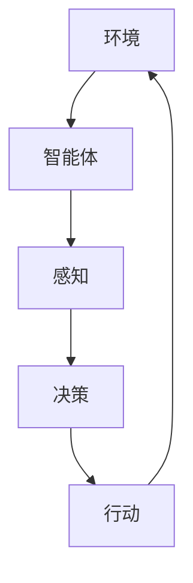

# 智能体 (Agent)

## 1. 背景介绍

### 1.1 智能体的起源与发展
#### 1.1.1 智能体概念的提出
#### 1.1.2 智能体技术的发展历程
#### 1.1.3 智能体在人工智能领域的地位

### 1.2 智能体的定义与特征
#### 1.2.1 智能体的定义
#### 1.2.2 智能体的主要特征
#### 1.2.3 智能体与传统软件的区别

## 2. 核心概念与联系

### 2.1 智能体的分类
#### 2.1.1 反应型智能体
#### 2.1.2 认知型智能体
#### 2.1.3 社会型智能体

### 2.2 智能体的架构
#### 2.2.1 感知-决策-行动模型
#### 2.2.2 BDI (Belief-Desire-Intention) 模型
#### 2.2.3 混合架构

### 2.3 智能体之间的交互
#### 2.3.1 通信机制
#### 2.3.2 协作与竞争
#### 2.3.3 多智能体系统



## 3. 核心算法原理具体操作步骤

### 3.1 强化学习
#### 3.1.1 马尔可夫决策过程
#### 3.1.2 Q-Learning算法
#### 3.1.3 策略梯度方法

### 3.2 搜索算法
#### 3.2.1 启发式搜索
#### 3.2.2 A*搜索算法
#### 3.2.3 蒙特卡洛树搜索

### 3.3 规划算法  
#### 3.3.1 经典规划
#### 3.3.2 层次化规划
#### 3.3.3 实时规划

## 4. 数学模型和公式详细讲解举例说明

### 4.1 马尔可夫决策过程
#### 4.1.1 状态、动作、转移概率和奖励
#### 4.1.2 贝尔曼方程
$$V(s)=\max _{a} \sum_{s^{\prime}} P\left(s^{\prime} | s, a\right)\left[R\left(s, a, s^{\prime}\right)+\gamma V\left(s^{\prime}\right)\right]$$

### 4.2 Q-Learning 
#### 4.2.1 Q值更新公式
$$Q(s, a) \leftarrow Q(s, a)+\alpha\left[r+\gamma \max _{a^{\prime}} Q\left(s^{\prime}, a^{\prime}\right)-Q(s, a)\right]$$
#### 4.2.2 探索与利用的权衡

### 4.3 策略梯度
#### 4.3.1 策略参数化
#### 4.3.2 目标函数与梯度估计
$\nabla_{\theta} J(\theta)=\mathbb{E}_{\tau \sim p_{\theta}(\tau)}\left[\sum_{t=0}^{T} \nabla_{\theta} \log \pi_{\theta}\left(a_{t} | s_{t}\right) R(\tau)\right]$

## 5. 项目实践：代码实例和详细解释说明

### 5.1 基于Q-Learning的迷宫寻路智能体
#### 5.1.1 环境与任务定义
#### 5.1.2 Q表的设计与更新
#### 5.1.3 探索与利用策略

```python
import numpy as np

class QLearningAgent:
    def __init__(self, env, alpha=0.1, gamma=0.9, epsilon=0.1):
        self.env = env
        self.alpha = alpha
        self.gamma = gamma 
        self.epsilon = epsilon
        self.Q = np.zeros((env.observation_space.n, env.action_space.n))

    def choose_action(self, state):
        if np.random.uniform() < self.epsilon:
            return self.env.action_space.sample()
        else:
            return np.argmax(self.Q[state])

    def update_Q(self, state, action, reward, next_state):
        self.Q[state][action] += self.alpha * (reward + self.gamma * np.max(self.Q[next_state]) - self.Q[state][action])

    def train(self, num_episodes):
        for _ in range(num_episodes):
            state = self.env.reset()
            done = False
            while not done:
                action = self.choose_action(state)
                next_state, reward, done, _ = self.env.step(action)
                self.update_Q(state, action, reward, next_state)
                state = next_state
```

### 5.2 基于深度强化学习的对话智能体
#### 5.2.1 对话环境与任务定义
#### 5.2.2 深度Q网络的设计
#### 5.2.3 经验回放与目标网络

## 6. 实际应用场景

### 6.1 智能客服
#### 6.1.1 自然语言理解与生成
#### 6.1.2 对话管理与上下文理解
#### 6.1.3 知识库问答

### 6.2 自动驾驶
#### 6.2.1 感知与决策
#### 6.2.2 路径规划与控制
#### 6.2.3 多智能体协同

### 6.3 智能推荐
#### 6.3.1 用户画像与兴趣建模
#### 6.3.2 协同过滤与内容过滤
#### 6.3.3 在线学习与个性化推荐

## 7. 工具和资源推荐

### 7.1 开发框架
#### 7.1.1 OpenAI Gym
#### 7.1.2 TensorFlow Agents
#### 7.1.3 RLlib

### 7.2 学习资源
#### 7.2.1 《Reinforcement Learning: An Introduction》
#### 7.2.2 《Artificial Intelligence: A Modern Approach》
#### 7.2.3 CS234: Reinforcement Learning (Stanford)

## 8. 总结：未来发展趋势与挑战

### 8.1 智能体的发展趋势
#### 8.1.1 多智能体系统与协同
#### 8.1.2 人机混合智能
#### 8.1.3 可解释性与安全性

### 8.2 面临的挑战
#### 8.2.1 样本效率与泛化能力
#### 8.2.2 奖励设计与目标指定
#### 8.2.3 伦理与法律问题

## 9. 附录：常见问题与解答

### 9.1 如何选择合适的智能体架构？
### 9.2 如何处理智能体学习过程中的探索与利用问题？
### 9.3 如何评估智能体的性能？

智能体技术是人工智能领域的重要分支，旨在创建能够感知环境、做出决策并执行行动的自主实体。随着人工智能的不断发展，智能体技术在各个领域得到了广泛应用，如智能客服、自动驾驶、智能推荐等。未来，智能体技术将向着多智能体协同、人机混合智能、可解释性与安全性等方向发展，同时也面临着样本效率、奖励设计、伦理法律等挑战。

作为人工智能领域的研究者和实践者，我们应该深入理解智能体的核心概念和算法原理，掌握相关的开发工具和框架，并积极探索智能体技术在实际场景中的应用。同时，我们也要关注智能体技术发展过程中的伦理与安全问题，确保智能体技术能够造福人类社会。

作者：禅与计算机程序设计艺术 / Zen and the Art of Computer Programming