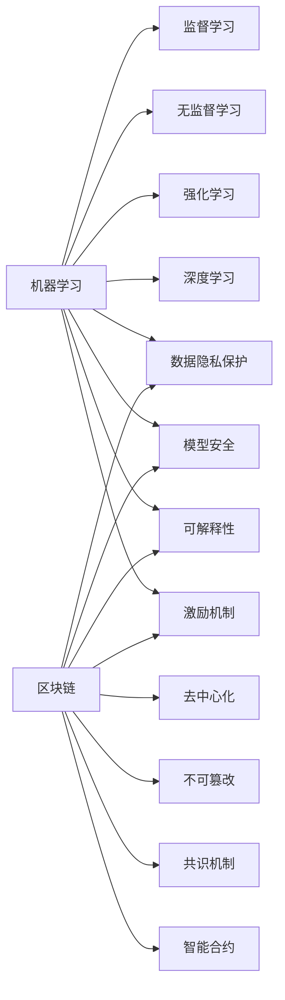

# 机器学习与区块链：安全与可信赖的机器学习

## 1. 背景介绍
### 1.1 机器学习的发展现状
机器学习作为人工智能的核心，近年来取得了突飞猛进的发展。从图像识别、语音识别到自然语言处理，机器学习已经在各个领域展现出了巨大的潜力。然而，随着机器学习模型的日益复杂化和应用场景的不断拓展，其安全性和可信赖性问题日益凸显。

### 1.2 区块链技术的兴起
区块链作为一种去中心化的分布式账本技术，以其不可篡改、高度透明的特性，为解决机器学习的安全与可信赖问题提供了新的思路。区块链技术通过密码学原理和共识机制，确保数据的真实性和一致性，为构建可信的机器学习系统奠定了基础。

### 1.3 机器学习与区块链结合的意义
将机器学习与区块链技术相结合，有望解决机器学习面临的数据隐私、模型安全、决策可解释等诸多挑战，实现安全、透明、可信赖的机器学习。这不仅有利于推动机器学习技术的进一步发展，也将为人工智能在金融、医疗、供应链等领域的应用提供坚实的技术支撑。

## 2. 核心概念与联系
### 2.1 机器学习的核心概念
- 监督学习：通过标注数据训练模型，实现对未知数据的预测。
- 无监督学习：从无标注数据中发现隐藏的模式和结构。
- 强化学习：通过与环境的交互，学习最优决策策略。
- 深度学习：利用多层神经网络，实现对复杂数据的表征学习。

### 2.2 区块链的核心概念
- 去中心化：不依赖于中心化的管理机构，实现点对点的直接交互。
- 不可篡改：一旦数据写入区块链，无法被篡改或删除。
- 共识机制：通过特定的算法，在分布式节点间达成对交易的一致性认可。
- 智能合约：以代码形式编写的自动化执行合约，具有不可篡改和可验证的特性。

### 2.3 机器学习与区块链的联系
机器学习与区块链的结合，主要体现在以下几个方面：
- 数据隐私保护：利用区块链的加密和访问控制机制，保护用户数据隐私。
- 模型安全：通过区块链存储模型参数和训练过程，防止模型被篡改或窃取。
- 可解释性：利用区块链记录决策过程，增强机器学习模型的透明度和可解释性。
- 激励机制：通过区块链代币激励数据贡献和模型训练，构建去中心化的机器学习生态。



## 3. 核心算法原理具体操作步骤
### 3.1 联邦学习
联邦学习是一种分布式机器学习范式，允许多方在不共享原始数据的情况下，协同训练模型。其基本步骤如下：
1. 各参与方在本地利用自己的数据训练模型。
2. 各方将本地模型参数上传至中心服务器。
3. 中心服务器对收到的模型参数进行聚合，得到全局模型。
4. 中心服务器将全局模型分发给各参与方。
5. 各方利用全局模型继续在本地进行训练，重复步骤2-4，直至模型收敛。

### 3.2 多方安全计算
多方安全计算允许多个参与方在不泄露各自隐私数据的前提下，联合计算某个函数。其常见的实现技术包括：
- 秘密共享：将隐私数据分割成多个份额，分别由不同参与方持有，单独一方无法获取完整信息。
- 同态加密：允许在加密数据上直接进行计算，得到的结果解密后与对原始数据进行同样计算的结果一致。
- 混淆电路：将计算过程表示为布尔电路，参与方对电路的输入进行加密，通过安全协议计算电路输出。

### 3.3 零知识证明
零知识证明允许证明者在不泄露任何额外信息的情况下，向验证者证明某个论断的正确性。其基本原理如下：
1. 证明者将论断转化为一个难以解决但易于验证的数学问题。
2. 证明者利用自己掌握的信息（如私钥），生成问题的解，即证明。
3. 验证者通过验证证明的正确性，从而确信原始论断的正确性，但无法获知证明过程中使用的任何额外信息。

## 4. 数学模型和公式详细讲解举例说明
### 4.1 安全多方计算中的秘密共享
在秘密共享中，我们通常采用Shamir秘密共享方案。假设要在$n$个参与方之间共享秘密$s$，且至少需要$t$个参与方才能恢复秘密。基本步骤如下：

1. 在有限域$GF(p)$上选择次数不超过$t-1$的多项式$f(x)$，满足$f(0)=s$。
2. 选择$n$个不同的非零元素$x_1,x_2,...,x_n$，计算$y_i=f(x_i), i=1,2,...,n$。
3. 将$(x_i,y_i)$作为第$i$个参与方的子秘密份额。

当至少$t$个参与方聚合他们的子秘密份额时，可以通过Lagrange插值公式恢复出原始秘密$s$：

$$s=f(0)=\sum_{i=1}^{t}y_i\prod_{j=1,j\neq i}^{t}\frac{x_j}{x_j-x_i} \pmod p$$

### 4.2 同态加密中的Paillier加密系统
Paillier加密系统是一种常用的加法同态加密方案。其公私钥生成、加密和解密过程如下：

1. 选择两个大素数$p$和$q$，计算$n=pq$，$\lambda=lcm(p-1,q-1)$。
2. 选择随机数$g\in \mathbb{Z}_{n^2}^*$，计算$\mu=(\mathcal{L}(g^\lambda \bmod n^2))^{-1} \bmod n$，其中$\mathcal{L}(x)=\frac{x-1}{n}$。
3. 公钥为$(n,g)$，私钥为$(\lambda,\mu)$。
4. 对明文$m\in \mathbb{Z}_n$，选择随机数$r\in \mathbb{Z}_n^*$，加密为$c=g^m\cdot r^n \bmod n^2$。
5. 对密文$c$，解密为$m=\mathcal{L}(c^\lambda \bmod n^2)\cdot \mu \bmod n$。

Paillier加密系统的加法同态性质满足：

$$D(E(m_1,r_1)\cdot E(m_2,r_2) \bmod n^2)=m_1+m_2 \bmod n$$

其中$E$和$D$分别表示加密和解密函数。

## 5. 项目实践：代码实例和详细解释说明
下面以Python为例，演示如何利用区块链实现一个简单的联邦学习系统。

### 5.1 区块链部分
首先，我们利用Python的`hashlib`库实现一个简单的区块链：

```python
import hashlib
import json

class Block:
    def __init__(self, index, timestamp, data, previous_hash):
        self.index = index
        self.timestamp = timestamp
        self.data = data
        self.previous_hash = previous_hash
        self.hash = self.calculate_hash()

    def calculate_hash(self):
        block_string = json.dumps(self.__dict__, sort_keys=True)
        return hashlib.sha256(block_string.encode()).hexdigest()

class Blockchain:
    def __init__(self):
        self.chain = [self.create_genesis_block()]

    def create_genesis_block(self):
        return Block(0, "2023-06-08", "Genesis Block", "0")

    def get_latest_block(self):
        return self.chain[-1]

    def add_block(self, new_block):
        new_block.previous_hash = self.get_latest_block().hash
        new_block.hash = new_block.calculate_hash()
        self.chain.append(new_block)
```

在这个简单的区块链实现中，每个区块包含了索引、时间戳、数据和前一个区块的哈希值。`Blockchain`类维护了一个区块的链表，并提供了添加新区块的方法。

### 5.2 联邦学习部分
接下来，我们利用`TensorFlow`实现一个简单的联邦学习系统：

```python
import tensorflow as tf
import numpy as np
import time

class FederatedModel:
    def __init__(self, model_fn, num_clients):
        self.model_fn = model_fn
        self.num_clients = num_clients
        self.client_models = [self.model_fn() for _ in range(num_clients)]
        self.global_model = self.model_fn()

    def train_client_models(self, client_datasets):
        for i in range(self.num_clients):
            self.client_models[i].fit(client_datasets[i], epochs=1)

    def aggregate_models(self):
        global_weights = self.global_model.get_weights()
        for i in range(len(global_weights)):
            client_weights = [model.get_weights()[i] for model in self.client_models]
            global_weights[i] = np.mean(client_weights, axis=0)
        self.global_model.set_weights(global_weights)

    def train(self, client_datasets, num_rounds):
        blockchain = Blockchain()
        for round in range(num_rounds):
            self.train_client_models(client_datasets)
            self.aggregate_models()
            model_hash = hashlib.sha256(self.global_model.to_json().encode()).hexdigest()
            block = Block(round+1, time.time(), model_hash, "")
            blockchain.add_block(block)
        return blockchain
```

在这个联邦学习系统中，`FederatedModel`类维护了多个客户端模型和一个全局模型。`train_client_models`方法在每个客户端上使用本地数据训练模型，`aggregate_models`方法将客户端模型参数聚合更新到全局模型。`train`方法执行多轮联邦学习，并将每轮得到的全局模型哈希值记录到区块链中。

### 5.3 运行示例
下面是一个完整的运行示例：

```python
def create_model():
    model = tf.keras.Sequential([
        tf.keras.layers.Dense(10, activation='relu', input_shape=(784,)),
        tf.keras.layers.Dense(10, activation='softmax')
    ])
    model.compile(optimizer='adam', loss='categorical_crossentropy', metrics=['accuracy'])
    return model

(x_train, y_train), (x_test, y_test) = tf.keras.datasets.mnist.load_data()
x_train = x_train.reshape((60000, 784)) / 255.0
x_test = x_test.reshape((10000, 784)) / 255.0
y_train = tf.keras.utils.to_categorical(y_train)
y_test = tf.keras.utils.to_categorical(y_test)

client_datasets = [
    (x_train[0:20000], y_train[0:20000]),
    (x_train[20000:40000], y_train[20000:40000]),
    (x_train[40000:60000], y_train[40000:60000])
]

model = FederatedModel(create_model, len(client_datasets))
blockchain = model.train(client_datasets, num_rounds=10)

for block in blockchain.chain:
    print(f"Block {block.index}: {block.data}")
```

在这个例子中，我们使用MNIST手写数字数据集，将其划分为3个客户端的本地数据集。然后创建一个`FederatedModel`实例，执行10轮联邦学习，并将每轮的全局模型哈希值记录到区块链中。最后，我们打印出区块链中的每个区块信息。

通过这种方式，我们利用区块链的不可篡改性，确保了联邦学习过程中的模型更新记录的完整性和透明性，从而增强了联邦学习的安全性和可信赖性。

## 6. 实际应用场景
机器学习与区块链的结合，在以下场景中具有广阔的应用前景：

### 6.1 医疗健康
在医疗领域，机器学习可以用于疾病诊断、药物研发、个性化治