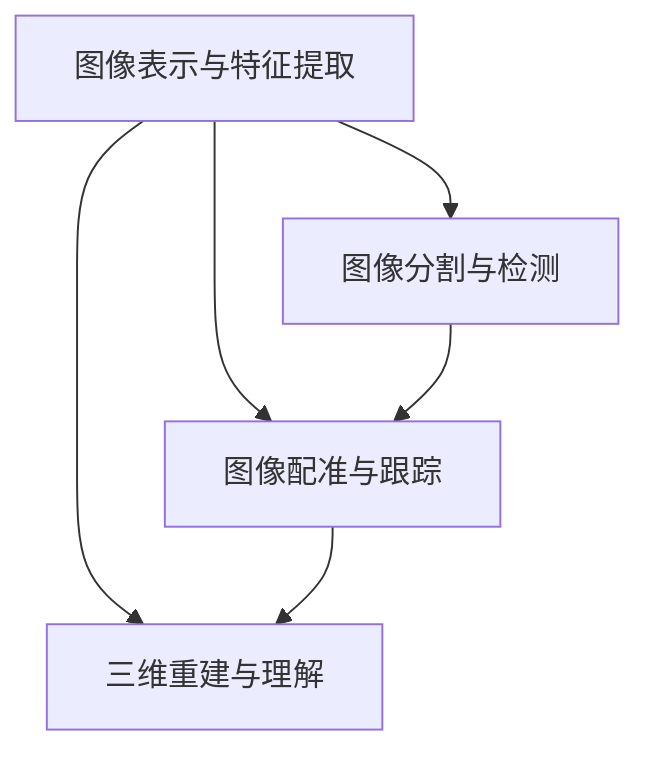

# 机器视觉 (Computer Vision)

## 1. 背景介绍

机器视觉(Computer Vision)是一个跨学科领域,它研究如何使计算机获得高层次的图像和视频理解。机器视觉旨在通过算法和模型,使计算机能够从图像或视频中提取、分析和理解有用的信息,进而做出智能决策。

### 1.1 机器视觉的起源与发展

机器视觉的研究可以追溯到20世纪50年代末。1959年,Hubel和Wiesel在研究猫视觉皮层时发现了视觉系统的层次结构,为计算机视觉的发展奠定了神经科学基础。20世纪60年代,Roberts提出了基于几何的物体建模方法,标志着计算机视觉的诞生。

此后,机器视觉经历了几次重要的发展阶段:

- 20世纪70年代,Marr提出了视觉计算理论框架,将视觉问题分解为表示和过程。
- 20世纪80年代,Lowe提出了尺度不变特征变换(SIFT)算法,解决了图像匹配问题。
- 20世纪90年代,Viola和Jones提出了基于Haar特征的快速人脸检测算法。
- 21世纪初,深度学习方法在图像分类等任务上取得突破,极大推动了机器视觉的发展。

### 1.2 机器视觉的应用领域

机器视觉在许多领域有着广泛的应用,例如:

- 自动驾驶:通过分析道路图像实现车辆的自主导航。
- 医学影像:辅助医生进行疾病诊断和手术规划。  
- 工业检测:自动检测产品缺陷,提高生产效率。
- 安防监控:实时检测和跟踪可疑目标,预防安全事故。
- 人机交互:通过手势、表情识别等方式,实现更自然的人机交互。

### 1.3 机器视觉面临的挑战

尽管机器视觉取得了长足进展,但仍面临许多挑战:

- 鲁棒性:如何提高算法对光照、视角等变化的鲁棒性。
- 小样本学习:如何利用少量标注数据训练高性能模型。  
- 领域自适应:如何使模型适应不同领域的数据分布差异。
- 可解释性:如何理解模型的决策过程,提高模型的可信度。

## 2. 核心概念与联系

机器视觉涉及多个核心概念,它们相互关联,共同构成了机器视觉的理论和方法体系。

### 2.1 图像表示与特征提取

图像表示是将图像转化为计算机能够处理的数字形式。常见的图像表示方法包括像素表示、频域表示等。在图像表示的基础上,需要提取图像的特征,用于后续的分析和理解。常用的特征包括:

- 颜色特征:如颜色直方图、颜色矩等。
- 纹理特征:如LBP、Gabor滤波器等。
- 形状特征:如HOG、SIFT等。
- 深度特征:利用深度学习方法学习到的高层特征。

### 2.2 图像分割与检测

图像分割是将图像划分为若干个语义区域的过程。常用的图像分割算法包括:

- 阈值分割:根据像素灰度值设置阈值进行分割。
- 区域生长:从种子点开始,不断将相似的像素点合并到区域中。
- 图割:将图像视为图,通过最小割算法实现分割。
- 语义分割:利用深度学习方法对图像进行像素级别的分类。

图像检测是定位图像中感兴趣目标的过程。常见的检测任务包括人脸检测、行人检测、车辆检测等。经典的检测算法包括Viola-Jones、DPM等,近年来基于深度学习的检测算法如Faster R-CNN、YOLO等取得了较好的性能。

### 2.3 图像配准与跟踪

图像配准是将两幅或多幅图像对齐到同一坐标系下的过程。常用的配准算法包括基于特征的配准、基于灰度值的配准等。图像配准在医学影像、遥感影像等领域有重要应用。

图像跟踪是在视频序列中持续定位感兴趣目标的过程。常见的跟踪算法包括:

- 核相关滤波器(KCF):利用循环矩阵的性质加速相关滤波器的求解。
- 孪生网络(Siamese Network):通过学习目标与搜索区域的相似度,实现跟踪。
- 强化学习:将跟踪建模为马尔可夫决策过程,通过强化学习求解策略。

### 2.4 三维重建与理解

三维重建是从二维图像恢复场景三维结构的过程。常用的三维重建方法包括:

- 双目立体视觉:通过左右两个视角的图像恢复深度信息。
- 结构光:投影特定光纹图案到物体表面,根据畸变恢复深度。
- SfM:通过运动物体的多视角图像,恢复场景结构和相机运动。

在重建的三维模型基础上,可以进一步进行三维场景理解,如三维物体检测、三维语义分割等。

### 2.5 概念之间的联系

以上核心概念之间存在密切的联系:

- 图像表示和特征提取是图像分割、检测等任务的基础。
- 图像分割的结果可用于辅助检测和跟踪等任务。
- 图像配准是三维重建的重要步骤。
- 在图像跟踪中也常利用目标检测和分割的结果。

下图展示了这些概念之间的联系:



## 3. 核心算法原理具体操作步骤

本节介绍几种机器视觉的核心算法,包括它们的基本原理和具体操作步骤。

### 3.1 尺度不变特征变换(SIFT)

SIFT是一种用于图像配准和识别的局部特征描述符,对尺度、旋转等变化具有不变性。其主要步骤包括:

1. 尺度空间极值检测:在不同尺度下对图像进行高斯模糊,并计算相邻尺度之差(DoG),找出局部极值点作为关键点候选。
2. 关键点定位:通过泰勒展开拟合DoG函数,精确定位关键点位置,并剔除低对比度和边缘响应较强的不稳定点。
3. 方向赋值:根据关键点邻域像素的梯度方向直方图,确定该点的主方向,使特征具备旋转不变性。
4. 关键点描述:以关键点为中心取16x16邻域,划分为4x4子区域,每个子区域计算8个方向的梯度直方图,形成128维特征向量。

### 3.2 Viola-Jones人脸检测

Viola-Jones是一种经典的实时人脸检测算法,基于Haar特征和AdaBoost分类器。其主要步骤包括:

1. Haar特征提取:定义多种尺度和形状的Haar特征模板,用积分图快速计算图像中不同位置处的Haar特征值。
2. AdaBoost训练:使用AdaBoost算法训练多个弱分类器,并将其组合成强分类器。每个弱分类器基于一个Haar特征,通过阈值比较对窗口进行二分类。
3. 级联分类:将多个强分类器级联,前面的分类器用于快速剔除大多数负样本,后面的分类器用于检测出人脸。窗口依次通过各级分类器,只有全部通过才被认为是人脸。
4. 多尺度检测:对图像金字塔的各层图像进行滑动窗口检测,实现不同尺度人脸的检测。

### 3.3 KCF跟踪算法

KCF是一种基于核相关滤波器的实时跟踪算法,利用循环矩阵的性质在傅里叶域求解,大大提高了速度。其主要步骤包括:

1. 初始化:在第一帧中,以目标位置为中心取一个大小为MxN的图像块作为训练样本。
2. 训练:使用高斯核计算训练样本的核相关矩阵,并在傅里叶域求解岭回归闭式解,得到相关滤波器的傅里叶系数。
3. 检测:在下一帧中,以上一帧目标位置为中心取MxN图像块,计算其与相关滤波器的傅里叶域点积,得到响应图。
4. 位置估计:在响应图中找到峰值位置,作为新的目标位置。
5. 模型更新:以一定学习率对相关滤波器进行在线更新,适应目标外观变化。重复步骤3-5直到视频结束。

### 3.4 图割分割算法

图割是一种基于能量最小化的图像分割算法,通过构建像素间的图模型,求解最小割将图划分为前景和背景区域。其主要步骤包括:

1. 图构建:将图像视为一个无向图G=(V,E),每个像素对应一个顶点,相邻像素之间有一条连接边。
2. 能量定义:定义能量函数E(L)=Σ_p D_p(L_p)+Σ_(p,q) V_(p,q)(L_p,L_q),其中D_p(L_p)表示将像素p标记为L_p的代价,V_(p,q)表示相邻像素p和q标记不一致的惩罚项。
3. 最小割求解:在图G中添加两个特殊节点s(源)和t(汇),分别与所有像素相连。求解从s到t的最小割,将图划分为两个子图,分别对应前景和背景。
4. 分割结果:根据最小割的结果,将像素标记为前景或背景,得到分割结果。

## 4. 数学模型和公式详细讲解举例说明

本节以图割分割算法为例,详细讲解其数学模型和公式。

图割分割的核心是能量函数的定义。设L为图像的标记,L_p∈{0,1}表示像素p的标记(0为背景,1为前景)。能量函数E(L)由两部分组成:数据项D_p(L_p)和平滑项V_(p,q)(L_p,L_q)。

数据项衡量了将像素p标记为L_p的代价,常用的定义包括:

- 高斯分布: $D_p(L_p)=-log P(I_p|L_p)=-log[\frac{1}{\sqrt{2π}σ}exp(-\frac{(I_p-μ_(L_p))^2}{2σ^2})]$
- 直方图模型: $D_p(L_p)=-log P(I_p|L_p)=-log H_(L_p)(I_p)$

其中I_p为像素p的灰度值,μ_(L_p)和σ分别为标记为L_p的像素灰度值的均值和方差,H_(L_p)为标记为L_p的像素灰度直方图。

平滑项鼓励相邻像素具有一致的标记,常用的定义包括:

- Potts模型: $V_(p,q)(L_p,L_q)=λ·δ(L_p≠L_q)$
- 对比敏感Potts模型: $V_(p,q)(L_p,L_q)=λ·exp(-\frac{(I_p-I_q)^2}{2σ^2})·δ(L_p≠L_q)$

其中λ为平滑系数,δ(·)为指示函数。对比敏感Potts模型考虑了像素间灰度差异,鼓励灰度相似的相邻像素标记一致。

在构建图G=(V,E)时,数据项对应顶点的权重,平滑项对应边的权重。在图G中添加源点s和汇点t,s与所有像素之间有一条权重为D_p(1)的有向边,t与所有像素之间有一条权重为D_p(0)的有向边。求解最小割等价于最大流问题,可使用Ford-Fulkerson等算法求解。

举例说明,考虑如下4x4图像:

```
4 3 6 7
2 1 9 5
0 8 3 2
1 4 6 3
```

假设已知部分像素的前景背景标记