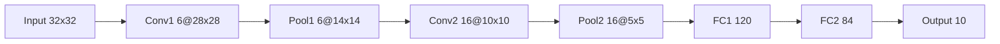

# 深度学习原理与代码实战案例讲解

## 1. 背景介绍

### 1.1 深度学习的起源与发展

深度学习(Deep Learning)是机器学习的一个分支,其本质是通过构建具有多个隐藏层的人工神经网络,并利用大量的训练数据,来学习数据背后隐藏的模式和表示,从而对未知数据进行预测。深度学习概念最早由 Geoffrey Hinton 等人在 2006 年提出,随后在语音识别、图像识别等领域取得了突破性进展,引发了新一轮的人工智能热潮。

近年来,得益于算法的改进、数据的增多和计算能力的提升,深度学习已成为人工智能领域最为活跃和成功的技术之一。从 AlphaGo 击败人类围棋冠军,到自动驾驶汽车的广泛应用,再到自然语言处理的长足进步,无不彰显着深度学习的巨大威力。可以预见,深度学习将在未来继续引领人工智能技术的发展,深刻影响和改变人类社会。

### 1.2 深度学习的应用领域

深度学习在诸多领域得到了广泛应用,主要包括:

- 计算机视觉:图像分类、目标检测、语义分割、人脸识别等
- 语音识别:语音转文本、说话人识别、情感识别等  
- 自然语言处理:机器翻译、情感分析、文本分类、问答系统、聊天机器人等
- 推荐系统:电商推荐、广告推荐、个性化推荐等
- 生物医疗:药物发现、基因表达、医学影像分析等
- 金融科技:股票预测、风险控制、反欺诈等
- 无人驾驶:环境感知、路径规划、智能决策等

可以说,深度学习正在成为人工智能的核心驱动力,在各行各业掀起了智能化变革的浪潮。

## 2. 核心概念与联系

### 2.1 人工神经网络

人工神经网络(Artificial Neural Network,ANN)是一种模仿生物神经网络(动物的中枢神经系统,特别是大脑)的结构和功能的数学模型。其基本组成单元是神经元,通过大量神经元之间的连接和交互,来完成复杂的计算和信息处理。

一个典型的神经网络由输入层、隐藏层和输出层组成。每层都包含一定数量的神经元,层与层之间通过权重矩阵连接。神经元接收来自上一层的输入,通过加权求和和激活函数处理后,将结果传递给下一层神经元。通过调整权重参数,神经网络可以学习到输入和输出之间的复杂映射关系。

人工神经网络具有非线性映射能力、自学习能力、容错能力等优点,被广泛应用于模式识别、数据挖掘、自动控制等领域。

### 2.2 深度前馈网络 

深度前馈网络(Deep Feedforward Network,DFN)是一种最基本的深度学习模型,也称为多层感知机(Multilayer Perceptron,MLP)。其特点是神经元之间呈前馈连接,信息从输入层经过多个隐藏层逐层传递,最终到达输出层。

DFN 可以看作由多个单层神经网络堆叠而成,每一层使用矩阵乘法对输入数据进行线性变换,再经过激活函数引入非线性,从而增强网络的表达能力。常见的激活函数包括 Sigmoid、Tanh、ReLU 等。

DFN 的训练通常使用反向传播算法和梯度下降法,通过最小化损失函数来优化模型参数。一般采用随机梯度下降(SGD)及其变种,如 Momentum、Adagrad、RMSprop、Adam 等。

DFN 可以用于解决分类、回归等监督学习问题,在实践中可以根据具体任务设计网络的层数、神经元数量、激活函数等超参数。

### 2.3 卷积神经网络

卷积神经网络(Convolutional Neural Network,CNN)是一种结构类似于人类或动物的视觉系统的深度学习模型,主要用于处理网格拓扑结构的数据,如图像、视频等。

CNN 的核心是卷积层和池化层。卷积层使用卷积核(一组可学习的过滤器)对输入进行卷积操作,以提取局部特征。池化层对卷积层的输出进行下采样,既可以减少参数量,也能提高特征的鲁棒性。卷积层和池化层交替堆叠,逐步将低级局部特征组合为高级全局特征。网络的最后通常接全连接层和分类器,用于完成具体的任务。

CNN 的结构特点使其能够利用图像的局部连接、权重共享、空间不变性等先验知识,大大减少了参数数量,加快了训练速度,提高了模型的泛化能力。经典的 CNN 模型包括 LeNet、AlexNet、VGGNet、GoogLeNet、ResNet 等。

CNN 在计算机视觉领域取得了广泛成功,如图像分类、目标检测、语义分割、人脸识别等。近年来,CNN 也被引入到语音识别、自然语言处理等领域,展现出了强大的特征学习能力。

### 2.4 循环神经网络

循环神经网络(Recurrent Neural Network,RNN)是一种适合处理序列数据的深度学习模型。不同于前馈网络,RNN 引入了时间维度上的循环连接,使得网络能够记忆之前的信息,具备了处理任意长度序列的能力。

RNN 的隐藏层神经元不仅接收当前时刻的输入,还接收上一时刻隐藏层的输出。这种循环连接方式使得 RNN 能够捕捉序列的上下文信息和长距离依赖关系。理论上,RNN 能够处理任意长度的序列,但在实践中,由于梯度消失或梯度爆炸问题,其难以捕捉长期依赖。

为了解决这一问题,研究者提出了长短期记忆网络(LSTM)和门控循环单元(GRU)等改进模型。LSTM 引入了门控机制来控制信息的流动,包括输入门、遗忘门和输出门,可以有效缓解梯度问题。GRU 是 LSTM 的一种变体,结构更加简洁,参数更少。

RNN 广泛应用于自然语言处理、语音识别、时间序列预测等领域。一些经典的 RNN 架构包括 Elman Network、Jordan Network、Bidirectional RNN 等。

### 2.5 生成对抗网络

生成对抗网络(Generative Adversarial Network,GAN)由 Ian Goodfellow 等人于 2014 年提出,是一种用于生成模型的深度学习技术。GAN 由生成器(Generator)和判别器(Discriminator)两部分组成,通过二者的博弈学习来进行训练。

生成器的目标是生成尽可能逼真的假样本,以欺骗判别器;判别器的目标是尽可能准确地区分真实样本和生成的假样本。在训练过程中,生成器和判别器不断地相互博弈、优化,最终使生成器能够生成与真实数据分布接近的样本。

GAN 的理论基础是最小最大博弈,即生成器和判别器要最小化自己的损失,同时最大化对方的损失。这个过程可以用如下的目标函数来表示:

$$\min_G \max_D V(D,G) = \mathbb{E}_{x \sim p_{data}(x)}[\log D(x)] + \mathbb{E}_{z \sim p_z(z)}[\log(1-D(G(z)))]$$

其中,$G$表示生成器,$D$表示判别器,$x$表示真实样本,$z$表示随机噪声。

GAN 在图像生成、图像翻译、图像修复、语音合成、文本生成等领域取得了广泛应用。一些经典的 GAN 变体包括 CGAN、DCGAN、Pix2Pix、CycleGAN、StarGAN、StyleGAN 等。GAN 的训练较为困难,需要平衡生成器和判别器的学习速度,否则容易出现模式崩溃等问题。

### 2.6 深度学习与传统机器学习的区别

深度学习是机器学习的一个分支,二者在某些方面存在共通之处,但也有显著区别:

1. 特征提取方式:传统机器学习通常需要人工设计特征,再输入模型学习。而深度学习可以自动学习层次化的特征表示,不需要人工特征工程。

2. 模型复杂度:深度学习模型一般具有更深的网络结构和更多的参数,表达能力更强。传统机器学习模型相对简单,如支持向量机、决策树等。

3. 数据依赖:深度学习是一种数据驱动的方法,需要大量的有标注数据进行训练。传统机器学习对数据量的要求相对较少。

4. 计算资源:深度学习模型训练需要更多的计算资源,一般需要使用 GPU 进行加速。传统机器学习模型计算量相对较小。

5. 可解释性:深度学习模型因其复杂的网络结构,通常被视为一个黑盒子,缺乏可解释性。传统机器学习模型相对更容易理解和解释。

6. 应用领域:深度学习在语音、视觉、自然语言处理等领域取得了重大突破。传统机器学习更多应用于结构化数据的分类、回归等任务。

总的来说,深度学习是一种更加强大和有潜力的机器学习方法,但传统机器学习在某些场景下仍然不可或缺。现实应用中需要根据具体任务和数据特点,来选择合适的技术路线。

## 3. 核心算法原理具体操作步骤

下面以经典的卷积神经网络 LeNet 为例,介绍 CNN 的核心算法原理和操作步骤。LeNet 由 Yann LeCun 等人在 1998 年提出,是最早的卷积神经网络之一,曾被成功应用于手写数字识别。

LeNet 的网络结构如下:

具体的操作步骤如下:

1. 输入层:输入一张 32x32 的灰度图像。

2. 第一个卷积层(Conv1):使用 6 个 5x5 的卷积核对输入图像进行卷积操作,得到 6 个 28x28 的特征图。卷积操作可以表示为:

$$h_{i,j,k} = \sum_{m=0}^4 \sum_{n=0}^4 w_{m,n,k} \cdot x_{i+m,j+n} + b_k$$

其中,$h$表示输出特征图,$w$表示卷积核权重,$x$表示输入图像,$b$表示偏置项。

3. 第一个池化层(Pool1):对 Conv1 的输出进行 2x2 的最大池化操作,得到 6 个 14x14 的特征图。池化操作可以减小特征图的尺寸,同时保留重要的特征。

4. 第二个卷积层(Conv2):使用 16 个 5x5 的卷积核对 Pool1 的输出进行卷积操作,得到 16 个 10x10 的特征图。

5. 第二个池化层(Pool2):对 Conv2 的输出进行 2x2 的最大池化操作,得到 16 个 5x5 的特征图。

6. 全连接层 FC1:将 Pool2 的输出拉伸为一维向量,并连接到 120 个神经元上。全连接层可以对卷积层提取的局部特征进行组合,得到更高级的特征表示。

7. 全连接层 FC2:将 FC1 的输出连接到 84 个神经元上。

8. 输出层:使用 Softmax 激活函数,将 FC2 的输出转化为 10 个类别的概率分布。

在训练过程中,LeNet 使用反向传播算法和随机梯度下降法来优化网络参数。具体地,先在前向传播过程中计算每一层的输出,然后在反向传播过程中计算损失函数对各参数的梯度,并用