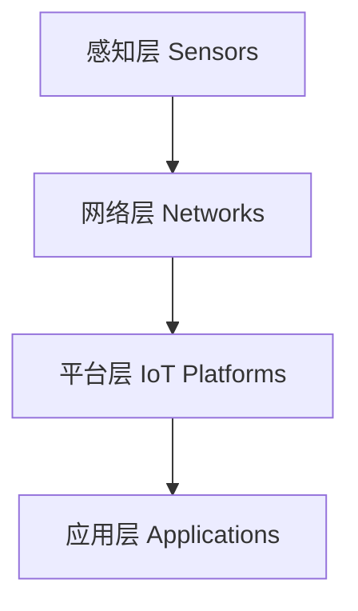

# 物联网 (Internet of Things)

## 1. 背景介绍

### 1.1 物联网的定义与起源
物联网(Internet of Things, IoT)是一个将各种物理设备连接到互联网并使它们能够收集和交换数据的网络。这个概念最早由Kevin Ashton在1999年提出,他认为通过射频识别(RFID)、传感器等技术,可以让计算机在无需人工干预的情况下收集和管理数据。

### 1.2 物联网的发展历程
物联网经历了从概念到实践的发展过程:

- 2000年前后,物联网开始进入研究阶段,各国政府和研究机构开始关注物联网
- 2005年前后,物联网进入试验和小规模应用阶段
- 2010年前后,物联网开始进入大规模商用阶段,各行业开始积极探索物联网应用
- 2015年以来,在人工智能、大数据等新技术的推动下,物联网进入了快速发展期

### 1.3 物联网带来的机遇与挑战
物联网为各行各业带来了新的发展机遇,如智慧城市、工业互联网、车联网等,有望极大提升社会效率。但同时,物联网也面临着诸如安全、隐私、标准等诸多挑战。

## 2. 核心概念与联系

### 2.1 感知层
感知层通过各种传感器收集物理世界的数据,是物联网的数据来源。常见的传感器包括:

- 温度传感器
- 湿度传感器
- 压力传感器
- 光照传感器
- 加速度传感器
- GPS定位传感器
- 图像传感器
- 声音传感器

### 2.2 网络层
网络层负责将感知层采集的数据进行可靠、高效的传输,是连接感知层和应用层的桥梁。物联网使用的网络技术包括:

- RFID
- WiFi
- 蓝牙
- ZigBee 
- NB-IoT
- LoRa
- 5G

### 2.3 平台层
平台层为物联网应用提供数据管理、设备管理、安全管理等共性支撑。主流的物联网平台包括:

- 亚马逊AWS IoT
- 微软Azure IoT 
- 谷歌Cloud IoT
- 阿里云物联网平台
- 华为OceanConnect
- 百度天工物联网平台

### 2.4 应用层
应用层基于物联网平台和数据,结合行业需求,开发各类应用,是物联网的最终目的。物联网应用领域非常广泛,几乎覆盖国民经济各行各业。

### 2.5 架构图
下面是物联网架构的一个示意图:



从架构图可以看出,物联网自下而上依次为感知层、网络层、平台层和应用层,各层之间紧密联系,共同支撑物联网应用的实现。

## 3. 核心算法原理具体操作步骤

### 3.1 数据采集算法
物联网设备通过各种传感器采集环境数据,为了提高数据采集的效率和可靠性,常用的优化算法包括:

1. 数据压缩算法:通过去除数据中的冗余信息,在保证精度的同时减小数据量,如游程编码、霍夫曼编码等。
2. 数据融合算法:通过综合分析多源异构传感器数据,提高数据的准确性和可靠性,如卡尔曼滤波、贝叶斯估计等。  
3. 自适应采样算法:根据数据变化情况动态调整采样频率,在保证数据质量的同时降低能耗,如自适应采样、事件触发采样等。

### 3.2 数据传输算法
物联网设备采集的数据需要通过网络传输到云端,为了提高传输效率和可靠性,常用的优化算法包括:

1. 多址接入算法:合理分配无线信道资源,减少设备之间的相互干扰,提高网络容量,如TDMA、CSMA等。
2. 路由优化算法:根据网络拓扑和链路状态,选择时延最小、可靠性最高的路由,如Dijkstra算法、蚁群算法等。
3. 数据确认算法:发送方收到接收方的确认后才认为数据传输成功,如停等ARQ、回退N帧ARQ等。

### 3.3 数据处理算法
海量的物联网数据汇聚到云端后,需要进行处理和分析挖掘,常用的算法包括:

1. 流式计算算法:对连续到达的数据进行实时处理,如滑动窗口、增量更新等。
2. 批处理算法:对历史数据进行批量处理,挖掘隐藏的模式和规律,如MapReduce、Spark等。
3. 机器学习算法:从数据中自动学习模型,对未知数据进行预测分析,如决策树、支持向量机、神经网络等。

## 4. 数学模型和公式详细讲解举例说明

### 4.1 数据压缩的熵模型
熵是度量一个随机变量的不确定性的指标,设离散随机变量$X$的概率分布为:

$$P(X=x_i)=p_i,\quad i=1,2,\cdots,n$$

则随机变量$X$的熵定义为:

$$H(X)=-\sum_{i=1}^np_i\log p_i$$

直观地说,熵$H(X)$表示了描述随机变量$X$所需的平均信息量。熵越大,随机变量的不确定性越大,需要的平均编码长度也越长。

数据压缩的目标就是设计一个编码方案,使得编码的平均长度尽可能接近信源熵。例如,对于一个二进制信源,符号0出现概率为0.9,符号1出现概率为0.1,则其熵为:

$$H(X)=0.9\log_20.9+0.1\log_20.1=0.469$$

可以设计一个编码方案,0编码为0,1编码为1,平均编码长度为0.9x1+0.1x1=1,大于熵值。

如果0编码为0,1编码为1111,则平均编码长度为0.9x1+0.1x4=0.58,接近熵值0.469,是一个较好的编码方案。

### 4.2 卡尔曼滤波模型
卡尔曼滤波是一种常用的数据融合算法,通过递归估计动态系统的状态。

考虑线性高斯系统:

$$X_k=A_{k-1}X_{k-1}+B_{k-1}U_{k-1}+W_{k-1}$$

$$Z_k=C_kX_k+V_k$$

其中,$X_k$为k时刻系统状态,$U_k$为控制量,$Z_k$为观测量,$W_k$和$V_k$分别为过程噪声和观测噪声,服从高斯分布。

卡尔曼滤波通过以下两个步骤递归估计系统状态:

1. 预测步骤:根据上一时刻的最优估计和控制量,预测当前时刻的状态。

$$\hat X_k^-=A_{k-1}\hat X_{k-1}+B_{k-1}U_{k-1}$$

$$P_k^-=A_{k-1}P_{k-1}A_{k-1}^T+Q_{k-1}$$

2. 更新步骤:根据当前时刻的观测值,更新状态估计。

$$K_k=P_k^-C_k^T(C_kP_k^-C_k^T+R_k)^{-1}$$

$$\hat X_k=\hat X_k^-+K_k(Z_k-C_k\hat X_k^-)$$

$$P_k=(I-K_kC_k)P_k^-$$

其中,$\hat X_k^-$和$\hat X_k$分别为先验估计和后验估计,$P_k^-$和$P_k$为对应的估计误差方差阵,$K_k$为卡尔曼增益。

例如,用加速度计和GPS融合估计运动物体的位置,状态向量为$X=[x,v]^T$,观测向量为$Z=[x_m,v_m]^T$,状态方程和观测方程为:

$$\left[\begin{matrix}x_k\\v_k\end{matrix}\right]=\left[\begin{matrix}1 & \Delta t\\0 & 1\end{matrix}\right]\left[\begin{matrix}x_{k-1}\\v_{k-1}\end{matrix}\right]+\left[\begin{matrix}\frac{\Delta t^2}{2}\\{\Delta t}\end{matrix}\right]a_{k-1}+\left[\begin{matrix}w_{1,k}\\w_{2,k}\end{matrix}\right]$$

$$\left[\begin{matrix}x_{m,k}\\v_{m,k}\end{matrix}\right]=\left[\begin{matrix}1 & 0\\0 & 1\end{matrix}\right]\left[\begin{matrix}x_k\\v_k\end{matrix}\right]+\left[\begin{matrix}v_{1,k}\\v_{2,k}\end{matrix}\right]$$

其中,$a_k$为加速度计测量值,带入卡尔曼滤波公式即可得到位置和速度的最优估计。

## 5. 项目实践：代码实例和详细解释说明

下面以Python为例,演示如何使用MQTT协议连接OneNET平台,实现温湿度数据的采集和上传。

### 5.1 安装paho-mqtt

```
pip install paho-mqtt
```

### 5.2 连接MQTT服务器

```python
import paho.mqtt.client as mqtt

# 设备ID和产品ID
device_id = "12345"  
product_id = "67890"

# 用户名和密码
username = product_id
password = "abcdefg"

# MQTT服务器地址和端口
host = "mqtt.heclouds.com"
port = 6002

def on_connect(client, userdata, flags, rc):
    print("Connected with result code "+str(rc))

# 创建MQTT客户端
client = mqtt.Client(device_id)

# 设置用户名和密码
client.username_pw_set(username, password)

# 设置连接回调函数
client.on_connect = on_connect  

# 连接MQTT服务器
client.connect(host, port, 60)
```

### 5.3 发布数据

```python
import json
import random
import time

# 数据模板
template = {
    "id": device_id,
    "datastreams": [{
        "id": "temperature",
        "datapoints": [{
            "value": 0
        }]
    }, {
        "id": "humidity",
        "datapoints": [{
            "value": 0
        }]
    }]
}

while True:
    # 生成随机温湿度数据
    template["datastreams"][0]["datapoints"][0]["value"] = random.randint(20, 30)
    template["datastreams"][1]["datapoints"][0]["value"] = random.randint(40, 60)
    
    # 发布JSON格式数据
    client.publish("$dp", json.dumps(template))
    print("publish: " + json.dumps(template))
    
    time.sleep(5)
```

### 5.4 订阅命令

```python
def on_message(client, userdata, msg):
    print("topic: " + msg.topic + " payload: " + str(msg.payload))

# 设置消息回调函数
client.on_message = on_message

# 订阅命令主题
client.subscribe("$creq/cmd")

# 开启循环
client.loop_forever()
```

完整代码如下:

```python
import paho.mqtt.client as mqtt
import json
import random
import time

device_id = "12345"  
product_id = "67890"
username = product_id
password = "abcdefg"

host = "mqtt.heclouds.com"
port = 6002

def on_connect(client, userdata, flags, rc):
    print("Connected with result code "+str(rc))
    
def on_message(client, userdata, msg):
    print("topic: " + msg.topic + " payload: " + str(msg.payload))

client = mqtt.Client(device_id)
client.username_pw_set(username, password)
client.on_connect = on_connect
client.on_message = on_message

client.connect(host, port, 60)
client.subscribe("$creq/cmd")

template = {
    "id": device_id,
    "datastreams": [{
        "id": "temperature",
        "datapoints": [{
            "value": 0
        }]
    }, {
        "id": "humidity",
        "datapoints": [{
            "value": 0
        }]
    }]
}

while True:
    template["datastreams"][0]["datapoints"][0]["value"] = random.randint(20, 30)
    template["datastreams"][1]["datapoints"][0]["value"] = random.randint(40, 60)
    
    client.publish("$dp", json.dumps(template))
    print("publish: " + json.dumps(template))
    
    client.loop()
    time.sleep(5)
```

代码说明:

1. 首先导入需要的模块,包括MQTT客户端paho-mqtt、JSON编码json、随机数random和定时