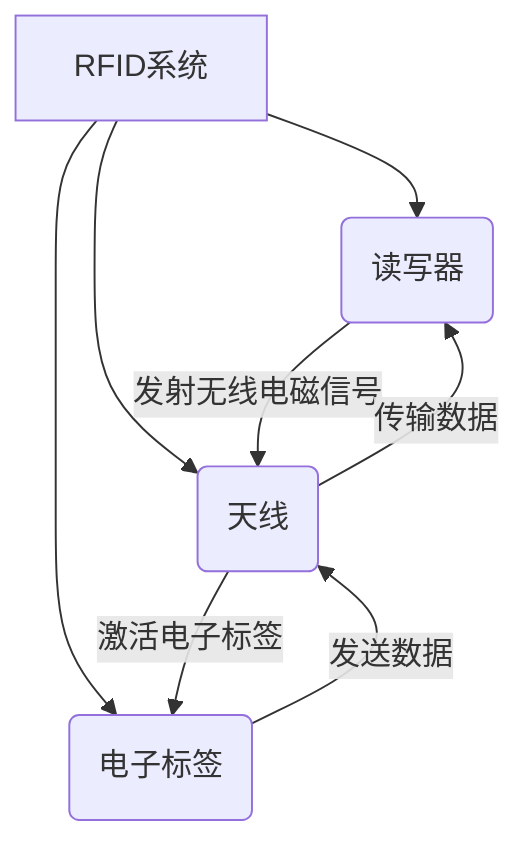
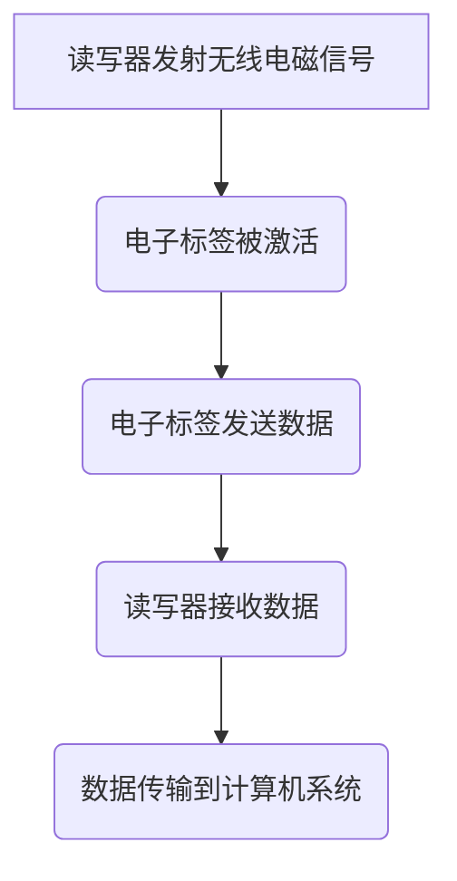

# 物联网(IoT)技术和各种传感器设备的集成：RFID与物联网

## 1.背景介绍

### 1.1 物联网的兴起

随着互联网技术的不断发展和普及,物联网(IoT)概念应运而生。物联网旨在将各种物品与互联网相连接,使它们能够相互通信和交换数据。这种技术的出现极大地推动了人与物、物与物之间的互联互通,为我们的生活、工作和商业运营带来了前所未有的便利。

### 1.2 物联网的重要性

物联网被认为是继计算机、互联网之后的第三次信息技术革命。它将各种设备、机器、系统和服务连接在一起,形成一个庞大的网络。通过这个网络,我们可以实时监控和控制连接的设备,收集和分析大量数据,优化资源利用,提高效率和生产力。

### 1.3 传感器在物联网中的作用

传感器是物联网的关键组成部分。它们负责采集各种物理、化学或生物参数的数据,并将这些数据传输到网络中进行处理和分析。传感器的种类繁多,包括温度传感器、压力传感器、光传感器、运动传感器等,可以应用于各个领域。

## 2.核心概念与联系

### 2.1 射频识别(RFID)技术

射频识别(RFID)是一种无线通信技术,它使用电磁场来自动识别和跟踪附着了标签的目标对象。RFID系统通常由三个主要组件组成:读写器、天线和电子标签。



### 2.2 RFID在物联网中的应用

RFID技术在物联网中扮演着重要角色。它可以用于对物品进行唯一识别和跟踪,实现自动化管理和监控。RFID标签可以附着在各种物品上,如商品、资产、车辆、动物等,读写器则可以部署在工厂、仓库、门禁系统等场所,实现对物品的实时定位和状态监控。

### 2.3 传感器与RFID的集成

将RFID技术与各种传感器相结合,可以进一步扩展物联网的功能和应用场景。传感器可以采集温度、湿度、压力、光线等环境数据,并将这些数据与RFID标签上的识别信息相关联,从而实现对特定物品的环境条件监控。这种集成有助于提高供应链管理、资产跟踪、环境监测等领域的效率和准确性。

## 3.核心算法原理具体操作步骤

### 3.1 RFID系统工作原理

RFID系统的工作原理可以概括为以下几个步骤:

1. 读写器发射无线电磁信号,通过天线将能量传递给电子标签。
2. 电子标签接收到无线电磁信号后,内部集成电路被激活。
3. 激活后的电子标签将存储在其中的数据通过天线发送回读写器。
4. 读写器接收到电子标签发送的数据,并将其传输给连接的计算机系统进行处理。



### 3.2 RFID系统中的防碰撞算法

当多个电子标签同时被读写器激活时,它们发送的数据可能会发生冲突,导致读写器无法正确接收。为了解决这个问题,RFID系统采用了防碰撞算法,确保读写器能够正确识别和读取每一个电子标签的数据。

常见的防碰撞算法包括:

1. **ALOHA算法**: 每个电子标签在随机时间发送数据,如果发生冲突,则等待一段随机时间后重新发送。
2. **二进制树算法**: 读写器将电子标签分为两组,分别查询每一组,直到识别出所有电子标签。
3. **查询树算法**: 读写器通过发送前缀来查询匹配该前缀的电子标签,逐步缩小查询范围。

这些算法的具体实现过程较为复杂,需要考虑多个因素,如电子标签数量、读写器能力、时延要求等。

### 3.3 RFID系统中的数据编码

为了确保数据的准确性和安全性,RFID系统通常采用不同的数据编码方式。常见的编码方式包括:

1. **EPC(Electronic Product Code)编码**: 用于唯一标识商品的编码标准,由头部、对象类别、序列号组成。
2. **ISO标准编码**: 国际标准化组织制定的一系列RFID数据编码标准,如ISO 18000-6C、ISO 15693等。
3. **自定义编码**: 根据特定应用场景自行设计的编码方式,可以包含更多自定义信息。

数据编码不仅确保了数据的唯一性和可识别性,还可以提供数据加密和认证等安全机制,防止数据被窃取或篡改。

## 4.数学模型和公式详细讲解举例说明

### 4.1 RFID读写距离模型

RFID系统的读写距离是一个重要参数,它决定了系统的覆盖范围和性能。读写距离受多个因素的影响,如天线增益、功率、工作频率等。我们可以使用下面的公式来估计最大读写距离:

$$d_{max} = \frac{c}{4\pi f}\sqrt{\frac{P_tG_tG_rλ^2}{P_{th}}}$$

其中:
- $d_{max}$ 表示最大读写距离
- $c$ 为光速
- $f$ 为工作频率
- $P_t$ 为发射功率
- $G_t$ 为发射天线增益
- $G_r$ 为接收天线增益
- $λ$ 为工作波长
- $P_{th}$ 为电子标签激活所需的最小功率

通过调整上述参数,我们可以优化RFID系统的读写距离,满足不同应用场景的需求。

### 4.2 RFID防碰撞算法性能分析

防碰撞算法的性能直接影响了RFID系统的吞吐量和时延。我们可以使用数学模型来分析和比较不同算法的性能。

以查询树算法为例,假设有 $N$ 个电子标签,查询前缀的长度为 $L$,则成功识别所有电子标签所需的最大时隙数 $T_{max}$ 可以表示为:

$$T_{max} = 2^L - 1 + \sum_{i=1}^{N}2^{L-l_i}$$

其中 $l_i$ 表示第 $i$ 个电子标签的标识符长度。

通过计算不同场景下的 $T_{max}$,我们可以评估算法的性能,并根据需求选择合适的算法。

### 4.3 RFID系统中的信号传播模型

在RFID系统中,无线电磁信号的传播过程会受到多种因素的影响,如障碍物、多径效应等。我们可以使用经典的自由空间传播模型来估计接收功率:

$$P_r = P_t\frac{G_tG_rλ^2}{(4\pi d)^2}$$

其中:
- $P_r$ 为接收功率
- $P_t$ 为发射功率
- $G_t$ 为发射天线增益
- $G_r$ 为接收天线增益
- $λ$ 为工作波长
- $d$ 为传播距离

在实际环境中,我们还需要考虑其他因素的影响,如多径衰落、阴影效应等,从而建立更加精确的传播模型。

## 5.项目实践:代码实例和详细解释说明

在这一部分,我们将通过一个基于Python的RFID系统模拟项目,来演示RFID技术的实现和应用。

### 5.1 项目概述

该项目模拟了一个简单的RFID系统,包括读写器、电子标签和防碰撞算法的实现。我们将使用Python编程语言和相关库来构建这个系统。

### 5.2 读写器和电子标签的实现

首先,我们定义读写器和电子标签的类:

```python
import random

class Reader:
    def __init__(self, power, gain):
        self.power = power
        self.gain = gain

    def read_tags(self, tags):
        # 读取电子标签的逻辑
        pass

class Tag:
    def __init__(self, id, activation_power):
        self.id = id
        self.activation_power = activation_power
        self.active = False

    def activate(self, reader):
        # 激活电子标签的逻辑
        pass

    def send_data(self, reader):
        # 发送数据的逻辑
        pass
```

在这个例子中,`Reader`类表示读写器,它有发射功率(`power`)和天线增益(`gain`)两个属性。`Tag`类表示电子标签,它有唯一标识符(`id`)和激活所需的最小功率(`activation_power`)。我们还定义了`activate`和`send_data`方法,用于模拟电子标签的激活和数据发送过程。

### 5.3 防碰撞算法的实现

接下来,我们实现一个简单的ALOHA防碰撞算法:

```python
def aloha_anticollision(reader, tags):
    successful_tags = []
    collided_tags = tags.copy()

    while collided_tags:
        for tag in collided_tags:
            if random.random() < 0.5:  # 模拟随机发送
                tag.send_data(reader)
                if tag.active:
                    successful_tags.append(tag)
                    collided_tags.remove(tag)

    return successful_tags
```

在这个算法中,我们首先将所有电子标签添加到`collided_tags`列表中。然后,我们使用一个循环来模拟每个电子标签随机发送数据的过程。如果一个电子标签成功发送数据并被读写器激活,我们将它添加到`successful_tags`列表中,并从`collided_tags`列表中移除。循环结束后,`successful_tags`列表将包含所有成功识别的电子标签。

### 5.4 系统模拟

最后,我们创建一个函数来模拟整个RFID系统:

```python
def simulate_rfid_system(num_tags, reader_power, reader_gain):
    reader = Reader(reader_power, reader_gain)
    tags = [Tag(f"Tag{i}", random.uniform(0.1, 0.5)) for i in range(num_tags)]

    successful_tags = aloha_anticollision(reader, tags)

    print(f"成功识别的电子标签数量: {len(successful_tags)}")
    for tag in successful_tags:
        print(f"标签ID: {tag.id}")
```

在这个函数中,我们首先创建一个读写器实例和指定数量的电子标签实例。然后,我们调用`aloha_anticollision`函数来模拟防碰撞算法的执行过程。最后,我们打印出成功识别的电子标签数量和它们的ID。

您可以运行以下代码来模拟一个具有10个电子标签的RFID系统:

```python
simulate_rfid_system(num_tags=10, reader_power=1.0, reader_gain=2.0)
```

这个示例项目展示了如何使用Python实现一个简单的RFID系统模拟器。在实际应用中,您可以根据具体需求扩展和优化这个项目,添加更多功能和更复杂的算法。

## 6.实际应用场景

RFID技术与传感器的集成在现实生活中有着广泛的应用场景,可以为各个领域带来巨大的效率提升和便利。以下是一些典型的应用案例:

### 6.1 供应链管理

在供应链管理中,RFID技术可以用于实时跟踪货物的位置和状态。通过将RFID标签附着在货物上,并将读写器部署在仓库、码头、车辆等关键节点,我们可以实时获取货物的位置信息,优化物流路线和库存管理。

同时,将RFID技术与温度、湿度等环境传感器相结合,可以实现对易损货物的环境条件监控,确保货物在运输过程中保持在适当的环境下,避免损坏或变质。

### 6.2 资产管理

RFID技术在资产管理领域也有着广泛的应用。企业可以为各