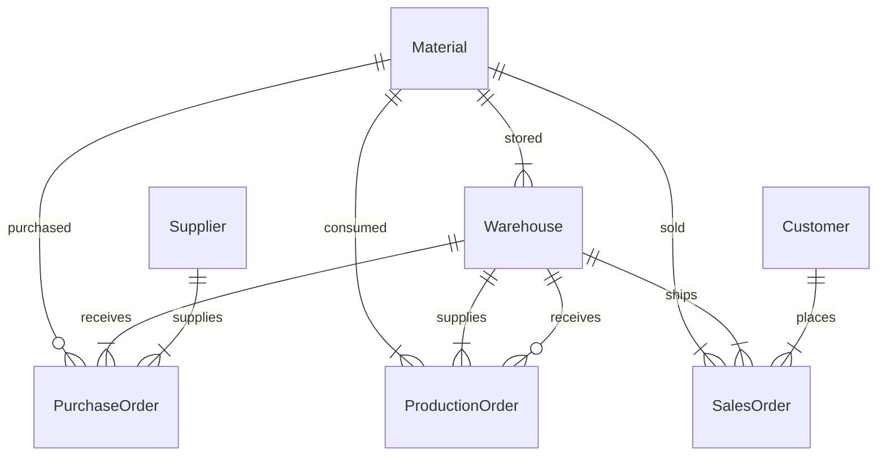

# 物资管理系统详细设计与具体代码实现

## 1. 背景介绍

随着现代企业规模的不断扩大,物资管理工作变得日益复杂和繁重。传统的人工管理方式已经无法满足企业高效运转的需求。因此,开发一套功能完善、高度自动化的物资管理系统势在必行。本文将详细阐述物资管理系统的设计思路,并给出具体的代码实现。

### 1.1 物资管理的重要性

物资是企业生产运营的基础,直接影响企业的生产效率和经济效益。科学高效的物资管理可以:

- 降低库存成本
- 减少呆滞物资
- 提高物资周转率
- 保障生产计划的顺利进行

### 1.2 传统物资管理方式的弊端

传统的物资管理主要依赖人工操作,存在以下问题:

- 效率低下,难以应对大规模物资管理
- 数据统计困难,缺乏实时性
- 人为失误多,数据准确性难以保证  
- 管理流程不规范,监管难度大

### 1.3 物资管理信息化的必要性

通过信息技术手段实现物资管理的自动化、规范化和智能化,可以有效解决上述问题。一套优秀的物资管理系统应具备:

- 完善的基础信息管理
- 规范的业务流程控制
- 实时准确的数据统计分析
- 灵活的系统扩展能力

## 2. 核心概念与关联

在设计物资管理系统之前,我们需要明确系统涉及的核心概念,以及它们之间的关联关系。

### 2.1 物资

物资是系统管理的核心对象,可以分为以下几类:

- 原材料:生产所需的各种原料
- 半成品:生产过程中的中间产品
- 产成品:最终的生产成果
- 辅料:生产过程中需要使用的油料、包装材料等
- 备品备件:为维护生产设备而准备的零配件

### 2.2 仓库

仓库是存储物资的场所,系统中要管理多个仓库。每个仓库有自己的地理位置和存储条件。

### 2.3 供应商与客户

供应商提供企业生产所需的原材料等物资。客户从企业购买产成品。供应商和客户都有相应的联系人信息。

### 2.4 业务单据

业务单据记录了物资管理过程中的各项业务活动,主要包括:

- 采购单:向供应商采购物资
- 生产领料单:从仓库领取生产用料
- 产品入库单:产品完工后入库
- 销售出货单:将产品销售给客户

### 2.5 核心概念ER图

下面使用Mermaid绘制系统核心概念的ER图:



从ER图可以看出,物资与仓库、采购、生产、销售等业务环节都有着密切的关联。

## 3. 核心算法原理与具体操作步骤

物资管理系统的核心是库存管理。合理控制库存水平,对降低成本、提高资金周转率至关重要。常用的库存管理模型有:

### 3.1 EOQ模型

EOQ(Economic Order Quantity)即经济订货批量模型。该模型通过平衡订货成本和存储成本,求得最优的订货批量。

#### 3.1.1 EOQ计算公式

$$ Q = \sqrt{\frac{2DS}{H}} $$

其中:
- Q:经济订货批量
- D:一定时期内的需求量  
- S:每次订货的固定成本
- H:单位商品的储存成本

#### 3.1.2 EOQ模型的适用条件

- 需求速度恒定
- 不允许缺货
- 采购提前期恒定
- 每次采购的单位成本恒定

#### 3.1.3 EOQ模型的局限性

现实中很难满足EOQ模型的所有假设,因此该模型只能作为库存管理的参考,不能完全依赖。

### 3.2 安全库存模型

安全库存是为了防止因需求波动或供应延迟而导致脱销,而额外准备的一部分库存。

#### 3.2.1 安全库存计算公式

$$ SS = Z \times \sigma \times \sqrt{LT} $$

其中:
- SS:安全库存
- Z:服务水平因子,取决于企业的库存策略
- $\sigma$:需求标准差  
- LT:提前期(单位:天)

#### 3.2.2 安全库存的动态调整

安全库存不是一成不变的,需要根据市场需求、供应能力等因素进行动态调整:

1. 收集一定时期内的历史销售数据
2. 计算需求标准差$\sigma$
3. 根据当前的服务水平目标,确定Z值
4. 由公式计算得到新的安全库存水平
5. 定期重复上述步骤,调整安全库存

## 4. 数学模型和公式详细讲解

### 4.1 需求预测模型

为了更好地控制库存,我们需要对未来一段时间的需求进行预测。常用的需求预测模型有:

#### 4.1.1 移动平均法

移动平均法根据最近n个期间的实际需求量来预测下一期的需求。

$$ F_{t+1} = \frac{\sum_{i=t-n+1}^{t} D_i}{n} $$

其中:
- $F_{t+1}$:第t+1期的预测需求
- $D_i$:第i期的实际需求
- n:移动平均的期数

移动平均法适用于需求波动较小的情况。当n较小时,预测值更敏感于近期波动;当n较大时,预测值更稳定,但不易察觉趋势变化。

#### 4.1.2 指数平滑法

指数平滑法是一种加权移动平均,近期数据的权重更大。

$$ F_{t+1} = \alpha D_t + (1-\alpha) F_t $$

其中:
- $F_{t+1}$:第t+1期的预测需求
- $D_t$:第t期的实际需求
- $\alpha$:平滑系数,取值在0到1之间

$\alpha$越大,预测值越接近于最近的实际需求;$\alpha$越小,预测值越稳定。指数平滑法适用于无明显趋势或周期性的需求。

### 4.2 ABC分类模型

ABC分类法根据物资的价值和重要性,将其分为A、B、C三类,采取不同的管理策略。

- A类物资:价值高,对生产至关重要,严格管控
- B类物资:价值和重要性居中,适度管控
- C类物资:价值低,大量采购,简化管理

ABC分类的具体操作步骤如下:

1. 统计一定时期内各种物资的消耗量和单价
2. 计算每种物资的总价值(消耗量×单价)
3. 按总价值从高到低排序
4. 计算每种物资的价值占比和累计占比
5. 将累计占比在70%以内的划为A类,70%~90%的划为B类,90%以上的划为C类

## 5. 项目实践:代码实例与详细解释

下面我们使用Python实现一个简单的物资管理系统。

### 5.1 数据模型设计

首先定义系统所需的数据模型。使用Python的数据类(dataclass)来定义。

```python
from dataclasses import dataclass
from typing import List
from enum import Enum

class MaterialType(Enum):
    RAW = 1
    SEMI = 2
    PRODUCT = 3

@dataclass
class Material:
    id: int
    name: str
    type: MaterialType
    
@dataclass 
class Warehouse:
    id: int
    name: str
    location: str

@dataclass
class Inventory:
    material: Material
    warehouse: Warehouse
    qty: int

@dataclass
class Supplier:
    id: int
    name: str
    contact: str

@dataclass
class PurchaseOrder:
    id: int
    supplier: Supplier
    items: List[Material]
    qtys: List[int]
    
@dataclass
class Customer:
    id: int
    name: str
    contact: str
    
@dataclass
class SalesOrder:
    id: int
    customer: Customer
    items: List[Material]  
    qtys: List[int]
```

这里我们定义了物资(Material)、仓库(Warehouse)、库存(Inventory)、供应商(Supplier)、采购单(PurchaseOrder)、客户(Customer)、销售单(SalesOrder)等数据模型。

### 5.2 业务逻辑实现

接下来实现系统的主要业务逻辑。

#### 5.2.1 采购入库

```python
def purchase(po: PurchaseOrder, wh: Warehouse):
    for item, qty in zip(po.items, po.qtys):
        inv = next((inv for inv in inventories 
                    if inv.material==item and inv.warehouse==wh), None)
        if inv:
            inv.qty += qty
        else:
            inventories.append(Inventory(item, wh, qty))
```

采购入库时,根据采购单(PurchaseOrder)将相应的物资入库。如果库存(Inventory)中已经存在该物资,则数量累加;否则新建库存记录。

#### 5.2.2 销售出库

```python
def sales(so: SalesOrder, wh: Warehouse):
    for item, qty in zip(so.items, so.qtys):
        inv = next((inv for inv in inventories 
                    if inv.material==item and inv.warehouse==wh), None)
        if inv and inv.qty >= qty:
            inv.qty -= qty
        else:
            raise Exception(f"物资{item.name}库存不足")
```

销售出库时,根据销售单(SalesOrder)从指定仓库出库。需要检查库存是否充足,不足则抛出异常。

#### 5.2.3 库存查询

```python
def get_inventory(wh: Warehouse):
    return [inv for inv in inventories if inv.warehouse == wh]
```

库存查询逻辑比较简单,根据仓库筛选出相应的库存记录即可。

### 5.3 单元测试

下面编写单元测试代码,以验证系统的正确性。使用Python内置的unittest模块。

```python
import unittest

class TestInventory(unittest.TestCase):
    
    def test_purchase(self):
        wh = Warehouse(1, "仓库1", "北京")
        mat1 = Material(1, "物资1", MaterialType.RAW)
        mat2 = Material(2, "物资2", MaterialType.PRODUCT)
        sup = Supplier(1, "供应商1", "张三")
        
        po = PurchaseOrder(1, sup, [mat1, mat2], [100, 200])
        purchase(po, wh)
        
        invs = get_inventory(wh)
        self.assertEqual(len(invs), 2)
        self.assertEqual(invs[0].qty, 100)
        self.assertEqual(invs[1].qty, 200)
        
    def test_sales(self):
        wh = Warehouse(1, "仓库1", "北京")
        mat1 = Material(1, "物资1", MaterialType.PRODUCT)
        mat2 = Material(2, "物资2", MaterialType.PRODUCT)
        cus = Customer(1, "客户1", "李四")
        
        inventories.clear()
        inventories.append(Inventory(mat1, wh, 100))
        inventories.append(Inventory(mat2, wh, 50))
        
        so = SalesOrder(1, cus, [mat1, mat2], [50, 30])
        sales(so, wh)
        
        invs = get_inventory(wh)
        self.assertEqual(invs[0].qty, 50)
        self.assertEqual(invs[1].qty, 20)
        
        so2 = SalesOrder(2, cus, [mat1], [100])
        with self.assertRaises(Exception):
            sales(so2, wh)
        
if __name__ == '__main__':  
    unittest.main()
```

在测试用例中,我们模拟了采购入库和销售出库的场景,并验证了库存数量的正确性。同时也测试了销售时库存不足的异常情况。

以上就是一个简单的物资管理系统的代码实现。实际系统会更加复杂,还需要考虑数据持久化、并发控制、权限管理等诸多因素。

## 6. 实际应用场景

物资管理系统在各行各业都有广泛的应用,下面列举几个典型场景。

### 6.1 制造业

制造业是物资管理系统的主要应用领域。通过对原材料、半成品、产成品等物资的精细化管理,可以:

- 降低原材料采购成本
-